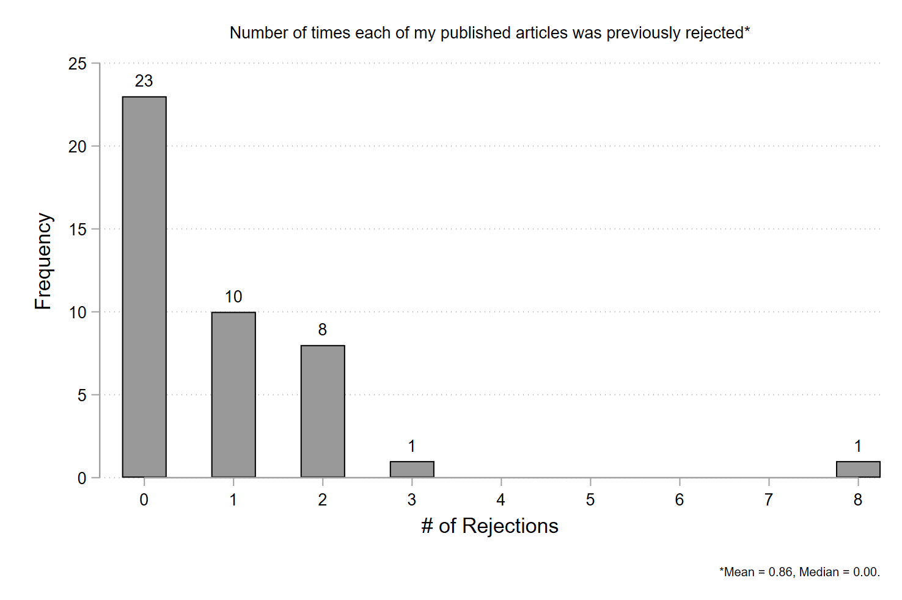
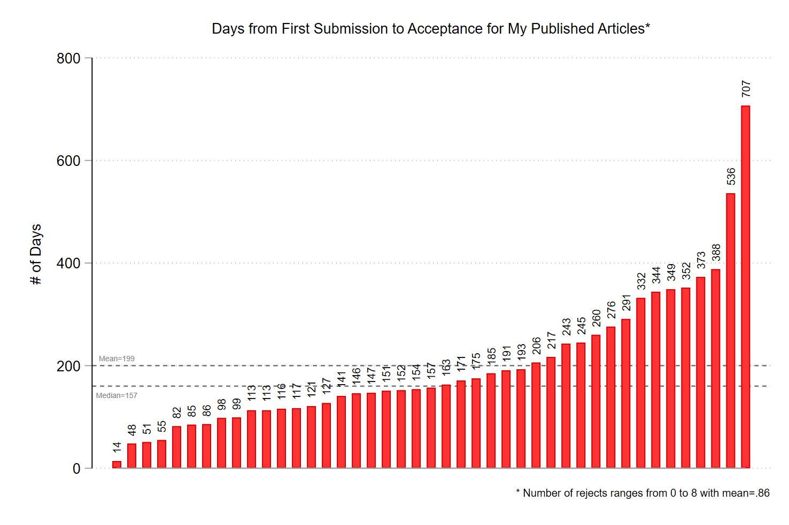

Each calendar year at my university we have to complete this thing called "Digital Measures," where we basically list off all the stuff we did over the past 12 months. Publications, grants submitted/awarded, classes taught, service activities, media contributions...*everything*. It's tedious but it is kind of cool to look back on the past year and see which goals you met (and which goals you didn't meet). 

In my first year on the tenure track, a senior faculty member advised me to keep a record of *everything* I did, so that I'd have all the receipts when it was time to submit my tenure materials. I may have gotten a little carried away, but it's how I ended up keeping track of [my record as a peer reviewer](https://jnix.netlify.app/post/post14-my-reviewer-history/), and how I ended up with the "data" for this post about my experiences as an author. 

If you're not familiar with the scientific publishing process, it [varies by field](https://www.nature.com/articles/530148a) but typically goes like this:

* You write a manuscript describing a study you did and submit it for review by a journal.
* The editor screens it and either "desk rejects" it or sends it to 2-5 anonymous reviewers for feedback. 
  - *This step should be pretty fast (24-48 hours), but I've had it take as long as a month.*
  - *If it's a desk reject, you prepare to send it to another journal.*
* Once the reviews come back, the editor decides whether to accept the manuscript for publication, ask that you revise it based on the feedback and resubmit it, or decline to publish it. 
  - *The timing for this step varies a lot but could be anywhere from 10 days to 6 months or more.* 
  - *If it's a rejection, you decide what revisions to make and prepare to send it to another journal.*
* After you've made revisions, you resubmit the manuscript for review. The editor might make the determination on their own, but usually they send it back to the original reviewers (perhaps even some new reviewers, which I strongly dislike). The reviewers determine whether the revised manuscript is sufficiently improved, recommending it be accepted, further revised, or rejected.
  - *Again, this step could take anywhere from 10 days to 6 months or more.*
  - *This step could also get repeated multiple times.*
* Once you get the good news that your manuscript has been accepted for publication, you still have to wait for page proofs to be generated. Once you receive and approve them, your article usually appears online within a few weeks. 

So this is rarely a fast process (unless you submit your work as a *Rapid Report* to [Police Practice & Research](https://www.tandfonline.com/journals/gppr20) ⚡⚡). It can potentially take years for your study to get published, at which point it usually ends up sitting behind a paywall (unless you pay the open-access fee or put a "post-print" up on your website or a repository like [CrimRxiv](https://www.crimrxiv.com/)).

I submitted my first article for review circa 2013-2014 and it was published in 2015. Fast forward to today and I've now [published 43 articles](https://jnix.netlify.app/publication/) in peer-reviewed journals. Here's how many times each of those articles was rejected before being published.

Just over half of my papers landed at the first journal I sent them to. Roughly a quarter were rejected once, and another 19% were rejected twice. And then there's that [one paper](https://jnix.netlify.app/publication/26-pjc-demeanor/) that got rejected eight different times before finally getting accepted.[^1] I've also got two unpublished papers that fell by the wayside after a few rejections - including this one on how to measure self-reported behaviors like [fair treatment of employees](https://www.crimrxiv.com/pub/ckjwt1m4/release/1).

Here's how long it took each paper to get published from the day it was submitted to its first journal to the day it was officially accepted somewhere. Keep in mind this doesn't include the time it took to devise and carry out the studies, or the time it took from acceptance to actual publication in the journal.

On average, it's taken me ~200 days (almost 7 months) to publish papers. Those two papers off to the right are outliers pulling up the average, so if you go by the median it tends to take me around 157 days (just over 5 months). 

* Average review time for the 23 papers that were accepted at their first journal was 135 days (4.5 months).
* Average review time for the 20 papers that were rejected at least once was 273 days (9 months; median 252 days or 8.5 months). 

These are just my experiences, of course. I'm not sure how typical they are, but FWIW here's a similar [post](https://andrewpwheeler.com/2018/05/09/the-length-it-takes-from-submission-to-publication/) by Andy Wheeler a few years ago about his experiences. He does a more sophisticated analysis and concludes:

> If you want a 50% chance of your article being published, you should expect 10 months based on my experience...So the sobering truth for those of us without tenure is that based on my estimates you need to have your journal articles out of the door well over a year before you go up for review to really ensure that your work is published.

So the moral of the story is there's a good chance that papers you submit during that last year on the tenure clock won't be published by the time you have to submit your materials. I hate how slow the process is, which is why I see some value in releasing pre-prints. But at the same time, the peer-review process has value to the extent it corrects mistakes and/or substantively strengthens papers. I know we academics like to gripe about "Reviewer 2," but in my experience, peer review has improved my papers more often than not - even if only incrementally. And as [a reviewer](https://jnix.netlify.app/post/post14-my-reviewer-history/), I've occasionally caught outright mistakes.[^2] Post-prints, however, should be shared immediately upon acceptance IMO.

[^1]: At virtually every journal, reviewers liked the paper but couldn't get past the low response rate. That motivated me to write [this paper](https://jnix.netlify.app/publication/22-response-rates/) with some colleagues about response rates for police surveys. 
[^2]: For example, I recently reviewed a paper where the authors had inaccurately described their dependent variable. It didn't sink the paper, but it did impact the findings and it would have been problematic had it gotten published without making the correction. 
