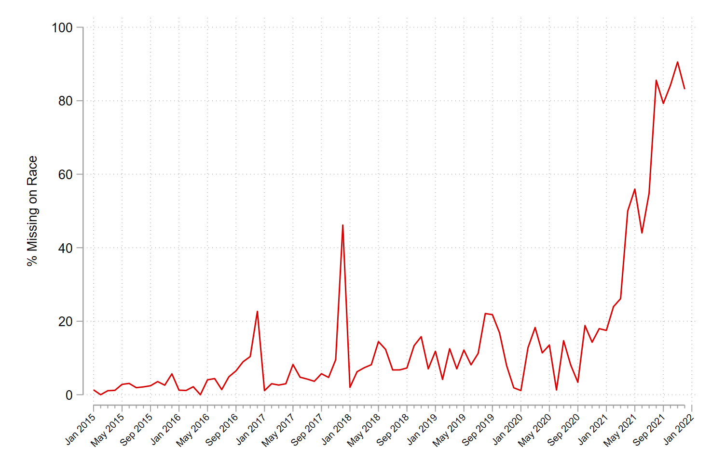
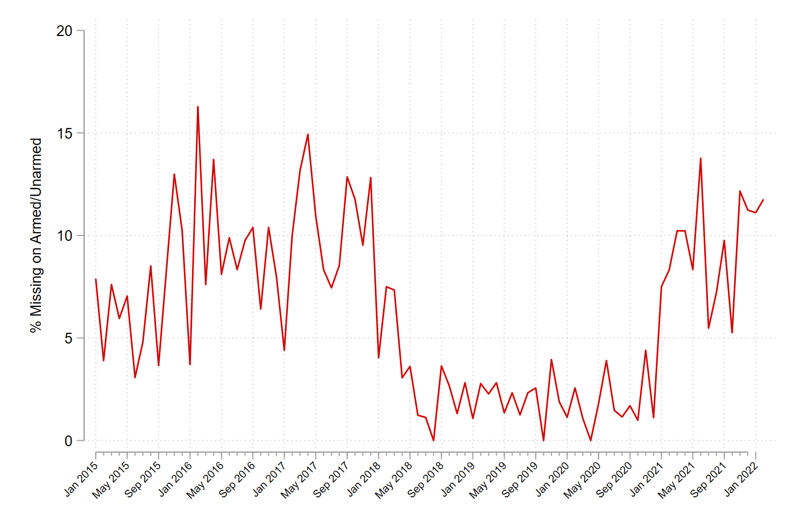

I've been screaming this into the void on Twitter lately so I figured I'd pull all my thoughts together in a blog post. 

On January 12th, ABC News published [a story](https://abcnews.go.com/US/fatal-police-shootings-dip-2021-amid-calls-reform/story?id=81914364) claiming that fatal police shootings had declined 13% in 2021 "amid calls for reform on use of force." The story also claimed that Florida saw the biggest decrease in shootings (from 93 to 44).[^1]

At that time, *The Washington Post's* (WAPO) database was showing **888** fatal police shootings. 

One month later, and the same database now shows **1,055** fatal police shootings - which is actually a 3% **increase** year-over-year, and the largest single-year total on record. The 3% increase is likely [just noise](https://andrewpwheeler.com/2022/02/11/an-update-on-the-wapo-officer-involved-shooting-stats/), but the fact that WAPO added another 167 shooting incidents to their data in the last month is definitely significant. 

I was following WAPO's data pretty closely all last year and had been seeing what looked like a reduction in police shootings in close to real time. That is, every time I ran the numbers, I would do year-over-year comparisons of up to a few weeks prior. So on October 20th, I [tweeted](https://twitter.com/jnixy/status/1450842186048704512?s=20&t=CUeeJKKAY7A7Y3sRIf20Og) that WAPO was showing 85 fewer shootings than the previous 6-year average as of September 30th, and that shootings of unarmed people and persons showing signs of mental illness also appeared to be down. Later in that same thread, I showed that [Mapping Police Violence](https://mappingpoliceviolence.squarespace.com/) (MPV)[^2] and [Fatal Encounters](https://fatalencounters.org/) (FE) data weren't showing the same reduction.[^3] 

In fact, on January 5th, *Criminal Justice Review* published [an article](https://doi.org/10.1177%2F07340168211071014) by Ben Comer and Jason Ingram showing just how closely the three databases [tracked each other](https://twitter.com/jnixy/status/1481753471959318529?s=20&t=CUeeJKKAY7A7Y3sRIf20Og) every month from January 2015 to December 2019.[^4] So it should raise some red flags when one of the databases shows a significant decrease (or increase), but the other two don't. 

Indeed, there was no reduction in fatal police shootings last year. It appears WAPO is just not moving as quickly as they had been a few years ago when they launched their database. This is one of the challenges of data transparency: the public wants the data now, but those collecting the data need to be reasonably sure that the data are complete/correct before publishing.

Which brings me to my next point. At this moment, I'm not sure how much stock we can put in anything else from WAPO's 2021 data besides the total number. I initially thought it was interesting that shootings of mentally ill persons were down from ~25% of all shootings a few years ago to just ~14% of all shootings last year. At least until someone pointed out that WAPO's race variable is 60% missing in 2021. And if you plot %missing on race each month, it becomes clear how incomplete the recent data are:

What's going on in December 2017?

For what it's worth, here's %missing for armed/unarmed each month:

Weird. Less than 5% missing each month from April 2018 to December 2020, but mostly more than 5% for every other month in the data. 🤷

Strangely, while WAPO's fields for *race, age, sex, threat level,* and *armed* each include "undetermined" or blank entries, *signs of mental illness* is strictly yes/no and is 0% missing. So it seems like this field defaults to **no** for some reason, which means we can probably expect many of these to get switched to **yes** in the weeks and months ahead.

**So, users beware**. Best to wait at least a month on WAPO - don't expect the real-time numbers to be accurate. Also note that some of the details for shootings that occurred in the last 6-8 months are far more likely to be incomplete than shootings that occurred longer ago. If you want accurate real-time estimates, Fatal Encounters and Mapping Police Violence seem like better alternatives right now.[^3]

[^1]: I also recall doing at least one interview around the same time where the journalist believed this reduction was indicative of widespread *de-policing.* He implied that a reduction in fatal police shootings wasn't necessarily a good thing because it could reflect a public safety trade off (i.e., his theory was that de-policing was also why homicides spiked).
[^2]: By the way, Mapping Police Violence is temporarily [using a new domain](https://twitter.com/samswey/status/1488606324707364868?s=20&t=CUeeJKKAY7A7Y3sRIf20Og).
[^3]: Keep in mind that you have to filter out some incidents (e.g., off-duty shootings, vehicular accidents, self-inflicted gunshot wounds) in these databases so that you're getting apples-to-apples comparisons. 
[^4]: With the exception of September 2018, for some reason.