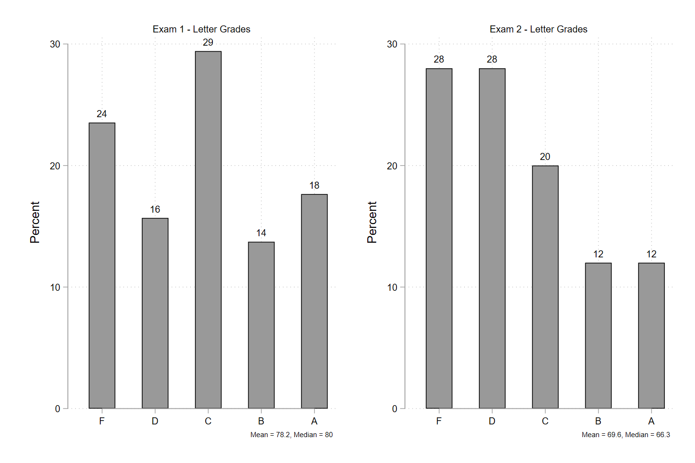
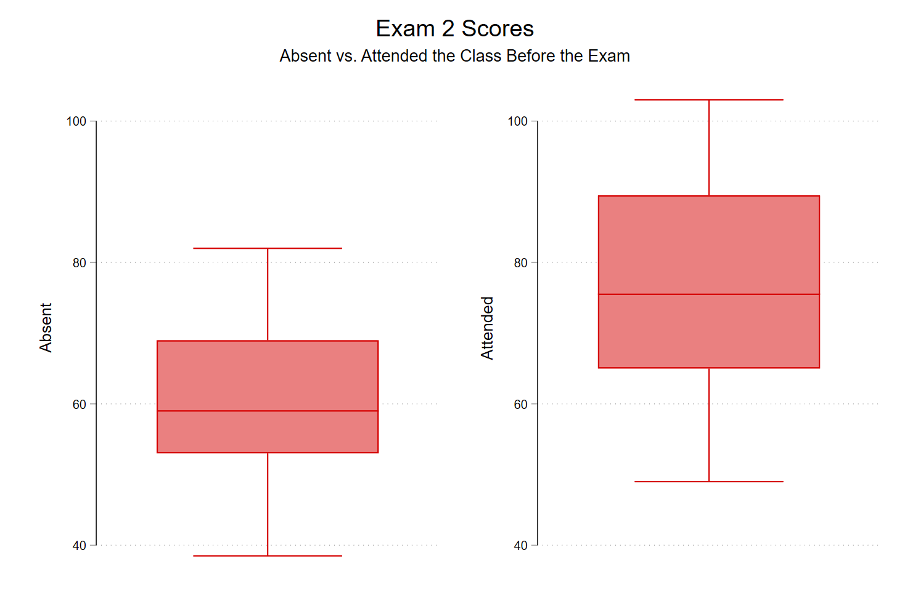

This semester, for the first time since I was in grad school, I decided to post the slides I use for my undergraduate [Police & Society](https://jnix.netlify.app/courses/crcj2030/lectures/) course. My main fear was that students would (mistakenly) believe this would enable them to skip class and still do well on the exams. But what finally persuaded me was when I [asked #AcademicTwitter to weigh in](https://twitter.com/jnixy/status/1476240958836596743) last December and got mostly encouragement and positive feedback from others who've adopted this policy.

We're now about two-thirds of the way through the semester, and honestly I'm not sure how I feel. Attendance is down a bit, as I expected. But after the first exam, I noticed that the distribution of scores was about what it usually is: mean of about 78, a fair number of A's, and a fair number of F's. For context, I've taught this class (or some version of it) five times before this semester (both here and at USC).

I've just graded the second exam, and it's got me somewhat concerned. In the past, classes have usually performed about the same or a little better on subsequent exams. This semester, the class average dropped 8 points. But at the same time, there were more A's on this exam. In fact, that was the modal score this time:

Just eyeballing those histograms, it looks like the C and D bars flipped. 

I don't take attendance, but at the beginning of the semester I tried to make it **very clear** to my students that although I was posting the slides, they'd still need to come to class and participate in order to get the most out of the class. I also put a disclaimer at the top of the [webpage that lists all my lectures](https://jnix.netlify.app/courses/crcj2030/lectures/), warning that the slides are *merely skeletons* and that *in class, we'll discuss the material in much greater detail.* 

But like I said, attendance does seem to be down a bit. So last week, I took attendance on the day before the exam. Looking out at the room, it was the usual crowd, so while this wasn't a perfect measure of attendance, I'm confident that attendance on that day was highly correlated with regular attendance. Unsurprisingly, as a group, those who attended that particular day did **much better** on Exam 2 than those who didn't. On average, those who attended scored almost 17 points higher. And whereas the highest score among the absent group was an 82, nearly 1/3 of the attended group earned an 82 or higher. 

To be clear, I can't say for sure that those who aren't attending regularly have made a calculated decision to skip based on the slides being posted. And I do think that those who *do* attend regularly appreciate having the slides because it makes note-taking more manageable. But looking at those boxplots, I'm thinking that next semester and moving forward I'll need to take attendance. 

Friends who teach: do you take attendance or otherwise entice students to attend? How so? I'd love to hear from you.

