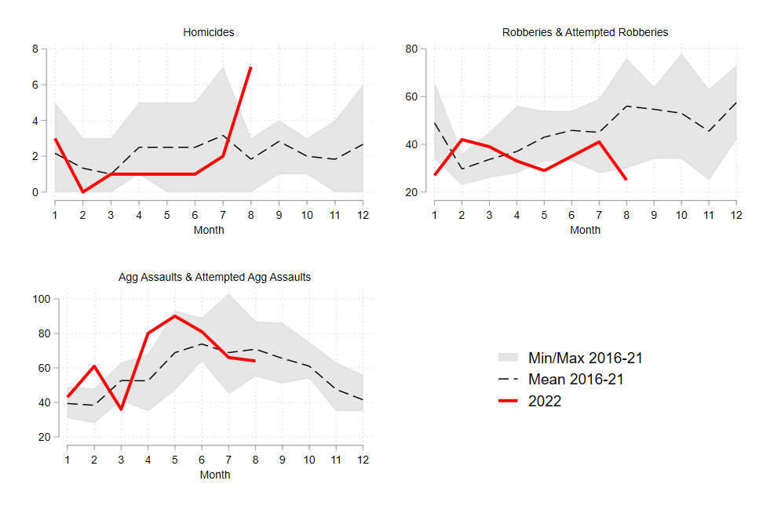

Recently, a couple local journalists reached out to me about an apparent surge in shootings and homicides in Omaha. My first instinct when I get those calls around this time of the year is that it's probably seasonal variation. But maybe not. So before I schedule an interview, I like to pull the data and have a quick look, if possible. Fortunately, OPD has been posting incident-level crime data [on its website](https://police.cityofomaha.org/crime-information/incident-data-download) since 2015. 

So below I'm going to walk through some code that I hope is easily adaptable and will enable you to quickly see if crime is up, down, or consistent with prior years. To save the trouble of copying and pasting each snippet, click the **Code** button at the top of the page. With apologies to those of you who use R...I realize that by still using Stata I'm quickly becoming a dinosaur. That said, you could check out the very helpful [stata2r package](https://stata2r.github.io/). But even if you can't plug & play with this code, hopefully the logic is still useful. 

(***UPDATE***: *Thanks to [Matt Herman](https://twitter.com/buddyherms) for translating my code to R! Get it [here](https://gist.github.com/mfherman/892d8e3861c36a305ec3c8da885d3d2c)*.)

First, I like to set a global that directs to the folder where I'll store the data files. You can call it whatever you want. Here, I'm calling it *omaha*. Thereafter, when I type **$omaha**, Stata will recognize this as shorthand for the folder's filepath.

```
global omaha "" // insert your local filepath in the quotations
```

OPD posts separate data files for each calendar year on [this webpage](https://police.cityofomaha.org/crime-information/incident-data-download). Download them and save them in the folder you identified above. This next chunk of code will import and append the 8 .csv files (2015 - 2022 YTD) into a single .dta file that includes all years. Make sure before you run this that each file follows the same naming convention. In this case, I'd saved each file as **Incidents_YYYY.csv**. 

```
	cd "$omaha"
	local files: dir "$omaha" files "Incidents*.csv"
	di `"`files'"'
	tempfile master // generate temporary save file to store data in
	save `master', replace empty
	foreach x in `files' {
		di "`x'" // display file name
		
		* import each file
			qui: import delimited "`x'", delimiter(",") case(preserve) clear // import csv file
			qui: gen data_id = subinstr("`x'", ".csv", "", .) // generate id variable
		
		* append each file to the master file
			append using `master', force
			save `master', replace
	}
	
	order data_id, first
	sort data_id
	save "$omaha\incidents_merged.dta", replace // save the merged file with a new name
```

Now that the data are all merged up, you should screen for duplicates.[^1] Use the code below to ask Stata how many rows are exact matches on *RBNumber*, *Reported Date and Time*, *Statute/Ordinance Description*, and *Location*. Then tag them with a new variable, *dup*, and drop any rows where *dup* has a value greater than 0. 

```
duplicates report RBNumber ReportedDate ReportedTime StatuteOrdinanceDescription OccurredLocation
duplicates tag RBNumber ReportedDate ReportedTime StatuteOrdinanceDescription OccurredLocation, gen(dup)
drop if dup > 0
```

Next, you need to convert the *ReportedDate* field from string to Stata's appropriate date format. This is really easy with Stata's *date* function. We'll also drop 2015 because everything before July looks wonky.

```
gen date = date(ReportedDate, "MDY")
format date %td

gen year = year(date)
gen month = month(date)

drop if year == 2015 // reporting looks inconsistent prior to July
```

OK, we want to quickly get a sense of whether violence was unusually high this summer, or more or less similar to recent summers. I like to visualize this with a monthly line graph that shows what happened in the current year versus the *N*-year average and the *N*- year range. This quickly shows what a "typical" month looked like over the past *N* years, what months on each extreme looked like, and how each month of the current year stacks up. 

Note we could do this at smaller units of time, such as weeks or days, but homicides are rare enough in most places that daily or weekly graphs will mostly produce 0s and 1s, which isn't super helpful for a visualization. For consistency, we'll also plot robberies and aggravated assaults at the monthly level.

Next we create dummy variables from the *StatuteOrdinanceDescription* variable, which is in string format. Then we can use **tabstat** to quickly count how many homicides, completed and attempted aggravated assaults, and completed and attempted robberies occurred each year. Note that for robberies, there are several different entries we want to include in the "1" category of our dummy. To save a few lines of code, we can use the **regexm** function, which flags all cases that include some string of characters that we define. 

There should be 158 homicides, 4084 aggravated assaults (completed and attempted), and 3299 robberies (completed and attempted) between 2016 and 2021. The totals for 2022 will change between now and December 31st.

```
gen homicide = 1 if StatuteOrdinanceDescription == "HOMICIDE"
tabstat homicide, by(year) s(sum)

gen agg = 1 if StatuteOrdinanceDescription == "ASSAULT - FELONY - AGGRAVATED" | StatuteOrdinanceDescription == "ASSAULT - FELONY - AGGRAVATED -ATTEMPT"
tabstat agg, by(year) s(sum)

gen rob = 1 if regexm(StatuteOrdinanceDescription, "ROBBERY") == 1
tabstat rob, by(year) s(sum)
```

Now we need to create **crime + year** dummies that we'll use for the visualizations. Here's a loop that will do this for each year in the data:

```
local crime "homicide rob agg"
	foreach i in `crime' {
		gen `i'_16 = 1 if `i' == 1 & year == 2016
		gen `i'_17 = 1 if `i' == 1 & year == 2017
		gen `i'_18 = 1 if `i' == 1 & year == 2018
		gen `i'_19 = 1 if `i' == 1 & year == 2019
		gen `i'_20 = 1 if `i' == 1 & year == 2020
		gen `i'_21 = 1 if `i' == 1 & year == 2021
		gen `i'_22 = 1 if `i' == 1 & year == 2022
	}
```

Next, we collapse these new variables down, from the incident level to the month level. Once we do this, there will only be 12 rows in our dataset - one for each calendar month. Each column will correspond to the **crime + year** dummies we created above, plus one column indicating the month.

```
collapse (sum) homicide* rob* agg*, by(month)
```

Almost there! Now, for each variable, we need to calculate means, minimums, and maximums for each month from 2016 to 2021. For example, how many homicides occurred each January from 2016 to 2021, on average? What were the highest and lowest January totals? We can answer these questions for each crime and for each month in the data with the following loop:

```
local crime "homicide rob agg"
  foreach i in `crime' {
    egen `i'_avg = rmean(`i'_16 `i'_17 `i'_18 `i'_19 `i'_20 `i'_21)
    egen `i'_min = rowmin(`i'_16 `i'_17 `i'_18 `i'_19 `i'_20 `i'_21)
    egen `i'_max = rowmax(`i'_16 `i'_17 `i'_18 `i'_19 `i'_20 `i'_21)
  }
```

We've now got everything we need to create some visualizations. First, optionally, you can install and use Trenton Mize's [cleanplots scheme](https://www.trentonmize.com/software/cleanplots). Then, for each crime, use Stata's **twoway** command to plot the min-max range as a light grey "band," the mean as a dashed black line, and 2022 (January through August) as a thicker red line. Feel free to play around with the formatting until you get something you like. Note that for now I've turned the legends off - more on that in a moment.

```
 net install cleanplots, from("https://tdmize.github.io/data/cleanplots") // optional
 set scheme cleanplots // optional
 
twoway (rarea homicide_min homicide_max month2, color(gs14)) ///
	|| line homicide_avg month2, lc(gs0) lp(dash) ///
	|| line homicide_22 month2 if month2 <= 8, lc(red) lw(thick) ///
	xscale(range(1(1)12)) xlabel(1(1)12) xmtick(1(1)12) xtitle("Month", size(small)) ///
	leg(off) title("Homicides", size(small)) name(homs, replace)
	
twoway (rarea rob_min rob_max month2, color(gs14)) ///
	|| line rob_avg month2, lc(gs0) lp(dash) ///
	|| line rob_22 month2 if month2 <= 8, lc(red) lw(thick) ///
	xscale(range(1(1)12)) xlabel(1(1)12) xmtick(1(1)12) xtitle("Month", size(small)) ///
	leg(off) title("Robberies & Attempted Robberies", size(small)) name(robs, replace)
	
twoway (rarea agg_min agg_max month2, color(gs14)) ///
	|| line agg_avg month2, lc(gs0) lp(dash) ///
	|| line agg_22 month2 if month2 <= 8, lc(red) lw(thick) ///
	xscale(range(1(1)12)) xlabel(1(1)12) xmtick(1(1)12) xtitle("Month", size(small)) ///
	leg(off) title("Agg Assaults & Attempted Agg Assaults", size(small)) name(aggs, replace)
```
	
We could stop there, but often we want to be able to look at multiple visualizations simultaneously. To do that, we can use Stata's **graph combine** command. But first, we should create a legend. We could have left the legend on for each individual graph we created above, but then our combined graph would be very cluttered. **Graph combine** allows you to arrange figures in *N* rows by *N* columns. Here, we'll lay the figures out in 2 rows and 2 columns, where the space on the bottom right will be our legend. 

Notice the first three lines of the code below are the same as in the code to make the homicide graph above. The difference is we'll suppress everything but the legend, which will be centered in the plot region. Name it "graph_leg" (or whatever you want), and include it with the other figures when you run the **graph combine** command. 

```	
twoway (rarea homicide_min homicide_max month2, color(gs14)) ///
	|| line homicide_avg month2, lc(gs0) lp(dash) ///
	|| line homicide_22 month2 if month2 <= 8, lc(red) lw(thick) ///
	leg(ring(0) pos(0) size(medium) label(1 "Min/Max 2016-21") label(2 "Mean 2016-21") label(3 "2022"))yscale(off) xscale(off) xtitle("") name(graph_leg, replace)
gr_edit .plotregion1.draw_view.setstyle, style(no) 

graph combine homs robs aggs graph_leg, rows(2)
```	

Hopefully, everything has worked up to this point, and you were able to render the following graph: 



We can see pretty clearly that the 7 homicides in August 2022 were unusual - the previous 6-year average for August was 2, and the previous high was 3. It's too soon to determine whether this is a blip or the start of a trend, but if I had to guess I'd say that line will probably come back down in the last quarter. I'd also be reluctant to call this one-month spike statistically meaningful - it could still very well be "random." Consider, for example, that part of what differentiates a nonfatal shooting from a fatal shooting is [luck](https://doi.org/10.1111/1745-9133.12451) (in terms of whether bullets hit or miss vital organs). 

Anyway, robberies have been down for most of 2022, compared to the previous 6-year average. Aggravated assaults were up a bit in the first part of the summer, but within typical ranges, then close to the 6-year average for July and August.

That's it! I've been learning and tinkering with this for years now, so I hope someone finds it helpful. Let me know if you end up using/adapting it for something - I'd love to hear about it!


[^1]: If you can, speak to an analyst or someone at the agency who is familiar with the data. They can help with this and many other issues that will inevitably come up. 