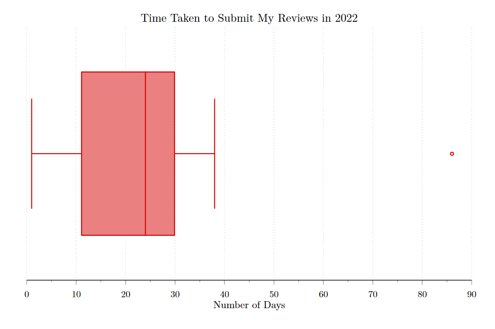

---
authors:
- admin
categories: []
date: "2023-01-04T13:00:00Z"
draft: false
featured: false
image:
  caption: "Image by [Nathan Shively](https://unsplash.com/@shivelycreative) at [Unsplash](https://unsplash.com/photos/MgIPNC8TG1c)"
  focal_point: "smart"
projects: []
subtitle: ""
summary: 
tags:
- Peer Review
title: "Looking Back on My Peer Reviews for 2022"
url_pdf: ""
---

About 2 years ago I [posted](https://jnix.netlify.app/post/post14-my-reviewer-history/) about my peer review "stats" and how I typically approach the review process. Today, I decided to look back at my reviews for 2022. 

Altogether, I've now reviewed 162 manuscripts. Last year, I agreed to review 20 manuscripts for 15 different journals, which is par for the course for me. I've completed 19 as of today (the last is due in a few weeks). Of those 19, I recommended conditionally accepting 2, revising and resubmitting 5, and rejecting 12. 

It took me, on average, about 3.5 weeks to submit my reviews. Note that the outlier below was for a special issue where the Guest Editor gave a much longer deadline than usual, so I was in no particular hurry. I was late 4 times - by one day on 3 occasions, and by 5 days on one occasion. FWIW, whenever I know I won't meet the deadline, I always email the Editor and/or Managing Editor to give them a heads up. And at least thus far, that's never been a problem.

One final thing I wanted to check is how often my initial recommendation was (in)consistent with the Editor's decision. Last year, my vote was consistent with the Editor's decision 12 times and inconsistent 5 times (3 papers still TBD). So roughly 30% of the time, what I recommended for a paper was inconsistent with what the Editor decided. And that's been pretty stable over the last 5 years. 

To be clear, we shouldn't expect that what we recommend for a paper will always be consistent with what the Editor decides. Other reviewers of the same paper might make different recommendations, leaving the Editor to make a judgment call. For example, we might miss a serious problem that other reviewers catch, or we might be more concerned about an issue that other reviewers don't see as a reason to reject a paper. I just track this out of sheer curiosity. That said, if I found that the modal outcome was different from what I was recommending over an extended period, I'd say that would probably be cause for concern. 

I'll also point out that there are well-documented cases of bad papers making it through the peer review process, so it's not like Reviewer-Editor agreement is an indication of the quality of a paper. It's an imperfect system, to be sure. Some, like [Adam Mastroianni](https://experimentalhistory.substack.com/about), argue it's [completely broken and bad for science](https://experimentalhistory.substack.com/p/the-rise-and-fall-of-peer-review). But for now at least, it's the status quo, and I try to provide good feedback on 1-2 papers per month.