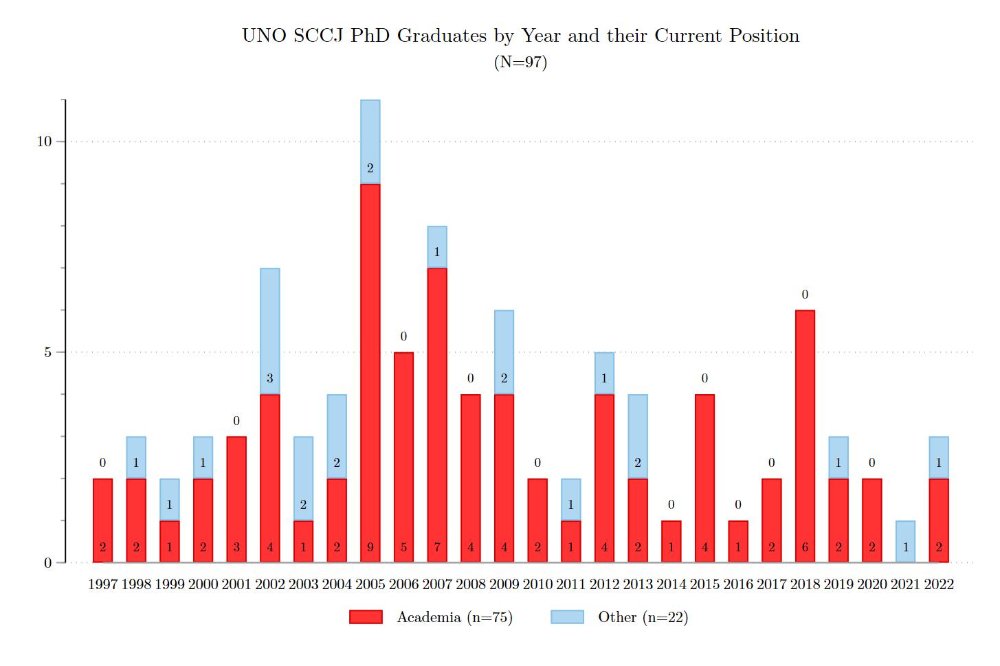
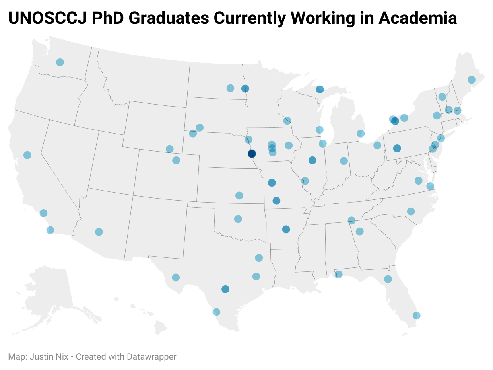

---
authors:
- admin
categories: []
date: "2023-01-11T13:45:00Z"
draft: false
featured: false
image:
  caption: ""
  focal_point: "smart"
projects: []
subtitle: ""
summary: 
tags:
- Peer Review
title: "Where are they now?"
subtitle: "Career outcomes for UNO School of Criminology and Criminal Justice PhDs"
url_pdf: ""
---

A few days ago Andy Wheeler [posted](https://andrewpwheeler.com/2023/01/08/where-are-they-now-job-outcomes-for-recent-suny-crim-phds/) about career outcomes for people who earned their PhD in Criminal Justice from SUNY Albany between 2010 and 2020. He found that roughly 50% of those who graduated during this period are currently working as a university professor. 

It made me curious about where all the UNO graduates have ended up.[^1] As of today, 97 people have earned their PhD in Criminology and Criminal Justice from the University of Nebraska Omaha. That works out to roughly 3 or 4 per year since 1997, when we hooded our first two graduates. They were [Phil Ni He](https://www.unomaha.edu/college-of-public-affairs-and-community-service/news/2023/01/ni-phil-he-joins-uno-as-chief-acedemic-officer.php) (who just returned to UNO as our new Senior Vice Chancellor) and [Chuck Katz](https://search.asu.edu/profile/24209) (professor, Arizona State). The most recent was my former student, [Brandon Tregle](https://hcap.utsa.edu/directory/brandon-tregle/) (AP, University of Texas at San Antonio). 

By our count, 75 of our 97 graduates – 77% – are currently working in academia.[^2] And remarkably, from 2014 to 2020, 18 of the 19 individuals who earned their PhD at UNO now work in academia.

And just for fun, here’s where most of those individuals are currently working. Not shown are three individuals who hold positions at MacEwan University (Canada), the Max Planck Institute (Germany), and Macau University (China). Look how spread out our graduates who are working in academia are: they span 34 US states and 3 additional countries!

Three things to keep in mind: 

1.	Some of our graduates were already employed as practitioners and came back to earn their PhD. [Dr. Mark Foxall](https://www.unomaha.edu/college-of-public-affairs-and-community-service/criminology-and-criminal-justice/about-us/mark-foxall.php) is a prime example. He worked for the Omaha Police Department, the FBI, and served as Director of Corrections in Douglas County before coming back and earning his PhD in 2005. Currently, he works in our School as our Community Service Associate (non-tenure track position that also teaches classes).

2.	A few graduates had been working in academia at one point, but have since moved on to other opportunities. 

3.	I haven’t yet tried to parse out the “other” category as Andy did (i.e., government, private sector, think tanks). That’s not meant as a slight – I was just shocked at the % who are currently working in academia and haven’t gotten around to doing the rest of the work yet. 
Other than what Andy shared about SUNY Albany, I have no idea how we stack up against other PhD-granting Crim/CJ programs. But this strikes me as an impressive track record.

Onward and upward!

[^1]: It also made me curious about my alma mater, the University of South Carolina, which graduated its first PhD student (Rhys Hester, AP at Clemson University) in the spring of 2012 (I was #10!). Unfortunately, I haven’t kept up with who has graduated since I left, or where anyone outside my small circle is presently working.
[^2]: To make a more apples to apples comparison with Andy’s SUNY analysis: from 2010 to 2020 UNO graduated 32 students, and 27 of them currently hold academic positions (84%). 

