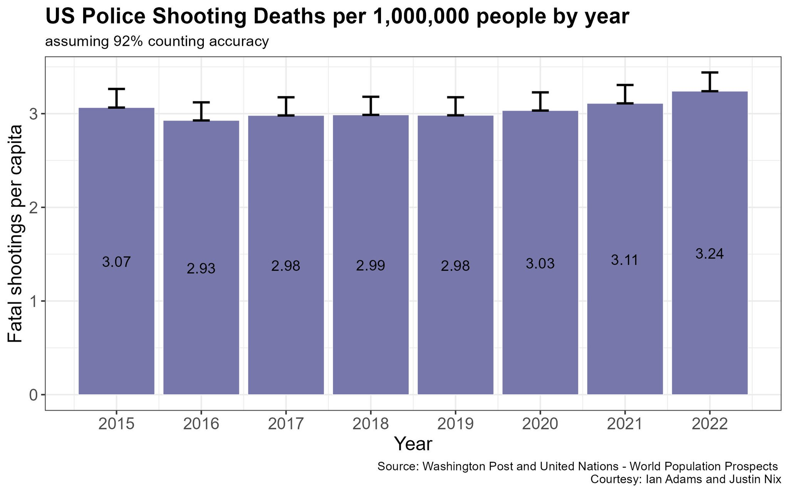
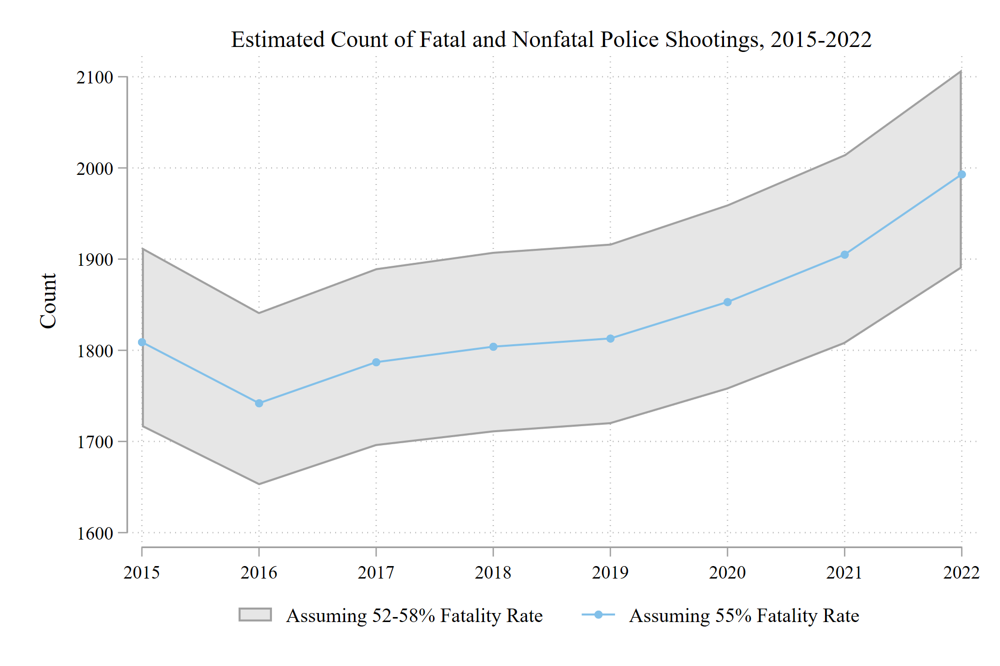

Much is being made about an apparent increase in the use of deadly force by U.S. police officers. In January, *The Guardian* ran a story titled ["It never stops: killings by US police reach record high in 2022"](https://www.theguardian.com/us-news/2023/jan/06/us-police-killings-record-number-2022). And last week, *The Washington Post* (WAPO) ran a story titled ["Fatal police shootings are still going up, and nobody knows why"](https://www.washingtonpost.com/investigations/2023/02/21/fatal-police-shootings-increase-2022/). In this story, one of us (Justin) was quoted as saying "It's hard to know if the increase is meaningful or random." As is sometimes the case with these sorts of interviews, 20-minute conversations get cut down to a single sentence or two, and a lot of context doesn't make it into the story. The point of this blog post is to continue shouting some of that context out into the void. 

Here's what prompted the stories in *The Guardian* and *WAPO*: last year, *WAPO* documented 1,096 fatal police shootings, which was the highest total they've tallied since they [started in 2015](https://github.com/washingtonpost/data-police-shootings). Over the last 8 years, the number has bounced as low as 958 (in 2016) to 1,096.[^1]

| Year 	| Fatal Police Shootings 	| Population 	| Rate per 1M 	|
|------	|:----------------------:	|:----------:	|:-----------:	|
| 2015 	|           995          	|  324607776 	|     3.07    	|
| 2016 	|           958          	|  327210198 	|     2.93    	|
| 2017 	|           983          	|  329791231 	|     2.98    	|
| 2018 	|           992          	|  332140037 	|     2.99    	|
| 2019 	|           997          	|  334319671 	|     2.98    	|
| 2020 	|          1019          	|  335942003 	|     3.03    	|
| 2021 	|          1048          	|  336997624 	|     3.11    	|
| 2022 	|          1096          	|  338289857 	|     3.24    	|

There sure does appear to be a slow but steady increase over the last 3 years or so. 

But here's one problem: it is unlikely WAPO is *actually* capturing "every fatal shooting in the United States by a police officer in the line of duty since 2015." [Mapping Police Violence](https://mappingpoliceviolence.us/), for example, [states on its website](https://mappingpoliceviolence.us/aboutthedata) that they are capturing **92% of police killings**:

Meanwhile, [Fatal Encounters](https://fatalencounters.org/) has [done some digging](https://fatalencounters.org/methodology/) that suggests their data are about **97% complete**: 

It's plausible that WAPO has simply gotten better over time at tracking fatal police shootings as they have become increasingly [newsworthy events](https://sites.duke.edu/patrickbayer/files/2022/07/w30209.pdf). And it's likely that from year to year, the completeness of their data might fluctuate slightly (e.g., 92% complete one year, 94% complete the next). If we add error bars to the yearly fatal police shooting rates which assume WAPO's database is about 92% complete every year, we can see pretty clearly that intervals for 2021 and 2022 overlap. At the same time, the 2022 rate is definitely higher than what it was each year from 2016 to 2019. 

But there's another issue: fatal police shootings do not represent the universe of deadly force incidents. They are a [nonrandom sample](https://jnix.netlify.app/publication/45-pone-nonfatal-shootings/) of deadly force incidents. [Nix and Shjarback's (2021)](https://journals.plos.org/plosone/article?id=10.1371/journal.pone.0259024) analysis of fatal and nonfatal police shootings in four states revealed that 45% of people struck by police gunfire **did not die**. If we assumed the national fatality rate of police shootings was in the ballpark of 55% (and at least one [national study](https://academicworks.cuny.edu/gc_etds/4682/) suggests that's about right), it would mean there were roughly 900 nonfatal police shootings last year in addition to the ~1100 fatal ones. And it's possible that there is some noise in the fatality rate from year to year. That is, it probably isn't *exactly* 55% every year - it may bounce around from, say, 52% to 58%. So what if the fatality rate bounced up slightly in 2022? In the figure below, we use the known number of fatal police shootings to estimate the number of fatal + nonfatal shootings each year. It shows that the number of fatal + nonfatal police shootings each year could fall anywhere within the shaded region if we assume a mere +/- 3% in the fatality rate each year.[^2] 

Yet another consideration is that all of these claims are based on national population estimates, but using total population as the benchmark here is somewhat misleading because not everyone in the country [has contact with a police officer in any given year](https://www.bjs.gov/index.cfm?ty=dcdetail&iid=251). In fact, arrests have been declining since before the pandemic (see, e.g., Appendix B of [this forthcoming article](https://jnix.netlify.app/files/pdfs/crim_war_on_cops.pdf)). 

Finally, consider the [significant increases in homicide and other violent crime](https://www.nytimes.com/2021/09/22/upshot/murder-rise-2020.html) that many communities experienced in 2020 - historically high gains that have not returned to their pre-2020 levels. Research shows that [violent crime rates are associated with police shootings](https://doi.org/10.1177/10887679221129857). In other words, as violent crime increases, the odds that an officer is involved in an arrest where lethal force is necessary may very well increase as well. [Gun sales also spiked in 2020](https://www.nytimes.com/2021/05/29/us/gun-purchases-ownership-pandemic.html), and firearm availability may mechanically lead to more armed confrontations in a nation with many millions of police and civilian contacts. In any case, these types of relationships cannot be captured in simple overall counts, as have dominated recent headlines. 

The instinct to visualize police shootings in the United States as one specific number is appealing and understandable. But as we've shown, measurement error in how we capture those numbers, random fluctuations in the lethality of police shootings, and even choices about which denominator to use all add up to a much more complex picture. Pointing at raw counts is inflammatory and detracts from our collective ability to understand one of the most important police actions we study - the authority to use lethal force capable of taking human life. The gravity of that authority should attract our most careful attention, not alarmist headlines and surface-level analysis.

[^1]: Population data pulled from [UN World Population Prospects](https://population.un.org/wpp/). 
[^2]: Keep in mind we're just talking about police shootings that injure or kill. Each year, police shoot and miss an unknown number of people, meaning the [true fatality rate](https://jnix.netlify.app/post/post2-fatality-rates/) is lower. 

