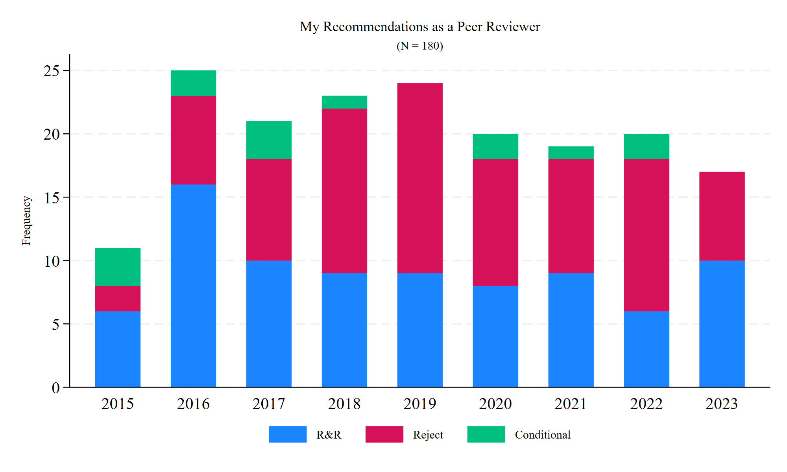

---
authors:
- admin
categories: []
date: "2023-12-27T14:00:00Z"
draft: false
featured: false
image:
  caption: "Image by [Nathan Shively](https://unsplash.com/@shivelycreative) at [Unsplash](https://unsplash.com/photos/MgIPNC8TG1c)"
  focal_point: "smart"
projects: []
subtitle: ""
summary: 
tags:
- Peer Review
title: "Looking Back on My Peer Reviews for 2023"
url_pdf: ""
---

Near the end of each of the past few calendar years, I've been [looking back](https://jnix.netlify.app/post/post14-my-reviewer-history/) on the [peer reviews I've submitted](https://jnix.netlify.app/post/post21-peer-review-2022/) - things like how often I recommended [rejecting vs. revising papers](https://jnix.netlify.app/post/post21-peer-review-2022/scores.png), how [long it took](https://jnix.netlify.app/post/post21-peer-review-2022/time.png) me to submit my reviews, and how often the editor's decision was [consistent with my recommendation](https://jnix.netlify.app/post/post21-peer-review-2022/consistency.png). Today, I'm looking back at the reviews I did in 2023, and this year, I also kept track of the review invitations I declined.

I've heard many editors say it's getting harder to find reviewers. I'm sympathetic to that, so at times I feel bad when I decline. This year I was invited to review **68 manuscripts** (20 since November 1st!) across 47 journals spanning multiple disciplines. I agreed to review 20 and declined to review 48.[^1] So that's about 5-6 invitations per month, on average, with me agreeing to review about 1-2 per month, on average. I have to say even this feels like too much at times. Sometimes papers aren't quite in my wheelhouse, sometimes there's a conflict of interest, but often I just don't have the bandwidth (I'm currently on the hook for 3 reviews). 

The way I scored these manuscripts looks pretty similar to [past years](https://jnix.netlify.app/post/post21-peer-review-2022/scores.png). I suggested revising and resubmitting 10 manuscripts[^2] and rejecting 7. 

In 2023 it took me, on average, about 4 weeks to submit my reviews (range 0 to 63 days). I've always tried my best to get my reviews in on time, but this year the wheels fell off. Eleven of the 17 I've submitted were late. Usually only by a day or two! But once I was two weeks late, and another time I was late by a month (range 1 to 32 days, median = 3). That latter one just completely slipped through the cracks and I'd forgotten about it until I got a follow-up email telling me I was late. 

So usually when I agree to review a paper, I either jump right on it (because I'm excited to read it) or put it off until later. When I put it off until later, I inevitably forget about it until I get a follow-up email right before the due date (usually between 24 hours and 1 week). 

**Journal editors: I think there's a better way.** 

Recently I've seen a few journals attach calendar invites to their automated responses when you agree to review a paper. This adds the due date to my calendar and includes a reminder a day or a week beforehand. That works way better for me and I hope more journals will adopt this practice. I get way too many emails and it's easy for stuff like that to get lost in the shuffle. But I pay attention to my calendar and use it to map out my work weeks. If I see a review is coming due that week, I'll be sure to carve out the time I need to complete it. If I get an automated reminder email at some random time of the day, I'll probably sigh at the distraction, tell myself not to forget, delete it and move on, and proceed to forget. 

One of my resolutions for next year is to set better boundaries with checking and responding to emails. Part of my problem is that I have my email account open in the background while at work and on my phone every waking hour. I check it habitually - even when I'm not at work or when I'm actively trying **not** to think about work (e.g., on the golf course, out for drinks). I can't count the number of times I've gotten a review invitation after normal working hours, thought "Hmm, sounds interesting, sure I'll review that," and completely forgotten about it by the time I was back at my desk. If I just had the self-control to not check emails when not at my desk, I'd probably get most (if not all) of my reviews in on time, and just be better organized in general. So I'm going to try to work on that, but in the meantime I bet there are others like me who'd benefit from having the due dates and reminders automatically added to their calendars. 

[^1]: Here I'm only counting original submissions (i.e., not revised manuscripts that I reviewed for a second or third time). 
[^2]: I'm including in this total one review I submitted to *PNAS Nexus*, which technically doesn't ask for a recommendation. Instead, reviewers submit their feedback and editors make the call after they've read all the reviews (which I sort of liked). But in this case my review was favorable. 