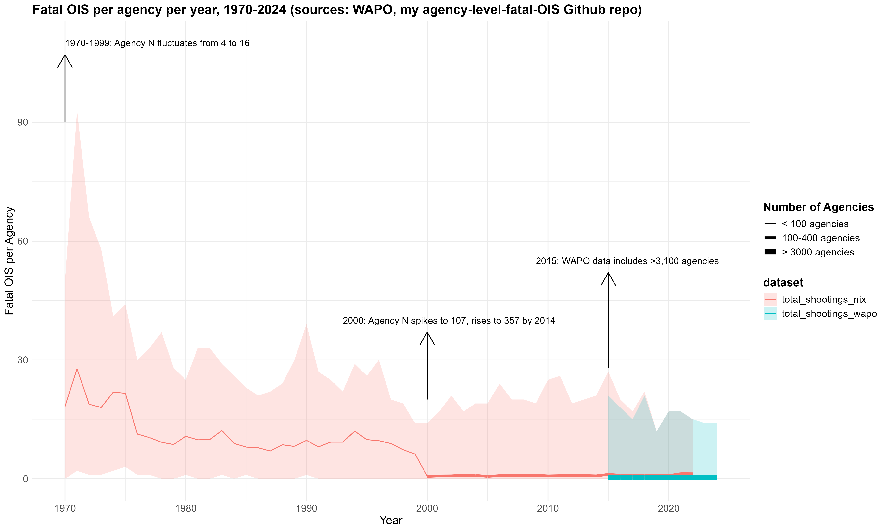

Roughly 2 years ago I started [building a database](https://github.com/jnixy/agency-level-fatal-OIS) of fatal officer-involved shootings (OIS) at the agency-year level, going back in time as far as possible. If you're not familiar with the OIS data landscape, here's the gist:

* Official data compiled by the FBI and NVSS have long been [recognized](https://heinonline.org/HOL/P?h=hein.journals/jclc70&i=556) as [woefully incomplete](https://doi.org/10.3818/JRP.4.1.2002.87) and thus [inadequate](https://doi.org/10.1177/1088767911430861). 

* Unofficial data compiled by current/former journalists, activists, and researchers have become available over the last decade or so. These do a much better job of estimating how many people are killed by police officers in the United States each year. See [Fatal Encounters](https://fatalencounters.org), [Mapping Police Violence](policedata.org), [Fatal Force by WAPO](https://www.washingtonpost.com/graphics/investigations/police-shootings-database/), [Gun Violence Archive](https://www.gunviolencearchive.org/), and SPOTLITE(https://clinecenter.illinois.edu/spotlite). 

The former goes back many decades, the latter only to 2013 or so (2000 in the case of Fatal Encounters, though the early 2000s data are likely less reliable than ~2013 onward). 

What this means is that, unfortunately, we just don't really know how current OIS trends square with more historical data, as we do in the case of [crime data](https://link.springer.com/article/10.1007/s10940-015-9277-2). That doesn't stop researchers from [trying](https://x.com/jnixy/status/1635677916762886149), though. And of course there have been [headlines](https://www.theguardian.com/us-news/2024/jan/08/2023-us-police-violence-increase-record-deadliest-year-decade) the last few Januarys about how the year before was a ["record high"](https://www.theguardian.com/us-news/2023/jan/06/us-police-killings-record-number-2022) for [police killings](https://www.usatoday.com/story/news/nation/2024/01/17/police-killings-record-2023/72174081007/). The headlines rarely convey that the "record" only goes back like 12 years. 

So if you check the [ReadMe file](https://github.com/jnixy/agency-level-fatal-OIS/blob/main/README.md) on my Github repo, you can catch up with what I set out to do 2 years ago. I started with Geller & Scott's book, *Deadly Force: What We Know*, which includes historical OIS data (i.e., as far back as 1970 in some cases) for 11 major cities. Then I tried to track down data for the ~100 largest U.S. cities. Usually this involved: (1) checking their websites for open data or annual reports, (2) looking for other published reports (e.g., by academics, Attorney Generals, or groups like ACLU), (3) looking for other data compiled by journalists, often at the city (e.g., *Texas Tribune*) or state level (e.g., *Tampa Bay Times*, *Salt Lake Tribune*, *Honolulu Civil Beat*). I didn't have much luck finding data from before 2000, but I did end up with at least some pre-2015 data for 417 agencies. 

This past week I made some updates to the data that I hope will make it more useful to anyone who might be interested. Originally, I structured the dataset so that the first column was a "year" variable that spanned 53 years, 1970 to 2022. Each subsequent column was an agency, following a "jurisdiction_state" naming convention. This obviously isn't useful for much, and it's quite messy. So I wrote an R script that does the following: 

1. Imports WAPO's [incident-level](https://raw.githubusercontent.com/washingtonpost/data-police-shootings/refs/heads/master/v2/fatal-police-shootings-data.csv) and [agency-level](https://raw.githubusercontent.com/washingtonpost/data-police-shootings/refs/heads/master/v2/fatal-police-shootings-agencies.csv) datasets, and creates a new dataset at the agency-year level for all agencies that WAPO says was involved in at least one shooting from 2015 to 2024 (3,211 agencies x 10 years = 32,110 rows). 

2. Imports my dataset with 417 agencies and reshapes it into agency-year format (417 agencies x 53 years = 22,101 rows).

3. Assigns ORI codes to almost all of the 417 agencies in my dataset (there were a few I couldn't track down - I'll keep working on that). 

4. Merges my dataset with the WAPO agency-year dataset (from Step 1) on `oricodes` (this ends up dropping some federal agencies in the WAPO data). 

Going forward, this will keep my dataset up-to-date as long as WAPO keeps updating their files. In some cases, it also allows me to see how well data I collected from other sources compares to WAPO's data (e.g., comparing `total_shootings_nix` to `total_shootings_wapo`). And having the file in agency-year format will, I hope, make it easier to work with. For example, I created the following plot to try to convey trends over time while also being transparent about how much smaller the sample gets the further back in time we go. 

So I've updated my Github repository to include the ORI codes I dug up and the R script I wrote to merge my data with WAPO's. At the end of the R script you should also be able to recreate the figure above. 

This remains a work in progress, and **any mistakes are mine**. If you do spot anything, please let me know and I can make any necessary fixes. 
