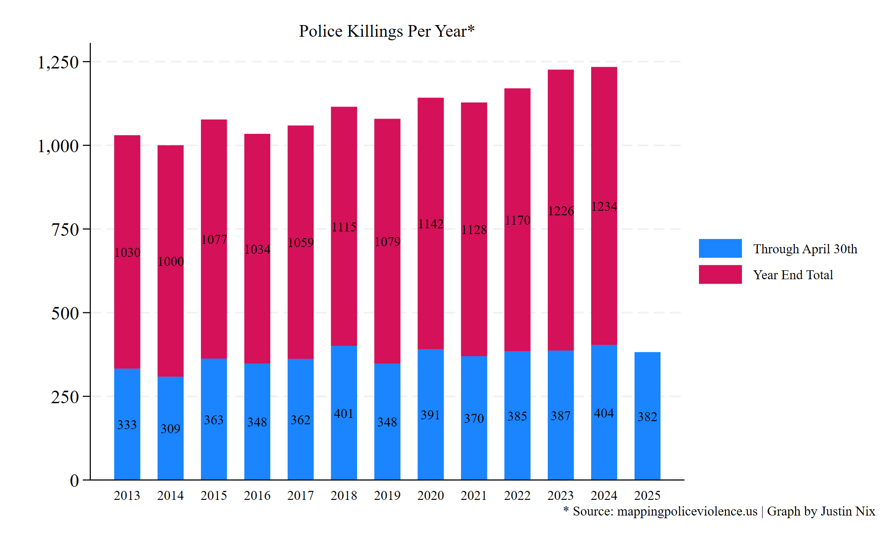
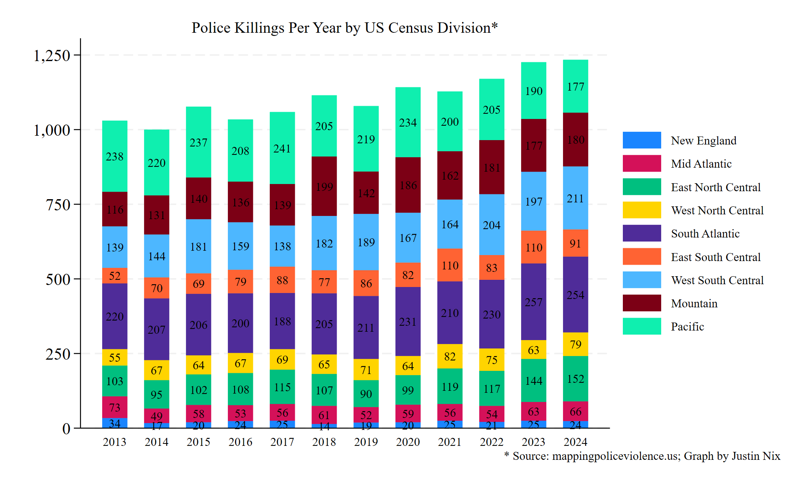

This weekend marks 5 years since George Floyd was killed by Officer Derek Chauvin of the Minneapolis Police Department. Expect to see some news stories in the coming weeks wrestling with the question of why police killings have not become any less frequent, despite the wave of reforms that were introduced in the wake of the "Defund" movement. In fact, police killings have continued on an **upward** trend, with 2024 witnessing the greatest number of people killed by police since 2013, according to [Mapping Police Violence](https://mappingpoliceviolence.us).

One exception to the larger trend seems to be in the Pacific Division - that is, the west coast plus Alaska and Hawaii - where police killings have trended downward pretty steadily since 2020:

Which it turns out is largely a California effect. Here's every state's trend, for what it's worth. Just eyeballing the post-2020 trends, it looks like Maryland is the only other state that has seen a notable downward trend. *Maybe* Oklahoma? (Right click the graph and open it in a new window if it's hard to read). 

Why? Over the past 12 years, we've observed national crimes rates go up and down multiple times, we've experienced two full-blown police legitimacy crises (first after the shooting of Michael Brown in Ferguson in 2014, then again after the 2020 killing of George Floyd), we've endured a global pandemic, and we've had both Democrat and Republican presidents in the Oval Office. Body-worn cameras have been [widely adopted](https://doi.org/10.1177/1098611120917937). Officers in many agencies have attended [de-escalation](https://link.springer.com/article/10.1007/s11292-023-09584-8) and [bias-awareness trainings](https://psycnet.apa.org/doi/10.1037/lhb0000568). Agencies have [implemented](https://www.urban.org/research/publication/evaluating-alternative-crisis-response-denvers-support-team-assisted-response) [co-responder programs](https://link.springer.com/article/10.1007/s11292-024-09634-9).

One theory is that pressure to reform was mostly (or most effectively) applied to large, metropolitan police departments. If so, we might expect police killings in those jurisdictions to have declined, but not necessarily elsewhere. The data do seem to lend some support to that theory:

Along similar lines, there is some evidence that elected sheriffs are [less supportive of citizen oversight](https://doi.org/10.1002/pam.22620), and their agencies are perhaps [less accountable and responsive to reform pressures](https://press.uchicago.edu/ucp/books/book/chicago/P/bo220537347.html) than municipal police departments. However, MPV data show no clear evidence that the increase in police killings over the past 12 years has been driven by sheriff's departments:

Homicides and other crimes spiked from 2020 to 2022, but fortunately that's behind us now.[^1] Concurrent with that spike we might've expected to see a small uptick in police killings, given [the influence of the environment on officer-involved shootings](https://doi.org/10.1177/10887679221129857). But if so, then shouldn't we also expect police killings to have fallen along with the subsequent national decline in violent crime? Maybe - though it's possible any effect might be delayed a year or so, particularly if officers still *perceive* [heightened danger](https://cup.columbia.edu/book/the-danger-imperative/9780231198479/) in their working environments. It's also possible that violence in the aggregate could be falling, while the potential for violence *during* police-citizen interactions might have remained stable or risen. That is, perhaps people have become more emboldened to challenge, resist, fight, or point/shoot guns at officers in recent years. According to [the FBI](https://www.fbi.gov/news/press-releases/fbi-releases-officers-killed-and-assaulted-in-the-line-of-duty-2023-special-report-and-law-enforcement-employee-counts):

[^1]: It's still early, but check out Jeff Asher's recent substack post: [How 2025 could feature the lowest US murder rate ever recorded](https://jasher.substack.com/p/how-2025-could-feature-the-lowest).

> [F]rom 2021 to 2023, more officers were feloniously killed (194) than in any other consecutive three-year period in the past 20 years (73 officers in 2021, 61 officers in 2022, and 60 officers in 2023)...The number of officers assaulted and injured by firearms has climbed over the years, reaching a 10-year high in 2023 with approximately 466 officers assaulted and injured by firearms.

Relatedly, there is evidence that [gun ownership](https://www.nytimes.com/2021/05/29/us/gun-purchases-ownership-pandemic.html) [and gun carrying](https://ajph.aphapublications.org/doi/full/10.2105/AJPH.2022.307094) increased in the past decade, and [studies consistently show](https://doi.org/10.1177/0002716219896259) that agencies operating in [jurisdictions with higher rates of gun ownership](https://www.nature.com/articles/s41562-025-02169-7) tend to be [involved in more officer-involved shootings](https://doi.org/10.1080/07418825.2021.1922733). So, what about the types of encounters that have precipitated police killings over the past decade? And is the increase in police killings being driven by an increase in killings of armed persons? Again, the MPV data don't tell a clear story:

One final theory is that the groups that have been hard at work tracking these incidents over the past decade or so may have gotten better over time. Meaning year by year, they're documenting a greater proportion of the true number of police killings (whatever it is), and some unknown, "dark figure" of police killings (those that occur but don't get picked up by MPV or other datasets) has gotten smaller year by year. Media attention plays a big role here - where police killings are almost certainly going to get picked up in major news markets, but perhaps less likely to get picked up in smaller, rural, and more remote jurisdictions. If so, this could perhaps also explain some of the observed increase in rural and suburban killings noted in the first figure above.

In the end, this is all [very complicated](https://doi.org/10.21428/cb6ab371.8b17fd57), and small year-to-year fluctuations are [to be expected](https://jnix.netlify.app/post/post23-are-ois-increasing/) with statistically rare outcomes (remember, these \~1200 killings per year are downstream from [50 million+ police-citizen interactions per year](https://bjs.ojp.gov/document/cbpp22.pdf)). But having said that, there's no denying that national data show an upward trend over the past 12 years. I doubt there's a singular explanation - it's likely a host of convoluted factors.
