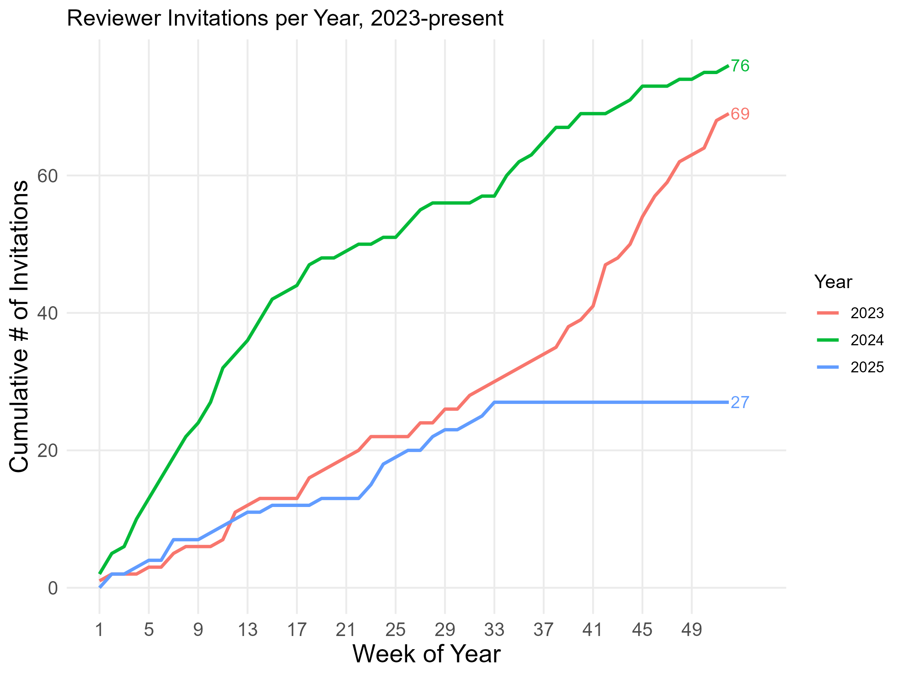
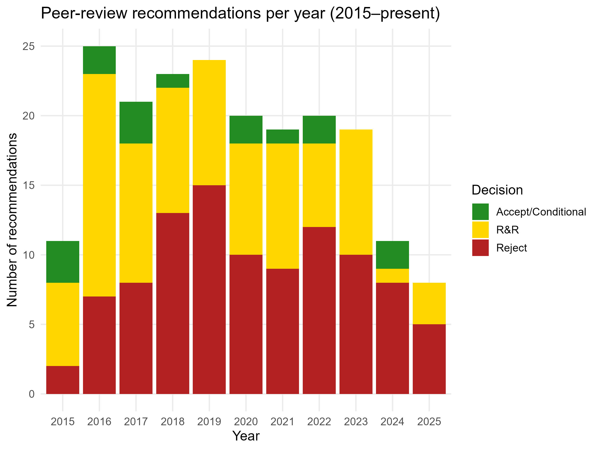
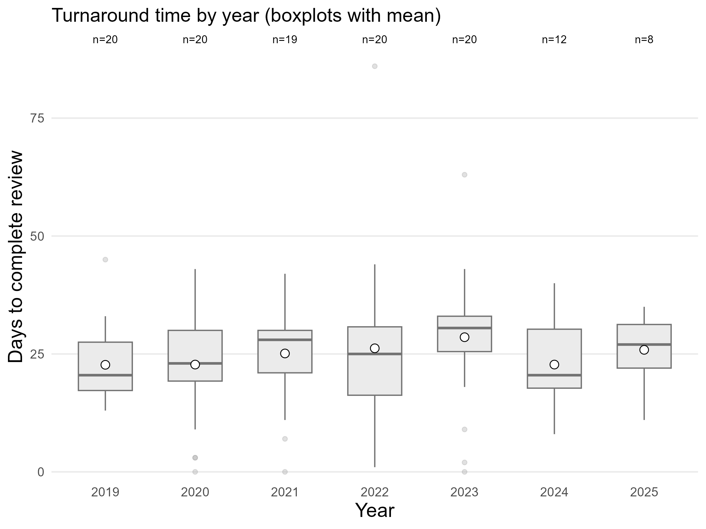

---
authors:
- admin
categories: []
date: "2025-08-19T15:00:00Z"
draft: false
featured: false
image:
  caption: "Image created by ChatGPT 5.0"
  focal_point: "smart"
projects: []
subtitle: ""
summary: 
tags:
- Peer Review
title: "Looking Back on My Peer Reviews III"
url_pdf: ""
---

I recently surpassed 200 manuscripts reviewed, and you know what that means: time to look back on how many manuscripts I've been asked to review, the recommendations I've made, and how long it generally takes me to submit after I've agreed. 

## Invitations Received

I only started keeping track of this in January 2023. But since then I've been invited to review **at least** 172 manuscripts for 97 unique journals. Mostly for criminology/criminal justice, but also sociology and, increasingly, public health. Here's a plot showing the cumulative number of invitations I've received per year. 

Looks like things have slowed down quite a bit year-over-year...perhaps because I started declining more in 2024. Years ago I was consistently agreeing to review 20-25 manuscripts. Lately I've cut that down to 10-15. There's still 4+ months left in 2025, but I don't anticipate reviewing more than 3-4 papers in that span.

| Year | Invitations | Agreements | % Agreed    |
| ---- | ----------- | ---------- | ----------- |
| 2023 | 69          | 20         | 29.0        |
| 2024 | 76          | 13         | 17.1        |
| 2025 | 27          | 8          | 29.6        |

## Recommendations Made

I've kept track of the recommendations I've made since the beginning. So over the past ~10 years, I've recommended rejecting 99 papers (49%), R&R'ing 86 papers (42%), and conditionally or outright accepting 16 papers (8%). Here's the yearly breakdown.

I've recommended rejecting 13 of the last 20 manuscripts I've reviewed (65%). Maybe I've been less lenient these past 2 years than I was earlier in my career, maybe I've been getting asked to review lower-quality papers, or maybe a bit of both. But I will say the papers I get asked to review on police use of deadly force tend to be lower quality. Some colleagues and I elaborate on the problems with that line of literature in this [forthcoming book chapter](https://doi.org/10.21428/cb6ab371.8b17fd57). 

## Need for Speed

I started reliably tracking how long it took me to submit my reviews around 2019. And I'm proud to say that, apart from a few outliers (including one paper I completely spaced on until the editors pinged me), I've been good about getting my reviews in on time. Even with those outliers, overall, my average turnaround time is ~25 days. 

## In Closing

I've received my share of helpful and unhelpful reviews, and I much prefer the former as I'm sure we all do. So the Golden Rule of peer review should be to *review unto others as you'd have them review unto you*. That doesn't mean submitting favorable reviews of bad papers. Reject away if they're bad - just be kind. As I've [said before](https://jnix.netlify.app/post/post14-my-reviewer-history/), we should all strive to be good reviewers - meaning we take them seriously (don't phone it in), we're reasonably prompt, and we offer constructive feedback instead of snark and condescension. A rejection stings enough on its own - no need to pour salt in the wound. 