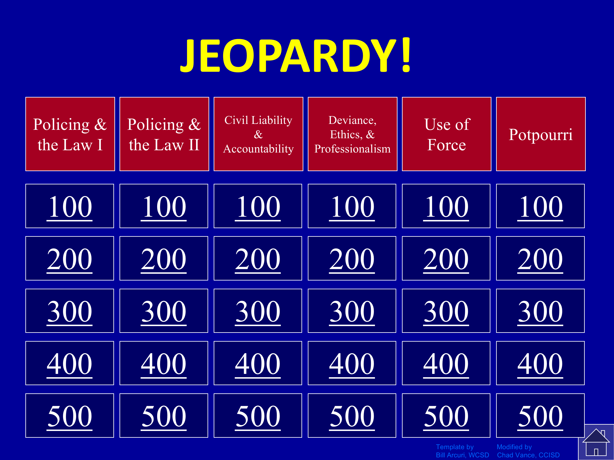

---
authors:
- admin
categories: []
date: "2025-12-11T15:00:00Z"
draft: false
featured: false
image:
  caption: "Image created by ChatGPT 5.1"
  focal_point: "smart"
projects: []
subtitle: ""
summary: 
tags:
- Teaching
title: "New teaching hack unlocked?"
url_pdf: ""
---

Today was the last day of the semester for my undergrad [Police & Society](https://jnix.netlify.app/courses/crcj2030/) course. In the past, I've always done a review for the final, in the form of Jeopardy:[^1]

My classes range in size from 20 to 35 students, so I end up splitting them into three teams of anywhere from 6 to 12. I've tried doing this randomly as well as more intentionally (i.e., stratifying by performance so that each group has roughly the same number of high-performers). But inevitably what happens is 2 or 3 extroverts drive the game and the rest don't engage much, if at all. Today I decided to switch things up in an effort to get everyone to participate. 

I discovered [Poll Everywhere 2.0](https://www.polleverywhere.com/) and it might just be a game-changer, not just for review sessions like today but for every class going forward. The free version allows you to create polls/surveys for up to 40 participants, and I found it to be super intuitive. In less than 30 minutes, I had pasted my Jeopardy questions from the old PowerPoint file into Poll Everywhere. Students can play from their laptops by visiting a unique URL or from their smartphones by using a QR code. They don't have to create an account or download an app. I put the questions on the big screen and students can see it mirrored on their devices, where they submit their answers individually. Once everyone has answered, we can see what the distribution of responses was, and I can see what content the class has a clear grasp of, and what content we might need to brush up on ahead of the final. 

I didn't require students to attach their names to their responses, but it is an option, and in theory it would enable me to circle back to students individually to help tailor a study plan for them (e.g., helping them determine which topics or concepts they should consider spending more time with as they study).

Ultimately I think this worked **much** better than the team-based approach I was using previously. Thinking bigger picture though, I hope to use Poll Everywhere for other stuff, too. For example, I could imagine posting an open-ended question at the end of each lecture asking students what questions they still have, or if there was anything we covered that was still unclear. Or, I could give a short quiz at the end of each lecture to check that they're picking up/retaining key information.

I'm sure I'm late to the party and there's probably a better tool or app out there, but for me this was a big step forward and I'm glad I gave it a try. I'm sharing it here in case others might find it helpful. 

[^1]: I'm happy to share my Jeopardy PowerPoint file with other instructors - just shoot me an email. 
