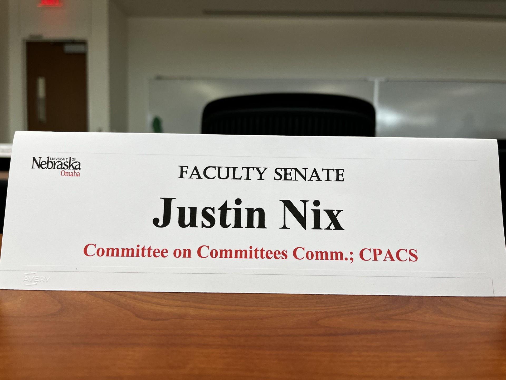

Graduate programs are hosting preview visits this semester, trying to figure out who they'll admit to their fall cohorts. If you're one of those prospective students flying in for campus tours and wine-and-cheese receptions with faculty, congratulations! You're probably excited. Maybe a little nervous. Definitely wondering if you're making the right call.

I remember that feeling. I also remember wishing someone had been more candid with me about what graduate school in criminology actually involves. So consider this that conversation—the one I wish I'd had before I started my PhD in 2011.

## 1. Pick Your Advisor Like You're Picking a Business Partner

You'll hear people say "fit matters" when choosing a program. They're right, but not for the reasons you think. Fit isn't just about whether you and your advisor are both interested in the same research topics, nor is it about whether you love the same TV shows or share political views. It's about whether you can work together productively for 5-7 years under conditions that will sometimes be stressful and occasionally frustrating.

Ask yourself: Does this person respond to emails? Do their current students seem happy, or do they seem exhausted and stressed? Are they still actively publishing, or did they peak 15 years ago? Do they have a track record of placing students in jobs? These are things I never even considered when I was thinking about grad school.

Here's what I wish someone had told me: your advisor's reputation matters, but their actual behavior matters more. A famous scholar who ignores your emails and never reads your drafts is worse than an early- or mid-career professor who meets with you regularly and helps you push papers forward. And pay attention to whether they have funding. A well-funded advisor can pay you as a research assistant, send you to conferences, and connect you to important projects. An advisor without funding may not be able to do any of that, no matter how smart they are.

One more thing: if you're visiting a campus and the current grad students won't make eye contact when you ask about their advisor, that's a signal. Listen to it.

## 2. The Job Market Is Harder Than Anyone Will Tell You

During your campus visit, someone will probably mention job placement rates. They might say something like "95% of our graduates are employed within a year." That sounds great, but it's probably misleading.[^1]

[^1]: [A few years ago](https://jnix.netlify.app/post/post22-sccj-alumni/) I tried to track down all ~100 of UNO SCCJ's PhD alumni. I found that nearly 80% were currently employed at academic jobs. 

The relevant question isn't whether graduates are employed. It's whether they're employed in the kinds of jobs they wanted. Tenure-track positions at research universities are scarce. Teaching-heavy positions at regional schools are more common but still competitive. Many people who complete PhDs in criminology end up working for research firms, government agencies, or nonprofits. And to be clear these are perfectly good jobs! But probably not what you pictured when you applied.

I'm not saying this to discourage you. I'm saying it because you should go in with realistic expectations. The people who struggle most in grad school are often the ones who assumed a tenure-track job was the natural endpoint of the PhD. It's not. It's one possible outcome, and increasingly it's not the most common one.

If you do decide to go to grad school, make sure you're doing it because you actually want to spend 5-7 years learning how to do research, not because you think it's the ticket to a specific job. And for god's sake, do not go into debt for a PhD in criminology. If a program isn't offering you full funding (tuition waiver plus a living stipend), do not go.

## 3. Methods and Stats Training Matter More Than You Think

Most people come to grad school excited about theory and big ideas. That's fine. But here's what will actually determine your career trajectory: whether you can consistently translate those big ideas into published products. There's a ton of data out there. Do you know where to look, and can you effectively wrangle it to answer your research questions? If there's insufficient or inadequate data, can you write a proposal to collect newer/better data, secure funding, execute your plan, and publish the results? 

I wish I'd taken methods and stats training more seriously early on. Not because I didn't think it was important, but because I didn't realize how much of academic research is just data wrangling. Cleaning messy datasets. Merging files. Dealing with missing data. Figuring out why your code worked yesterday but doesn't work today. This is the unglamorous reality of empirical research, and you need to get good at it.

Two specific things I wish someone had emphasized:

First, learn to code for replicability, not just to get results. That means writing scripts that are well-organized, clearly commented, and can be run by someone else (or by future-you, six months from now when a journal asks for revisions). If your analysis pipeline is a mess of uncommented code and files named "final_FINAL_v3_USE_THIS.R," you're going to have problems. More importantly, the field is moving toward [open science practices](https://jnix.netlify.app/publication/65-science-under-scrutiny/), and being able to share clean, reproducible code is becoming an expectation, not a bonus.

Second, get comfortable with at least one statistical programming language early. R or Stata or Python—pick one and *really* learn it.[^2] Don't just memorize the commands you need for your current project. Understand how the software works. Read other people's code. Take the extra methods seminar even if it's not required. Your 4th-year self will thank you when you're trying to finish your dissertation and you don't have to relearn basic data manipulation because you forgot everything from your 1st-year stats class.

[^2]: Even SPSS, I guess, as long as you're writing syntax and not pointing/clicking.

## 4. Rejection Is Part of the Job

You're going to submit papers to journals and get rejected. You're going to apply for grants and not get them. You're going to give conference presentations where someone in the audience asks a hostile question that makes you feel like an idiot. This is normal. It happens to everyone, including the most successful people in the field.

What surprised me most about academia was how much of it involves putting your work out into the world and having people tell you it's not good enough. Sometimes they're right—your paper really does have problems that need fixing. Sometimes they're wrong—Reviewer 2 clearly didn't read your methods section. Either way, you have to learn how to absorb the criticism, extract what's useful, and keep going.

The people who succeed in academia aren't necessarily the smartest or the most talented. They're the ones who can handle rejection without spiraling, who can revise a paper for the third time without losing their minds, and who can get a grant rejected and immediately start working on the next application.

If you're someone who takes criticism very personally, grad school is going to be hard. Not impossible—plenty of sensitive people become successful academics—but hard. You'll need to develop strategies for dealing with feedback that feels harsh or unfair. Remember that peer review is about improving your work, not attacking you personally (even when it feels that way).

## 5. You're Not Just Training to Be a Researcher

Here's something nobody tells you during campus visits: being a professor isn't just about doing research. It's also about teaching, service, mentoring, and a whole lot of administrative work that has nothing to do with the intellectual questions that drew you to the field. True story: I once served on a "Committee on Committees Committee." 

If you end up in a tenure-track job, you'll spend a lot of time teaching undergraduates who don't want to be in your class. You'll serve on committees that accomplish very little. You'll write letters of recommendation. You'll advise students who are struggling academically or personally. You'll deal with grade complaints, plagiarism cases, and administrative tasks that could have been handled in an email but instead require three meetings and a memo.

I'm not complaining—I genuinely enjoy most parts of the job. But I wish someone had told me that being good at research isn't enough. You also need to enjoy teaching, be capable of handling bureaucracy without losing your mind, and be willing to do a lot of work that feels tangential to your core intellectual interests.

Think about whether that sounds appealing to you. If the only part of academic life that interests you is sitting in your office thinking deep thoughts about crime, you might want to reconsider. If you like the idea of mentoring students, building [research labs](https://viprlab.org/), and being part of an intellectual community, then academia might be a good fit.

## A Final Word

None of this is meant to scare you away from grad school. I'm very happy I got my PhD. I worked hard, but I also realize how lucky I am that things came together the way they did for me. I've learned a ton, worked on problems I care about, and built a career I find meaningful. But I do think prospective students deserve a realistic picture of what they're signing up for.

If you're considering grad school, ask yourself: Do you actually want to do research, or do you just like the idea of being a professor? Are you prepared for 5-7 years of modest pay and deferred gratification? Can you handle regular rejection and criticism? Are you willing to invest serious time in learning technical skills that aren't glamorous but are essential?

If the answers are yes, then go for it. Grad school can be a great experience. Just go in with your eyes open.
