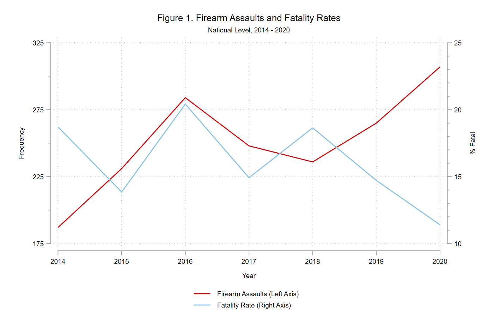

***************

**BACKGROUND & METHODS**

In a new paper forthcoming at *Police Practice & Research*, [Michael Sierra-Arévalo](https://twitter.com/michaelsierraa), [Brad O'Guinn](https://twitter.com/BradOguinn), and I examine firearm assault survival among U.S. police officers from 2014 to 2020 using data from the [Gun Violence Archive](https://www.gunviolencearchive.org/). This work builds on a study Michael and I published in [Criminology & Public Policy](https://onlinelibrary.wiley.com/doi/10.1111/1745-9133.12507) in 2020. The first step was to use the same [case selection strategy](https://jnix.netlify.app/post/post10-gvaanalysis/) as before (i.e., we excluded accidental and intentional self-inflicted firearm injuries, “blue-on-blue” shootings of one officer by another, security guards, federal officers, court officers, and probation agents). For this analysis, we also restricted our sample to the 48 contiguous U.S. states, excluding cases in Alaska (n=6) and Hawaii (n=4). This process yielded an analytic sample of **N=1,758**

Second, we calculated the distance from each shooting incident to the nearest Level I or II trauma care center. For our purposes, "nearest" refers not to shortest distance, but the shortest drive time as determined by historical traffic data pulled from the Google Maps API (see pp. 3-4 of the [post-print](https://jnix.netlify.app/files/pdfs/ppr_trauma_proximity.pdf)). 

Finally, using logistic regression, we estimated the odds of an officer fatality (conditional on having been shot in the line of duty) while controlling for proximity to trauma care, U.S. census division, whether the shooting occurred in an [urban county](https://www.ers.usda.gov/data-products/rural-urban-continuum-codes.aspx), and the month and year of the shooting. 

**KEY FINDINGS**

At the national level, firearm assaults of officers *increased* from 2018 to 2020 while the fatality rate *decreased* over the same period. This again underscores the need for better data on nonfatal shootings, which account for about 84% of firearm assaults on officers each year (bear in mind our data do not include instances where suspects shot at but missed officers). 

The results of our multivariable analysis indicated that proximity to trauma care was **not** significantly associated with the odds of officers surviving a gunshot wound (see Table 2 on p. 9 of the [post-print](https://jnix.netlify.app/files/pdfs/ppr_trauma_proximity.pdf)). On the one hand, this was somewhat surprising given that proximity to trauma care predicts survival of gunshot wounds among the general public.[^1]. On the other hand, police have specialized equipment, such as ballistic vests and tourniquets, that reduce the severity of gunshot wounds or allow them to be tereted immediately. Several of our year variables significantly differed from the reference year - 2020 - which warrants additional empirical scrutiny. 2020 saw the greatest number of firearm assaults in our study period but simultaneously witnessed the lowest fatality rate over the same seven years. Maybe that's just a coincidence, but it's worth a closer look, especially in light of the fact that nonfatal shootings among the general public spiked in many cities in 2020.

**IMPLICATIONS**

Based on these findings, to enhance officer safety and wellness, we make three policy recommendations:

1. Equip officers with ballistic vests *and mandate their use at all times*. As of 2013, nearly 30% of local police departments did not require officers to always wear a vest while on duty.[^2] 

2. Equip officers with tourniquets and train officers on their use. One recent [survey](https://doi.org/10.7205/MILMED-D-14-00470) found that only 30% of agencies issued tourniquets to their officers. Tourniquets can save the lives of both officers *and* civilians who have been shot. 

3. Collect and disseminate higher-quality data on violence directed at police. As usual, there were a lot of variables we would have liked to include in our analysis that simply weren't available (e.g., number of wounds, wound location, firearm type). California does a good job of this with its [Use of Force Reporting System](https://openjustice.doj.ca.gov/data), and we see no reason other states shouldn't attempt to emulate their efforts. 

[^1]: See e.g., [Circo (2019)](https://doi.org/10.1136/injuryprev-2019-043180); [Circo & Wheeler (2021)](https://doi.org/10.1007/s12061-020-09362-3); [Crandall et al. (2013)](https://doi.org/10.2105/AJPH.2013.301223).

[^2]: See Table 2 of [Reaves (2015)](https://www.bjs.gov/content/pub/pdf/lpd13et.pdf). 