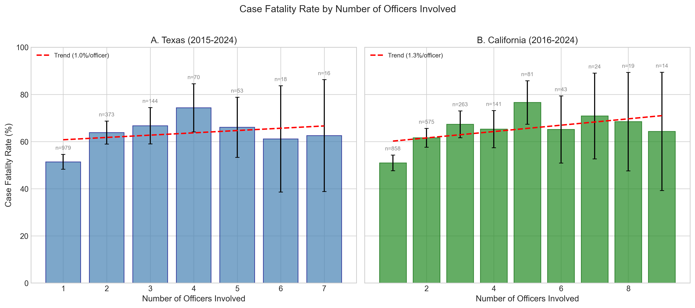
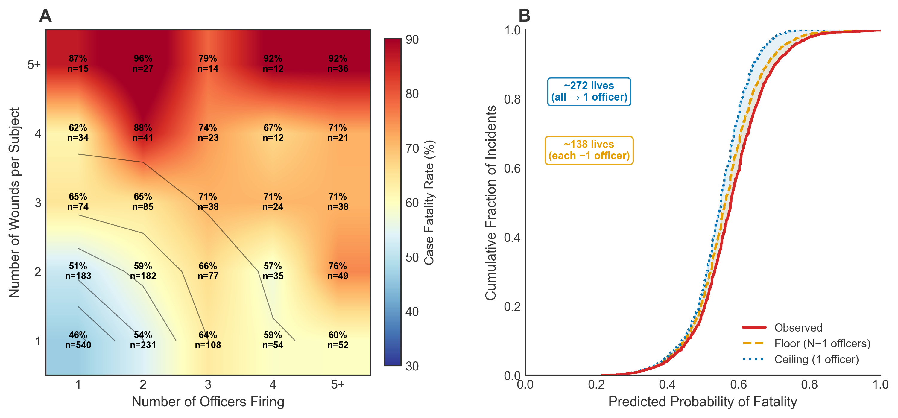

+++
# Paper title
title = "The Killing Cascade: More Officers, More Wounds, More Deaths in Police Shootings"

# Authors
authors = ["admin", "Ian Adams"]

# Publication
publication = "*CrimRxiv*"

# Publication types (2 = Journal article; 3 = preprint; 4 = report; 6 = book chapter)
publication_types = ["3"]

# Date the paper was published.
date = 2026-02-09T10:00:00Z

# Date this page was created.
publishdate = 2026-02-09T13:00:00Z

# Project summary to display on homepage.
summary = ""

# Abstract
abstract = "**Research Summary**. The probability that a civilian will die rises markedly when more than one officer discharges their firearms, but prior studies have largely failed to account for the number of officers firing or the anatomical location of wounds. We analyzed 3,715 officer-involved shootings in Texas (2015–2024) and California (2016–2024) using linear probability models with progressive controls. Each additional officer firing was associated with a 3.14 percentage point increase in fatality risk (pooled estimate = 3.14 pp, 95% CI: 2.32–3.97; N = 3,519), and roughly 45.1% of this effect operated through wound count. We term this progression—more officers, more rounds, more wounds, more deaths—the killing cascade, consistent with a “contagious fire” mechanism in which peer gunfire triggers additional rounds. In California, where wound data were available, wound location was the single most powerful predictor of fatality and did not differ by race (χ^2(6) = 7.56, p = .27). The Black coefficient was not significant in any California specification, though in Texas—where wound location is unobserved—Black civilians had a significantly lower probability of fatality (-7.02 pp, p = .03). **Policy Implications**. If multi-officer shootings carried single-officer fatality rates, an estimated 272 deaths—12.5% of all fatalities across both states—would not have occurred. A more conservative scenario—reducing the number of officers firing by one per encounter, as contagious fire training aims to achieve—would have prevented an estimated 138 deaths. Training protocols addressing fire discipline and coordination in multi-officer encounters may reduce fatality risk. Mandating wound location reporting, currently required only in California, would enable systematic monitoring of shooting outcomes and inform evidence-based policy."

# Tags: can be used for filtering projects.
# Example: `tags = ["machine-learning", "deep-learning"]`
tags = ["police shootings", "use of force", "race"]

# Optional external URL for project (replaces project detail page).
external_link = ""

# Slides (optional).
#   Associate this project with Markdown slides.
#   Simply enter your slide deck's filename without extension.
#   E.g. `slides = "example-slides"` references
#   `content/slides/example-slides.md`.
#   Otherwise, set `slides = ""`.
slides = ""

# Links (optional).
url_pdf = ""
url_slides = ""
url_video = ""
url_code = ""

# Custom links (optional).
#   Uncomment line below to enable. For multiple links, use the form `[{...}, {...}, {...}]`.
links = [{name = "Preprint", url="https://www.crimrxiv.com/pub/7mj8aj3g", icon = "unlock-alt", icon_pack = "fas"}]

# Featured image
# To use, add an image named `featured.jpg/png` to your project's folder.
[image]
  # Caption (optional)
  caption = "Created with ChatGPT 5.2"

  # Focal point (optional)
  # Options: Smart, Center, TopLeft, Top, TopRight, Left, Right, BottomLeft, Bottom, BottomRight
  focal_point = "Center"
+++

## The Killing Cascade

Roughly 1,000 people are killed by police gunfire every year in the United States. Another 800 survive. What determines who lives and who dies? One straightforward hypothesis is that when more than one officer fires, civilians are more likely to die. Our new research shows why—and what could potentially be done about it.

Surprisingly, that question has gotten little attention. Most research on police shootings focuses on *who gets (fatally) shot* — the racial disparities, the encounter characteristics, the neighborhood context. But the question of *who survives* conditional on being shot is different, and it requires more comprehensive data. You need records of nonfatal shootings too, and those have been notoriously hard to come by.

In a new paper with Ian Adams, we analyzed 3,715 officer-involved shootings across Texas and California over nearly a decade. We used mandatory state reporting data that captures both fatal and nonfatal incidents—the kind of data that crowdsourced databases like the *Washington Post*'s Fatal Force simply don't track.

Our central finding: each additional officer who discharges their firearm is associated with about a 3 percentage point increase in the probability that the civilian dies. That held up across dozens of alternative specifications in both states. It's not a binary effect, either—it's a continuous dose-response relationship. Two officers firing is deadlier than one. Three is deadlier than two. And so on.

## Why More Officers Means More Death

California's data let us dig into the mechanism, because California is the only state with a reporting system that records where bullets actually strike. We found that when more officers fire, civilians sustain wounds to more anatomical regions. More officers, more rounds, more wounds, more death. We call this progression the "killing cascade."

Wound count alone mediated about 45% of the relationship between officer count and fatality. That's a big number, and it aligns with recent experimental research on [contagious fire](https://doi.org/10.1016/j.jcrimjus.2024.102215)—the phenomenon where one officer's shots trigger reflexive firing by others nearby. Lab studies have shown that officers in multi-shooter scenarios fire faster and less accurately. Our data suggest this translates to real-world lethality.

## What About Race?

We tested whether the killing cascade operated differently by race. It didn't. The association between officer count and fatality was statistically similar for White, Black, and Hispanic civilians in both states. We also ran a chi-square test on wound location distributions by race in California and found no significant differences—officers appear to hit similar anatomical regions regardless of victim race.

This doesn't mean race doesn't matter in police shootings. It clearly does - Black and Hispanic civilians are overrepresented among those shot [in the first place](https://www.pnas.org/doi/10.1073/pnas.1821204116). But our results suggest the [previously documented](https://doi.org/10.1371/journal.pone.0259024) [Black–White fatality gap](https://ajph.aphapublications.org/doi/full/10.2105/AJPH.2023.307560) among those who are shot is more likely explained by encounter dynamics than by differential aiming.

## The Counterfactual

To illustrate the magnitude of what we found, we estimated how many deaths might not have occurred under different scenarios. If multi-officer shootings carried single-officer fatality rates, an estimated 272 deaths—12.5% of all fatalities across both states—would not have happened. A more conservative estimate, which assumes that contagious fire training could prevent just one officer from reflexively firing in each multi-officer incident, yields 138 fewer deaths.

Those aren't small numbers.

## What Can Be Done?

The cascade structure of the finding is actually good news from a policy standpoint, because it means intervention at any link in the chain can reduce fatality. Contagious fire training—scenario-based exercises that teach officers to independently assess threats before firing—could prevent reflexive discharges. Tactical approaches that reduce, whenever possible, the number of officers converging on a single point of contact could help too.

Our results also highlight a data problem. Among the two states we studied, only California records where bullets strike. Texas doesn't. That means the mediation analysis—arguably the most policy-relevant part of our study—was only possible in one state. Mandating wound location reporting nationwide would give researchers and departments far better tools for understanding and reducing police lethality.

---

*The preprint version of this manuscript is available at [CrimRxiv](https://www.crimrxiv.com/pub/7mj8aj3g). We welcome feedback as we move through the peer review process.*

