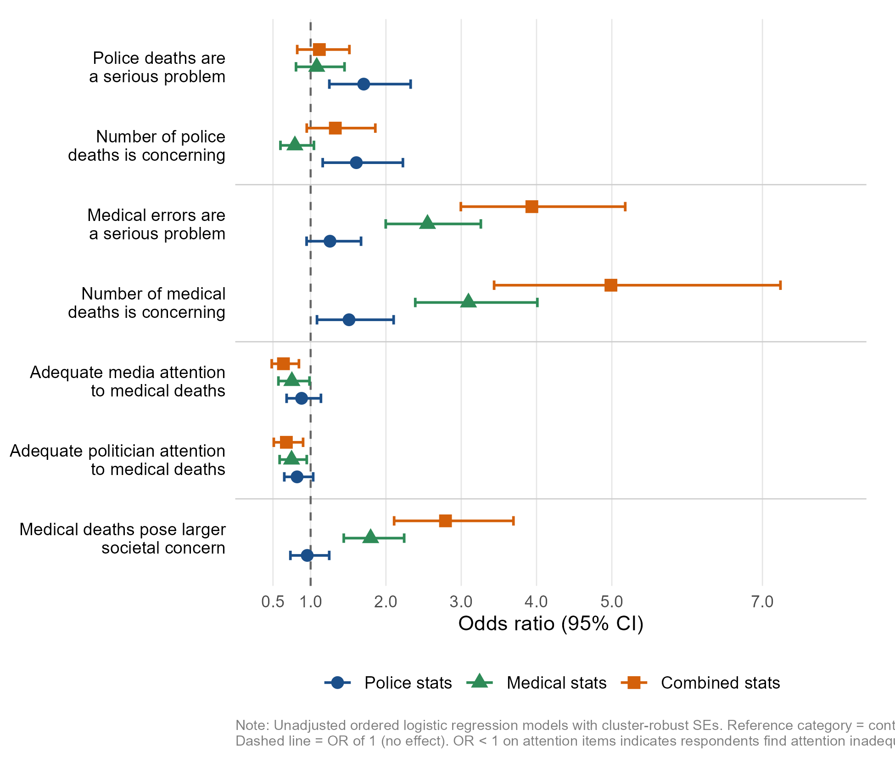

+++
# Paper title
title = "Concerning, but do we need policy reform? An experimental analysis of public reactions to accurate statistics on deaths caused by police officers and medical professionals"

# Authors
authors = ["Hunter Boehme", "Brandon Tregle", "admin"]

# Publication
publication = "*Journal of Experimental Criminology*"

# Publication types (2 = Journal article; 3 = preprint; 4 = report; 6 = book chapter)
publication_types = ["2"]

# Date the paper was published.
date = 2026-01-26T10:00:00Z

# Date this page was created.
publishdate = 2026-02-11T11:00:00Z

# Project summary to display on homepage.
summary = ""

# Abstract
abstract = "Preventable deaths by medical professionals and law enforcement officers figure prominently figure in political discourse. While databases have emerged to track such deaths, little is known about the public's concern over the prevalence of these deaths, the perceived adequacy of societal attention to these deaths, and which policies the public supports to attempt to reduce these deaths. This study presents findings from a pre-registered survey with an embedded information provision experiment, randomly assigning accurate statistics on police-caused and medical error deaths. Findings suggest that the public finds both death types concerning and a serious problem, and that there is not adequate attention from the media and politicians given to both death types. Those assigned medical death statistics, as well as combined medical death and police-caused death statistics, were significantly more likely to agree that medical error deaths pose a larger societal concern than police deaths. Implications for policy and research are discussed."

# Tags: can be used for filtering projects.
# Example: `tags = ["machine-learning", "deep-learning"]`
tags = ["policing", "experimental design", "officer-involved shootings", "medical errors"]

# Optional external URL for project (replaces project detail page).
external_link = ""

# Slides (optional).
#   Associate this project with Markdown slides.
#   Simply enter your slide deck's filename without extension.
#   E.g. `slides = "example-slides"` references
#   `content/slides/example-slides.md`.
#   Otherwise, set `slides = ""`.
slides = ""

# Links (optional).
url_pdf = ""
url_slides = ""
url_video = ""
url_code = ""

# Custom links (optional).
#   Uncomment line below to enable. For multiple links, use the form `[{...}, {...}, {...}]`.
links = [{name = "DOI", url="https://doi.org/10.1007/s11292-026-09735-7", icon = "unlock-alt", icon_pack = "fas"}, {name = "Pre-registration", url="https://osf.io/39emp", icon = "osf", icon_pack = "ai"}]

# Featured image
# To use, add an image named `featured.jpg/png` to your project's folder.
[image]
  # Caption (optional)
  caption = "Image created with ChatGPT 5.2"

  # Focal point (optional)
  # Options: Smart, Center, TopLeft, Top, TopRight, Left, Right, BottomLeft, Bottom, BottomRight
  focal_point = "Center"
+++

## When Numbers Change Minds—But Not Policy Views

More than 1,000 people are [killed by police officers](https://doi.org/10.21428/cb6ab371.2658be90) every year in the United States. Meanwhile, by some estimates, medical errors claim an estimated [250,000 lives per year](https://doi.org/10.1136/bmj.i2139).[^1] Most Americans can approximate the first number; very few can approximate the second. In a new paper with Hunter Boehme and Brandon Tregle, we ran a pre-registered survey experiment to find out what happens to public attitudes when people learn both.

[^1]: See also: [Havens & Boroughs (2000)](https://www.jpedhc.org/article/S0891-5245(00)70009-5/fulltext), [Kavanagh et al. (2017)](https://journals.lww.com/journalpatientsafety/fulltext/2017/03000/estimating_hospital_related_deaths_due_to_medical.1.aspx)

**The Study**

We randomly assigned 1,227 adults (recruited via [Prolific](https://www.prolific.com/)) to one of four conditions: a control group, a group that received accurate statistics on annual police-caused deaths (~1,000 per year), a group that received statistics on medical error deaths (~250,000 per year), or a combined group that received both. Before and after the treatment, respondents rated their concern over each type of death, their views on the adequacy of media and political attention to each issue, and their support for twelve policy reforms. Pre-registration is [here](https://osf.io/39emp).

**What Changed**

The statistics moved people. Before receiving any information, 68% of control respondents agreed that medical errors are a serious problem. After seeing medical error statistics, that figure rose to 84%—and to 89% among those who received both sets of statistics. Police deaths showed a more modest shift: 72% of controls agreed police deaths are a serious problem, rising to 81% in the police statistics condition.

Effects on relative salience were sharper. In the control group, only 31% agreed that medical error deaths pose a *larger* societal concern than police deaths. That figure climbed to 45% in the medical condition and 56% in the combined condition—a 25-percentage-point increase. Pre-post comparisons told the same story: concern about medical deaths increased by an average of 0.52 scale points in the medical condition and 0.64 points in the combined condition (both *p* < .001).

The ordered logistic models confirm these patterns. Medical statistics more than doubled the odds that respondents found medical errors a serious problem (OR = 2.55, *p* < .001) and tripled the odds they found the *number* of medical deaths concerning (OR = 3.10, *p* < .001). The combined treatment had the strongest effects, nearly quintupling the odds on that last outcome (OR = 4.99, *p* < .001). The figure below shows treatment effects across seven key outcomes.

One pattern stands out on the attention items: across both the medical and combined conditions, respondents were *less* likely to view media and political attention to medical deaths as adequate (ORs ranging from 0.64–0.75). Respondents who learned that 250,000 people die annually from preventable medical errors didn't conclude the problem was being handled—they concluded it was being ignored.

**The Dog That Didn't Bark**

Despite those substantial shifts in concern and salience, treatment assignment had almost no effect on policy preferences. Out of twelve policy reform items, only one reached statistical significance: respondents who received medical error statistics were modestly more likely to support increased funding for medical oversight agencies (OR = 1.34, *p* < .05). The police statistics condition produced zero significant policy effects.

The same information that reshaped how people *think* about these deaths did almost nothing to change what they *want done* about them.

**What This Means**

Two takeaways stand out. First, there is a genuine information gap around medical error mortality—and filling it has measurable effects on awareness and perceived salience. Advocates and journalists covering this issue may find that accurate numbers can help close the gap with public opinion on police violence.

Second, information provision is not sufficient to generate policy demand. This is consistent with a broader literature: factual beliefs and policy preferences are often decoupled, particularly on issues where partisan identity and prior values do the heavier work. For advocates on either side of these debates, the implication is practical: the numbers can open doors, but they probably won't close deals on their own.
