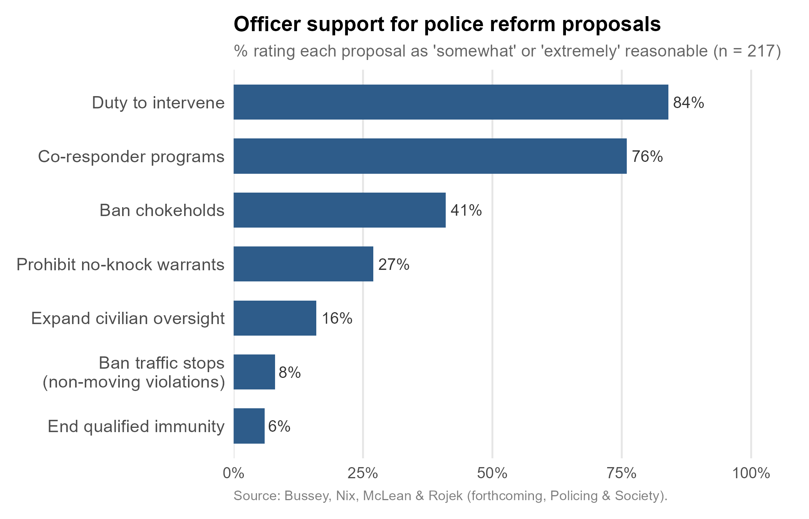

+++
# Paper title
title = "The relationship between warrior and guardian mindsets and support for police reform"

# Authors
authors = ["Trey Bussey", "admin", "Kyle McLean", "Jeff Rojek"]

# Publication
publication = "*Policing & Society*"

# Publication types (2 = Journal article; 3 = preprint; 4 = report; 6 = book chapter)
publication_types = ["2"]

# Date the paper was published.
date = 2026-04-16T10:00:00Z

# Date this page was created.
publishdate = 2026-04-17T11:00:00Z

# Project summary to display on homepage.
summary = ""

# Abstract
abstract = "This study investigates how distinct cultural orientations among police officers are associated with their support for contemporary reform efforts. Although prior research has established that police culture shapes officer attitudes toward reform, the specific impact of differing cultural perspectives remains underexplored. Drawing on survey data collected from three U.S. police agencies including a sample of 217 officers, this study examines the effects of two prominent cultural orientations—warrior (emphasizing crime-fighting) and guardian (emphasizing public service)—on support for a range of reform policies and training programs. Results suggest widespread support among officers for training programs. Perceptions of reform initiatives are more divided, with support levels ranging considerably across different proposals. Guardian orientations are significantly and positively associated with support for both trainings and reforms. Our findings suggest that many officers are open to a range of reforms and training programs. Promoting a guardian mindset in officers may improve receptivity to both training and reform. Agencies should emphasise this orientation in both training and supervision practices. Additionally, officers’ support for co-responder models—an approach also widely endorsed by the public—suggests that there is potential for policy expansion in this area. Taken together, our findings suggest that policymakers should consider the risks of abandoning reforms that receive widespread internal and external (i.e., community) support."

# Tags: can be used for filtering projects.
# Example: `tags = ["machine-learning", "deep-learning"]`
tags = ["policing", "culture", "reform", "warrior", "guardian"]

# Optional external URL for project (replaces project detail page).
external_link = ""

# Slides (optional).
#   Associate this project with Markdown slides.
#   Simply enter your slide deck's filename without extension.
#   E.g. `slides = "example-slides"` references
#   `content/slides/example-slides.md`.
#   Otherwise, set `slides = ""`.
slides = ""

# Links (optional).
url_pdf = ""
url_slides = ""
url_video = ""
url_code = ""

# Custom links (optional).
#   Uncomment line below to enable. For multiple links, use the form `[{...}, {...}, {...}]`.
links = [{name = "Post-print", url="Warrior_Guardian_Postprint.pdf", icon = "unlock-alt", icon_pack = "fas"}, {name = "DOI", url="https://doi.org/10.1080/10439463.2026.2662950"}]

# Featured image
# To use, add an image named `featured.jpg/png` to your project's folder.
[image]
  # Caption (optional)
  caption = "Image created with ChatGPT 5.2"

  # Focal point (optional)
  # Options: Smart, Center, TopLeft, Top, TopRight, Left, Right, BottomLeft, Bottom, BottomRight
  focal_point = "Center"
+++

This is the third paper to come out of an [NIJ-funded project](https://jnix.netlify.app/project/nij-empathic-accuracy/) evaluating a police de-escalation training program. The first [developed and validated an emotion recognition test for policing](https://jnix.netlify.app/publication/63-emotion-recognition-test-for-policing/), and the second [evaluated the training itself in a randomized controlled trial](https://jnix.netlify.app/publication/64-de-escalation-training/). In a new paper with Trey Bussey, Kyle McLean, and Jeff Rojek, just accepted at *Policing & Society*, we turn to a question underlying both of those earlier studies: do officers who embrace different cultural orientations differ in their openness to training and reform?

## Warrior vs. Guardian

The distinction matters because it features prominently in policy debates. The [President's Task Force on 21st Century Policing (2015)](https://www.govinfo.gov/content/pkg/GOVPUB-J36-PURL-gpo64136/pdf/GOVPUB-J36-PURL-gpo64136.pdf) called for a shift from a "warrior" mindset, which emphasizes crime-fighting, danger, and authority, to a "guardian" mindset that prioritizes public service, legitimacy, and community relationships. The task force partly made that call on the intuition that officers with a guardian orientation would be more receptive to reform. That's a sensible intuition, but to our knowledge, no prior study had actually tested it.

## The Study

We surveyed 263 officers across three municipal police departments—Chattanooga, Boulder, and Charlotte-Mecklenburg—and asked about eight training topics and eight reform proposals. After dropping respondents with incomplete answers, we analyzed 217 officers. For each training topic, officers rated how important it was. For each reform, they rated how reasonable they found it. We controlled for experience, education, gender, race/ethnicity, rank, and agency.

## Officers on Training

The training results were striking in their consistency: a majority of officers endorsed every single topic we asked about. Nearly every officer rated training on active shooter response, defensive tactics, and Fourth Amendment issues as important or very important. Support for de-escalation, crisis intervention, and investigations ran between 88 and 91%.

The exception was implicit bias training, which 56% of officers rated as important—still a majority, but notably smaller. That gap may be consequential. When evaluations of implicit bias training produce [mixed results](https://psycnet.apa.org/record/2025-13432-001), researchers often point to poor officer buy-in as a possible explanation. The data suggest the problem may partly precede the training itself.

## Officers on Reform

Training support was broadly high. Reform support was a different story.

Duty-to-intervene policies—which require officers to step in when a colleague engages in misconduct—were rated as at least somewhat reasonable by 84% of the sample. Co-responder programs, which take many forms but often inolve unarmed social workers accompanying officers responding to mental health calls, drew 76% support. Both figures are striking. These reforms are sometimes characterized as top-down impositions officers resent, but our data suggest widespread buy-in at the rank-and-file level.

The picture shifted considerably for other proposals. Banning chokeholds drew 41%, prohibiting no-knock warrants drew 27%, and expanding civilian oversight drew 16%. Ending qualified immunity (6%) and banning traffic stops for minor violations (8%) brought up the rear.

## Does Mindset Matter?

Yes—but not symmetrically.

Officers with stronger guardian orientations were more supportive of both trainings and reforms, even after accounting for individual demographics. Officers with stronger warrior orientations were less supportive of reforms, but their warrior scores were not reliably associated with training support in either direction. The warrior orientation appears linked to resistance to reform specifically, not to a general skepticism about training.

Minority officers were also more supportive of reforms than white officers, consistent with prior work on racial and ethnic differences in how officers view their role.

One important caveat: this is a cross-sectional survey. We can't establish that these mindsets produce different attitudes toward training and reform—the relationship could run the other way, or both could reflect upstream factors we didn't measure, like [prior training experiences](https://www.tandfonline.com/doi/pdf/10.1080/07418825.2025.2585859), [political views](https://jmummolo.scholar.princeton.edu/sites/g/files/toruqf3341/files/ba_et_al_2022.pdf), or how officers were recruited and [socialized](https://www.tandfonline.com/doi/abs/10.17730/humo.32.4.13h7x81187mh8km8) into the job.

## What This Means

Two things stand out. First, there's a genuine window for reform on at least two of the proposals we examined. Duty-to-intervene policies and co-responder programs enjoy broad support from officers and the public alike. That kind of internal-external consensus is rare in policing debates, and it's worth taking seriously—particularly given how quickly political conditions can shift.

Second, the guardian orientation may matter more than is commonly recognized. Officers who identify more strongly with the service and legitimacy dimensions of policing are consistently more warmly disposed toward both training and reform. How agencies recruit, how supervisors model behavior, and how organizational culture gets reinforced over time may all shape whether reform efforts find traction among the people tasked with implementing them.