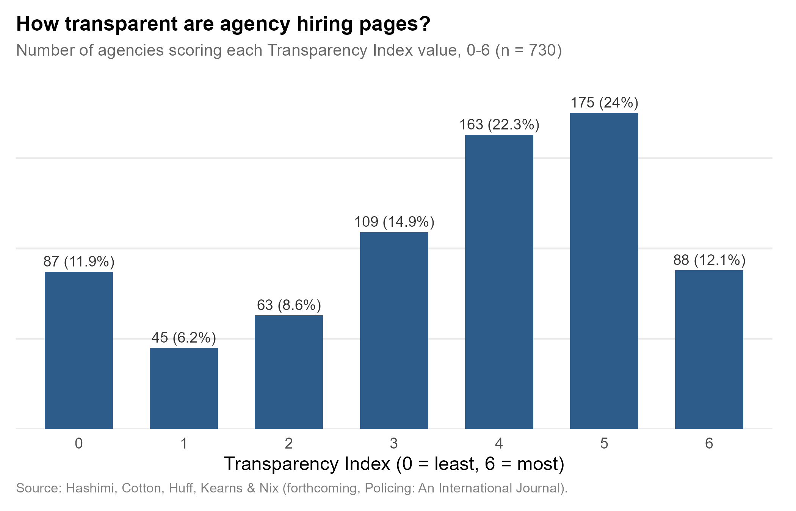
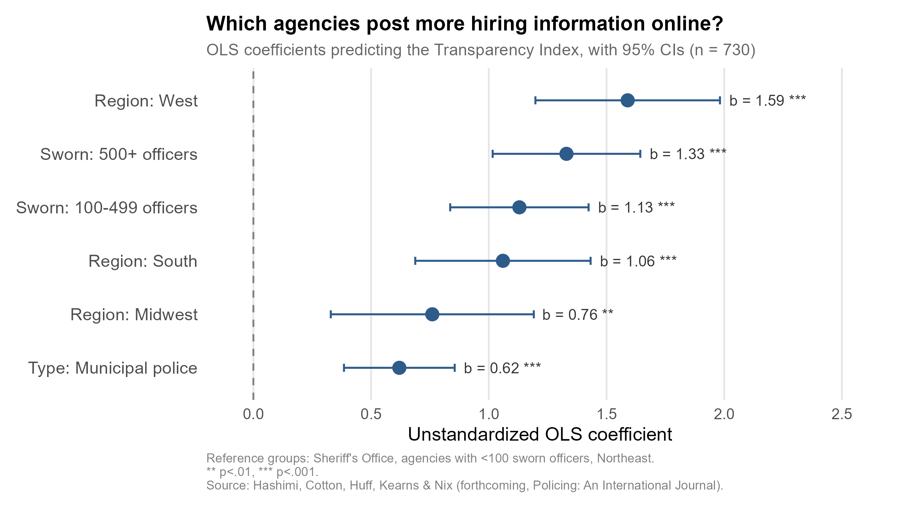

+++
# Paper title
title = "Hiring and screening practices in a sample of U.S. law enforcement agencies"

# Authors
authors = ["Sadaf Hashimi", "Natalie Cotton", "Jessie Huff", "Erin Kearns", "admin"]

# Publication
publication = "*Policing: An International Journal*"

# Publication types (2 = Journal article; 3 = preprint; 4 = report; 6 = book chapter)
publication_types = ["2"]

# Date the paper was published.
date = 2026-08-13T10:00:00Z

# Date this page was created.
publishdate = 2026-09-15T11:00:00Z

# Project summary to display on homepage.
summary = ""

# Abstract
abstract = "*Purpose*: Hiring and screening processes shape who enters law enforcement, yet little is known about how agencies prioritize these requirements and publicly communicate them on their websites. As a result, it remains unclear how candidate suitability is defined in practice and how standards vary across agencies. This study examines hiring requirements, screening practices, and selection procedures across a sample of US law enforcement agencies. *Design/methodology/approach*: Archival data were collected from the official websites of 730 law enforcement agencies selected through stratified random sampling. Hiring information was coded across six domains: background investigations, mandatory requirements, disqualifying factors, assessment tests, character evaluations and recruitment incentives. These indicators were aggregated into a transparency index that measures how agencies communicate their recruitment and screening practices online. Transparency levels were then compared by agency type, size and geographic region. *Findings*: Transparency varies considerably across agencies. Larger agencies, municipal police departments and agencies in the Western United States tend to provide more detailed and comprehensive information about hiring requirements and screening procedures on their websites. Together, these findings suggest significant variations in recruitment practices and procedures across the country. *Originality/value*: This study offers one of the first large-scale examinations of how U.S. law enforcement agencies present their hiring and screening practices online. Because agency websites often serve as the first point of contact for prospective applicants, the findings provide insight into how agencies communicate hiring expectations and screening procedures and reveal substantial variation in the hiring information available across organizational contexts."

# Tags: can be used for filtering projects.
# Example: `tags = ["machine-learning", "deep-learning"]`
tags = ["organizational performance", "policing", "recruitment"]

# Optional external URL for project (replaces project detail page).
external_link = ""

# Slides (optional).
#   Associate this project with Markdown slides.
#   Simply enter your slide deck's filename without extension.
#   E.g. `slides = "example-slides"` references
#   `content/slides/example-slides.md`.
#   Otherwise, set `slides = ""`.
slides = ""

# Links (optional).
url_pdf = ""
url_slides = ""
url_video = ""
url_code = ""

# Custom links (optional).
#   Uncomment line below to enable. For multiple links, use the form `[{...}, {...}, {...}]`.
links = [{name = "DOI", url="https://doi.org/10.1108/PIJPSM-03-2026-0065"}, {name = "Postprint", url="https://www.crimrxiv.com/pub/kugsso0n"}]

# Featured image
# To use, add an image named `featured.jpg/png` to your project's folder.
[image]
  # Caption (optional)
  caption = "Image created with ChatGPT 5.2"

  # Focal point (optional)
  # Options: Smart, Center, TopLeft, Top, TopRight, Left, Right, BottomLeft, Bottom, BottomRight
  focal_point = "TopLeft"
+++

For most people who think about applying to a police department, the agency's website is the whole encounter before they ever talk to a recruiter. In a new paper with Sadaf Hashimi, Natalie Cotton, Jessie Huff, and Erin Kearns — part of a DHS-funded project on insider threats in law enforcement — we asked a basic question nobody had answered at scale: what do those websites actually tell applicants about how hiring and screening work?

## What We Looked At

We sampled 730 agencies (380 municipal police departments, 350 sheriff's offices), stratified by size and region, and had trained coders comb through every hiring-relevant page, document, and video we could find. We grouped what we saw into six domains — background investigations, mandatory requirements, disqualifying factors, assessment tests, character suitability evaluations, and hiring incentives — and summed them into a 0-to-6 Transparency Index: one point for each domain an agency's site said anything meaningful about.

The average agency scored 3.49 out of 6, and most clustered in the middle — scores of 4 or 5 accounted for nearly half the sample. But averages hide the part that actually matters for applicants. Mandatory requirements (education, age, driver's license) showed up on 79% of sites, and assessment tests on 80%. Disqualifying factors — the things that get an application rejected outright — appeared on only 42%. Character suitability evaluations, like polygraphs and background interviews, showed up on 54%. The domains agencies were least likely to explain are the ones most likely to determine whether someone's application goes anywhere.

## Who's More Transparent

That variation isn't random.

Municipal police departments score higher than sheriff's offices. Agencies with 100 or more sworn officers score higher than smaller ones, and the largest agencies (500+) score highest of all. And agencies in the West score noticeably higher than every other region, followed by the South and Midwest. None of this tracks the content of an agency's actual standards — it tracks organizational capacity. Bigger, better-resourced agencies communicate more, full stop.

## What This Means

We want to be careful about what a low score does *not* mean. An agency that says little online about disqualifying factors or character evaluations isn't necessarily running a lax hiring process — it may just lack the staff or web infrastructure to post one. 

But that gap is still consequential. As recruitment increasingly happens online, an applicant's first read on whether they're eligible, and what they're in for, comes from a webpage that — for smaller and rural agencies especially — often says very little. Transparency alone won't fix policing's recruitment problems. But it's a cheap, fixable first step, and right now a lot of agencies are leaving it undone.
