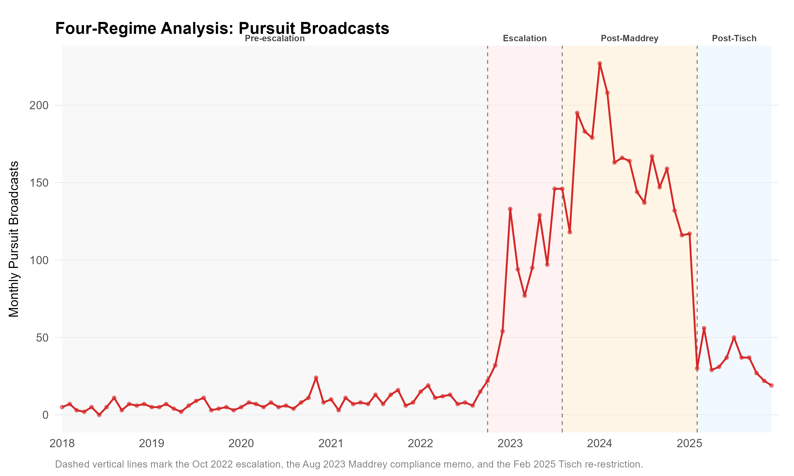

+++
# Paper title
title = "The fast and the spurious: A causal evaluation of NYPD's pursuit policy, 2022-2025"

# Authors
authors = ["John Hall", "admin"]

# Publication
publication = "*Journal of Quantitative Criminology*"

# Publication types (2 = Journal article; 3 = preprint; 4 = report; 6 = book chapter)
publication_types = ["2"]

# Date the paper was published.
date = 2026-09-15T10:00:00Z

# Date this page was created.
publishdate = 2026-09-15T11:00:00Z

# Project summary to display on homepage.
summary = ""

# Abstract
abstract = "*Objectives*: This study examines the consequences of the New York City Police Department’s late-2022 operational shift that sharply expanded vehicle pursuits. We evaluate whether the surge in pursuits affected motor vehicle collisions, robberies, and shootings, and whether any crime-prevention benefits offset the associated collision costs. *Methods*: For collision outcomes, interrupted time series (ITS) segmented regression provides direct causal estimates. For crime outcomes, where within-city trends may reflect national forces, we triangulate across a city-level ITS, a generalized synthetic control comparing New York with large U.S. cities, a test of whether crime rose after the February 2025 re-restriction, and descriptive borough- and precinct-level comparisons of where any decline was concentrated. A cost-benefit analysis estimates the threshold of prevented shootings needed for pursuit escalation to break even. *Results*: Monthly pursuits rose from roughly eight to a peak above 200. Pursuit-related collisions increased proportionally with pursuit volume across all four policy regimes and declined sharply following the February 2025 policy re-restriction. Crime outcomes provide no evidence of deterrence. The generalized synthetic control finds NYC’s post-2022 shooting trajectory statistically indistinguishable from the national counterfactual, and robbery, if anything, rose relative to comparable cities. The February 2025 reduction in pursuits was not followed by any increase in crime. Descriptive within-city comparisons align: the shooting DiD rests on non-parallel pre-trends, and the robbery DiD runs opposite to deterrence. *Conclusions*: Pursuit escalation produced clear and attributable collision harms while providing no credible evidence of crime reduction. Cost-benefit estimates suggest the threshold of prevented shootings required to offset these harms was not achieved. Agencies should require affirmative evidence of crime-prevention benefits before expanding pursuit authority."

# Tags: can be used for filtering projects.
# Example: `tags = ["machine-learning", "deep-learning"]`
tags = ["policy", "pursuits", "policing"]

# Optional external URL for project (replaces project detail page).
external_link = ""

# Slides (optional).
#   Associate this project with Markdown slides.
#   Simply enter your slide deck's filename without extension.
#   E.g. `slides = "example-slides"` references
#   `content/slides/example-slides.md`.
#   Otherwise, set `slides = ""`.
slides = ""

# Links (optional).
url_pdf = ""
url_slides = ""
url_video = ""
url_code = ""

# Custom links (optional).
#   Uncomment line below to enable. For multiple links, use the form `[{...}, {...}, {...}]`.
links = [{name = "Preprint", url="https://doi.org/10.21428/cb6ab371.0440bf49"}, {name = "Slides", url="https://jnix.netlify.app/talk/cambridge_ebp_2026/"}]

# Featured image
# To use, add an image named `featured.jpg/png` to your project's folder.
[image]
  # Caption (optional)
  caption = "Image created with ChatGPT 5.2"

  # Focal point (optional)
  # Options: Smart, Center, TopLeft, Top, TopRight, Left, Right, BottomLeft, Bottom, BottomRight
  focal_point = "Left"
+++

This one's been accepted at the *Journal of Quantitative Criminology*, with John Hall at Cambridge leading the charge. The publisher embargoes accepted manuscripts for twelve months before authors can post them, so the postprint isn't up yet — the [preprint](https://doi.org/10.21428/cb6ab371.0440bf49) linked above has the full analysis for anyone who wants to dig in now, or if you'd like the accepted version before the embargo lifts, just email me.

## The Escalation

In October 2022, the NYPD started letting officers chase. Monthly pursuit broadcasts went from an average of eight to a peak above two hundred — a 25-fold jump — and stayed elevated through most of 2023 and 2024, easing only after an August 2023 compliance memo and then dropping sharply once Commissioner Jessica Tisch reined the policy back in in February 2025.

## What It Cost

More pursuits meant more crashes. An interrupted time series shows collisions jumping immediately at the October 2022 break, with no evidence the city was simply getting better or worse at avoiding them over time — collision counts track the four policy regimes almost exactly, rising with the escalation and falling within weeks of the February 2025 restriction. Annual pursuit-related collisions went from 84 in 2022 to 421 at their 2024 peak, more than a fivefold increase in total crash burden.

## Did It Work?

That's the trade the NYPD was implicitly making: more collision risk, in exchange for less crime. We threw everything we had at that question, and none of it holds up.

A generalized synthetic control comparing New York to a donor pool of large U.S. cities finds NYC's post-2022 shooting trend statistically indistinguishable from cities that never expanded pursuits. Robbery, if anything, ran the other way — it rose relative to comparable cities, not fell. And the cleanest test of all: when Tisch cut pursuits back down in February 2025, crime didn't go up. Robberies and shootings kept falling. If chasing more cars was deterring crime or incapacitating chronic offenders, taking that away should have shown it. It didn't.

## The Bottom Line

| Year | Pursuits | Δ Pursuits | Collisions | Δ Collisions | Robberies | Δ Robberies | Shootings | Δ Shootings | Gun Violence | Δ Gun Violence |
|------|---------:|-----------:|-----------:|-------------:|----------:|------------:|----------:|------------:|-------------:|---------------:|
| 2018 | 61 | — | 58 | — | 12,965 | — | 754 | — | 2,017 | — |
| 2019 | 64 | +4.9% | 73 | +25.9% | 13,434 | +3.6% | 777 | +3.1% | 2,324 | +15.2% |
| 2020 | 99 | +54.7% | 69 | -5.5% | 13,187 | -1.8% | 1,532 | +97.2% | 4,479 | +92.7% |
| 2021 | 109 | +10.1% | 62 | -10.1% | 13,861 | +5.1% | 1,562 | +2.0% | 5,028 | +12.3% |
| 2022 | 214 | +96.3% | 84 | +35.5% | 17,439 | +25.8% | 1,294 | -17.2% | 4,162 | -17.2% |
| 2023 | 1,592 | +643.9% | 318 | +278.6% | 16,922 | -3.0% | 974 | -24.7% | 3,109 | -25.3% |
| 2024 | 1,930 | +21.2% | 421 | +32.4% | 16,569 | -2.1% | 904 | -7.2% | 2,917 | -6.2% |
| 2025 | 492 | -74.5% | 104 | -75.3% | 15,048 | -9.2% | 688 | -23.9% | 2,506 | -14.1% |

*Annual counts, NYPD/NYC Open Data. Robbery and shooting totals kept declining through the escalation years for reasons the paper argues are unrelated to pursuits — which is exactly why we didn't stop at the city-level trend.*

## What This Means

Pursuit escalation produced clear, attributable collision harm and no credible evidence of a crime-prevention payoff. That doesn't mean pursuits *never* matter for public safety — it means the NYPD expanded them without the kind of evidence that should precede a policy change with this much collateral risk. Our recommendation for other agencies facing pressure to loosen pursuit policy is a simple burden-of-proof shift: require affirmative evidence that pursuits outperform the regional trend, not just a hope that they will, before expanding officers' discretion to chase.
