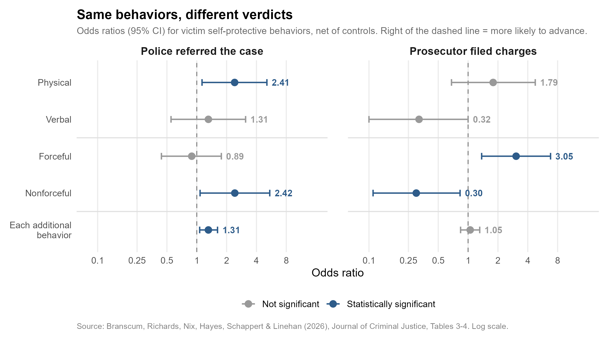

+++
# Paper title
title = "Examining victim self-protection on police and prosecutorial decision-making for sexual assault case advancement"

# Authors
authors = ["Caralin Branscum", "Tara Richards", "admin", "Brittany Hayes", "Sarah Schappert", "Emily Linehan"]

# Publication
publication = "*Journal of Criminal Justice*"

# Publication types (2 = Journal article; 3 = preprint; 4 = report; 6 = book chapter)
publication_types = ["2"]

# Date the paper was published.
date = 2026-10-02T10:00:00Z

# Date this page was created.
publishdate = 2026-10-05T11:00:00Z

# Project summary to display on homepage.
summary = ""

# Abstract
abstract = "Historically, demonstrating a victim's “resistance” to sexual assault was a legal requirement to achieve convictions. While these legal requirements have been repealed, victim self-protective behaviors (VSPB), broadly defined as various responses to an assault, may still impact criminal justice decision-making through perceptual shorthand embedded in “real rape” and “ideal victim” misconceptions. Yet, few studies have examined how victim self-protective behaviors can shape sexual assault case outcomes. Using 368 sexual assault cases from a Midwestern jurisdiction, we examined the relationship between three distinct operationalizations of victim self-protective behaviors and two outcomes: police case referral and prosecutorial charging. Findings revealed that while all behaviors increased case referral odds, charging odds were increased by forceful VSPB, but decreased by nonforceful VSPB. That said, the victim wanted an investigation was the strongest predictor of case referral odds and the strongest predictor of charging odds was the suspect confessed. Implications for theory and practice include how divergent patterns allude to fundamentally different lenses actors use to assess self-protection. While police may view them as corroborative evidence, prosecutors seem to favor behaviors most consistent with prevailing misconceptions."

# Tags: can be used for filtering projects.
# Example: `tags = ["machine-learning", "deep-learning"]`
tags = ["sexual assault", "decision-making", "prosecution", "policing", "sexual assault kit initiative"]

# Optional external URL for project (replaces project detail page).
external_link = ""

# Slides (optional).
#   Associate this project with Markdown slides.
#   Simply enter your slide deck's filename without extension.
#   E.g. `slides = "example-slides"` references
#   `content/slides/example-slides.md`.
#   Otherwise, set `slides = ""`.
slides = ""

# Links (optional).
url_pdf = ""
url_slides = ""
url_video = ""
url_code = ""

# Custom links (optional).
#   Uncomment line below to enable. For multiple links, use the form `[{...}, {...}, {...}]`.
links = [{name = "DOI", url="https://doi.org/10.1016/j.jcrimjus.2026.102752"}]

# Featured image
# To use, add an image named `featured.jpg/png` to your project's folder.
[image]
  # Caption (optional)
  caption = "Image created with ChatGPT 5.2"

  # Focal point (optional)
  # Options: Smart, Center, TopLeft, Top, TopRight, Left, Right, BottomLeft, Bottom, BottomRight
  focal_point = "Center"
+++

For much of American history, a rape conviction required proof that the victim resisted — physically, and often "to the utmost." Rape law reform scrubbed those requirements from the statutes decades ago. Whether it scrubbed them from the heads of the people deciding which cases move forward is a different question.

That's the question behind a new paper in the *Journal of Criminal Justice*, led by Caralin Branscum (USF) with Tara Richards, Brittany Hayes, Sarah Schappert, Emily Linehan, and me. The short version: police and prosecutors in our data seem to read the same victim behaviors very differently.

## What We Looked At

The data come from our evaluation of the [Minnesota Sexual Assault Kit Initiative](/publication/61-mn-saki-lessons-learned/), which gave us complete investigative case files from the Anoka County Sheriff's Office — initial reports, detectives' notes, interview transcripts, and SANE (sexual assault nurse examiner) forms. We limited the analysis to the 368 cases with an identified suspect, since those are the only cases that *could* be referred and charged.[^1]

| Stage | Cases | Share |
|---|---:|---:|
| Identified suspect | 368 | 100% |
| Police referred to the prosecutor | 267 | 72.6% |
| Prosecutor filed charges | 81 | 22.0% of all cases (30.3% of referrals) |

From victims' statements, we coded 12 distinct self-protective behaviors — everything from hitting or biting the attacker, to running away, to screaming for help, to pleading, stalling, or holding still out of fear. Then we measured them three ways, because prior work has mostly used a crude "any resistance vs. none" switch: physical vs. verbal, forceful vs. nonforceful, and a simple count of how many different things the victim did. The average victim reported about two.

| | Forceful | Nonforceful |
|---|---|---|
| **Physical** | • Attacked using a *non-gun* weapon (e.g., knives, tools, broom) • Attacked *without* a weapon (e.g., hit, slap, scratch, kick, bite) • Chased, caught, or tried to catch/hold onto the suspect | • Ran or drove away or attempted to hide • Struggled against the suspect or attempted to block attacks (e.g., pushed, removed hand from body, ducked) |
| **Verbal** | • *Threatened* to use a non-gun weapon • *Threatened* to attack without a weapon • Screamed/shouted/yelled, threw insults, or threatened to call the police • Tried to attract attention from bystanders, including calling or texting others • Directly called the police or a security guard during the incident | • Cried, argued, reasoned, pleaded, bargained, or lied to the suspect • Pretended to cooperate or held still out of fear, stalled for time, or tried to de-escalate the suspect |

*Adapted from Table 1 of the paper. Each behavior falls in one cell, but a victim could report several, so a single case can count as both physical and verbal, or both forceful and nonforceful.*

## Police: Self-Protection of Any Kind Helped

At the referral stage, every way of measuring self-protection pointed the same direction. Cases where the victim did something physical had about 2.4 times the odds of referral compared with otherwise similar cases where she didn't. So did cases involving nonforceful behaviors like struggling, hiding, or pleading. And each additional behavior bumped the odds of referral by about 31%. Detectives, in other words, appear to treat self-protection as corroboration — evidence that something happened, whatever form it took.

It's worth keeping this in proportion, though. By far the strongest predictor of referral was whether the victim wanted an investigation (odds nearly 13 times higher). Cases where the victim knew the suspect were less likely to be referred than stranger cases.

## Prosecutors: Only the "Right" Kind

At the charging stage, the picture flipped.

When victims used forceful self-protection — hitting, kicking, threatening the attacker — prosecutors had about three times the odds of filing charges compared with otherwise similar cases. *Nonforceful* self-protection cut the odds of charges by about 70%, again holding everything else constant, including whether the victim also fought back. Put the two together and a victim who only pleaded, stalled, or froze had roughly one-tenth the odds of charges of a victim who only fought back, while a victim who did both landed close to where a victim who did neither would.[^3] The same nonforceful behaviors that made police *more* likely to refer a case made prosecutors *less* likely to charge it. And the total number of behaviors didn't predict charging. It wasn't how much a victim resisted, but how.

That's uncomfortable, because the nonforceful category includes some of the most common responses to sexual assault: pleading, stalling, pretending to cooperate, freezing. [Tonic immobility](https://doi.org/10.1037/trm0000537) — an involuntary freeze response — is engaged in most highly traumatic events. A charging calculus that rewards fighting back and penalizes freezing is, functionally, the old resistance standard with the statute removed.

There's a competing explanation we take seriously: forceful resistance might simply leave more physical evidence. But victim injury didn't predict charging (or referral) in our models, which cuts against that reading. Here's how the main predictors lined up at each stage:

| Predictor | Police referral | Prosecutor charging |
|---|---:|---:|
| Victim wanted an investigation | 12.67 ↑ | 1.15 |
| Victim knew the suspect | 0.45 ↓ | 0.91 |
| Suspect confessed | not modeled[^2] | 9.04 ↑ |
| Concerns about victim credibility | 1.32 | 0.20 ↓ |
| Victim had used alcohol or drugs | 1.49 | 0.35 ↓ |
| Forceful self-protection | 0.89 | 3.05 ↑ |
| Nonforceful self-protection | 2.42 ↑ | 0.30 ↓ |

*Odds ratios from Tables 3 and 4: the two self-protection rows come from Models 2 and 5, all other rows from Models 1 and 4. Each is net of everything else in its model. Arrows mark statistically significant associations; values above 1 mean a case was more likely to advance, below 1 less likely.*

Prosecutors keyed on confessions, credibility, and substance use — all things that bear on how a jury will see the case. Police keyed on whether the victim was on board.

## What This Means

We can't say from these data that prosecutors are consciously applying a resistance standard. We *can* say that, in this jurisdiction, the pattern of who got charged looks a lot like what Susan Estrich's "real rape" stereotype would predict, and much less like what police were doing with the same cases.

One plausible reason for the gap is training. Police have had years of trauma-informed sexual assault training, now written into law through measures like the [Abby Honold Act](https://www.congress.gov/bill/117th-congress/house-bill/649). Prosecutors have had far less. Our recommendation is targeted training for prosecutors on why victims plead, stall, or freeze — and on what's lost when only the "slam dunk" cases get filed. If prosecutors decline every case that doesn't fit the stereotype, they never learn how many of those cases a jury would have convicted on, and juries never see the full range of what sexual assault actually looks like.

*A note on limitations:* This is one midsized, mostly White, suburban and rural Minnesota county, and the analysis is limited to cases with female victims, male suspects, and a sexual assault kit. Whether the victim "wanted an investigation" was coded from the latest information in the file, so it may partly reflect how the investigation itself went rather than a fixed preference. And prosecutors' reasoning is documented far more thinly than detectives' — usually in a brief declination letter — so we're inferring their lens from outcomes. Replication in other jurisdictions is the obvious next step.

[^1]: We also dropped cases with a restricted kit, a kit collected in a homicide investigation, or incomplete files, and the small number of cases with male victims (12) or female suspects (2). About 30% of victims were minors; the paper's supplemental appendix re-runs everything without them, and the large majority of findings hold.

[^2]: Confessions were left out of the referral models because police referred essentially every case with one — only one confession case wasn't referred.

[^3]: Forceful and nonforceful behavior enter the model as two separate yes/no indicators, so each odds ratio holds the other constant, and a victim who did both gets both effects multiplied together. The comparisons here are what the model implies, not separately estimated effects: 0.30 ÷ 3.05 ≈ 0.10 for only nonforceful vs. only forceful, and 3.05 × 0.30 ≈ 0.92 for both vs. neither. We didn't test whether combining the two changes how either one works (an interaction), so treat these as rough.
