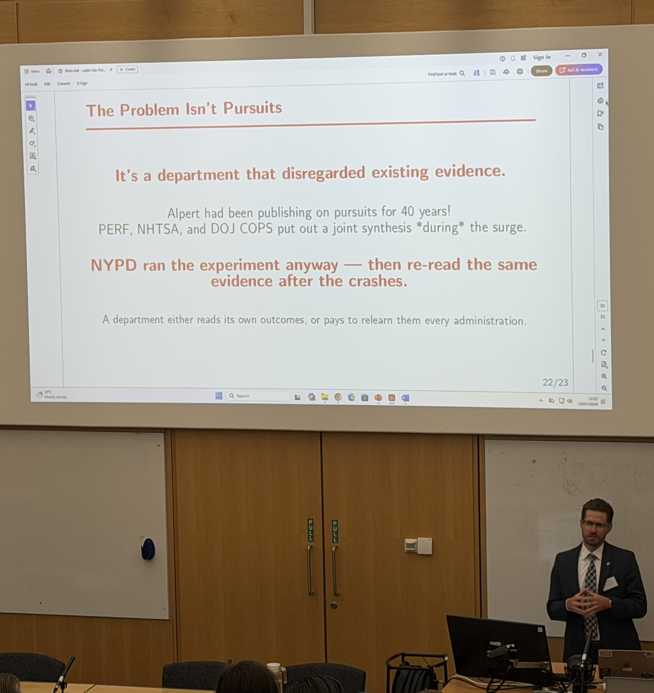

The [Institute of Criminology](https://www.crim.cam.ac.uk/) at the University of Cambridge recently celebrated the 30th Anniversary of its [Police Executive Programme](https://www.crim.cam.ac.uk/mst-applied-criminology-and-police-management-police-executive-programme). I was invited to this year's Evidence-Based Policing Conference, themed *Beyond Borders: Evidence-Led Solutions for Global Crime and Policing Challenges.* I chose to present my working paper with John Hall, where we try to estimate the tradeoffs associated with NYPD's recent pursuit escalation and de-escalation (i.e., more pursuits → more collisions, but more pursuits → less crime?). You can download the full working paper [here](https://doi.org/10.21428/cb6ab371.0440bf49) (though we're about to submit a revised version soon). 

What an honor it was to present alongside a Who's Who of criminologists and police researchers. 

{}
Click on the **Slides** buttons near the top of the page to download our presentation.
{}