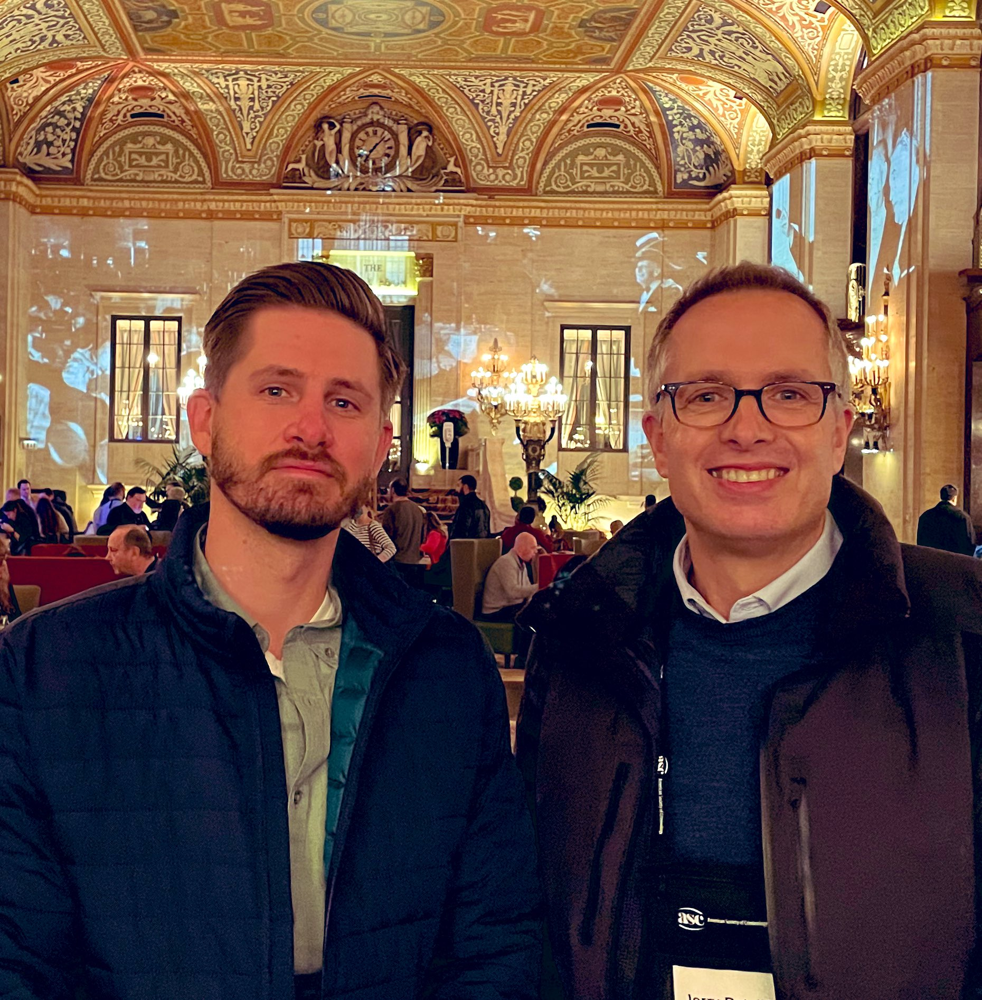

I was recently a guest on the [Reducing Crime](https://podcasts.apple.com/us/podcast/reducing-crime/id1412813382) Podcast (hosted by [Jerry Ratcliffe](https://twitter.com/Jerry_Ratcliffe)).

{}
Click on the **Listen** buttons near the top of the page to listen to the podcast on your preferred streaming platform. Or click the **PDF** button to read a transcript.
{}

Topics discussed include experimental criminology, procedural justice, police legitimacy, and police use of deadly force. 

Articles discussed: 

* [Compliance, noncompliance, and the in-between: causal effects of civilian demeanor on police officers’ cognitions and emotions](https://link.springer.com/article/10.1007%2Fs11292-019-09363-4)
* [Elevated Police Turnover following the Summer of George Floyd Protests: A Synthetic Control Study](https://jnix.netlify.app/files/pdfs/cpp_turnover.pdf)
* [Disparity does not mean bias: making sense of observed racial disparities in fatal officer-involved shootings with multiple benchmarks](https://digitalcommons.unomaha.edu/cgi/viewcontent.cgi?article=1061&context=criminaljusticefacpub)
* [We've been underestimating racial disparities in police use of lethal force](https://www.washingtonpost.com/crime-law/2021/11/11/non-fatal-police-shootings-disparities-data/)
* [Arresting the recruitment crisis](https://www.city-journal.org/police-departments-recruitment-crisis)
