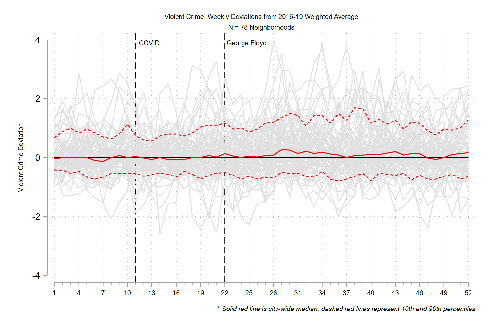
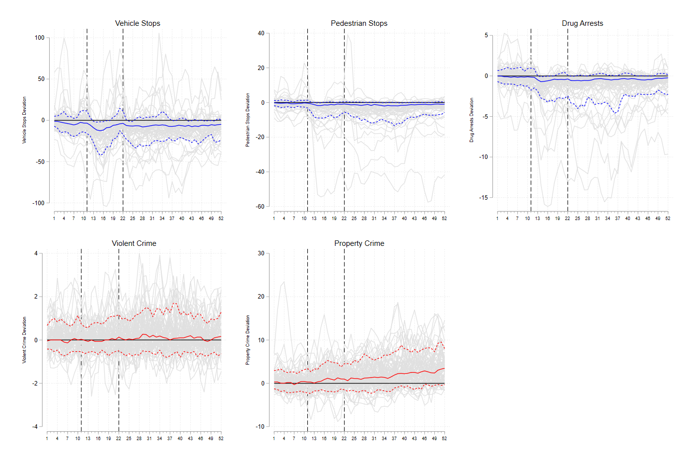

class: left, middle, inverse

# COVID-19, George Floyd Protests, and a Violent Crime Spike: The Denver Experience

[Justin Nix](https://jnix.netlify.app)  
*University of Nebraska Omaha*

[Jessie Huff](https://www.unomaha.edu/college-of-public-affairs-and-community-service/criminology-and-criminal-justice/about-us/jessica-huff.php)  
*University of Nebraska Omaha*

[Scott Wolfe](https://cj.msu.edu/directory/wolfe-scott.html)  
*Michigan State University*

[David Pyrooz](https://www.colorado.edu/sociology/our-people/david-pyrooz)  
*University of Colorado Boulder*

.white[Academy of Criminal Justice Sciences: Las Vegas, NV]  
.white[March 17, 2022]

---
class: top

# Background 

--

**March 2020**: COVID-19 stay-at-home orders issued

--

**May 2020**: Police kill George Floyd in Minneapolis

--

- Sparked the [largest protest movement](https://www.nytimes.com/interactive/2020/07/03/us/george-floyd-protests-crowd-size.html) in U.S. history

> *Further racialize[d] and politicize[d] attitudes within the domain of race and law enforcement in the U.S.*

<div style="text-align: right"> - Reny & Newman (2021) </div>

- Calls to "defund" and "abolish" the police
  
--

By year's end, homicides had spiked in the U.S. [by nearly 30%](https://www.pewresearch.org/fact-tank/2021/10/27/what-we-know-about-the-increase-in-u-s-murders-in-2020/)

---
class: top

# Background 

--

**Feb 2021**: We wrote about city-level trends for [The Denver Post](https://www.denverpost.com/2021/02/24/denver-crime-rate-homicide-shooting-property-crime-police/)

```{r, echo=FALSE, fig.align='center', out.width = "80%"}

```

---
class: top

# Purpose

--

To examine the relationship between police discretionary behaviors and crime at the neighborhood level

```{r, echo=FALSE, fig.align='center', out.width = "70%"}
knitr::include_graphics("nhoods.jpg")
```

---
class: top

# Data

- Crime, vehicle and pedestrian stops, and traffic collisions (from [Police Data Initiative](https://www.denvergov.org/opendata/search?q=police))

--

- Drug-related arrests (requested from [DPD](https://www.denvergov.org/Government/Agencies-Departments-Offices/Agencies-Departments-Offices-Directory/Police-Department))

--

- [Open Table Reservations](https://www.opentable.com/state-of-industry)

--

- Precipitation and Temperature (from [National Oceanic and Atmospheric Administration](https://www.ncdc.noaa.gov/cdo-web/datasets))

--

- Air Quality Index (from [Environmental Protection Agency](https://www.epa.gov/outdoor-air-quality-data/download-daily-data))

--

- Concentrated Disadvantage (from [ACS](https://www.denvergov.org/opendata/dataset/american-community-survey-nbrhd-2015-2019))

---
class: top

# Data

--

Unit of analysis 👉 **neighborhood weeks**

- 78 neighborhoods nested within 52 weeks (N x T = 4,056)

--

For each week of 2020, each variable is coded as the deviation from the **weighted 3-week average** 

--

- 2020 split into three periods: 

  - pre-COVID (weeks 1-10)
  - COVID Shock (weeks 11-21)
  - Floyd Shock (weeks 22-52)

--

**Outcomes** 👉 *violent* and *property* crime

---
class: center, middle, inverse

# **Preliminary** Findings

---
class: top

# Findings: Vehicle Stops

```{r, echo=FALSE, fig.align='center', out.width = "95%"}

```

---
class: top

# Findings: Vehicle Stops

```{r, echo=FALSE, fig.align='center', out.width = "95%"}

```

---
class: top

# Findings: Pedestrian Stops

```{r, echo=FALSE, fig.align='center', out.width = "95%"}

```

---
class: top

# Findings: Pedestrian Stops

```{r, echo=FALSE, fig.align='center', out.width = "95%"}

```

---
class: top

# Findings: Drug-related Arrests

```{r, echo=FALSE, fig.align='center', out.width = "95%"}

```

---
class: top

# Findings: Drug-related Arrests

```{r, echo=FALSE, fig.align='center', out.width = "95%"}

```

---
class: top

# Findings: Violent Crime

```{r, echo=FALSE, fig.align='center', out.width = "95%"}

```

---
class: top

# Findings: Violent Crime

```{r, echo=FALSE, fig.align='center', out.width = "95%"}

```

---
class: top

# Findings: Property Crime

```{r, echo=FALSE, fig.align='center', out.width = "95%"}

```

---
class: top

# Findings: Property Crime

```{r, echo=FALSE, fig.align='center', out.width = "95%"}

```

---
class: top

# Findings: Recap

```{r, echo=FALSE, fig.align='center', out.width = "95%"}

```

---
class: top

# Next Steps

--

What happens to crime rates when police suddenly *make fewer proactive stops and arrests* for a sustained period?

--

We've requested but are still waiting on COVID test data

--

Plan to run multi-level multivariable models that regress crime outcomes onto:

- *Time variant factors*
  - Police discretionary behaviors
  - Weather
  - Air Quality
  - Public movement
  - Reckless driving
  
- *Time stable factors*
  - Concentrated disadvantage
  
---
class: top

# Limitations

Just one city

--

Don't know precisely what caused the reduction in discretionary stops and arrests

--

  - Calculated decision-making by officers?
  
  - Patrol officers having to work protests?
  
  - Reduction in sworn capacity brought on by COVID or resignations? (e.g., [Mourtgos et al. 2022](https://jnix.netlify.app/files/pdfs/cpp_turnover.pdf))
  
--

Can't speak to variation within neighborhoods (e.g., street segments, see [Connealy 2021](https://www.proquest.com/docview/2542373679?pq-origsite=gscholar&fromopenview=true))

---
class: top

# Implications

The national homicide rate increased again in 2021, and [remains elevated in 2022](https://www.ahdatalytics.com/dashboards/ytd-murder-comparison/)

--

Studies like ours hope to contribute to a broader conversation about the appropriate role of police in our society

--

- How should police allocate their limited resources? ([Wheeler 2020](https://doi.org/10.1080/07418825.2019.1630471))

--

- In terms of maximizing public safety while minimizing police-caused harms...

  - What is the *optimal* rate of stopping (or arresting) people? ([Weisburst 2022](https://drive.google.com/file/d/1yYwJ9Kl1eJHdAD8HH9HVB8QFTvkb1Sov/view)) 

---
class: top, center

# Thank you!

## Questions?

**Justin Nix**  
School of Criminology and Criminal Justice  
University of Nebraska Omaha

`r icons::fontawesome("twitter")` [jnixy](https://twitter.com/jnixy)  
`r icons::fontawesome("envelope")` [jnix@unomaha.edu](mailto:jnix@unomaha.edu)  
`r icons::fontawesome("globe")` [jnix.netlify.app](https://jnix.netlify.app)

---
class: top, references-font

# References

Connealy, N. T. (2021). [*Exploring the overlap, saliency, and consistency of environmental predictors in crime hot spots: A remote systematic social observation and case-control examination*](https://www.proquest.com/docview/2542373679?pq-origsite=gscholar&fromopenview=true) (Doctoral dissertation, City University of New York).

Mourtgos, S. M., Adams, I. T., & Nix, J. (2022). [Elevated police turnover following the summer of George Floyd protests: A synthetic control study](https://jnix.netlify.app/files/pdfs/cpp_turnover.pdf). *Criminology & Public Policy*, 21(1), 9-33.

Reny, T. T., & Newman, B. J. (2021). [The opinion-mobilizing effect of social protest against police violence: Evidence from the 2020 George Floyd protests](https://doi.org/10.1017/S0003055421000460). *American Political Science Review*, 115(4), 1499-1507.

Weisburst, E. K. (2022). [“Whose help is on the way?” The importance of individual police officers in law enforcement outcomes](https://doi.org/10.3368/jhr.0720-11019R2). *Journal of Human Resources*, 0720-11019R2.

Wheeler, A. P. (2020). [Allocating police resources while limiting racial inequality](https://doi.org/10.1080/07418825.2019.1630471). *Justice Quarterly*, 37(5), 842-868.

<!-- ```{css, echo=FALSE} -->
<!-- @media print { -->
<!--   .has-continuation { -->
<!--     display: block; -->
<!--   } -->
<!-- } -->
<!-- ``` -->

