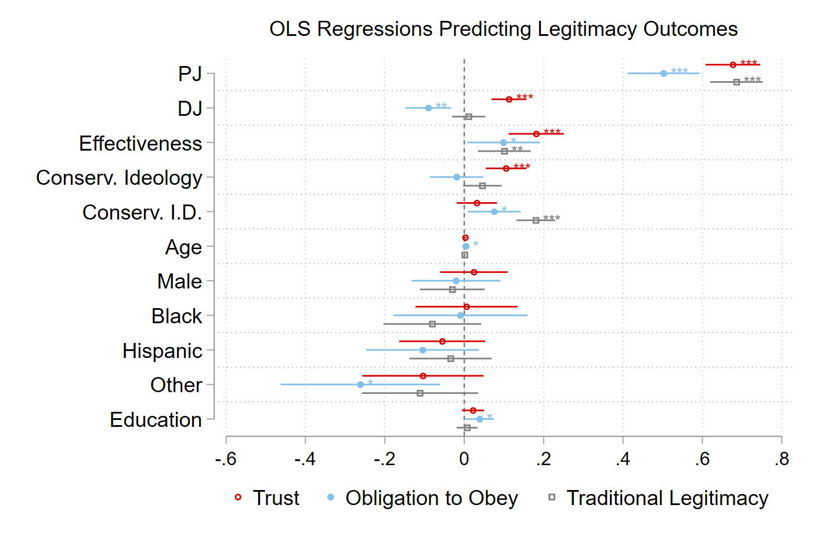

class: left, middle, inverse
background-image: url(https://www.unomaha.edu/university-communications/downloadables/campus-icon-the-o/uno-icon-color.png)
background-position: 95% 95%
background-size: 10%

# Understanding the Bounds of Legitimacy: Weber’s Facets of Legitimacy and the Police Empowerment Hypothesis

(Now *in press* at [*Justice Quarterly*](https://doi.org/10.1080/07418825.2021.1933141))

[Kyle McLean](https://www.clemson.edu/cbshs/about/profiles/index.html?userid=kdmclea)  
*Department of Sociology, Anthropology, and Criminal Justice*  
*Clemson University*

[Justin Nix](https://jnix.netlify.app)  
*School of Criminology and Criminal Justice*  
*University of Nebraska Omaha*

<br>
<br>
.white[American Society of Criminology: Chicago, IL]  
.white[November 17, 2021]

---
class: top 

# Background 

--

- **Empowerment** of police is understudied, relative to **compliance** and **cooperation**

--

- Process-based model suggests all three outcomes are more likely when police are seen as having **legitimate** authority<sup>[1-2]</sup>

--

- Max Weber identified three types of legitimacy:

--

  - Rational  

--

  - Charismatic  

--

  - Traditional
  
--

- **Legal socialization** literature suggests legal attitudes can get passed on to children at an early age<sup>[3-5]</sup>

---
class: top

# Purpose

--

The empowerment hypothesis demonstrates why understanding the **legitimating process** is critical:

--

```{r, echo=FALSE, fig.align='center', out.width = "400px"}
knitr::include_graphics("fig1.png")
```

--

Three objectives:

--

  1. Assess the measurement structure of public perceptions of **rational-legal** and **traditional** police legitimacy scales

--

  2. Examine whether these measures differ in their antecedents

--

  3. Predict ***global*** and ***situational*** **empowerment** of police to determine if the basis of legitimacy matters in evaluating the empowerment hypothesis

---
class: top

# Data

--

- Qualtrics survey of U.S. adults in the summer of 2019

--

- Quotas for age, race/ethnicity, and gender 

--

- N = 735

---
class: top

# Measures

--

- Legitimacy (Phase I)

--

  - *Trust, obligation to obey, normative alignment*, and *traditional legitimacy*

--

- Established Antecedents (Phase II)

--

  - *Procedural justice, distributive justice*, and *police effectiveness*

--

- Empowerment (Phase III)

--

  - *Global*
  - *Situational* (see Supplement)

--

- Controls
  
--

  - *Political ideology, political identification, age, gender, race/ethnicity*, and *education*

---
class: top

# Results: Phase I

--

```{r, echo=FALSE, fig.align='center', out.width = "800px"}
knitr::include_graphics("fig2.png")
```

---
class: top

# Results: Phase II

--

```{r, echo=FALSE, fig.align='center', out.width = "800px"}

```

---
class: top

# Results: Phase III

--

```{r, echo=FALSE, fig.align='center', out.width = "800px"}

```

---
class: top

# Implications

--

- **Traditional legitimacy** is distinct from **trust** and **obligation to obey**

--

- All three appear to tap into a common, higher-order **legitimacy** construct

--

- The *type* of legitimacy being granted matters

--

  - e.g., consider the **Back the Blue** folks
  
```{r, echo=FALSE, fig.align='center', out.width = "25%"}

```
  
--

- Future research:

--

  - Continue developing measures of **traditional legitimacy**
  
--

  - Consider **charismatic legitimacy**, which may moderate effects like we see here

---
class: top, center

# Thank you!

--

## Questions?

Justin Nix

*School of Criminology and Criminal Justice*  
*University of Nebraska Omaha*

`r icons::fontawesome("twitter")` [jnixy](https://twitter.com/jnixy) | `r icons::fontawesome("envelope")` [jnix@unomaha.edu](mailto:jnix@unomaha.edu) | `r icons::fontawesome("globe")` [jnix.netlify.app](https://jnix.netlify.app)

--

## Criticisms? 😁

Kyle McLean (Corresponding author)  

*Department of Sociology, Anthropology, and Criminal Justice*  
*Clemson University*

`r icons::fontawesome("twitter")` [@ClemPoliceProf](https://twitter.com/clempoliceprof) | `r icons::fontawesome("envelope")` [kdmclea@clemson.edu](mailto:kdmclea@clemson.edu)

---
class: top

# References

[1] Sunshine, J., & Tyler, T. R. (2003). The role of procedural justice and legitimacy in shaping public support for policing. *Law & Society Review*, 37(3), 513-548.

[2] Fox, B., Moule Jr, R. K., Jaynes, C. M., & Parry, M. M. (2021). Are the effects of legitimacy and its components invariant? Operationalization and the generality of Sunshine and Tyler’s empowerment hypothesis. *Journal of Research in Crime and Delinquency*, 58(1), 3-40.

[3] Tyler, T. R., & Trinkner, R. (2017). *Why children follow rules: Legal socialization and the development of legitimacy*. Oxford University Press.

[4] Wolfe, S. E., McLean, K., & Pratt, T. C. (2017). I learned it by watching you: Legal socialization and the intergenerational transmission of legitimacy attitudes. *British Journal of Criminology*, 57(5), 1123-1143.

[5] Pickett, J. T., Nix, J., & Roche, S. P. (2018). Testing a social schematic model of police procedural justice. *Social Psychology Quarterly*, 81, 97–125.

---
class: top

# Supplemental Material

Vignette: Low Info, No Witness

```{r, echo=FALSE, fig.align='center', out.width = "400px"}
knitr::include_graphics("fig_s1.png")
```

---
class: top

# Supplemental Material

Vignette: Low Info, Witness Present

```{r, echo=FALSE, fig.align='center', out.width = "400px"}
knitr::include_graphics("fig_s2.png")
```

---
class: top

# Supplemental Material

Vignette: High Info, No Witness

```{r, echo=FALSE, fig.align='center', out.width = "400px"}
knitr::include_graphics("fig_s3.png")
```

---
class: top

# Supplemental Material

Vignette: High Info, Witness Present

```{r, echo=FALSE, fig.align='center', out.width = "400px"}
knitr::include_graphics("fig_s4.png")
```

---
class: top

# Supplemental Material

**Global Empowerment**

1.	The police should have the right to stop and question people on the street.
2.	The police should have the power to decide which areas of the city should receive the most police protection.
3.	Because of their training and experience, the police are best able to decide how to deal with crime.
4.	The police should have the power to do whatever they think is necessary to fight crime.
5.	If we give enough power to the police, they will be able to effectively control crime.

*(1 = strongly disagree to 5 = strongly agree)*

---
class: top

# Supplemental Material

**Situational Empowerment**

1.	There is little reason to be concerned about this incident before the investigation is completed.
2.	Without knowing more information, I am unlikely to be upset about this incident.
3.	The police department will release the necessary details about this shooting in due time.

*(1 = strongly disagree to 5 = strongly agree)*

---
class: top

# Supplemental Material

**Traditional Legitimacy**

1.	I tend to give police officers the benefit of the doubt during controversial situations.
2.	It is difficult to imagine a situation where I would not support the actions of a police officer.
3.	In general, I believe the statements of police officers more than the statements of suspects.
4.	When others criticize the police, I generally try to defend their behavior.

*(1 = strongly disagree to 5 = strongly agree)*

<!-- ```{css, echo=FALSE} -->
<!-- @media print { -->
<!--   .has-continuation { -->
<!--     display: block; -->
<!--   } -->
<!-- } -->
<!-- ``` -->
