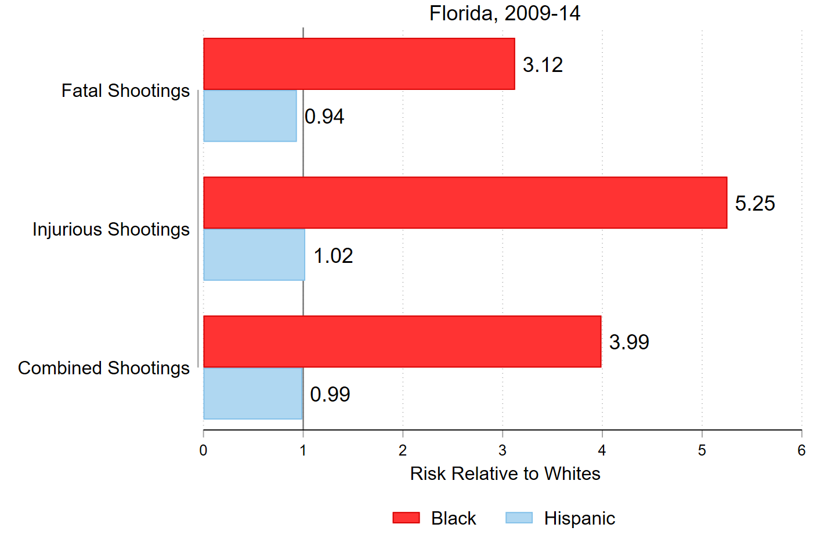
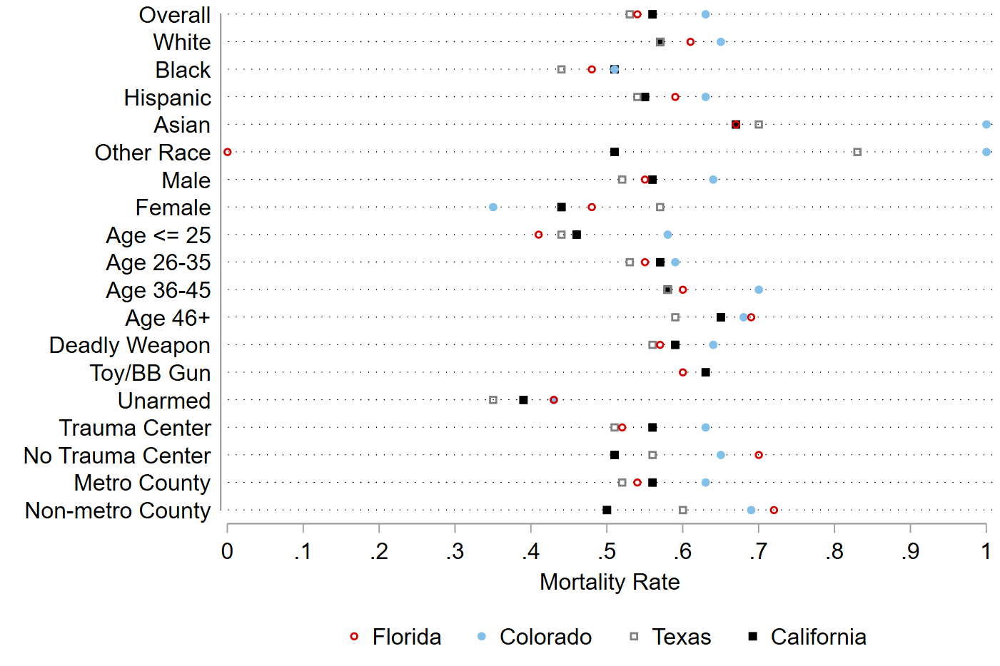

class: left, middle, inverse

# Factors associated with police shooting mortality: A focus on race and a plea for more comprehensive data

(Just published in [*PLOS ONE*](https://doi.org/10.1371/journal.pone.0259024))

[Justin Nix](https://jnix.netlify.app)  
*School of Criminology and Criminal Justice*  
*University of Nebraska Omaha*

[John Shjarback](https://www.johnshjarback.com/about-john)  
*Department of Law and Justice Studies*  
*Rowan University*

<br>
<br>
.white[American Society of Criminology: Chicago, IL]  
.white[November 17, 2021]

---
class: top 

# Background 

--

- [WAPO](https://www.washingtonpost.com/graphics/investigations/police-shootings-database/), [Fatal Encounters](www.fatalencounters.org), and [MPV](www.mappingpoliceviolence.org) have given us a better idea how often police kill people in the United States

--

- *Lots* of researchers have used these data to answer *lots* of research questions<sup>[1-4]</sup>

--

- But deaths caused by police officers are just one outcome of the behavior we're really interested in: the **use of** lethal force

--

- Lethal force is "physical force *capable of or likely to kill*...it does not always kill"<sup>[5]</sup>

--

- **Every time** police officers shoot at a person, they're using lethal force - even if they don't ultimately kill the person

---
class: top

# Purpose

--

To demonstrate how existing data may be misleading us

--

1. Quantify nonfatal, injurious police shootings of people in four states with sufficient data

--

2. Examine the factors associated with mortality, conditional on being shot by a police officer

---
class: top

# Data

Police shooting data from four states:

--

```{r, echo=FALSE, fig.align='center', out.width = "550px"}

```

--

Level I and II Adult Trauma Centers

--

- Pulled from Trauma Center Association of America [website](https://www.traumacenters.org/page/TraumaCentersMap)

---
class: top

# Data

**Dependent Variable**: Fatality (1 = yes; 0 = nonfatal injury)

--

**Covariates**

--

- Race/Ethnicity (White, Black, Hispanic, Other)

- Sex (Male = 1)

- Age (25 and under, 26-35, 36-45, 45 and older)

--

- Deadly Weapon (1 = yes)

--

- Trauma Center (1 = 1+ in the county)

- Metropolitan County (1 = yes)

---
class: top

# Findings


---
class: top

# Findings



---
class: top

# Findings



---
class: top

# Findings


---
class: top

# Findings


---
class: top

# Implications

**Recap**

--

- 45% of the victims in this sample **did not die**

--

- Black and younger victims less likely to die (conditional on being shot)

--

- Victims armed with deadly weapons were ~16% more likely to die (conditional on being shot)

--

**So what?**

--

- The federal government has consistently failed to compile these data

--

- More states should follow the lead of Texas, California, New Jersey, Connecticut, and Maine

--

- Researchers: Be careful about generalizing from data that only capture fatalities

---
class: top, center

# Thank you!

--

## Questions?

Justin Nix

*School of Criminology and Criminal Justice, University of Nebraska Omaha*

`r icons::fontawesome("twitter")` [jnixy](https://twitter.com/jnixy) | `r icons::fontawesome("envelope")` [jnix@unomaha.edu](mailto:jnix@unomaha.edu) | `r icons::fontawesome("globe")` [jnix.netlify.app](https://jnix.netlify.app)

--

## Criticisms? 😁

John Shjarback

*Department of Law and Justice Studies, Rowan University*

`r icons::fontawesome("twitter")` [shjarback_CCJ](https://twitter.com/shjarback_CCJ) | `r icons::fontawesome("envelope")` [shjarback@rowan.edu](mailto:shjarback@rowan.edu)| `r icons::fontawesome("globe")` [johnshjarback.com](https://johnshjarback.com)

---
class: top

# References

[1] Nix, J., Campbell, B. A., Byers, E. H., & Alpert, G. P. (2017). A bird's eye view of civilians killed by police in 2015: Further evidence of implicit bias. *Criminology & Public Policy*, 16(1), 309-340.

[2] Edwards, F., Lee, H., & Esposito, M. (2019). Risk of being killed by police use of force in the United States by age, race–ethnicity, and sex. *Proceedings of the National Academy of Sciences*, 116(34), 16793-16798.

[3] Schwartz, G. L., & Jahn, J. L. (2020). Mapping fatal police violence across US metropolitan areas: Overall rates and racial/ethnic inequities, 2013-2017. *PLOS ONE*, 15(6), e0229686.

[4] Bor, J., Venkataramani, A. S., Williams, D. R., & Tsai, A. C. (2018). Police killings and their spillover effects on the mental health of black Americans: A population-based, quasi-experimental study. *The Lancet*, 392(10144), 302-310.

[5] Fyfe J.J. (1978). *Shots fired: An examination of New York City police firearms discharges.* Doctoral dissertation, State University of New York at Albany. Ann Arbor, MI: University Microfilms International. 

---
class: top

# Supplemental Materials

```{r, echo=FALSE, fig.align='center', out.width = "400px"}

```

---
class: top

# Supplemental Materials

```{r, echo=FALSE, fig.align='center', out.width = "500px"}

```

---
class: top

# Supplemental Materials

```{r, echo=FALSE, fig.align='center', out.width = "400px"}

```

---
class: top

# Supplemental Materials

```{r, echo=FALSE, fig.align='center', out.width = "400px"}

```

---
class: top

# Supplemental Materials

- Sources for Police Shooting Data

  - **Florida** (2009-2014), compiled by [*Tampa Bay Times*](https://projects.tampabay.com/projects/2017/investigations/florida-police-shootings/)

  - **Colorado** (2010-2019), compiled by Division of Criminal Justice, per Senate Bill 15-217 ([repealed](https://ors.colorado.gov/ors-coll-ois))

  - **Texas** (2015-2019), compiled by [Texas Office of Attorney General](https://oagtx.force.com/oisreports/apex/OISReportsPage)

  - **California** (2016-2019), compiled by [State Department of Justice](https://openjustice.doj.ca.gov/data)


<!-- ```{css, echo=FALSE} -->
<!-- @media print { -->
<!--   .has-continuation { -->
<!--     display: block; -->
<!--   } -->
<!-- } -->
<!-- ``` -->

