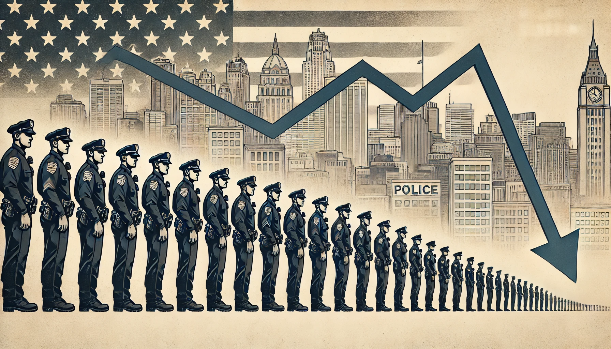
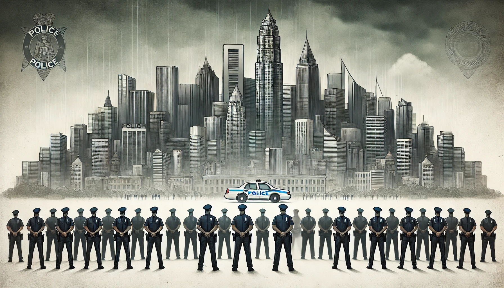
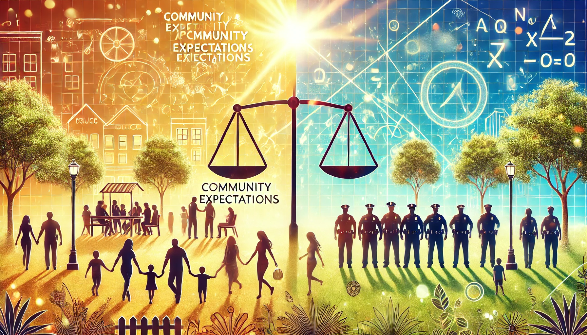
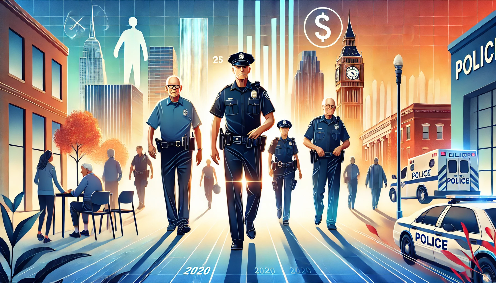

class: top

# Outline

--

1. Scope of the problem

2. Downstream effects

3. Optimal staffing?

4. How U.S. agencies have responded

5. Theoretically-informed interventions

6. Looking ahead

???

**Start with brief introductions if the moderator doesn't do that for us**

So we'll start by discussing what we know about current trends. Spoiler alert, it's pretty spotty and open to interpretation...

We'll allude to the things we know can occur downstream of a staffing shortage. 

We'll discuss what we know about how to optimally staff an agency...

Cover some anecdotal evidence of what US agencies have attempted to do to stop the bleed

We'll talk about a couple of ideas that make good theoretical sense, but for which we don't have good empirical evidence just yet

And we'll conclude with some thoughts about where to go from here. 
---
class: top, center

# Scope of the problem

--

First, let's be clear: this is not new!

```{r, echo=FALSE, fig.align='center', out.width = "50%"}

```

--

Generation of cops hired in the 1990s with federal grant money now retiring

???

Clinton's Violent Crime Control and Law Enforcement Act of 1994, AKA the "Violent Crime Bill"

--

Hiring freezes during and after The Great Recession of 2008

???

Economy tanked in 2008 and many agencies had multiple-year hiring freezes, leaving them incapable of replacing positions opened up by retirements and separations

--

Ferguson unrest...COVID-19...George Floyd protests

???

National discourse surrounding policing → less desirable career. Recruitment numbers plummeting. In Omaha 10 years ago, they were getting close to 2,000 applications per year. The last few years it's been 300 at best. And remember not all of those will progress all the way to patrol. 

---
class: top, center

# Scope of the problem

## <p style="text-align:center;">City size differences?</p>

--

Major cities → sharp spike in resignations and retirements from 2020-21  
(Adams et al. 2023)

```{r, echo=FALSE, fig.align='center', out.width = "60%"}

```

???

Ours was a convenience sample of 14 mostly large jurisdictions that were generous enough to share their staffing data with us. Though there was variation in the extent of the problem, there was a spike in separations and/or retirements in the majority of agencies. 

--

PERF, IACP Surveys

???

PERF and IACP have surveyed their memberships (much larger samples) and results paint a similar picture. Staffing is down and most places are struggling to keep pace with current recruitment efforts. 

---
class: top, center

# Scope of the problem

## <p style="text-align:center;">Still losing?</p>

--

Seem to have stopped the bleed for now (Grunwald 2024)

```{r, echo=FALSE, fig.align='center', out.width = "75%"}
knitr::include_graphics("stop.png")
```

???

Grunwald's working paper relies on a dataset he assembled. Some 5,000 agencies that purportedly represent all departments in 15 states. In the aggregate, the numbers don't look so grim, seemingly because most smaller agencies are doing okay. But his findings w/r/t larger agencies are consistent with ours and PERF/IACP. 

---
class: top, center

# Downstream effects

--

Police can only "do more with less" for so long

```{r, echo=FALSE, fig.align='center', out.width = "50%"}
knitr::include_graphics("balance.png")
```

???

Technological innovations have helped here. But at some point when you stretch a rubber band enough, it breaks. Communities require some baseline level of policing - the trouble is its difficult to know a priori what that is. However, we have a good idea of what can happen if police *do* get stretched too thin:

--

↑ Crime (Braga et al. 2024; Braga & Weisburd 2020; Petersen et al. 2023)

???

Robust evidence that policing reduces crime, particularly when it is *focused* (on the right people, places, and times) and *proactive*. We've cited 3 meta-analyses here which provide evidence that across different jurisdictions and contexts, focused and proactive policing reduces crime (relative to "business as usual" policing). 

--

↑ Response times (Mourtgos et al. 2024)

???

In SLC, response times to Priority 1 and 2 calls held up okay, but skyrocketed for Priority 3 and 4 calls. Maybe not terribly surprising, as we'd expect police to continue prioritizing responding quickly to life-threatening situations. But again, at what point does short staffing inhibit this? And meanwhile, we might not be shocked if we found that the people calling 911 to generate those Priority 3 and 4 calls are unhappy with the amount of time it takes to get a response. 

--

↓ Clearance rates (Mawajdeh, 2023)

???

It's not just patrol - investigative units are affected by this too. During the homicide spike of 2020 and 2021, some people were shocked (or did a good job faking it) that homicide clearance rates fell. 

--

↓ Victim satisfaction? (Bolger et al., 2021)

???

Unaware of any evidence directly connecting short-staffing to decreased victim satisfaction to be clear. But good reasons to expect an indirect effect by way of each of the above. If cops are perceived as ineffective at preventing and solving crimes, and slow to respond, they'll lose legitimacy and credibility with the public. 

---
class: top, center

# Optimal Staffing?

--

```{r, echo=FALSE, fig.align='center', out.width = "55%"}

```

Unfortunately there's no formula; it depends on what the community expects

???

*LA Times* just ran a story about the LAPD. Projections show they'll keep losing ~150 officers per year through retirements and separations, such that in the next year or so they'll be at their lowest staffing levels since 1995. 

They've warned for years that they need "at least 10K sworn" to maintain public safety...

...Yet most violent offenses have continued to trend downward. But:

- **beware YoY comparisons!**
- public fear of victimization doesn't map neatly onto actual crime trends
- it's also tied to disorder, which seems to be up in many major cities, and which we know can be policed! (Braga et al. 2024)

--

One study: each additional 10-17 officers abated ~1 homicide, with per capita effects 2x as large for Black vs. White victims (Chalfin et al. 2022)

--

→ But there was a clear tradeoff in that Black community members bore the brunt of low-level stops and misdemeanor arrests

---
class: top, center

# How U.S. agencies have responded

--

```{r, echo=FALSE, fig.align='center', out.width = "40%"}

```

Sign-on bonuses & lateral transfers

--

Attempts at re-branding the job

```{r, echo=FALSE, fig.align='center', out.width = "40%"}

```

---
class: top, center

# Theoretically-informed interventions

--

## <p style="text-align:center;">Organizational justice</p>

→ Key to maintaining morale and commitment to the job (Wolfe & Nix, 2016)

???

Chiefs having the courage to push back against false or poorly framed narratives about policing can go a long way in terms of organizational morale

Otherwise, treating officers fairly and listening to their concerns

--

## <p style="text-align:center;">Moving beyond the traditional candidate pool</p>

→ Targeted recruitment of women (e.g., 30x30 Initiative)

???

In the US, women make up 51% of the population but just 12% of policing

---
class: top, center

# Looking ahead

--
```{r, echo=FALSE, fig.align='center', out.width = "50%"}

```

Major cities may have stopped the bleed but will struggle to return to pre-2020 levels of staffing without a 'shot in the arm'

???

Here we note that Biden was pushing another federal bill that would help local governments hire more cops. Ultimately it didn't go anywhere though:

- Less politically palatable than it was 30 years ago when crime was at an all-time high
- The pool of interested people is smaller now than it was then, meaning if agencies want to increase their staffing they're going to have to do more than convert interested persons into applicants, and eventually officers. **They have to do something to make the job interesting to a wider swath of people.** 

--

Changing workforce

Pensions, long-term careers a thing of the past

???

At least anecdotally, we here that the new generation of potential applicants is less interested in a pension 25 years from now, and less interested in job stability. They want flexibility - such as the option to work from home or have more work/life balance. Historically, policing hasn't been the job to seek out if those are your things.

How can policing adapt to this changing workforce? 

Denver PD just got rid of restrictions on facial hair; other agencies have done the same as well as with tattoos. Cool, cool...but what else? 

---
class: middle, inverse, center

# Thank you!

Questions?

---
class: top, references-font

# References

Adams, I. T., Mourtgos, S. M., & Nix, J. (2023). Turnover in large US policing agencies following the George Floyd protests. *Journal of Criminal Justice*, 88, 102105.

Bolger, M. A., Lytle, D. J., & Bolger, P. C. (2021). What matters in citizen satisfaction with police: A meta-analysis. *Journal of Criminal Justice*, 72, 101760.

Braga, A. A., & Weisburd, D. L. (2020). Does hot spots policing have meaningful impacts on crime? Findings from an alternative approach to estimating effect sizes from place-based program evaluations. *Journal of Quantitative Criminology*, 1-22.

Braga, A. A., Schnell, C., & Welsh, B. C. (2024). Disorder policing to reduce crime: An updated systematic review and meta‐analysis. *Criminology & Public Policy*.

Chalfin, A., Hansen, B., Weisburst, E. K., & Williams Jr, M. C. (2022). Police force size and civilian race. *American Economic Review: Insights*, 4(2), 139-158.

Grunwald, B. (2024). A large-scale study of the police retention crisis. Available at SSRN 4871954.

Mawajdeh, H. (2023). Police are solving fewer crimes. Why? *Vox*. Available at: <https://www.vox.com/2023/12/23/24012514/police-crime-data-solve-rate-eddie-garcia-today-explained>. 

Petersen, K., Weisburd, D., Fay, S., Eggins, E., & Mazerolle, L. (2023). Police stops to reduce crime: A systematic review and meta‐analysis. *Campbell Systematic Reviews*, 19(1), e1302.

Wolfe, S. & Nix, J. (2016). Managing police departments post-Ferguson. *Harvard Business Review*. Available at <https://hbr.org/2016/09/managing-police-departments-post-ferguson>. 

<!-- ```{css, echo=FALSE} -->
<!-- @media print { -->
<!--   .has-continuation { -->
<!--     display: block; -->
<!--   } -->
<!-- } -->
<!-- ``` -->

