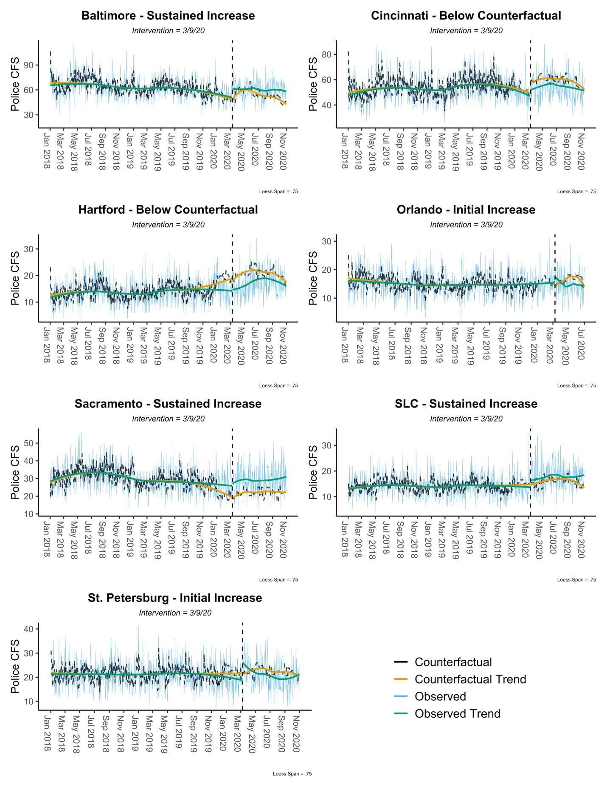
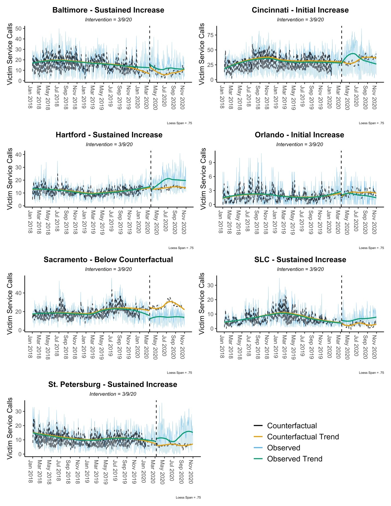

class: center, middle, inverse

# A Comparison of 911 and Emergency Hotline Calls for Domestic Violence Before and During COVID-19

Drs. [Tara Richards](https://www.unomaha.edu/college-of-public-affairs-and-community-service/criminology-and-criminal-justice/about-us/tara-richards.php) and [Justin Nix](https://jnix.netlify.app)

*School of Criminology and Criminal Justice, University of Nebraska Omaha*

[Scott Mourtgos](https://smourtgos.netlify.app/) and [Ian Adams](https://ianadamsresearch.com/)

*Department of Political Science, University of Utah*

---
class: top 

# Background 

- DV-related calls for service to police increased directly after stay-at-home orders[1]

--

- Most DV victims **do not call police** after incidents of partner violence[2]

--

- Victims may seek out help from victim service organizations, commonly through an emergency DV hotline[3]

--

- Victim calls to *emergency DV hotlines* may provide important information on DV trends during COVID-19.

---
class: top

# Purpose

- Examine the **observed trend** in DV calls for service to police and emergency hotlines before and during COVID-19.

--

- Estimate the **expected trend** (i.e., counterfactual) in DV calls for service to police and emergency hotlines during COVID-19.

--

- Compare **differences** in the observed and expected trends for DV calls for service to police and emergency hotlines during COVID-19.

---
class: top

# Data

- Seven U.S. cities: Baltimore, MD; Cincinnati, OH; Hartford, CT; Orlando, FL; Sacramento, CA; Salt Lake City, UT; and St. Petersburg, FL.

--

- Police calls were obtained from the [Police Data Initiative](https://www.policedatainitiative.org/datasets/calls-for-service/).

--

- Emergency hotline calls were obtained directly from the victim service agencies.

--

- Study period: January 1, 2018 to October 31, 2020; COVID-related period: March 9 to October 31, 2020[4]

---
class: top

# Analyses

- **Observed Trend** - Bayesian Structural Time Series (BSTS) models are estimated for police calls for service (CFS) and emergency hotline calls (EHC) in each city using 2018 and 2019 data (i.e., non-COVID period).

--

- **Expected Trend** - BSTS models are then used to estimate a counterfactual for CFS and EHC in each jurisdiction between March 9 and October 31, 2020 (i.e., COVID period).

--

- **Differences** - mean differences between the observed and expected trends are calculated for the COVID period, providing estimates of the impact on CFS and EHC in each jurisdiction. 

---
class: top

# Findings: Calls for Police Service

.pull-left[

]

.pull-right[
- Increases in police calls were observed in Baltimore, Sacramento, and Salt Lake City. 
- Increases ranged from 1.64 more calls per day on average to 7.16 more calls per day on average, for **a total of 1030.32 more calls to police** from March 9 to October 31, 2020.
]

---
class: top

# Findings: Emergency Hotline Calls

.pull-left[

]

.pull-right[
- Increases in the average number of calls to emergency hotlines were observed for Baltimore, Cincinnati, Hartford, Salt Lake City, and St. Petersburg. 
- These increases ranged from 2.31 more calls per day on average to 4.64 more calls per day on average, for **a total of 1670.85 more calls to emergency hotlines** from March 9 to October 31, 2020. 
]

---
class: top

# Findings: Comparisons

- General increases in calls for DV service, but variation across cities in whether increases in calls to police, emergency hotlines, or both.
- Sacramento experienced an increase in calls to **police only** while Cincinnati, Hartford, and St. Petersburg experienced increases in calls to **emergency hotlines only.**
- Baltimore and Salt Lake City experienced an increase in calls to **both** police and emergency hotlines.
- Orlando experienced a decrease in calls to **both** police and emergency hotlines.

---
class: top

# Discussion

- Police calls only tell us part of the story about DV help seeking during COVID-19.

--

- Emergency hotlines/advocates shouldered a significant burden.

--

- Critical to understand local effects, localized impacts on agencies.

--

- As COVID recedes, we cannot forget about the “pandemic within the pandemic” - ongoing economic stressors associated with DV are not easily/quickly solved.

---
class: top

# Implications

Can we develop a culture of better data sharing and usage within/across criminal justice and victim service agencies?
- Better understand localized trends, deploy training and resources in real time.

--

Can strategic research-practitioner partnerships help domestic violence coordinated community response teams?
- Data-driven decisions regarding local prevention and intervention (e.g., pop-up advocacy sites, well-checks for DV “hotspots”).

---
class: top, center

# Thank you!

Dr. Tara N. Richards, [@prof_TNR](https://twitter.com/prof_tnr)

Dr. Justin Nix, [@jnixy](https://twitter.com/jnixy)

*School of Criminology and Criminal Justice, University of Nebraska Omaha*

Scott Mourtgos, Ph.D.(c), [@morty\_s_](https://twitter.com/morty_s_)

Ian Adams, Ph.D.(c), [@LiminalMori](https://twitter.com/liminalmori)

*Department of Political Science, University of Utah*

---
class: top

# References

[1] Piquero, A.R., Jennings, W.G., Jemison, E., Kaukinen, C., & Knaul, F.M. (2021). Domestic violence during COVID-19: Evidence from a systematic review and meta-analysis. Washington, DC: Council on Criminal Justice. Retrieved from https://covid19.counciloncj.org/2021/02/23/impact-report-covid-19-and-domestic-violence-trends/

[2] Morgan, R. E., & Truman, J. L. (2020). Criminal victimization, 2019. U.S. Department of Justice, Office of Justice Programs, Bureau of Justice Statistics. https://www.bjs.gov/content/pub/pdf/cv19.pdf 

[3] Logan, T. K., & Valente, R. (2015). Who will help me? Domestic violence survivors speak out about police responses. National Domestic Violence Hotline. http://www.thehotline.org/wp-content/uploads/sites/3/2015/09/NDVH-2015-Law-Enforcement-Survey-Report.pdf 

[4] Leslie, E., & Wilson, R. (2020). Sheltering in place and domestic violence: Evidence from calls for service during COVID-19. Journal of Public Economics, 189(104241), 104241. https://doi.org/10.1016/j.jpubeco.2020.104241

