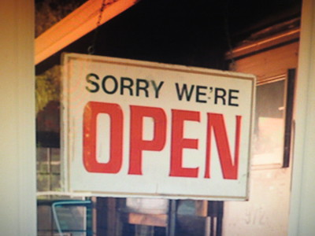
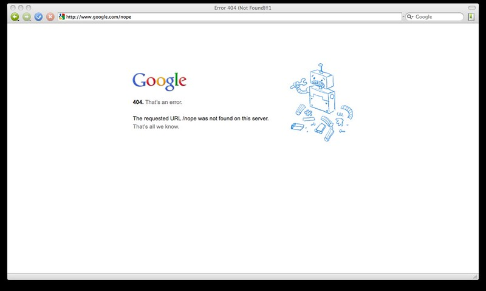
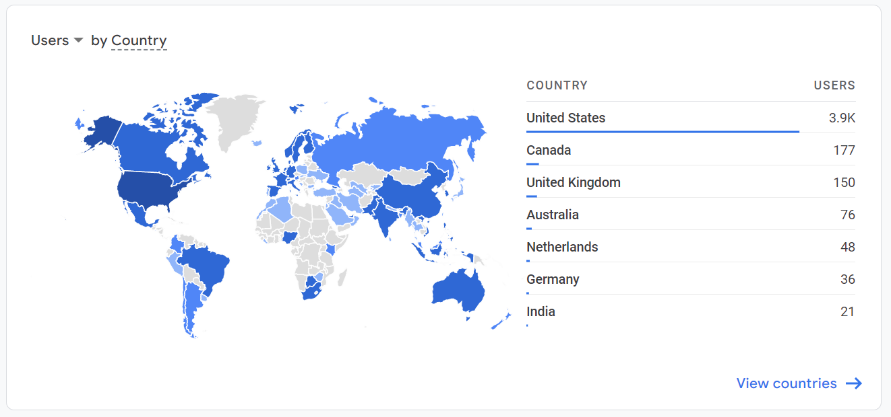
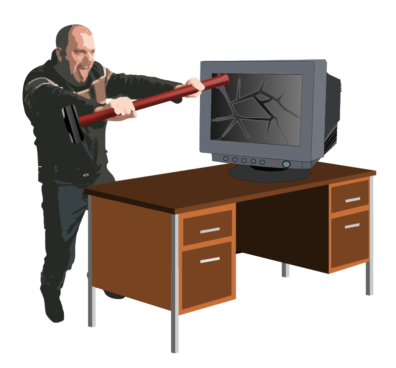
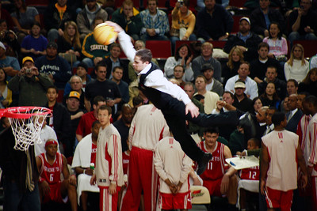

class: left, middle, inverse
background-image: url(https://www.unomaha.edu/university-communications/downloadables/campus-icon-the-o/uno-icon-color.png)
background-position: 95% 89%
background-size: 10%

# Creating a Professional Website
## (Part 1?)

</br>
</br>

[Justin Nix](https://jnix.netlify.app)  
Distinguished Associate Professor  
School of Criminology and Criminal Justice  

<br>
<br>
<br>
.white[Graduate Seminar Series]  
.white[University of Nebraska Omaha]  
.white[December 2, 2022]

---
class: middle, center, inverse

# Why You Should Create a Website

???

---
class: middle, center

## To Make Your Work More Accessible

```{r, echo=FALSE, fig.align='center', out.width = "60%"}

```

<p style="text-align: center; color: gray">.small[Image by [Michelle Ress](https://flickr.com/photos/safoocat/) on [flickr](https://flic.kr/p/2b6WhLK), [CC BY-NC-ND 2.0](https://creativecommons.org/licenses/by-nc-nd/2.0/)]</p>

---
class: middle, center

## Committees Will Google You

```{r, echo=FALSE, fig.align='center', out.width = "60%"}

```

<p style="text-align: center; color: gray">.small[Image by [Rick Turoczy](https://flickr.com/photos/turoczy/) on [flickr](https://flic.kr/p/9zUNcr), [CC BY 2.0](https://creativecommons.org/licenses/by/2.0/)]</p>

---
class: middle, center, inverse

# Disclaimer

---
class: top

```{r, echo=FALSE, fig.align='center', out.width = "60%"}

```

<p style="text-align: center; color: gray">.small[Image by [Rheo](https://pixabay.com/users/merio-1480566/) on [Pixabay](https://pixabay.com/illustrations/halloween-frankenstien-party-2853809/)]</p>

---
class: middle, center, inverse

# OK, Let's Get Started

---
class: middle, center

## Prerequisites

--

You'll need to set up free accounts with [GitHub](https://github.com/) and [Netlify](https://netlify.com)

--

Download [RStudio](https://posit.co/download/rstudio-desktop/) and install the [blogdown](https://cran.r-project.org/web/packages/blogdown/index.html) package

```
install.packages("blogdown")
```

---
class: top

## Step 1: Pick a Theme and Launch

--

Go to [Wowchemy.com](https://wowchemy.com)

```{r, echo=FALSE, fig.align='center', out.width = "60%"}
knitr::include_graphics("wowchemy_home.png")
```

--

```{r, echo=FALSE, fig.align='center', out.width = "60%"}

```

  - You might need to grant Netlify access to GitHub
  
- Choose repository name, save and deploy

---
class: top

## Step 2: Customize Your URL 

--

Change the auto-assigned URL to something that makes more sense

.pull-left[

]

.pull-right[

]

---
class: left

## Step 3: Create the Project in RStudio

--

```{r, echo=FALSE, fig.align='center', out.width = "75%"}

```

--

Enter the URL of your GitHub repo and name the directory (i.e., folder) where you'll store the files that will build your website

</br>

```{r, echo=FALSE, fig.align='center', out.width = "40%"}
knitr::include_graphics("clone_git_repo.png")
```

--

</br>

Click "Create Project"

---
class: top

## Step 4: Build Out Your Homepage

--

Use Wowchemy Page Builder to [customize your homepage](https://wowchemy.com/docs/getting-started/page-builder/)

--

Things you should **definitely** include:

--

- Your CV

- A headshot

- Degrees earned (and in progress)

- A short description of yourself

- A page that links to your published work

---
class: top

## Step 4: Build Out Your Homepage

### Your Avatar and Bio

--

Save your avatar in **content/authors/admin** - overwriting the stock image

--

Open **content/authors/admin/_index.md**

--

- Add your full name to the **title** field
- Add your current position to the **role** field
- Write one (short) sentence describing yourself in the **bio** field
- List the **organizations** you're affiliated with
- List your research interests in the **interests** field
- List your degrees earned/in progress in the **education -> courses** block
- Link to your social media or academic accounts
  - E.G., Twitter, ResearchGate, OrcID, GitHub...
  
---
class: top

## Step 4: Build Out Your Homepage

### Your Avatar and Bio

```{r, echo=FALSE, fig.align='center', out.width = "75%"}
knitr::include_graphics("your_bio.png")
```

---
class: top

## Step 4: Build Out Your Homepage

Use Wowchemy Page Builder to [customize your homepage](https://wowchemy.com/docs/getting-started/page-builder/)

--

Things you should **consider** including:

--

- Pre-prints

- Teaching materials (e.g., syllabi)

- Presentations

- A blog

---
class: top

## Step 4: Build Out Your Homepage

--

Wowchemy has several page [templates](https://wowchemy.com/docs/getting-started/get-started/) to choose from (or you can create one from scratch)

```{r, echo=FALSE, fig.align='center', out.width = "60%"}
knitr::include_graphics("wowchemy_pages.png")
```

---
class: top

## Step 5: Personalize

--

### Pick a website icon

- Save in the **assets/media/** folder as a 512x512 named **icon.png**

```{r, echo=FALSE, fig.align='center', out.width = "50%"}
knitr::include_graphics("icon.png")
```

---
class: top

## Step 5: Personalize

--

### Appearance

Open **config/_default/params.yaml** 

--

- Choose a **color theme** and **font** that suits you

  - Easy to go back and change/tweak these later

--

- Customize the **header**

  - Main menu links in your navigation bar can be added in **config/_default/menu.yaml**
  
```{r, echo=FALSE, fig.align='center', out.width = "75%"}
knitr::include_graphics("header.png")
```

---
class: top

## Step 5: Personalize

### Appearance 

Open **config/_default/params.yaml** 

--

- Add a **copyright notice** to the **footer**

--

```{r, echo=FALSE, fig.align='center', out.width = "40%"}
knitr::include_graphics("copyright_notice.png")
```

--

```
footer:
  widget: minimal
  copyright:
    notice: '© {year} Me. This work is licensed under {license}'
    license:
      enable: true
      allow_derivatives: false
      share_alike: true
      allow_commercial: false
  # For multilingual sites, show a language chooser in the footer?
  show_translations: true
```

---
class: top

## Step 5: Personalize

### Appearance 

Open **config/_default/params.yaml** 

--

- Lastly, you can enable [commenting](https://wowchemy.com/docs/hugo-tutorials/comments/), [analytics](https://wowchemy.com/docs/hugo-tutorials/analytics/), and [social sharing](https://wowchemy.com/docs/hugo-tutorials/page-sharer/) if you like

--

.pull-left[

]

.pull-right[

]

---
class: top

## Step 6: Commit Your Changes and Push them Out!

--

Can make changes directly in GitHub, but I prefer to do it all in RStudio

--

You should see a list of changes you've made in upper right pane, under the **Git** tab:

```{r, echo=FALSE, fig.align='center', out.width = "50%"}
knitr::include_graphics("commit_changes_1.png")
```

--

Check the "Staged" box next to the changes you want to commit

Click "Commit"

---
class: top

## Step 6: Commit Your Changes and Push them Out!

--

Add text explaining what you've changed in the "commit message" box

```{r, echo=FALSE, fig.align='center', out.width = "50%"}
knitr::include_graphics("commit_changes_2.png")
```

--

Now click "Commit" and then "Push"

---
class: middle, center, inverse

# Congrats! Your changes should appear in a few moments

--

## ...Unless there's a bug

--

## ...And often there is

---
class: top

## Other Helpful Resources

--

I built my Frankenstein with help from [Yihui Xie](https://yihui.org/en/), [Alison Hill](https://www.apreshill.com/tags/rmarkdown/), [Dan Quintana](https://www.dsquintana.blog/), and [Steve Miller](http://svmiller.com/blog/).

--

Follow them for helpful content about:

- [Markdown syntax](https://www.markdownguide.org/cheat-sheet/)

- [xaringan](https://slides.yihui.org/xaringan/#1), [officedown](https://www.apreshill.com/blog/2021-07-officedown/), and [Beamer](http://svmiller.com/blog/2019/08/r-markdown-template-beamer-presentations/)

- Rendering your [CVs](http://svmiller.com/blog/2016/03/svm-r-markdown-cv/), [pre-prints](http://svmiller.com/blog/2020/09/another-rmarkdown-article-template/), [syllabi](http://svmiller.com/blog/2016/07/r-markdown-syllabus/)

---
class: middle, center, inverse

# Words of Caution

---
class: top

## Have some patience

--

```{r, echo=FALSE, fig.align='center', out.width = "60%"}

```

---
class: top

## Be mindful of copyright

--

For images, I use [flickr](https://flickr.com/), [pixabay](https://pixabay.com/), and [Unsplash](https://unsplash.com/)

```{r, echo=FALSE, fig.align='center', out.width = "50%"}
knitr::include_graphics("creative_commons.png")
```

--

Head over to [CrimRxiv](https://www.crimrxiv.com/individual-open-access-license) for information about sharing research

---
class: top

## If you blog: **Don't. Be. Messy.**

--

Ask yourself: what am I trying to accomplish with this?

--

.pull-left[
```{r, echo=FALSE, fig.align='center', out.width = "100%"}

```

<p style="text-align: center; color: gray">.small[Image by [Beyond Neon](https://flickr.com/photos/kungfuji/) on [flickr](https://flic.kr/p/4nMcFp), [CC BY-NC 2.0](https://creativecommons.org/licenses/by-nc/2.0/)]</p>
]

--

.pull-right[

</br>
</br>
</br>

...This is generally unhelpful

]

---
class: top, center
background-image: url(https://www.unomaha.edu/university-communications/downloadables/campus-icon-the-o/uno-icon-color.png)
background-position: 50% 59%
background-size: 10%

# Thank you!

## Questions?

Justin Nix

*School of Criminology and Criminal Justice*  
*University of Nebraska Omaha*

</br>
</br>
</br>

`r icons::fontawesome("twitter")` [jnixy](https://twitter.com/jnixy) | `r icons::fontawesome("envelope")` [jnix@unomaha.edu](mailto:jnix@unomaha.edu) | `r icons::fontawesome("globe")` [jnix.netlify.app](https://jnix.netlify.app)


<!-- ```{css, echo=FALSE} -->
<!-- @media print { -->
<!--   .has-continuation { -->
<!--     display: block; -->
<!--   } -->
<!-- } -->
<!-- ``` -->

<style>
p.caption {
  font-size: 0.5em;
  color: gray;
}
</style>