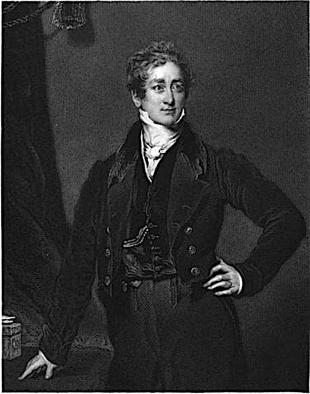
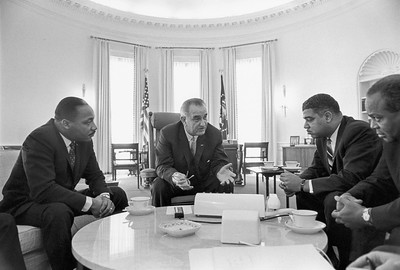
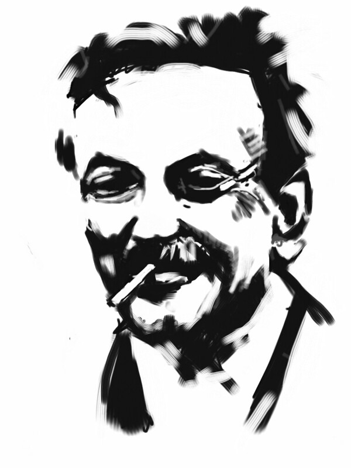

class: center, middle, inverse
background-image: url(https://www.unomaha.edu/university-communications/downloadables/campus-icon-the-o/uno-icon-color.png)
background-position: 95% 90%
background-size: 10%

# Chapter 1:  
# Origins and Evolution of American Policing

<br>
<br>

[Justin Nix](https://jnix.netlify.app)  
*School of Criminology and Criminal Justice*  
*University of Nebraska Omaha*

<br>
<br>
<br>
.white[February 1, 2022]

---
class: top

# From Private to Public Policing 

--

- Earliest known models of policing

--

  - "Kin policing"

--

  - Night watch

--

  - "Frankpledge system"

--

  - Bow Street Runners

---
class: top

# The Influence of the English Model

--

- [Sir Robert Peel](https://en.wikipedia.org/wiki/Robert_Peel)

```{r, echo=FALSE, fig.align='center', out.width = "25%"}

```

--

- Industrial Revolution, urbanization, and increasing crime

--

- [Metropolitan Police Act (1829)](https://scholarlycommons.law.northwestern.edu/cgi/viewcontent.cgi?article=5222&context=jclc&httpsredir=1&referer=)

---
class: top

# The Influence of the English Model

--

- First to centralize, unify police force

```{r, echo=FALSE, fig.align='center', out.width = "35%"}

```

--

- Emphasis on *prevention*

--

  - E.G., uniforms to increase visibility and (in theory) deter crime

--

- Peel's [Nine Principles of Policing](https://www.sjpd.org/home/showpublisheddocument?id=284)

--

  - At least...according to [textbooks](https://doi.org/10.1016/j.jcrimjus.2006.11.016)

---
class: top

# Policing comes to America

--

- In the north...

--

  - Appointed constables and citizen volunteers

--

- In the south...

--

  - Slave patrols

--

- Expanding westward...

--

  - Vigilantism  
  - Texas Rangers

--

- Organized police forces born out of perceived necessity

---
class: top

# Policing comes to America

--

- Immigration into urban centers

--

- Heavily influenced by Peel and London Metropolitan Police

--

- Key distinctions:

--

  - No uniforms at first

--

  - Significantly involved in/influenced by local politics

--

  - More empowered to use physical coercion

---
class: top

# Three Eras of Policing

--

- [Kelling and Moore (1988)](https://www.ojp.gov/pdffiles1/nij/114213.pdf) divide the history of U.S. policing into three eras:

--

  1. The Political Era
  
--
  
  2. The Reform Era (aka Professional Era)

--

  3. The Community Problem-Solving Era

---
class: top

# The Political Era

--

- Fear of urban street crime -> demands for more police protection

--

- NYC establishes first full-time, paid police force circa 1844

--

  - [Some argue](https://www.newyorker.com/magazine/2020/07/20/the-invention-of-the-police) it was actually Boston, circa 1838
  
--

  - ...Curiously, the Boston Police Department's [website](https://bpdnews.com/history) doesn't mention this
  
--

- Close relationship between police and political leaders

--
  
  - Extreme corruption

---
class: top
background-image: url(wickersham.jpg)
background-position: 95% 10%
background-size: 35%

# The Reform Era

--

- Circa 1930

--

- Public concern about corruption

--

- Influence of [August Vollmer](https://doi.org/10.2307/1139476)

--

- [State](https://homicide.northwestern.edu/docs_fk/homicide/ICS/ICS.pdf) and [Federal](https://www.ojp.gov/pdffiles1/Digitization/44540NCJRS.pdf) Crime Commissions 

--

- Key takeaways:

--

  - Need for professionalization

--

  - Divorce policing from politics
  
--

  - The primary function of policing is *crime fighting*

---
class: top

# The Community Problem-Solving Era

--

.pull-left[
- Circa late 1960s/early 1970s

- The influence of Vollmer's student, *O.W. Wilson*

- [Research](https://www.policefoundation.org/publication/the-kansas-city-preventive-patrol-experiment/) that challenged conventional wisdom

- [President's Commission on Law Enforcement and Administration of Justice (1967)](https://www.ojp.gov/sites/g/files/xyckuh241/files/archives/ncjrs/42.pdf)

- 1968 [Democratic National Convention](https://time.com/5377386/1968-democratic-national-convention-protesters/)
]

.pull-right[

]

---
class: top

# The Community Problem-Solving Era

--

- Emphasis on:

--

  - Building better relationships with communities
  
--

  - Diversifying the police
  
--

  - Proactively addressing *problems*
  
--

- J. Q. Wilson & George Kelling (1982): [Broken Windows](https://www.theatlantic.com/magazine/archive/1982/03/broken-windows/304465/)

```{r, echo=FALSE, fig.align='center', out.width = "40%"}
knitr::include_graphics("broken_windows.jfif")
```

---
class: top
background-image: url(https://upload.wikimedia.org/wikipedia/commons/0/08/Black_Lives_Matter_Sign_-_Minneapolis_Protest_%2822632545857%29.jpg)
background-position: 90% 10%
background-size: 30%

# The "Post-Ferguson" Era

--

- Police killing of Michael Brown in 2014

--

- Rapid growth of [Black Lives Matter](https://www.nytimes.com/interactive/2020/07/03/us/george-floyd-protests-crowd-size.html)

--

- [New data](https://www.fatalencounters.org) reveal police kill people much more frequently than FBI data had been showing

--

- President Obama's [Task Force on Policing in the 21st Century](https://cops.usdoj.gov/RIC/Publications/cops-p341-pub.pdf)

--

- Diffusion of smartphones and [body-worn cameras](https://doi.org/10.1177%2F1098611120917937)

--

- Push for [data transparency](https://www.policedatainitiative.org/)

---
class: top, center

# Have a great day! 😄

```{r, echo=FALSE, fig.align='center', out.width = "25%"}

```

### *New knowledge is the most valuable commodity on Earth. The more truth we have to work with, the richer we become.*

<div style="text-align: right"> - Kurt Vonnegut </div>


<!-- ```{css, echo=FALSE} -->
<!-- @media print { -->
<!--   .has-continuation { -->
<!--     display: block; -->
<!--   } -->
<!-- } -->
<!-- ``` -->

