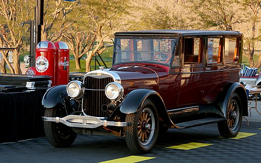

class: center, middle, inverse
background-image: url(https://www.unomaha.edu/university-communications/downloadables/campus-icon-the-o/uno-icon-color.png)
background-position: 95% 90%
background-size: 10%

# Policing and the Law

<br>
<br>
<br>

[Justin Nix](https://jnix.netlify.app)  
*School of Criminology and Criminal Justice*  
*University of Nebraska Omaha*

<br>
<br>
<br>
<br>
.white[April 5, 2022]

---
class: top
background-image: url(we_the_ppl.jpg)
background-position: 94% 5%
background-size: 30%

# The 4th Amendment

</br>

<p style="text-align: right;">.small[(Image by [ClaraDon](https://www.flickr.com/photos/florida_photo_guy/) on [Flickr](https://flic.kr/p/2jhRXa8), [CC BY-NC-SA 2.0](https://creativecommons.org/licenses/by-nc-sa/2.0/))]</p>

</br>

> The right of the people to be secure in their persons, houses, papers, and effects, against **unreasonable searches and seizures**, shall not be violated, and no warrants shall issue, but upon **probable cause**, supported by oath or affirmation, and **particularly describing** the place to be searched, and the persons or things to be seized.

---
class: top
background-image: url(bacon.jpg)
background-position: 90% 5%
background-size: 40%

# Suspicion

</br>
</br>

<p style="text-align: right;">.small[(Image by [RaphaelMoreno0601](https://upload.wikimedia.org/wikipedia/commons/thumb/5/5f/Francis_Bacon_filosofo.jpg/800px-Francis_Bacon_filosofo.jpg?20180817165909), [CC BY-SA 4.0](https://creativecommons.org/licenses/by-sa/4.0), via Wikimedia Commons)]</p>

</br>

> Suspicions amongst thoughts are like bats amongst birds, they ever fly by twilight. Certainly they are to be repressed, or at least well-guarded; for they cloud the mind...they are defects, not in the heart, but in the brain...for commonly they are not admitted, but with examination, whether they be likely or no; but in fearful natures they gain ground too fast. There is nothing makes a man suspect much, more than to know little; and therefore men should remedy suspicion by procuring to know more, and not to keep their suspicions in smother.

<div style="text-align: right"> - Francis Bacon </div>

---
class: top

# Searches and seizures

--

In some circumstances, police may infringe on our expectation of privacy to **search** for evidence that could be used for criminal prosecution

--

- 4th Amendment "protects people, not places"

  - See [Katz v. United States (1967)](https://www.oyez.org/cases/1967/35)
  
???

In **Katz**, federal agents placed a listening device outside a phone booth in which Katz was having a conversation.
- Agents suspected him of transmitting gambling information over the phone to clients in other states
- He makes incriminating statements, and the FBI sought to use them against him at trial
- Lower courts said that the FBI's activities did not amount to a search, because there was **no physical entry into the phone booth**.
- SCOTUS voted 7-1 to **reverse**, holding that 4th Amendment "protects people, not places," and doesn't require physical intrusion into any enclosure.

In Katz, SCOTUS went on to say that a 4th Amendment search/seizure has only occurred when there is an infringement on an expectation of prviacy that society (through the eyes of a court) is willing to accept as reasonable.
- Further, anything a person knowingly exposes to the public - including in their home or office - is not subject to 4th Amendment protection
- Protection is afforded only for what he seeks to preserve as private.

--

A **seizure** can refer to property (i.e., evidence) *or* people (i.e., restricting their movement)

--

- SCOTUS: a seizure occurs when an officer intentionally restrains a person's liberty in such a manner that a *reasonable person* would believe they are not free to leave

---
class: top

# Standards of proof

--

Imagine the scale below measures *certainty*...

</br>

```{r, echo=FALSE, fig.align='center', out.width = "50%"}
knitr::include_graphics("scale.png")
```

--

</br>

- How certain do you think an officer should have to be in order to ***stop someone***?

--

  - E.G., let's discuss the facts in [Kansas v. Glover (2020)](https://www.oyez.org/cases/2019/18-556)
  
???

**Kansas v. Glover**
- On patrol, an officer runs a registration check on a pickup with a KS plate
- Truck is registered to Charles Glover, Jr., and his license is revoked
- Acting on suspicion that the owner was unlawfully operating the vehicle (based on the assumption that the registered owner of the truck was also the driver), the officer stops the truck
  - Glover was the driver, and he officer cited him for being a "habitual violator of KS traffic laws"

- Glover moved to suppress all evidence, arguing the stop violated his 4th Amendment protection against unreasonable searches and seizures.
  - Because the officer **lacked reasonable suspicion to pull him over**

- State argues that, absent information to the contrary, police may infer that the owner of a vehicle is the one driving it
  - And knowledge that the owner has a revoked license combined with this inference gives police reasonable suspicion to do an investigative stop
  
- Trial court grants Glover's motion to suppress; appellate court reverses; Kansas Supreme Court reversed lower court; SCOTUS takes case
- **Key question: Is it reasonable for an officer to suspect that the registere owner of a vehicle is the one driving it absent any information to the contrary?**

  - SCOTUS rules (8-1) that this *is* reasonable. Justice Sotomayor dissented, saying the majority's decision "flips the burden of proof."

--

- Now, how certain should an officer be to search someone (i.e., ***probable cause***)?

---
class: top

# Probable cause

--

In [Beck v. Ohio (1964)](https://supreme.justia.com/cases/federal/us/379/89/#tab-opinion-1945328), SCOTUS defined *probable cause* as more than *bare suspicion*:

> the facts and circumstances within [the officers'] knowledge and of which they [have] reasonably trustworthy information [are] sufficient to warrant a prudent man in believing that the [suspect] had committed or was committing an offense. 

```{r, echo=FALSE, fig.align='center', out.width = "30%"}

```

???

**BECK** 
- Officer in Cleveland stops William Beck and arrests him after receiving unspecified “information” and “reports” concerning his whereabouts
- Officer had no warrant
- Searched his car but didn’t find anything; at the station, they found some clearing house slips beneath his sock
- Beck filed a motion to suppress the slips, arguing they violated the 4th amendment
- Court overruled, and the case was ultimately appealed up to SCOTUS
- SCOTUS overturned his conviction (6-3) – **justification for the arrest was too vague**, and **suspicion relied too much on Beck’s prior criminal history**
- Prosecution “needed to show with considerably more specificity” what the info was, who the informer was, and why police felt the informer was reliable
- “Good faith is not enough”

- **All arrests must be supported by probable cause**

--

<div style="text-align: center"> What are we trying to balance here? </div>

???

**Balancing act**

more from SCOTUS on PC: "Requiring more would unduly hamper law enforcement. To allow less would be to leave law-abiding citizens at the mercy of the officers' whim or caprice."

---
class: top

# 3 requirements for search & arrest warrants

--

```{r, echo=FALSE, fig.align='center', out.width = "30%"}

```

1. Signed by a neutral and detached magistrate

--

2. Probable cause

--

3. Particularity

???

See Figure 10-4 in your textbook (p. 172)

---
class: middle, center, inverse

# But there are exceptions
# to the warrant requirement!

---
class: top

# Warrantless searches

--

## The plain view doctrine

```{r, echo=FALSE, fig.align='center', out.width = "45%"}

```
<p style="text-align: center;">.small[Image by [Coolcaesar](https://upload.wikimedia.org/wikipedia/commons/thumb/b/b0/CHP_HOV_traffic_stop.jpg/800px-CHP_HOV_traffic_stop.jpg?20090521173939), [CC BY-SA 3.0](https://creativecommons.org/licenses/by-sa/3.0/), via Wikimedia Commons]</p>

See [Coolidge v. New Hampshire (1971)](https://www.oyez.org/cases/1970/323)

???

**Coolidge**: 14 y.o. Pamela Mason places ad in a merchant’s window for babysitting
- She gets picked up by Edward Coolidge who needed a babysitter and is never seen alive again
- Body found eight days later, stabbed and shot to death
- State AG took charge of policing activities related to the murder
- Home visits, shows 3 guns, willing to take polygraph
- Later visit with wife, who gives them 4 guns as well as some clothing…
- Police applied for a warrant to search Coolidge’s vehicle, the AG authorized it (acting as JOP)
- Coolidge found guilty and sentenced to life
- **Key issue**: did the searches of Coolidge's home and automobile violate the 4th Amendment? 
  - SCOTUS: yes, they did, because the warrants were not signed by a neutral and detached magistrate
  - However, plain view doctrine was inapplicable here since police had ample opportunity to obtain a warrant
  
---
class: top

# Warrantless searches

--

## The open fields doctrine

--

See [Oliver v. United States (1984)](https://www.oyez.org/cases/1983/82-15)

```{r, echo=FALSE, fig.align='center', out.width = "45%"}
knitr::include_graphics("trespass.png")
```
<p style="text-align: center;">.small[[Image](https://flic.kr/p/TtAYjd) by [Bill Smith](https://www.flickr.com/photos/byzantiumbooks/), [CC BY 2.0](https://creativecommons.org/licenses/by/2.0/)]</p>

???

**Oliver v. United States**
- KSP got a tip about a marijuana growing operation
- Drove onto defendant’s land, past his house, up to a gate with a “no trespassing” sign
- Got out of vehicles and walked down a footpath beyond the gate for ½ mile
- Spotted a large marijuana crop
- SCOTUS said this didn’t constitute a search
  - “Cannot legitimately demand privacy for activities conducted out of doors in fields, except in area immediately surrounding home
  - Open fields are usually accessible to the public
  - No trespassing signs are generally ineffective
  - And air surveillance is lawful

---
class: top

# Warrantless searches

--

## "Terry" frisks

--

See [Terry v. Ohio (1968)](https://www.oyez.org/cases/1967/67)

```{r, echo=FALSE, fig.align='center', out.width = "40%"}
knitr::include_graphics("pat_down.jpg")
```
<p style="text-align: center;">.small[Image by [dfirecop](https://www.flickr.com/photos/28111950@N00/) on [flickr](https://flic.kr/p/fwU53e), [CC BY-NC-ND 2.0](https://creativecommons.org/licenses/by-nc-nd/2.0/)]</p>

???

**Terry**
- In Cleveland, Detective McFadden observes two strangers on a street corner
- They proceed alternately back and forth along an identical route, pausing to stare in the same store window
- They do this approximately 24 times
- They're joined by a third man who then leaves quickly
- McFadden suspects the mean of planning a stick-up, so he follows them as they rejoin the third man a few blocks away
- He approaches, identifies himself as a police officer, and asks for their names
- They "mumbled something," at which point McFadden spun one of the men around, patted down the exterior of his clothing
- He finds a pistol in the overcoat pocket but is unable to remove it
- He orders the three men into the store, where he removes the overcoat, takes out the revolver, and proceeds to pat the other men down
- He finds another gun on one of the other men
- He arrests them and they're charged with carrying concealed weapons
- Defendants move to suppress the weapons
- **Key question: Did this search and seizure violate the 4th Amendment?**
- Trial court rejects the claim that this was a search incident to arrest, but allows the guns to be admitted into evidence on the ground that the officer had cause to believe they were acting suspiciously, their interrogation was warranted, and the officer had a right to pat them down for his own safety
- Defendants found guilty; State Supreme Court dismissed their appeal saying there was no substantial constitutional question involved

---
class: top

# Warrantless searches

--

## Plain feel

--

See [Minnesota v. Dickerson (1993)](https://www.oyez.org/cases/1992/91-2019)

```{r, echo=FALSE, fig.align='center', out.width = "40%"}

```
<p style="text-align: center;">.small[Image by [Thoric](https://upload.wikimedia.org/wikipedia/commons/thumb/e/e1/CocaineHCl.jpg/664px-CocaineHCl.jpg?20070501183913), [CC BY-SA 2.5](https://creativecommons.org/licenses/by-sa/2.5), via Wikimedia Commons]</p>

???

**Minnesota v. Dickerson**
- Defendant spotted leaving a building known for cocaine traffic
- Seemed to be aware of police presence and hurriedly tried to get away
- Police stopped him and ordered he submit to a pat down
- Felt small lump they believed to be cocaine (it was)
- Dickerson filed a motion to suppress the cocaine as evidence but was found guilty of possession of controlled substance
- MN COA ruled the S&F was valid under Terry, but the seizure of the cocaine was unconstitutional
  - Was **not** a plain view exception
  - Court seemed to acknowledge it would permit a “plain feel” exception during a Terry Frisk, provided the substance was immediately identifiable as contraband upon touch. 
  - **But that in this case** it would not because the search went **far beyond what is permissible under Terry**

---
class: top

# Warrantless searches

--

## Searches incident to a lawful arrest

--

.pull-left[See [Chimel v. California (1969)](https://www.oyez.org/cases/1968/770)

</br>

What about cell phones? 

- See [Riley v. California (2014)](https://www.oyez.org/cases/2013/13-132)
]

.pull-right[
```{r, echo=FALSE, fig.align='center', out.width = "85%"}
knitr::include_graphics("smartphone.png")
```
<p style="text-align: center;">.small[Image by [Luis Villasmil](https://unsplash.com/@luisviol) on [Unsplash](https://unsplash.com/photos/4V8uMZx8FYA)]</p>
]

???

**Chimel v CA**
- Local police go to Chimel’s home with an arrest warrant
- Conduct comprehensive search and seize a number of items later used to convict him
- Thus, they searched without a warrant
  - SCOTUS actually ruled in favor of Chimel – the search was unreasonable
  - Searches “incident to arrest” are **limited to the area within immediate control of the suspect**
  - Police are prohibited from rummaging through the entire house without a search warrant

- Officers justified to check if suspect is unarmed for own and public safety
- Search of person and immediate vicinity is allowed
- Search for weapons and/or evidence
- Traffic offense arrestee can be searched

---
class: top

# Warrantless searches

--

## Exigent circumstances

--

Things like the need to *administer aid*, *hot pursuit*, and concerns that suspects will *destroy evidence*

--

- Is alcohol in the bloodstream an exigent circumstance?

  - See [Missouri v. McNeely (2013)](https://www.oyez.org/cases/2012/11-1425)

???

**Missouri v. McNeely**
- McNeely pulled over for speeding, swerving
- Officer noticed his eyes were red and glassy, and his breath smelled like alcohol
- Failed four sobriety tests and refused to take the breathalyzer
- Arrested for DWI and taken to a hospital for a blood sample
- McNeely refused but the officer ordered it be taken
- Key Question: **Blood sample was obtained without a warrant. Should it be admissible?**
  - SCOTUS ruled 5-4 that this was a violation of 4A
  - Could be cases where it would amount to exigent circumstance, but “No reason to create a categorical rule”
  - Protection against bodily intrusions > states interest in gaining evidence quickly

--

- Can police *create* exigent circumstances?

  - See [Kentucky v. King (2011)](https://www.oyez.org/cases/2010/09-1272)

???

**Kentucky v. King**
- Police enter apartment building in pursuit of suspect who sold crack to an undercover informant
- Lose sight of him and mistakenly assumed he entered an apartment from which they could smell marijuana
- They knock and identify themselves, hear movement inside, and think he’s destroying evidence
- They forcibly enter and find Hollis King and others smoking weed
- Also find cash, drugs and paraphernalia
- Key Question: **Should “exigent circumstances” apply in this case, when the emergency was created by lawful police actions?**
  - SCOTUS ruled 8-1 that *exigent circumstances applies when police do not create the exigency by engaging in conduct that violates 4A*

---
class: top

# Warrantless searches

--

## Consent

```{r, echo=FALSE, fig.align='center', out.width = "35%"}
knitr::include_graphics("consent.png")
```

--

</br>

See [United States v. Drayton (2002)](https://www.oyez.org/cases/2001/01-631)

???

**US v Drayton**
- Drayton and Brown traveling on a Greyhound bus in Tallahassee
- Police get on the bus as part of a routine interdiction effort
- They don’t inform passengers of their right to refuse to cooperate
- Both men consent to a pat down search which revealed cocaine taped to their thighs
- Key Question: **Should police be required to advise bus passengers during random searches that they have a right to refuse?**
  - SCOTUS ruled 6-3 that they *are not required* to do so. 

---
class: top

# Warrantless searches

--

## Automobile searches

--

First addressed by SCOTUS in [Carroll v. United States (1925)](https://www.oyez.org/cases/1956/571)

```{r, echo=FALSE, fig.align='center', out.width = "50%"}

```
<p style="text-align: center;">.small[Image by Rex Gray from Southern California, [CC BY 2.0](https://creativecommons.org/licenses/by/2.0), via Wikimedia Commons]</p>

???

- Officers have broad authority to search vehicles
- Traffic stop on its own does not permit officer to search vehicle
- Passengers can be ordered to exit for safety
- Visible inspection always legal
- Probable cause required to search entire vehicle 
- Drug or alcohol arrest justifies search
- Impounded cars can be inventoried

- Note that a traffic violation by itself does not provide an officer with the authority to search an entire vehicle. 
  - There must be specific factors creating probable cause to justify officers doing anything more than looking inside the vehicle (within plain view)

---
class: top
background-image: url(we_the_ppl.jpg)
background-position: 94% 5%
background-size: 30%

# The 5th Amendment

</br>

<p style="text-align: right;">.small[Image by [ClaraDon](https://www.flickr.com/photos/florida_photo_guy/) on [Flickr](https://flic.kr/p/2jhRXa8), [CC BY-NC-SA 2.0](https://creativecommons.org/licenses/by-nc-sa/2.0/) ]</p>

</br>

> No person shall be held to answer for a capital, or otherwise infamous crime, unless on a presentment or indictment of a Grand Jury, except in cases arising in the land or naval forces, or in the Militia, when in actual service in time of War or public danger; nor shall any person be subject for the same offence to be twice put in jeopardy of life or limb; **nor shall be compelled in any criminal case to be a witness against himself**, nor be deprived of life, liberty, or property, without due process of law; nor shall private property be taken for public use, without just compensation.

---
class: top

# Questioning suspects

--

See [Miranda v. Arizona (1966)](https://www.oyez.org/cases/1965/759)

```{r, echo=FALSE, fig.align='center', out.width = "40%"}

```
<p style="text-align: center;">.small[Image by [Mike Licht](https://www.flickr.com/photos/notionscapital/) on [flickr](https://flic.kr/p/J5cLKW), [CC BY 2.0](https://creativecommons.org/licenses/by/2.0)]</p>

???

**Miranda**
- Consolidation of four cases, where defendant in each confessed guilt without being informed of 5A rights
- Ernesto Miranda arrested and brought to station and questioned about a kidnapping and rape
- After two hours, he signed a written confession
- He never requested an attorney, but was never informed of that right. At trial, moved that the confession be inadmissible 
- Found guilty, and AZ SC upheld. 
- **Issue: Does 5A protection against self-incrimination extend to police interrogation?**
  - SCOTUS: Yes. (5-4 decision)

--

What if there are legitimate public safety concerns?

- See [New York v. Quarles (1984)](https://www.oyez.org/cases/1983/82-1213)

???

**NY v. Quarles**
- Officer gets description of Quarles, sees him in a supermarket, stops an frisks him
- Detects an empty gun holster, asks where the gun is. Quarles responds
- Officer then arrests him and reads Miranda
- **Issue: Should the statement about the gun and the gun itself be suppressed b/c officer hadn’t yet Mirandized?**
  - SCOTUS: No – public safety exception. (5-4)

--

Many people waive their Miranda rights. Why?

???

**Waiving Miranda**

- Don't want to look guilty
- Overly confident
- Hoping to gain favor or get a plea bargain

---
class: top, center

# Have a great day! 😄

```{r, echo=FALSE, fig.align='center', out.width = "25%"}

```
<p style="text-align: center;">.small[Image by Stacey Ilyse, [CC BY 3.0](https://creativecommons.org/licenses/by/3.0), via Wikimedia Commons]</p>

### *We apply law to facts. We don't apply feelings to facts.*

<div style="text-align: right"> - Justice Sonia Sotomayor </div>

<!-- ```{css, echo=FALSE} -->
<!-- @media print { -->
<!--   .has-continuation { -->
<!--     display: block; -->
<!--   } -->
<!-- } -->
<!-- ``` -->

<style>
p.caption {
  font-size: 0.5em;
  color: lightgray;
}
</style>