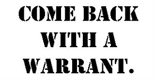
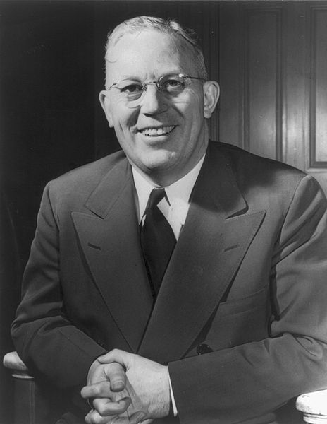

class: center, middle, inverse
background-image: url(https://www.unomaha.edu/university-communications/downloadables/campus-icon-the-o/uno-icon-color.png)
background-position: 95% 90%
background-size: 10%

# Civil Liability and Accountability

<br>
<br>
<br>

[Justin Nix](https://jnix.netlify.app)  
*School of Criminology and Criminal Justice*  
*University of Nebraska Omaha*

<br>
<br>
<br>
<br>
.white[November 25, 2025]

---
class: middle, center, inverse

# The 14th Amendment

---
class: top
background-image: url(we_the_ppl.jpg)
background-position: 94% 5%
background-size: 30%

# The 14th Amendment

</br>

<p style="text-align: right;">.small[Image by [ClaraDon](https://www.flickr.com/photos/florida_photo_guy/) on [Flickr](https://flic.kr/p/2jhRXa8), [CC BY-NC-SA 2.0](https://creativecommons.org/licenses/by-nc-sa/2.0/) ]</p>

</br>

>No State shall make or enforce any law which shall abridge the privileges or immunities of citizens of the United States; **nor shall any State deprive any person of life, liberty, or property, without due process of law**; nor deny to any person within its jurisdiction the **equal protection of the laws**.

---
class: middle, center, inverse

# Rules of Evidence

---
class: top

# Rules of Evidence

???

While the police have only the power to arrest, and not prosecute, rules of evidence are important because it is the police who are responsible for collecting evidence.
- The police have the primary responsibility for detecting and investigating crime, gathering evidence to present in court, and arresting suspects.
- **Rules of evidence** stipulate the requirements for introducing evidence
- If evidence is not collected properly, it can be declared inadmissible, in which case it cannot be used against a defendant.

--

[Weeks v. United States (1914)](https://www.oyez.org/cases/1900-1940/232us383)

</br>

```{r, echo=FALSE, fig.align='center', out.width = "50%"}

```

???

**Exclusionary rule** established in *Weeks v. United States*
- Weeks suspected of illegally sending lottery tickets through the mail
- Officers twice entered his home without a warrant and seized the evidence
- SCOTUS ruled unanimously that a warrantless seizure violates the 4th Amendment
  - To allow private documents to be seized and held as evidence against citizens would mean the 4th Amendment is of no value whatsoever. 
  - **HOWEVER** they didn’t incorporate this ruling to the state courts

---
class: top

# Rules of Evidence

--

What to do with *derivatives* of illegally obtained evidence? 

???

The exclusionary rule established in *Weeks* only applies to "primary" evidence.
- What should be done if the police seize a company's documents without a warrant, make copies of the documents, and use *that* as evidence to prosecute the CEO for tax fraud? 

- What should be done if a warrantless search produces a map that indicates where a homicide suspect has buried his victim's body? 
  - The map couldn't be used as evidence...but what about the body? 

--

- [Silverthorne Lumber Co. v. United States (1918)](https://caselaw.findlaw.com/us-supreme-court/251/385.html)

```{r, echo=FALSE, fig.align='center', out.width = "50%"}

```
<p style="text-align: center;">.small[[Image](https://flic.kr/p/ogSmC) by [jstreit](https://www.flickr.com/photos/jstreit/) on Flickr, [CC BY-NC-ND 2.0](https://creativecommons.org/licenses/by-nc-nd/2.0)]</p>

???

An indictment on a single specific charge led to Frederick Silverthorne's arrest. While he was in custody, DOJ representatives and a US Marhsal go sweep his office (without a warrant)
- They seize all the books, papers, documents, and take all employees to the US District Attorney's office
- They make photo copies of everything, and use the information gleaned to get a new indictment
- The District Court orders all the originals be returned, but impounds the photo copies
- Silverthorne is charged with contempt of court and fined $250 fo refusal to obey a subpoena
  - In which the Court ordered him to produce the original books and documents from his company before a grand jury
- **Key issue**: "Although of course its seizure was an outrage which the Government now regrets, it may study the papers before it returns them, copy them, and then may use the knowledge that it has gained to call upon the owners in a more regular form to produce them"
  - In other words, "that the protection of the Constitution covers the physical possession but not any advantages that the Government can gain over the object of its pursuit by doing the forbidden act"
- SCOTUS rules that to allow this would be to reduce the 4th Amendment to a form of words.

- This is now known as the **fruit of the poisonous tree doctrine.**
  - Which extends the exclusionary rule to derivatives of illegally obtained evidence. 
  
- **But importantly**, the Court's decision only applies in federal court. SCOTUS did not incorporate the Fruit of the Poisonous Tree Doctrine to the states. 

---
class: top

# Rules of Evidence

What to do with *derivatives* of illegally obtained evidence? 

- [Wolf v. Colorado (1949)](https://en.wikipedia.org/wiki/Wolf_v._Colorado)

```{r, echo=FALSE, fig.align='center', out.width = "50%"}

```
<p style="text-align: center;">.small[[Image](https://flic.kr/p/ogSmC) by [jstreit](https://www.flickr.com/photos/jstreit/) on Flickr, [CC BY-NC-ND 2.0](https://creativecommons.org/licenses/by-nc-nd/2.0)]</p>

???

Dr. Julius Wolf, Charles and Betty Fulton are charged with conspiracy to perform an abortion. 
- One of Wolf's patients had complications and ended up in the hospital
- Police seized his patient list without a warrant and contacted women who were on the list
- Wolf moved to supress this evidence, arguing that it would be inadmissible in a federal prosecution, which was a violation of **due process per the 14th Amendment**
- Supreme Court of Colorado upheld his conviction, arguing that the exclusionary rule was not required by the US Constitution, rather it was a remedy fashioned for use by the federal courts
- **Key issue for SCOTUS**: Are states required to exclude illegal seized evidence from trial under the 4th and 14th Amendments? 
  - Court rules 6-3 that **states do not have to adopt the exclusionary rule**
  - While this might be an effective way to deter unreasonable searches, other methods could be equally effective and would not fall below the minimal standards required by the Due Process Clause. 
      - Civil remedies like "internal discipline of the police, under the eyes of an alert public opinion" were sufficient, in the Court's view. 

---
class: top

# Rules of Evidence

What to do with *derivatives* of illegally obtained evidence? 

- [Mapp v. Ohio (1961)](https://www.oyez.org/cases/1960/236)

```{r, echo=FALSE, fig.align='center', out.width = "30%"}

```

???

**MAPP V. OHIO**
Cleveland police get a tip that a bombing suspect is hiding at Dollree Mapp’s house, as well as proof that Mapp was involved in illegal gambling racket
- 3 cops ask for permission to enter and search, but she says no
- 2 leave to go get a warrant, 1 stays behind and watches the house
- 3 hours later, 4 cop cars arrive. Police knock but don’t get an answer, so they kick in the door
- Mapp demands a warrant and they flash a piece of paper which she then stuffs in her shirt without looking at it
- They search the entire house and find the bombing suspect in a downstairs apartment
- In the basement they find betting slips, a pistol and pornographic books
- She gets cleared of the betting slips, but after refusing to testify in another case, they try to slap her with possession of obscene material 
- Mapp is convicted, but she appeals on the basis of freedom of expression (1st Amendment)

- **Key issue**: Were the confiscated items protected from seizure by the 4th Amendment, given that the search for the fugitive was admittedly illegal? 
  - Note that SCOTUS essentially brushes aside the 1st Amendment claim. 
  - Remember that in Weeks, Silverthorne, and Wolf, SCOTUS did not extend the Exclusionary Rule to states. 
  - This time, SCOTUS rules 6-3 that all evidence obtained from searches and seizures that violate the 4th Amendment is inadmissible in state court. 
  - Thus, they extended the Exclusionary Rule to states, arguing that states had not done a sufficient job protecting their citizens from police abuse. 

---
class: middle, center, inverse

# Exceptions

---
class: top
background-image: url(oops.png)
background-position: 95% 5%
background-size: 30%

## Good Faith Exception

</br>

???

***Allows evidence obtained through a search warrant to be admissible in court, even if it is later deemed invalid, if the police acted in good faith reliance on it.***

**US v Leon (1984)**: Cops get a search warrant following an informant's tip and surveillance. Later ruled invalid b/c it wasn't supported by PC. 
- Yet SCOTUS upheld the search because the officers acted in good faith. 

**Massachusetts v. Sheppard (1984)**: Boston police had a difficult time securing a warrant for a suspected murder because it was the weekend. Detective O'Malley prepares an affidavit listing the evidence he hopes to find at Shepphard's home. They settled on a warrant form they had previously used for controlled substances. Got a judge to review and sign it at his home, but the judge failed to list the items from the affidavit in the warrant. 
- Trial judge declared the warrant invalid because it lacked particularity 
- **but SCOTUS disagreed, saying the exclusionary rule is meant to deter police misconduct, not punish the errors of magistrates.**

**Arizona v. Evans (1995)**: During a stop for driving the wrong way on a one way, a Phoenix officer's computer shows an outstanding warrant. During the arrest, Evans drops a hand-rolled cigarette that smelled like marijuana, so officers search the vehicle and find a bag. When they charged him with possession of marijuana, the police were informed that the arrest warrant had been quashed 17 days earlier, and remained on the record due to a clerical error. 
- Evidence obtained from his search was admissible, because according to the Court, "there was no basis for believing that applying the exclusionary rule in these circumstances would have a significant effect on court employees responsible for letting police know that a warrant has been quashed."

--

## Independent Source Doctrine

</br>

???

Illegally obtained evidence can be introduced if it was initially discovered during an unlawful search, but **later obtained independently by lawful conduct that was untainted by the initial illegality** (see *Murray v. United States (1988)*)

--

## Inevitable Discovery

</br>

???

see *Brewer v. Williams (1984)* and the "Christian Burial Speech"
- Robert Williams (an escaped mental patient) is suspected of murdering 10y.o. Pamela Powers after kidnapping her from a Des Moines YMCA on Christmas Eve, 1968.
- As hundreds of cops and volunteers began to search the area for Pamela's body, Williams surrendered and was arraigned in Davenport.
- Two detectives drive him to Des Moines to meet with his lawyer, and during the drive suggest he should reveal where the body was before an impending snowstorm. Williams ultimately led them to the body.
- **Did Williams waive his Miranda rights?** **Was he denied his right to counsel?**
- Trial court convicted him of 1st degree murder, Iowa Supreme Court affirmed. 
- He petitioned for a writ of habeas corpus, and ultimately SCOTUS agreed to consider the constitutional issues.

**Illegally obtained evidence can be introduced if the prosecutor can prove that such evidence would have been lawfully discovered in the course of a routine, predictable investigation** 

--

## Evidence Admissible for Impeachment

???

*Harris v. New York*: Harris arrested for making 2 sales of heroin to an undercover officer. Before being Mirandized, he asid he made both sales at the request of the officer. This statement wasn't admitted into evidence at trial. But Harris later testifed that he did not make the first sale, and for the second sale it was actually baking powder. The prosecution then used Harris' initial statement in an attempt to impeach his credibility.
- SCOTUS ruled 5-4 that this did not violate Harris' 5th, 6th, and 14th Amendment Rights. Miranda does not mandate that evidence inadmissible against an accused person be barred **for all purposes** from the trial.
- The exclusionary rule *does not* prevent the government from introducing illegally gathered evidence to “impeach,” or attack the credibility of, defendants’ testimony at trial. The Supreme Court recognized this exception in *Harris v. New York (1970)* as a truth-testing device to prevent perjury. Even when the government suspects perjury, however, it may only use tainted evidence for impeachment, and may not use it to show guilt.

---
class: middle, center, inverse

# Civil Liability

---
class: top

# 42 USC Section 1983

--

Meant to hold officers liable for violating constitutional rights

- [Bivens v. Six Unknown Named Agents (1971)](https://www.oyez.org/cases/1970/301)

???

Six agents of the Federal Bureau of Narcotics forced their way into Webster Bivens' home without a warrant and searched.
- Handcuffed Bivens in front of his wife and children and arrested him on narcotics charges
- Later they interrogate him and strip search him
- Bivens sues the agents for 15K in damages each for humiliation and mental suffering
- District Court dismisses the case, US Court of Appeals for 2nd Circuit affirms that decision
- **Key Issue for SCOTUS**: Does violation of 4th Amendment protection against unreasonable search and seizure give rise to a federal claim for damages?
  - AND does governmental privilege extend to federal agents who clearly violate constitutional rights and act outside their authority? 
  - In a 6-3 decision, SCOTUS sides with Bivens. He can sue, though he must provide proof of his injuries. SCOTUS didn't address the 2nd question because the COA didn't consider it. But this case ultimately revealed that federal officers can be sued under 42 USC 1983. 

--

**Absolute Immunity**

???

Absolute - official cannot be sued under any circumstances (judges, prosecutors). But Bivens indicated federal law enforcement officers *can* be sued. 

--

**Qualified Immunity**

???

QI: a police officer cannot be sued for an *honest mistake* or a *lapse in judgment*
- *Unless the official's actions were* ***clearly established*** *as unconstitutional at the time!*

- Courts use the *objective reasonableness* standard
  - That is, did the officer violate *clearly established rights* of which a *reasonable person* would have known

A constitutional violation is *clear* only if a court in the relevant jurisdiction has previously concluded that very similar police conduct occurring under very similar circumstances was unconstitutional. 
- SCOTUS has, for example, applied QI in a case where an officer standing on an interstate overpass shot at a fleeing vehicle, something that not only contravenes best practices, but that the officer was not trained to do, a supervisor had explicitly instructed him not to do, and was unnecessary because officers under the overpass had set up stop strips and then taken appropriate cover. 
  - Nevertheless, because no court had previously reviewed such conduct and found it to be unconstitutional, the Court held that any violation was not clearly established and, thus, that the officer could not be sued for his actions.
- Essentially, QI "provides ample protection to all but the plainly incompetent or those who knowingly violate the law." 
  - Stoughton et al: "It protects *even* the plainly incompetent."

--

- Many, including the authors of [this article](https://www.theatlantic.com/ideas/archive/2020/06/how-actually-fix-americas-police/612520/), argue we should *get rid of qualified immunity*. 

- ***What do you think?***

---
class: middle, center, inverse

# Other External Accountability Measures

---
class: top

# Citizen Oversight

???

The idea behind citizen oversight is that it will produce:
- More thorough and objective investigations of complaints
- A higher rate of sustained complaints, and more disciplinary measures taken against guilty officers
- Greater **deterrence** of misconduct
- Higher levels of satisfaction on the part of complainants and the general public

--

## Civilian Input

</b>

???

Civilians receive and investigate complaints, but next steps are taken by police department

--

## Civilian Monitor

</b>

???

Complaints received by police department, and the process from beginning to end is monitored by an external unit. The unit monitors but does not make decisions. 

E.G., Federal Consent Decrees include a court-appointed monitor who is supposed to ensure the agency is making sufficient progress on agreed-upon reforms. 

At least [one study](https://doi.org/10.1080/07418825.2020.1733637) suggests that consent decrees reduce police killings by ~27%. 
- The author cautions however that the results are unstable - two outliers really influence the results. 

--

## Civilian Review

???

Group of citizens investigates complaints against the police, adjudicates the complaints, and recommends punishment. Typically, the chief still retains discretion in what to do (though unions have some power here too). 

---
class: top, center

# Have a great day! 😄

```{r, echo=FALSE, fig.align='center', out.width = "25%"}
knitr::include_graphics("robin.jpg")
```
<p style="text-align: center;">.small[[Image](https://upload.wikimedia.org/wikipedia/commons/5/59/Robin_Williams_Happy_Feet_premiere.jpg) by Eva Rinaldi, [CC BY-SA 2.0](https://creativecommons.org/licenses/by-sa/2.0), via Wikimedia Commons]</p>

### *No matter what people tell you, words and ideas can change the world.*

<div style="text-align: right"> - Robin Williams </div>

<!-- ```{css, echo=FALSE} -->
<!-- @media print { -->
<!--   .has-continuation { -->
<!--     display: block; -->
<!--   } -->
<!-- } -->
<!-- ``` -->

<style>
p.caption {
  font-size: 0.5em;
  color: lightgray;
}
</style>