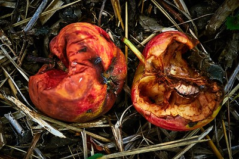
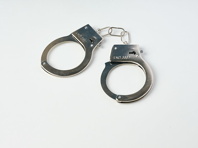
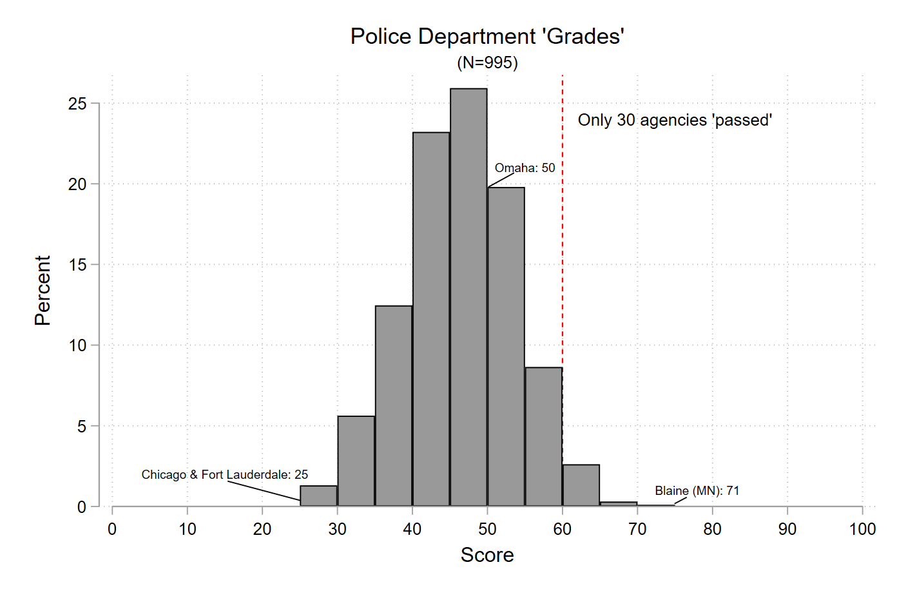
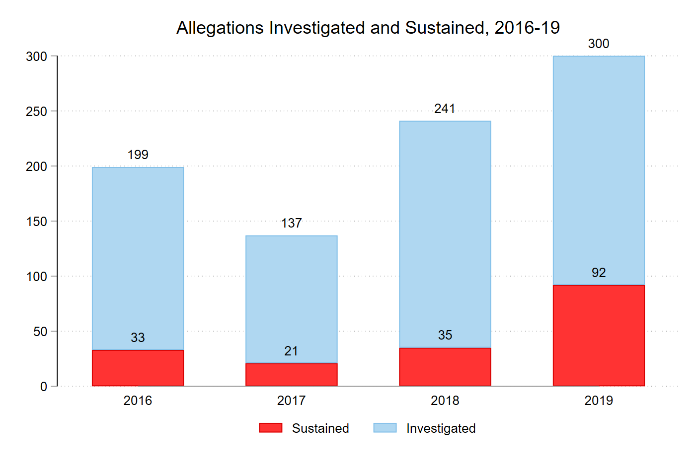

class: center, middle, inverse
background-image: url(https://www.unomaha.edu/university-communications/downloadables/campus-icon-the-o/uno-icon-color.png)
background-position: 95% 90%
background-size: 10%

# Deviance, Ethics, and Professionalism

<br>
<br>
<br>

[Justin Nix](https://jnix.netlify.app)  
*School of Criminology and Criminal Justice*  
*University of Nebraska Omaha*

<br>
<br>
<br>
<br>
.white[April 19, 2022]

---
class: middle, center

# Ever heard of the Rampart Scandal?

<iframe width="560" height="315" src="https://www.youtube.com/embed/MVBZ3YF800c" frameborder="0" gesture="media" allow="encrypted-media" allowfullscreen></iframe>

---
class: middle, center, inverse

# Okay, let's consider a few hypothetical scenarios.

.small[(From [Klockars et al., 2000](https://www.ojp.gov/pdffiles1/nij/181465.pdf))]

---
class: middle, center

## A police officer runs his own private business in which he sells and installs security devices, such as alarms, special locks, etc. He does this work during his off-duty hours.

---
class: middle, center

## A police officer routinely accepts free coffee from a merchant on his beat.

---
class: middle, center

## A police officer stops a motorist for speeding. The officer agrees to accept a personal gift of half of the amount of the fine in exchange for not issuing a citation.

---
class: middle, center

## A police officer is widely liked in the community, and on holidays local merchants and restaurant and bar owners show their appreciation for his attention by giving him gifts of food and liquor.

---
class: middle, center

## At 2:00 a.m., a police officer, who is on duty, is driving his patrol car on a deserted road. He sees a vehicle that has been driven off the road and is stuck in a ditch. He approaches the vehicle and observes that the driver is not hurt but is obviously intoxicated. He also finds that the driver is a police officer. Instead of reporting this accident and offense, he transports the driver to his home.

---
class: middle, center

## Two police officers on foot patrol surprise a man who is attempting to break into an automobile. The man flees. They chase him for about two blocks before apprehending him by tackling him and wrestling him to the ground. After he is under control, both officers punch him a couple of times in the stomach as punishment for fleeing and resisting.

---
class: middle, center

## A police officer has a private arrangement with a local auto body shop to refer the owners of cars damaged in accidents to the shop. In exchange for each referral, he receives payment of 5 percent of the repair bill from the shop owner.

---
class: middle, center, inverse

## Now, check out how a sample of ~3200 officers from 30 US police departments [felt about these scenarios](https://www.ojp.gov/pdffiles1/nij/181465.pdf).

---
class: middle, center

# What is *corruption*? 

--

# What is *deviance*?

---
class: middle, center, inverse

# Discovering Deviance

---
class: top

# Discovering Deviance

--

Police deviance and corruption rampant in the 18th Century

--

The [Wickersham Commission](https://www.ojp.gov/pdffiles1/Digitization/44540NCJRS.pdf) (1929)

- Reported widespread use of "the third degree"

???

Wickersham, or officially *National Commission on Law Observance and Enforcement*
- Commissioned by President Hoover, report released in 1931
- Primary author of the final report was August Vollmer
- Key findings
  - Use of the 3rd degree to coerce confessions was "extensively practiced across the country"
  - Widespread evasion of Prohibition laws; recommended more aggressive and extensive law enforcement to enforce compliance

--

</br>

The [Knapp Commission](https://iwpchi.files.wordpress.com/2019/12/knapp-commission-report-part-1.pdf) (1970)

- *Grass eaters* and *meat eaters*

???

*Knapp* was formed by Mayor John Lindsay of New York in response to a NYT article
- Findings
  - *Grass eaters* accept small gifts and engage in minor deviance, mostly in response to peer pressure
  - *Meat eaters* actively seek out opportunities to exploit their position
  
- Meat eating is more serious, grass eating is more commonplace

**Tom Barker** added to this typology
- *White knights* never cross the line
- *Straight shooters* are honest for the most part, but will overlook some of the misconduct around them
- *Rogues* are the most seriously deviant officers
  - Even meat eaters view rogues as extraordinarily corrupt
  - E.G., Two NYPD officers who worked as hitmen for the mob in the 1980s
  - Or LT Daniel Holtzclaw (OKC), who was convicted of 18 counts of rape and sentenced to 263 years in prison
  
--

</br>

The [Christopher Commission](https://web.archive.org/web/20110722124708/http://www.parc.info/client_files/Special%20Reports/1%20-%20Chistopher%20Commision.pdf) (1991)

- Repeat offenders and an organizational failure to monitor

???

From 1986 to 1990, in the years leading up to Rodney King beating, 1800 officers had received an excessive force complaint
- 1400 of those had just 1 or 2
- 183 had 4+
- 44 had 6+
- 16 had 8+
- One had 16

- To make matters worse, most of the officers who'd racked up 6+ complaints had received positive performance evaluations
  
---
class: middle, center, inverse

# Typologies of Deviance

---
class: top

# The Dark Side of Policing

[Kappeler, Sluder, and Alpert (1998)](https://www.ojp.gov/ncjrs/virtual-library/abstracts/forces-deviance-understanding-dark-side-policing-second-edition) identify four types of police deviance:

--

- Police crime

???

*Police crime* occurs when officers use their official powers to engage in criminal conduct
- E.G., entering private property with no legitimate reason, or unjustifiable homicide

--

</br>

- Occupational deviance

???

*Occupational deviance* refers to behavior that either doesn't conform to accepted standards of conduct or is not part of normal patrol work and is committed under the guise of police authority
- In other words, using one's position for personal gain
  - E.G., Committing theft from the evidence locker
  - E.G., helping a friend get a speeding ticket off of his driving record

--

</br>

- Police corruption

???

*Police corruption* is the misuse of police authority for *material reward or gain*
- E.G., skimming drugs from a big bust
- E.G., **accepting a cup of coffee**?

--

</br>

- Abuse of authority

???

*Abuse of authority* is a catchall category for other inappropriate conduct that does not necessarily amount to crime, deviance, or corruption.
- Three elements:
  - Physical abuse, via excessive force
  - Psychological abuse, via verbal assault, harassment, or ridicule
  - Violating constitutional, federal, or state rights

---
class: middle, center, inverse

# Explanations, Incidence, and Controls

---
class: top

# Explaining Police Deviance

--

## Rotten Apple Theory

How much deviance could be abated by incapacitating a few "bad apples?"

```{r, echo=FALSE, fig.align='center', out.width = "28%"}

```
<p style="text-align: center;">.small[[Image](https://flic.kr/p/g49hVW) by [Dani Mettler](https://www.flickr.com/photos/superfuzzbm/), [CC BY-SA 2.0](https://creativecommons.org/licenses/by-sa/2.0)]</p>

--

- Based on this study by [Chalfin & Kaplan (2021)](https://doi.org/10.1111/1745-9133.12542)...not much

--

  - However, accounting for [network spillovers](https://doi.org/10.1111/1745-9133.12545) can reap outsized benefits

---
class: top

# Explaining Police Deviance

## Environmental Factors

--

A corrupt political environment?

--

The socialization process?

--

For more specifics, see the factors listed in **Table 12-2** of your textbook

---
class: top

# How Common is Police Deviance?

--

```{r, echo=FALSE, fig.align='center', out.width = "25%"}

```
<p style="text-align: center;">.small[[Image](https://flic.kr/p/2kQ4LKN) by [Diverse Stock Photos](https://www.flickr.com/photos/192004829@N02/), [CC BY-NC 2.0](https://creativecommons.org/licenses/by-nc/2.0)]</p>

According to the [Henry A. Wallace Police Crime Database](https://policecrime.bgsu.edu/)...

--

- Nearly 11,000 police officers were arrested from 2005 to 2016

  - Employed by ~4100 agencies spread across all 50 states and Washington, DC

  - Upwards of 40% of these crimes involve acts of violence

---
class: top

# How Common is Police Deviance?

--

Phil Stinson's [research](https://clcjbooks.rutgers.edu/books/criminology-explains-police-violence/) suggests ~2% of officers are arrested at some point during their careers

- ~10% of those arrested between 2005 and 2011 were still working as police officers in 2017

--

See also Kane & White's [study of career-ending misconduct](https://doi.org/10.1111/j.1745-9133.2009.00591.x) in NYPD

--

- 1,543 officers were fired for misconduct from 1975-1996

  - < 2% of the 78K officers employed over the same period
  
--
  
- Most common forms of misconduct involved administrative offenses and drugs

???

Kane & White
- 1543 officers were involuntarily separated over a 20 year period
  - Compared against a random sample of police academy classmates who "served honorably"
- Those with a dad who worked for NYPD were slightly less likely to be involved in career-ending misconduct
  - As well as those with at least some college
- Black and Latino officers more likely to be involved in career-ending misconduct
  - As well as those who had more disciplinary infractions and citizen complaints

---
class: top

# How Common is Police Deviance?

--

Less serious forms of deviance are much harder to measure

--

Let's take a look at some [Police Scorecard](https://policescorecard.org/) data 👉 

```{r, echo=FALSE, fig.align='center', out.width = "95%"}
knitr::include_graphics("scorecard_method.png")
```

---
class: top

## Police Scorecard Data - Overall Scores

```{r, echo=FALSE, fig.align='center', out.width = "100%"}

```

---
class: top

## Police Scorecard Data - Accountability in Omaha

[Omaha](https://policescorecard.org/ne/police-department/omaha) scored 48% on accountability  
.small[(*Note*: Omaha was the **only** agency in Nebraska that provided enough data for Police Scorecard to evaluate)]

```{r, echo=FALSE, fig.align='center', out.width = "85%"}

```

---
class: top

# Controlling Police Deviance

Consider the *costs* and *anticipated benefits* of the following...

--

- [Screening out](https://doi.org/10.1177%2F0002716220901349) unfit applicants

--

- Implementing more [restrictive policies](https://doi.org/10.1080/07418825.2016.1147593)

--

- [Early warning systems](https://doi.org/10.1177%2F1098611100003002001)

--

- Treating employees [fairly](https://doi.org/10.1177%2F0093854810397739)

???

Org. Justice - Wolfe & Piquero used survey data from Philadelphia to show that OJ was associated with less adherence to the *code of silence* and less agreement that *noble cause corruption* is justified. 
- OJ also asociated with fewer citizen complaints, IAD investigations, and disciplinary charges

--

- Outfitting all officers with [body-worn cameras](https://journals.sagepub.com/doi/full/10.1177/1362480620973775)

--

- Entering into [consent decrees](https://www.annualreviews.org/doi/abs/10.1146/annurev-criminol-030920-102432)

--

- [Investing less](https://slate.com/news-and-politics/2022/04/increased-police-spending-leads-to-more-misdemeanor-arrests.html) in policing

--

***Which do you think would see the greatest return on investment?***

---
class: top, center

# Have a great day! 😄

```{r, echo=FALSE, fig.align='center', out.width = "25%"}

```

### *Corruption is a cancer: A cancer that eats away at a citizen's faith in democracy, diminishes the instinct for innovation and creativity.*

<div style="text-align: right"> - President Joe Biden </div>

<!-- ```{css, echo=FALSE} -->
<!-- @media print { -->
<!--   .has-continuation { -->
<!--     display: block; -->
<!--   } -->
<!-- } -->
<!-- ``` -->

<style>
p.caption {
  font-size: 0.5em;
  color: lightgray;
}
</style>