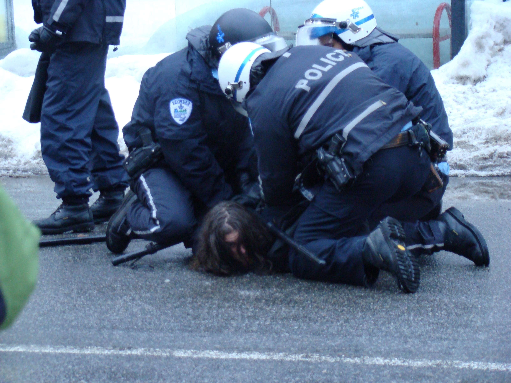

class: center, middle, inverse
background-image: url(https://www.unomaha.edu/university-communications/downloadables/campus-icon-the-o/uno-icon-color.png)
background-position: 95% 90%
background-size: 10%

# Police Use of Force

<br>
<br>
<br>

[Justin Nix](https://jnix.netlify.app)  
*School of Criminology and Criminal Justice*  
*University of Nebraska Omaha*

<br>
<br>
<br>
<br>
.white[May 5, 2025]

---
class: middle, center, inverse

# Defining (and measuring)
# **use of force**

---
class: top

# What is it?

```{r, echo=FALSE, fig.align='center', out.width = "75%"}

```
<p style="text-align: center;">.small[[Image](https://flic.kr/p/4ytvDE) by [Yannick Gingras](https://www.flickr.com/photos/ygingras/), [CC BY-SA 2.0](https://creativecommons.org/licenses/by-sa/2.0)]</p>

???

Individual agencies are free to define for themselves which behaviors constitute "force" and are therefore regulated by the agency's use-of-force policy (Stoughton et al., p. 99). 

- OPD [defines it](https://public.powerdms.com/OPDEP1/tree/documents/838867) as *any physical effort to control or restrain a subject, or to overcome the resistance of a subject*.

***What behaviors do you consider to be a use of force?***
- Firearm, taser, baton, OC spray, K9...these are all obvious
- What about "takedowns?"
  - Pointing (but not shooting) the firearm?
  - Arrests? (Given the OPD definition...)
  - Vehicular pursuit?
  - Verbal commands?

*Lethal or deadly force* vs. *less than lethal* force

---
class: top

# When is use of force **excessive**?

???

**According to IACP**, excessive force is "the application of an amount and/or frequency of force *greater than that required to compel compliance* from a willing or unwilling subject.

--

Can attempt to measure via a *force factor*

| Resistance level                                                            	| Force level                             	|
|:----------------------------------------------------------------------------	|:----------------------------------------	|
| None/cooperative                                                            	| Police presence and/or verbal direction 	|
| Verbal noncompliance, passive resistance, and/or psychological intimidation 	| Strong verbal order (minimal contact)   	|
| Defensive resistance and/or attempted to flee                               	| Hands or feet (defensive) or OC spray   	|
| Active resistance                                                           	| Hands or feet (offensive)               	|
| Aggravated active resistance                                                	| Less lethal weapon                      	|
| Active resistance (with a deadly weapon)                                    	| Deadly force                            	|

.small[See [Terrill et al. (2003:155)](https://journals.sagepub.com/doi/pdf/10.1177/1098611103006002002)]

---
class: middle, center, inverse

# Evaluating police use of force

## (h/t to [Seth Stoughton, Jeff Noble, & Geoff Alpert](https://nyupress.org/9781479814657/evaluating-police-uses-of-force/))

---
class: top

# The Constitutional Law Standard

--

## [Tennessee v. Garner (1985)](https://www.policinglaw.info/assets/downloads/US_Supreme_Court_Tennessee_v._Garner_1985.pdf)

--

<iframe width="560" height="315" src="https://www.youtube.com/embed/4bCPKjIpTUY" title="YouTube video player" frameborder="0" allow="accelerometer; autoplay; clipboard-write; encrypted-media; gyroscope; picture-in-picture" allowfullscreen></iframe>

???

SCOTUS applied the 4th Amendment in the context of a police shooting. 
- Previously, federal courts had taken different approaches, including:
  - 8th Amendment (cruel and unusual punishment)
  - 5th & 14th Amendments (depriving liberty without due process)
  
- **Implication**: deadly force is only permissible when:
  - It is necessary to prevent the suspect's escape **and**
  - The officer has **probable cause** to believe that the suspect poses a **serious threat of death or serious physical injury** to others

---
class: top

# The Constitutional Law Standard

## [Graham v. Connor (1989)](https://apps.oyez.org/player/#/rehnquist3/oral_argument_audio/19082f)

--

<iframe width="560" height="315" src="https://www.youtube.com/embed/ZO8jGsyx4zY" title="YouTube video player" frameborder="0" allow="accelerometer; autoplay; clipboard-write; encrypted-media; gyroscope; picture-in-picture" allowfullscreen></iframe>

???

Implications:

- Excessive force claims must be judged by the 4th Amendment's reasonableness clause
  - Should be based on the perspective of a **reasonable officer** on scene, **not 20/20 hindsight**
  - Because situations are "tense, uncertain and rapidly evolving"
  
- **Graham factors**
  - Severity of the crime
  - Threat posed by the subject
  - Whether the subject is resisting or attempting to flee
  
---
class: top

--

# The State Law Standard

???

State statutes and common law doctrines can explicitly authorize police officers to engage in what would otherwise be criminal or tortious behavior (p. 67)
- They can also exempt officers from otherwise applicable restrictions, or provide officers with defenses to civil liability or criminal sanctions

--

## Justifications for less-lethal force

--

- To make an arrest (37 states)

--

- To prevent an arrestee from escaping (24 states)

--

- To defend the officer or others (18 states)

???

Most states use "reasonably necessary" language
- Four use "reasonable" only and two use "necessary" only

--

- In North Dakota, force is justified when "required or authorized by law"
  
---
class: top

# The State Law Standard

--

## Justifications for deadly force

--

- The *fleeing felon* approach (4 states)

???

Alabama, Florida, Mississippi, and South Dakota still maintain the fleeing felon rule. 

--

- "Partially restrictive" approaches...

???

Partially restrictive approaches fall between *fleeing felon* and *Garner Rule* 

- Violent felonies/use or threatened use of deadly force (24 states)
- Certain crimes (3 states)
- Future threats (19 states)
- Escaping, armed subjects (6 states)
- Information forcing (Rhode Island)
  - Requires that the person to be arrested is aware a peace officer is trying to arrest him or her
- *Convicted* felons (North Carolina)
- Combinations

--

- The "Garner Rule" approach (25 states)

--

- Additional restrictions...

???

Some statutes adopt a partially restrictive or Garner approach, and add additional restrictions. 

- Risk to innocent persons (i.e., only when there is "no substantial risk of injury to innocent persons")
- Suicidal subjects
- Actual resistance
- Exhaustion requirements
- Information-forcing requirements (e.g., for officers to inform subjects of their identity and/or intent to arrest)
- Limitations on predicate crime (e.g., not if the only offense is a motor vehicle violation)

--

- Idiosyncrasies...

--

  - Nebraska authorizes lethal force *after the rioters or mutineers have been ordered to disperse and warned, in any manner that the law may require, that such force will be used if they do not obey* [(Neb. Rev. Stat. 28-1412(7)(b)(ii))](https://nebraskalegislature.gov/laws/statutes.php?statute=28-1412)
  
???

Nine states have similar statutes, though others (e.g., Arizona & Washington) stipulate that the rioter be "armed with a deadly weapon"

---
class: top

# The State Law Standard

--

Two key questions for evaluating uses of force under state law

</br>

--

- Does state law apply to what the officer did?

--

- Did state law authorize the officer to take the action or cause the harm under the circumstances? 

???

Constitutionality of force can be entirely distinct from whether it violated state law
- Although the constitution limits gov't authority, it does not require states to impsoe civil liability or criminal punishment on officials who exceed those limits (p. 68)

---
class: top 

# The Administrative Standard

--

Individual agencies are free to define for themselves which behaviors constitute "force" and are therefore regulated by the agency's use-of-force policy

--

Use of force models often fit into one of three categories:

--

- Incremental models

--

- Situational tactical options models

--

- Situational behavior models

---
class: top

# The Administrative Standard

## Download OPD's policy [here](https://public.powerdms.com/OPDEP1/tree/documents/838867)

```{r, echo=FALSE, fig.align='center', out.width = "65%"}
knitr::include_graphics("opd_uof.png")
```

---
class: top

# The Community Expectations Standard

--

Less formal, requires no triggering event

--

Most people are [not cognizant of legal standards](https://heinonline.org/HOL/P?h=hein.journals/jclc105&i=314)

--

Conflating the justifications for the encounter and the use of force

--

The necessity of force

--

- Criticisms based on perfect information

--

- Criticisms of avoidable force

--

- Criticisms of excessive force

---
class: middle, center, inverse

# How often does it happen?

---
class: top

# Prevalence of less-than-lethal force

--

About 61.5 million people had at least one [contact with police in 2018](https://bjs.ojp.gov/content/pub/pdf/cbpp18st.pdf)

--

- 2% of them were subjected to force or the threat of force by officers

--

- (N ~ 1.25 million)

--

  - Most incidents fell on the lower end of the continuum 👉 threats, handcuffing, and pushing/grabbing/hitting/kicking
  
--
  
  - Pointing/shooting gun 👉 0.3%
  
---
class: top

# Prevalence of deadly force

I discussed this and more in my recent *Curious People* [lecture](https://www.unomaha.edu/community-engagement-center/news/events/2022/04/curious-people-april2022.php)

```{r, echo=FALSE, fig.align='center', out.width = "70%"}
knitr::include_graphics("curious_ppl.png")
```

👉 *Let's flip over to* [*those slides*](https://jnix.netlify.app/slides/curious_ppl_2022/#1)

---
class: top, center

# Have a great day! 😄

```{r, echo=FALSE, fig.align='center', out.width = "25%"}

```

### *The police are nothing else than a mechanism for the distribution of situationally justified force in society.*

<div style="text-align: right"> - Egon Bittner </div>

<!-- ```{css, echo=FALSE} -->
<!-- @media print { -->
<!--   .has-continuation { -->
<!--     display: block; -->
<!--   } -->
<!-- } -->
<!-- ``` -->

<style>
p.caption {
  font-size: 0.5em;
  color: lightgray;
}
</style>