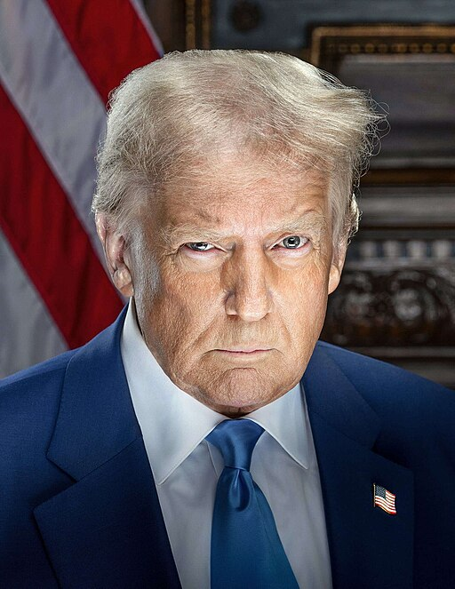
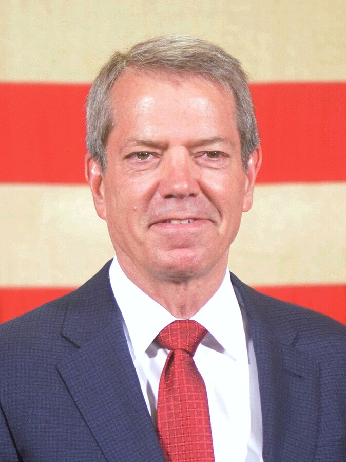
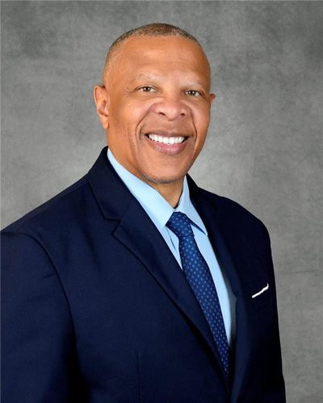

class: center, middle, inverse
background-image: url(https://www.unomaha.edu/university-communications/downloadables/campus-icon-the-o/uno-icon-color.png)
background-position: 95% 90%
background-size: 10%

# Chapter 2:  
# Policing in the American Context

<br>
<br>

[Justin Nix](https://jnix.netlify.app)  
*School of Criminology and Criminal Justice*  
*University of Nebraska Omaha*

<br>
<br>
<br>
.white[September 9, 2025]

---
class: middle

> *If there is a fact whose pathological nature appears indisputable, it is crime. All criminologists agree on this score. Although they explain this pathology differently, they none the less unanimously acknowledge it.*

--

> *Crime is not only observed in most societies of a particular species, but in all societies of all types. There is not one in which criminality does not exist, although it changes in form and the actions which are termed criminal are not everywhere the same. Yet everywhere and always there have been men who have conducted themselves in such a way as to bring down punishment upon their heads.*

--

> *Crime is normal because it is completely impossible for any society entirely free of it to exist.*

<div style="text-align: right"> - Émile Durkheim, The Rules of Sociological Method, pp. 97-99 </div>

???

Do you agree or disagree? Why?

**Durkheim even suggests crime can be beneficial! How?**

- By establishing the bounds of acceptable behavior. When we see someone punished for violating laws/norms, it reaffirms to us that the behavior in question is unacceptable. 

---
class: middle, center

# Let's apply this thinking to the latest viral video...

--

## Is this behavior **criminal**? 

<iframe width="560" height="315" src="https://www.youtube.com/embed/fiCnrPleU3k?si=pS8NIQWb0n5p2y6N" title="YouTube video player" frameborder="0" allow="accelerometer; autoplay; clipboard-write; encrypted-media; gyroscope; picture-in-picture; web-share" referrerpolicy="strict-origin-when-cross-origin" allowfullscreen></iframe>

???

No crime committed here, but most of the Internet seems to agree it was **deviant** behavior. 

- Perhaps fans at the games this week will be more likely to give a foul ball to a nearby child?

Note I could've used the Coldplay Concert video here but I was sick of it after the first day.
- Takeaway is either:
  - Don't cheat, or
  - Play it cool when you show up on the jumbotron

---
class: middle, center

# The Functionalist Perspective on Crime and Deviance

<iframe width="560" height="315" src="https://www.youtube.com/embed/j7y__PNf3no?si=neMrCYSoQHie5-0C" title="YouTube video player" frameborder="0" allow="accelerometer; autoplay; clipboard-write; encrypted-media; gyroscope; picture-in-picture; web-share" referrerpolicy="strict-origin-when-cross-origin" allowfullscreen></iframe>

???

Your textbook says that “democracy ensures that a certain amount of crime is inevitable.” 

Durkheim actually goes a step further and says crime is normal; it's impossible for any society entirely free of it to exist. 

- **Why?** 
  - There will always be those that go against the status quo
  - And particularly in a democracy, we are concern about people’s rights and privacy, which vastly restricts the power of the police and the government
  
---
class: top

# Policing in a Democracy

--

- Democracy = "Rule by the people"

--

- Policing in a democracy = *by consent*

--

```{r, echo=FALSE, fig.align='center', out.width = "35%"}
knitr::include_graphics("scales.png")
```
--

- .small[“…is subject to the rule of law embodying values respectful of human dignity, rather than the wishes of a powerful leader or party; can *intervene in the life of citizens only under limited and carefully controlled circumstances*; and is publicly accountable…”]

???

Can you think of any examples of how police authority to intervene in our lives is limited? 
- **4TH AMMENDMENT**
  - Protects us from unreasonable searches and seizures
  - Under most circumstances, warrant required to enter private residences, conduct searches, seize evidence

---
class: top

# Policing in a Democracy

--

- The US is a *representative democracy*

???

**Representative democracy**: we elect officials to represent our interests

--

- Adheres to [federalism](https://constitutioncenter.org/interactive-constitution/learning-material/federalism)

???

**Shared power**
- Strong federal government makes laws, but states also have the power to make their own 
- (but see supremacy clause — Article VI, Clause 2 of the United States Constitution)

--

  - A union of self-governing states
  
--

  - Dual federalism
  
???

**Dual Federalism**
- Only powers vested in fed government are those explicitly detailed in the Federal Constitution. Other powers are left to the states to decide
  
--

  - But see *Supremacy Clause* [(Article VI, paragraph 2)](https://constitutioncenter.org/interactive-constitution/interpretation/article-vi/clauses/31)
  
--

  - US is more of a *cooperative federalism*
  
???

Really we have a **cooperative federalism** structure
  - The lines between fed and state power are somewhat blurry
  - Fed govt has a lot of power over states (e.g., Interstate Commerce clause)
  
--

- This structure defines the three *levels* of US policing

--

  - Federal, state, and local
  
--

***Why not have a single, centralized police force?***

???

- Federalism
- It's impractical
- Early fear of policing being more or less a military regime

---
class: top

# Police Organizational Environment

--

Agencies operate in an environment characterized by *competing interests and priorities*

???

If you're the Chief of the Omaha Police Department, who is the #1 influencer of the way you run your agency? 

--

- The community

???

- Elections, review boards, filing complaints, reporting crimes

--
  
  - Not a monolith

--

- Elected officials
  
--

- The media

--

- Professional organizations, training institutes, and think tanks

--

<br>
What percentage of Americans express [confidence in the police](https://news.gallup.com/poll/1597/confidence-institutions.aspx)?

---
class: top

## The Community

--

<iframe title="% of Americans who have &quot;a great deal&quot; or &quot;quite a lot&quot; of confidence in the police" aria-label="Interactive line chart" id="datawrapper-chart-6yuWq" src="https://datawrapper.dwcdn.net/6yuWq/2/" scrolling="no" frameborder="0" style="width: 0; min-width: 100% !important; border: none;" height="423" data-external="1"></iframe><script type="text/javascript">!function(){"use strict";window.addEventListener("message",(function(a){if(void 0!==a.data["datawrapper-height"]){var e=document.querySelectorAll("iframe");for(var t in a.data["datawrapper-height"])for(var r=0;r<e.length;r++)if(e[r].contentWindow===a.source){var i=a.data["datawrapper-height"][t]+"px";e[r].style.height=i}}}))}();
</script>

???

I've shown you this before, but reminder: this is a Gallup Poll that has been conducted every summer since 1993. 
- The line is the % of American adults who have *a great deal* or *quite a lot* of **confidence in the police**.

- Roughly 1,000 adults from all 50 states + DC

- **What is most notable to you about this graph??**

---
class: top

## The Community

--

<iframe title="Americans' Confidence in Institutions" aria-label="Interactive line chart" id="datawrapper-chart-pLzzH" src="https://datawrapper.dwcdn.net/pLzzH/1/" scrolling="no" frameborder="0" style="width: 0; min-width: 100% !important; border: none;" height="400" data-external="1"></iframe><script type="text/javascript">!function(){"use strict";window.addEventListener("message",(function(e){if(void 0!==e.data["datawrapper-height"]){var t=document.querySelectorAll("iframe");for(var a in e.data["datawrapper-height"])for(var r=0;r<t.length;r++){if(t[r].contentWindow===e.source)t[r].style.height=e.data["datawrapper-height"][a]+"px"}}}))}();
</script>

???

Here, I've included Americans' confidence in other institutions over the same period. 

**What stands out?**

---
class: top

## The Community

--

- Those percentages mask a lot of variation

--

- How do you think the following *individual characteristics* are related to *confidence in police*?

--
  
  - Race
  
???

- Historically lower among non-whites
- Black and Hispanic confidence in police took a hit after Ferguson, White confidence did not. 

--

  - Age
  
???

- Younger people tend to have less confidence in police
  - Young confidence also took a hit post-Ferguson; meanwhile old confidence increased
  
--

  - Gender
  
???

- Pretty mixed; no clear relationship
  
--

  - Political ideology
  
???

- Liberal confidence took a hit post-Ferguson; conservative confidence increased
- The party gap widened post-Ferguson as well
- This reflects the broader trend that conservatives tend to lean crime control and liberals tend to lean due process.
  
---
class: top

## The Community

--

- [Adam Fine et al. (2020)](https://link.springer.com/article/10.1007/s11292-020-09438-7) show that among Black children, perceived police legitimacy falls every year [between the ages of 7 and 14](https://theconversation.com/kids-perceptions-of-police-fall-as-they-age-for-black-children-the-decline-starts-earlier-and-is-constant-145511)

```{r, echo=FALSE, fig.align='center', out.width = "80%"}
knitr::include_graphics("fine_study.png")
```

???

**Why do you think this is?**

**What are the implications of this for...**

  - Increasing trust and legitimacy?
  
  - Diversification of policing? 
  
---
class: top

## Elected Officials

--

### Executive influence

--

  - How does POTUS influence policing?

.pull-left[  
```{r, echo=FALSE, fig.align='center', out.width = "70%"}
knitr::include_graphics("biden.jpg")
```
]

.pull-right[
```{r, echo=FALSE, fig.align='center', out.width = "70%"}

```
]

???

POTUS appoints the federal agency heads (DOJ, DHS)

- Some, like COPS Office, decide how to distribute federal funding opportunities

Also indirectly influences policing by appointing SCOTUS justices

---
class: top

## Elected Officials

### Executive influence

--

  - How do governors influence policing?
  
```{r, echo=FALSE, fig.align='center', out.width = "30%"}

```

???

Governor sets policy and spending priorities for the state

- In some cases, s/he appoints the head of the state police department(s)
- In Missouri, the governor appoints members of the *Board of Police Commissioners*, who in turn oversee the KCPD.

---
class: top

## Elected Officials

### Executive influence

--

  - How do mayors and city council members influence policing?
  
```{r, echo=FALSE, fig.align='center', out.width = "25%"}

```
--

  - Council-manager form  
  - Mayor-council form

???

- **Council-manager**: the council makes decisions, and the mayor votes along with the members. City manager runs city operations.

- **Mayor-council**: No city manager. Mayor is responsible for operations.

  - Strong mayor - limitless authority
  - Weak mayor - serves city council
  
---
class: top

## Elected Officials

### Legislative influence

???

**Legislators** don't directly set police budgets, but they do influence them by enacting legislation that provides funding (for whatever they perceive to be priorities)

--

- E.G., Clinton's [Violent Crime Control and Law Enforcement Act (1994)](https://www.ncjrs.gov/txtfiles/billfs.txt)

--

- Created the [COPS Office](https://cops.usdoj.gov/)

--

### Judicial influence

???

Judicial oversight determines when police have abused their authority, and impacts the **outer limits of enforcement**, which we'll discuss more later in the semester.

--

- E.G., landmark SCOTUS decisions

???

***In what ways have the courts impacted policing in the last ~50 years?***

- Legality of terry stops
- Exceptions to the warrant requirement
- Police use of force
- Note that many cases that don't make it to SCOTUS remain binding in their state or federal circuit

--

  - We'll cover several over the course of the semester

---
class: top

## The Media

--

### Film and Television

--

<details>
  <summary>What are some of your favorite fictional movies that depict police characters?</summary>

  <br>
  
  Some of mine are <em>Beverly Hills Cop, Die Hard, Training Day, The Departed,</em> and <em>Blue Streak</em>
</details>

--

<br>

<details>
  <summary>What about television shows?</summary>

  <br>
  
  My favorites were <em>The Wire</em>, <em>Brooklyn Nine-Nine</em>, and <em>Reno 911!</em>
  
  And don't forget reality shows like <em>COPS</em> and <em>Live PD</em>
</details>

--

<br>

- ***Do you think these depictions influence our expectations of the police?***

---
class: top

## The Media

### News media

--

- Journalism helps hold government officials, including police, accountable

--

- [WAPO](https://www.washingtonpost.com/graphics/investigations/police-shootings-database/) has been tracking fatal police shootings since 2015

--

- The public gets [information about crime](https://doi.org/10.1177%2F0002716295539001011) from the news

```{r, echo=FALSE, fig.align='center', out.width = "35%"}
knitr::include_graphics("headline.png")
```

--

- ***In general, do you think the news media accurately portrays crime and policing?***

???

**Impression management**
- Many agencies operate their own social media pages, enabling them to circumvent the news media (e.g., Cheng 2021). 

- ***Do you agree with this practice?***

---
class: top
background-image: url(https://upload.wikimedia.org/wikipedia/commons/b/bf/Socialmedia-pm.png)
background-position: 95% 5%
background-size: 40%

## The Media

### Social media

--

- Viral videos

  - E.G., Eric Garner, Walter Scott, Philando Castile, George Floyd
  
--

- Helps social movements gain traction

  - E.G., #BlackLivesMatter, #MeToo

--

- Can also spread misinformation

```{r, echo=FALSE, fig.align='center', out.width = "30%"}
knitr::include_graphics("misinfo_meme.jpg")
```

---
class: top

## Professional Organizations

--

- [International Association of Chiefs of Police](https://www.theiacp.org/)

???

IACP is one of the largest professional organizations in the world. Founded in 1893 and has over 20K members from 89 countries.
- Annual conference with panels on technology, training, evidence-based practices, etc. 
- Research Center
- Police Chief Magazine

--

- [Major Cities Chiefs Association](https://majorcitieschiefs.com/)

???

MCCA is comprised of the 50 largest cities in the US and the 7 largest in Canada
- Holds two conferences per year
- Pushes out publications, survey results

--

- [American Society of Evidence-Based Policing](https://www.americansebp.org/)

```{r, echo=FALSE, fig.align='center', out.width = "45%"}
knitr::include_graphics("more_data.jpg")
```

???

ASEBP founded much more recently, circa 2015.
- Pushing to formalize evidence-based policing, i.e., agencies have a moral responsibility to follow the science.
- Annual conference, usually in a city with a strong criminology department
- Most of the executive board hold PhDs

---
class: top

## Training Institutes

--

- [FBI National Academy](https://www.fbi.gov/services/training-academy/national-academy)

???

FBI NA was founded in 1935 and is based in Quantico VA
- Runs a 10-wk course for managers nominated by their agency heads
- Covers intelligence theory, terrorism, law, forensics, leadership...

--

- [Southern Police Institute](https://louisville.edu/spi)

???

SPI was founded in 1951 and is housed at the University of Louisville.
- For mid-level managers
- Has two different courses, 10/12 weeks

--

- [Federal Law Enforcement Training Center](https://www.fletc.gov/)

???

FLETC is operated by DHS and is based in Glynco GA
- Courses on firearms, tactics, driving, investigations
- Hosts periodic summits that include presentations and roundtables with researchers

--

## Think Tanks

--

- [Police Executive Research Forum](https://www.policeforum.org/)

???

PERF is a nonprofit founded in 1976
- Research and policy organization
- Provides management services, technical assistance, and executive-level education to agencies
- Pushes out periodic reports

--

- [National Policing Institute](https://www.policinginstitute.org/)

???

NPF is a nonprofit founded in 1970 that did some of the earliest evaluations of police practices (e.g., KC Patrol Experiment)
- I collaborated with them in 2018 on a report analyzing a spike in shootings by the Phoenix Police Department

---
class: top, center

# Have a great day! 😄

```{r, echo=FALSE, fig.align='center', out.width = "30%"}
knitr::include_graphics("mandela.jpg")
```

### *It always seems impossible till it is done.*

<div style="text-align: right"> - Nelson Mandela </div>


<!-- ```{css, echo=FALSE} -->
<!-- @media print { -->
<!--   .has-continuation { -->
<!--     display: block; -->
<!--   } -->
<!-- } -->
<!-- ``` -->

