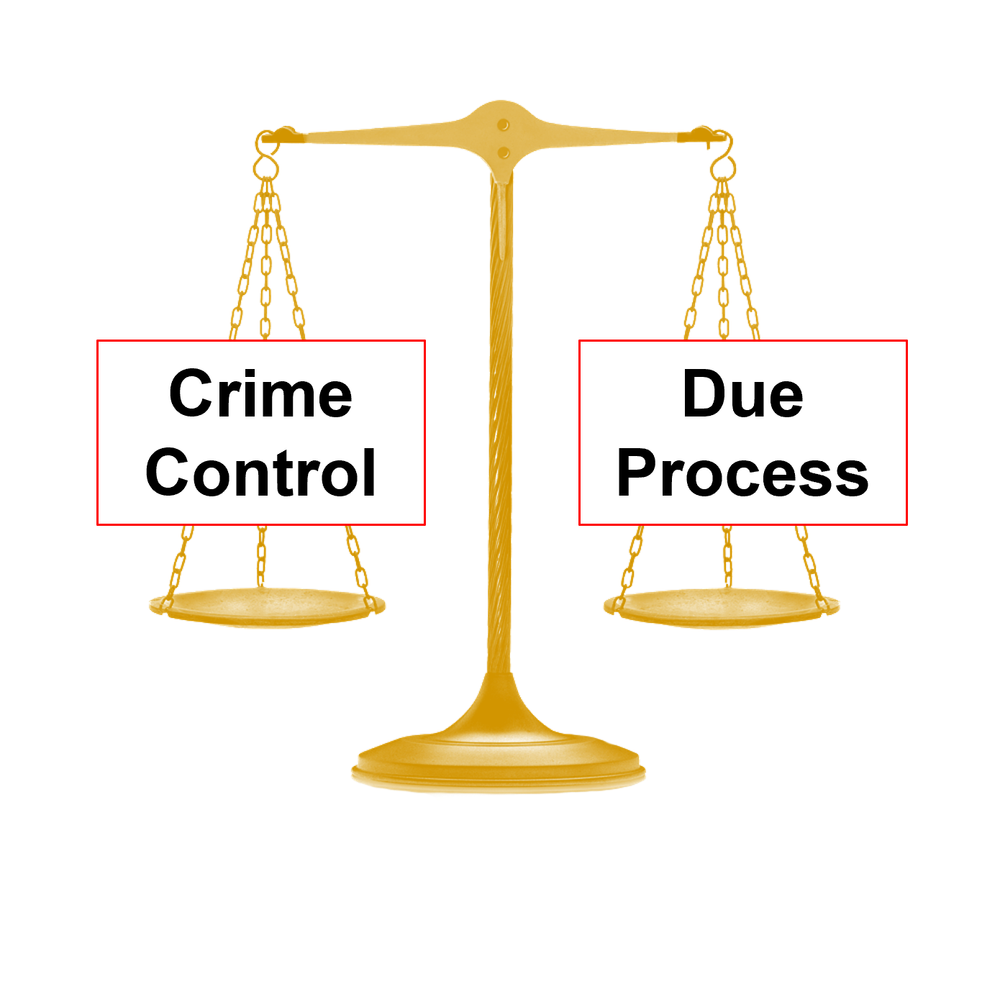
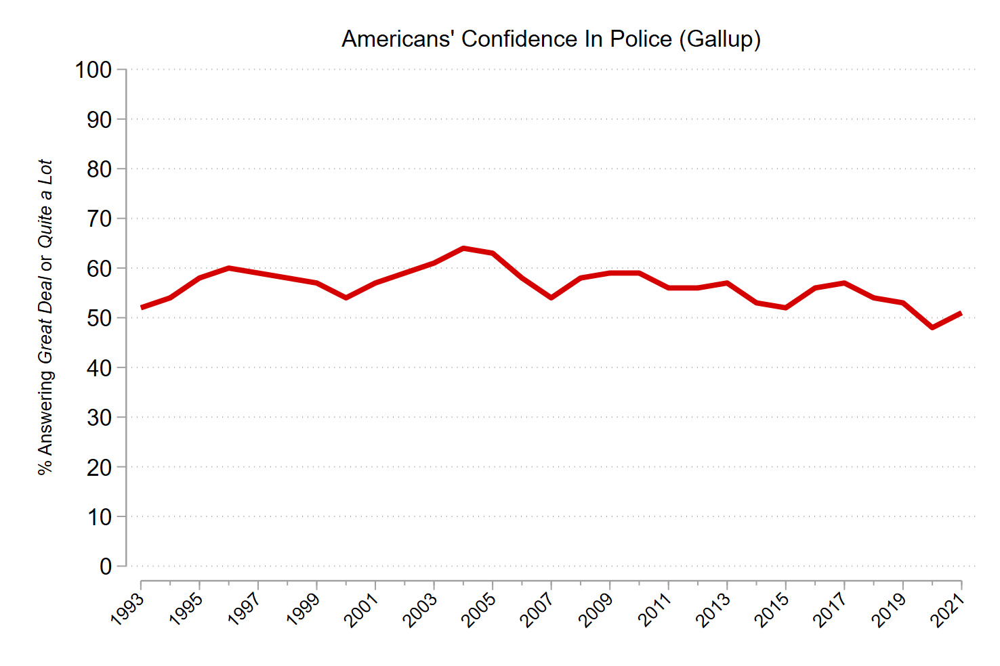
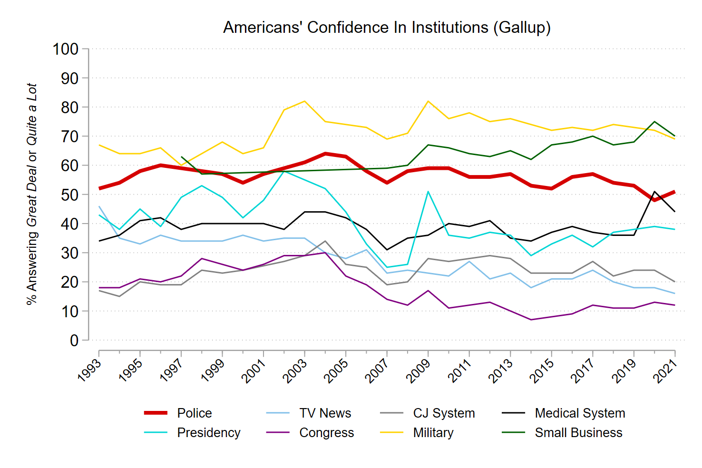
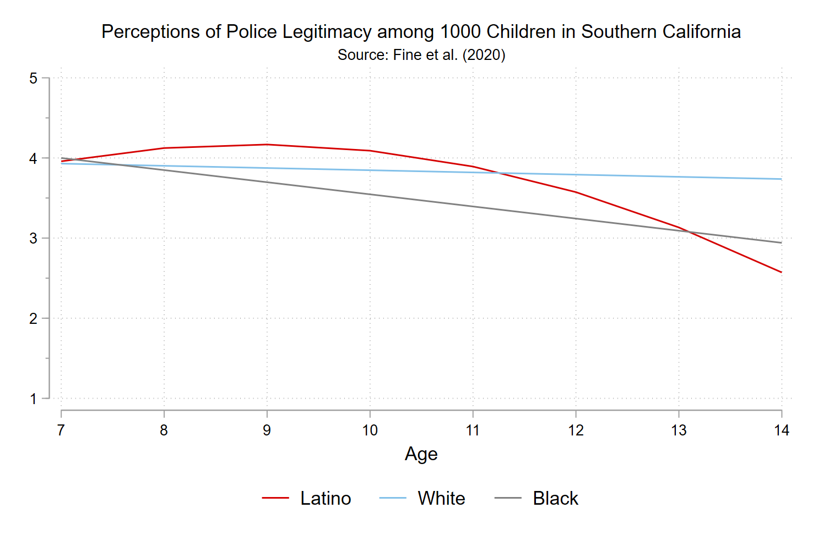
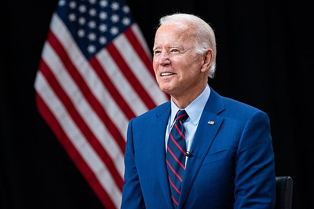
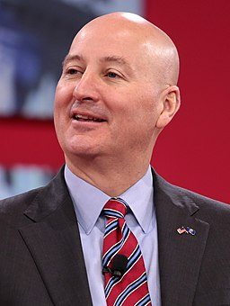
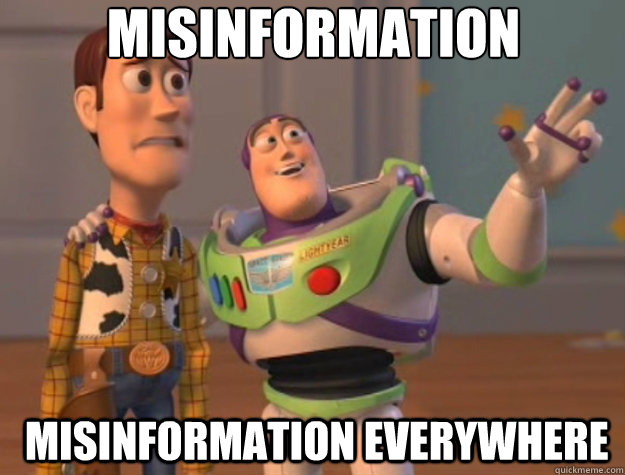
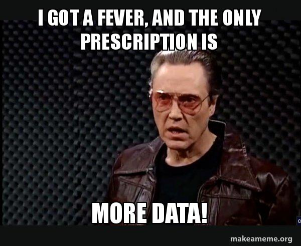
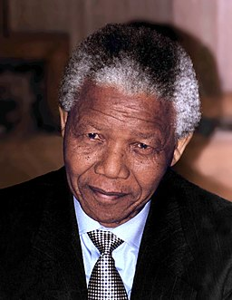

class: center, middle, inverse
background-image: url(https://www.unomaha.edu/university-communications/downloadables/campus-icon-the-o/uno-icon-color.png)
background-position: 95% 90%
background-size: 10%

# Chapter 2:  
# Policing in the American Context

<br>
<br>

[Justin Nix](https://jnix.netlify.app)  
*School of Criminology and Criminal Justice*  
*University of Nebraska Omaha*

<br>
<br>
<br>
.white[February 8, 2022]

---
class: top

# Policing in a Democracy

--

- Democracy = "Rule by the people"

--

- Policing in a democracy = *by consent*

--

```{r, echo=FALSE, fig.align='center', out.width = "35%"}

```
--

- .small[“…is subject to the rule of law embodying values respectful of human dignity, rather than the wishes of a powerful leader or party; can *intervene in the life of citizens only under limited and carefully controlled circumstances*; and is publicly accountable…”]

---
class: top

# Policing in a Democracy

--

- The US is a *representative democracy*

--

- Adheres to [federalism](https://constitutioncenter.org/interactive-constitution/learning-material/federalism)

--

  - A union of self-governing states
  
--

  - Dual federalism
  
--

  - But see *Supremacy Clause* [(Article VI, paragraph 2)](https://constitutioncenter.org/interactive-constitution/interpretation/article-vi/clauses/31)
  
--

  - US is more of a *cooperative federalism*
  
--

- This structure defines the three *levels* of US policing

--

  - Federal, state, and local
  
--

Why not have a single, centralized police force?

---
class: top

# Police Organizational Environment

--

Agencies operate in an environment characterized by *competing interests and priorities*

--

- The community

--
  
  - Not a monolith

--

- Elected officials
  
--

- The media

--

- Professional organizations, training institutes, and think tanks

--

<br>
What percentage of Americans express [confidence in the police](https://news.gallup.com/poll/1597/confidence-institutions.aspx)?

---
class: top

## The Community

--

```{r, echo=FALSE, fig.align='center', out.width = "90%"}

```

---
class: top

## The Community

--

```{r, echo=FALSE, fig.align='center', out.width = "90%"}

```

---
class: top

## The Community

--

- Those percentages mask a lot of variation

--

- How do you think the following *individual characteristics* are related to *confidence in police*?

--
  
  - Race
  
--

  - Age
  
--

  - Gender
  
---
class: top

## The Community

--

- [Adam Fine et al. (2020)](https://link.springer.com/article/10.1007/s11292-020-09438-7) show that among Black children, perceived police legitimacy falls every year [between the ages of 7 and 14](https://theconversation.com/kids-perceptions-of-police-fall-as-they-age-for-black-children-the-decline-starts-earlier-and-is-constant-145511)

```{r, echo=FALSE, fig.align='center', out.width = "80%"}

```

---
class: top

## Elected Officials

--

### Executive influence

--

  - How does POTUS influence policing?
  
```{r, echo=FALSE, fig.align='center', out.width = "50%"}

```
  
---
class: top

## Elected Officials

### Executive influence

--

  - How do governors influence policing?
  
```{r, echo=FALSE, fig.align='center', out.width = "30%"}

```
  
---
class: top

## Elected Officials

### Executive influence

--

  - How do mayors and city council members influence policing?
  
```{r, echo=FALSE, fig.align='center', out.width = "25%"}

```
--

  - Council-manager form  
  - Mayor-council form

---
class: top

## Elected Officials

### Legislative influence

--

- E.G., Clinton's [Violent Crime Control and Law Enforcement Act (1994)](https://www.ncjrs.gov/txtfiles/billfs.txt)

--

- Created the [COPS Office](https://cops.usdoj.gov/)

--

### Judicial influence

--

- E.G., landmark SCOTUS decisions

--

  - We'll cover several over the course of the semester

---
class: top

## The Media

--

### Film and Television

--

- What are some of your favorite fictional movies that depict police characters?

--

  - Some of mine are *Beverly Hills Cop*, *Die Hard*, *Training Day*, *The Departed*, and *Blue Streak*
  
--

- What about television shows? 

--

  - My favorites were *Brooklyn Nine-Nine* and *Reno 911!*

--

  - But don't forget reality shows like *COPS* and *Live PD*

--

- ***Do you think these depictions influence our expectations of the police?***

---
class: top

## The Media

### News media

--

- Journalism helps hold government officials, including police, accountable

--

- [WAPO](https://www.washingtonpost.com/graphics/investigations/police-shootings-database/) has been tracking fatal police shootings since 2015

--

- The public gets [information about crime](https://doi.org/10.1177%2F0002716295539001011) from the news

```{r, echo=FALSE, fig.align='center', out.width = "35%"}
knitr::include_graphics("headline.png")
```

--

- ***In general, do you think the news media accurately portrays crime and policing?***

---
class: top
background-image: url(https://upload.wikimedia.org/wikipedia/commons/b/bf/Socialmedia-pm.png)
background-position: 95% 5%
background-size: 40%

## The Media

### Social media

--

- Viral videos

  - E.G., Eric Garner, Walter Scott, Philando Castille, George Floyd
  
--

- Helps social movements gain traction

  - E.G., #BlackLivesMatter, #MeToo

--

- Can also spread misinformation

```{r, echo=FALSE, fig.align='center', out.width = "30%"}

```

---
class: top

## Professional Organizations

--

- [International Association of Chiefs of Police](https://www.theiacp.org/)

--

- [Major Cities Chiefs Association](https://majorcitieschiefs.com/)

--

- [American Society of Evidence-Based Policing](https://www.americansebp.org/)

```{r, echo=FALSE, fig.align='center', out.width = "45%"}

```

---
class: top

## Training Institutes

--

- [FBI National Academy](https://www.fbi.gov/services/training-academy/national-academy)

--

- [Southern Police Institute](https://louisville.edu/spi)

--

- [Federal Law Enforcement Training Center](https://www.fletc.gov/)

--

## Think Tanks

--

- [Police Executive Research Forum](https://www.policeforum.org/)

--

- [National Police Foundation](https://www.policefoundation.org/)

---
class: top, center

# Have a great day! 😄

```{r, echo=FALSE, fig.align='center', out.width = "30%"}

```

### *It always seems impossible till it is done.*

<div style="text-align: right"> - Nelson Mandela </div>


<!-- ```{css, echo=FALSE} -->
<!-- @media print { -->
<!--   .has-continuation { -->
<!--     display: block; -->
<!--   } -->
<!-- } -->
<!-- ``` -->

