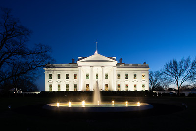

class: center, middle, inverse
background-image: url(https://www.unomaha.edu/university-communications/downloadables/campus-icon-the-o/uno-icon-color.png)
background-position: 95% 90%
background-size: 10%

# Chapter 3:  
# Police Organizations

<br>
<br>

[Justin Nix](https://jnix.netlify.app)  
*School of Criminology and Criminal Justice*  
*University of Nebraska Omaha*

<br>
<br>
<br>
.white[February 15, 2022]

---
class: top

# First, let's count them up

--

How many police departments exist in the United States?

--

- According to the [Bureau of Justice Statistics](https://bjs.ojp.gov/content/pub/pdf/lpd16p.pdf):

--

|Agency Type             |   N   |
|:-----------------------|------:|
|   Federal              |83     |
|   Tribal               |280    |
|   State                |49     |
|   Local                |12,261 |
|   Sheriff              |3,012  |
|   Special jurisdiction*|1,733  |
|   Other*               |638    |
|   **Total**            |18,056 |

.small[\* From [CSLLEA (2008)](https://www.bjs.gov/index.cfm/dataonline/content/index.cfm?ty=pbdetail&iid=2216)]

---
class: top

# Federal Law Enforcement

--

- Part of Executive Branch

--

- Jurisdiction: 

--

  - United States
  
--

  - Specific set of federal crimes defined by Congress
  
--

- Most are housed within [DOJ](https://www.justice.gov/) or [DHS](https://www.dhs.gov/)

--

  - [Homeland Security Act (2002)](https://www.congress.gov/bill/107th-congress/house-bill/5005)

```{r, echo=FALSE, fig.align='center', out.width = "30%", fig.cap = "(Image by Ray Young on Flikr)"}

```

---
class: top
background-image: url(secret_service.jpg)
background-position: 95% 5%
background-size: 40%

# Federal Law Enforcement

## DHS Agencies

--

### Secret Service

--

- Counterfeiting and money laundering

--

- Protecting POTUS and various other government officials

--

- Uniformed division protects the White House

```{r, echo=FALSE, fig.align='center', out.width = "30%"}

```

---
class: top
background-image: url(cbp.jpg)
background-position: 95% 5%
background-size: 40%

# Federal Law Enforcement

## DHS Agencies

--

### Customs and Border Protection (CBP)

- Protects borders and ports of entry

--

- Terrorism, drug trafficking, human trafficking

```{r, echo=FALSE, fig.align='center', out.width = "30%"}

```

---
class: top
background-image: url(ice.jpg)
background-position: 95% 5%
background-size: 35%

# Federal Law Enforcement

## DHS Agencies

--

### Immigration and Customs Enforcement (ICE)

- Primary focus: undocumented persons

--

- Main components:

--

  - Homeland security investigations
  
--

  - Enforcement and removal operations
  
---
class: top
background-image: url(fbi.png)
background-position: 95% 5%
background-size: 25%

# Federal Law Enforcement

## DOJ Agencies

--

### Federal Bureau of Investigation (FBI)

--

- The federal government's "general" law enforcement agency

--

- Since 9/11, terrorism and cybercrime have been prioritized

--

- Other services:

--

  - FBI Crime Lab
  
--

  - National Crime Information Center (NCIC)
  
--

  - Publishes [Uniform Crime Report](https://ucr.fbi.gov/crime-in-the-u.s) and [NIBRS](https://www.fbi.gov/services/cjis/ucr/nibrs)
  
---
class: top
background-image: url(washington.jpg)
background-position: 95% 5%
background-size: 25%

# Federal Law Enforcement

## DOJ Agencies

--

### U.S. Marshals Service

--

- Oldest federal law enforcement agency

--

- There are 94 marshals and some 3,700 deputy marshals

  - Why 94?
  
--

- Main functions:

--

  - Judicial security

--

  - Fugitive investigation
  
---
class: top

# Federal Law Enforcement

## DOJ Agencies

--

### Bureau of Alcohol, Tobacco, Firearms, and Explosives (ATF)

--

- Began as a unit within the IRS in 1862

--

- Became its own agency in 1972

--

  - Originally housed under Treasury but moved to DOJ in 2003

--

- Basically a tax-collection, enforcement, and regulatory arm of DOJ

---
class: top
background-image: url(nixon.jpg)
background-position: 95% 5%
background-size: 30%

# Federal Law Enforcement

## DOJ Agencies

--

### Drug Enforcement Administration (DEA)

--

- Established in 1973

--

- Controlled substance laws and regulations

```{r, echo=FALSE, fig.align='center', out.width = "40%"}

```

---
class: top

# State Law Enforcement

```{r, echo=FALSE, fig.align='center', out.width = "40%"}

```

--

- Generally responsible for:

--

  - Highway safety
  
--

  - Law enforcement in more remote areas
  
--

  - Technical support for local agencies
  
---
class: top

# State Law Enforcement

## Centralized Model

--

- AKA *state police* or *state patrol*

--

  - E.G., [Nebraska State Patrol](https://statepatrol.nebraska.gov/)
  
```{r, echo=FALSE, fig.align='center', out.width = "50%", fig.cap = "(Photo by Trooper Clint Zost)"}

```
  
---
class: top

# State Law Enforcement

--

## Decentralized Model

--

- Clearer distinction between *highway safety* and *other state-level functions*

--

  - E.G., [Department of Public Safety](https://scdps.sc.gov/) and [SLED](https://www.sled.sc.gov/) in South Carolina

---
class: top

# Local Policing

--

- Decentralized and fragmented

--

  - E.G., there are **227** local law enforcement agencies [in Nebraska](https://www.nebraska.gov/crime_commission/directory/index.cgi)

--

      - Including **9** in Douglas County alone

## Municipal Police

--

  - Authorized, funded, and operated within the limits of own jurisdictions
  
--

  - Each jurisdiction has its own goals and policies
  
--

- Most employ [fewer than 25 officers](https://bjs.ojp.gov/content/pub/pdf/lpd16p.pdf)

---
class: top

# Local Policing

--

## Sheriff's Departments

--

Responsibilities include:

--

1. Policing rural areas

  - Unincorporated areas  
  - Small towns that don't have their own agency
  
--

2. Operate county  jail

--

3. Court protection (bailiffs)

---
class: top

# Local Policing

--

## Special Jurisdiction Agencies

--

- About 57K officers working for ~1700 such agencies

--

- Examples:

--

  - Colleges and universities
  
--

  - State and county parks
  
--

  - Lakes and recreation areas
  
--

  - Airports, trains/subways, harbors
  
---
class: top

# Police Organizations

--

- Highly bureaucratized

--

  - See for example [OPD](https://public.powerdms.com/OPDEP1/tree/documents/2547925) and [LAPD](https://lapdonlinestrgeacc.blob.core.usgovcloudapi.net/lapdonlinemedia/2021/12/Org_chart_DP12_11232021.pdf) organizational charts...
  
--

- Different from private organizations:

--

  - Exist within political environments
  
--
  
  - Not for profit
  
--

  - Rules and regulations often limit creativity and flexibility

---
class: top

# Police Organizations

--

## Staff vs. Line Duties

--

### Staff

--

- Non-sworn personnel who provide assistance to sworn-personnel

--

  - Administrative assistants
  
  - Human resources
  
  - Crime analysts
  
  - 911 dispatchers
  
  - Records bureau
  
---
class: top

# Police Organizations

## Staff vs. Line Duties

--

### Sworn Personnel

--

- All the commissioned peace officers within the organization

--

- From chief or sheriff down to front-line officers or deputies

--

- Wide range of responsibilities (recall our discussion from [Week 1](https://jnix.netlify.app/slides/crcj2030_first_day/#14))

---
class: top

# Police Organizations

--

- Sir Robert Peel advocated for a military structure

--

  - In the US, our agencies often referred to as *quasi-military*

--

- **Frederick Taylor**, *Scientific Management Theory*
  
--

- **Max Weber**, *Bureaucratic Theory*

```{r, echo=FALSE, fig.align='center', out.width = "20%", fig.cap = "(Hacerahsen, CC BY-SA 4.0, via Wikimedia Commons)"}

```

  
--

- ***What do you think of structuring organizations this way?***

---
class: top

# Police Organizations

--

- **Contemporary organizational theory**

--

  - Line-level officers should have some say in decision-making and planning
  
  - i.e., *participatory management*
  
--

  - ***Why?***
  
--

- **Contingency theory**

--

  - Recognizes the difference between *repetitive* and *non-repetitive* tasks

---
class: top, center

# Have a great day! 😄

```{r, echo=FALSE, fig.align='center', out.width = "30%", fig.cap = "(photo by GPA Photo Archive on Flickr)"}

```

### *If you even dream of beating me, you'd better wake up and apologize.*

<div style="text-align: right"> - Muhammad Ali </div>


<!-- ```{css, echo=FALSE} -->
<!-- @media print { -->
<!--   .has-continuation { -->
<!--     display: block; -->
<!--   } -->
<!-- } -->
<!-- ``` -->

<style>
p.caption {
  font-size: 0.5em;
  color: gray;
}
</style>
