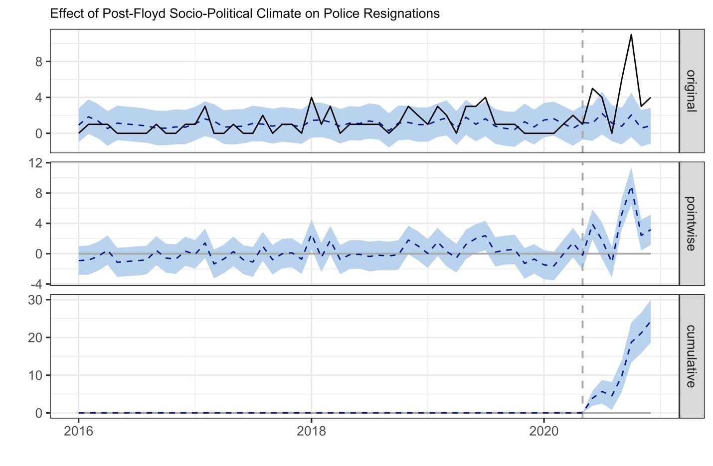
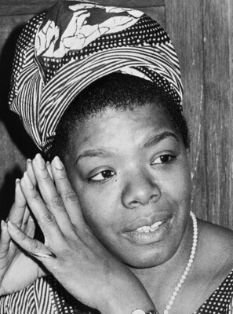

class: center, middle, inverse
background-image: url(https://www.unomaha.edu/university-communications/downloadables/campus-icon-the-o/uno-icon-color.png)
background-position: 95% 90%
background-size: 10%

# Becoming a Cop

<br>
<br>
<br>

[Justin Nix](https://jnix.netlify.app)  
*School of Criminology and Criminal Justice*  
*University of Nebraska Omaha*

<br>
<br>
<br>
<br>
.white[February 22, 2022]

---
class: top

# Pop Quiz!

--

Take out a sheet of paper and write down your answers to the following:

--

1. What are the **top 3** qualities of a **good cop?**

2. What are the **worst 3** qualities of a **bad cop?**

3. How should agencies ensure they employ **good cops?**

4. How many hours of **training** should people who want to be cops receive?

5. What topics should be **prioritized** during training? 

---
class: top

# Becoming a Cop

--

Broadly consists of three steps:

--

1. The hiring decision

--

2. Training academy

--

3. Field training

---
class: center, middle, inverse

# The hiring decision

---
class: top

# The hiring decision

--

According to **August Vollmer**, police officers should:

> Have the wisdom of Solomon, the courage of David, the patience of Job and leadership of Moses, the kindness of the Good Samaritan, the diplomacy of Lincoln, the tolerance of the Carpenter of Nazareth, and, finally, an intimate knowledge of every branch of natural, biological, and social sciences.

--

<br>

***How do agencies recruit such people?***

---
class: top

# The hiring decision

--

## Recruitment

--

- Historically competitive, particularly at the federal level

--

- Great Recession of 2008 ➡️ recruitment and retention crisis

--

  - After the George Floyd protests in 2020, [resignations spiked](https://www.city-journal.org/police-departments-recruitment-crisis)

--

      - ***Do you think this is cause for concern? Why or why not?***
      
```{r, echo=FALSE, fig.align='center', out.width = "40%"}

```
      
---
class: top

# The hiring decision

--

## Testing

```{r, echo=FALSE, fig.align='center', out.width = "25%", fig.cap = "(Photo by Nguyen Dang Hoang Nhu on Unsplash)"}
knitr::include_graphics("test.png")
```

--

- Written component

--

- Physical component

--

- Often, agencies contract with testing companies to ensure they're using **valid** and **reliable** exams

---
class: top
background-image: url(interview.png)
background-position: 95% 5%
background-size: 30%

# The hiring decision

--

## Oral interview

--

- Board of officers, administrators

  - Perhaps psychologists and/or other civilians
  
--

- Meant to gauge poise, reasoning, observational, and oral skills

--

  - E.G., hypothetical scenarios

---
class: top

# The hiring decision

--

## Background investigation

```{r, echo=FALSE, fig.align='center', out.width = "40%"}

```

--

- Review official records

--

- In-depth interviews with people who know you

---
class: top

# The hiring decision

--

## Polygraph

```{r, echo=FALSE, fig.align='center', out.width = "25%", fig.cap = "[Photo by spiralstares on Flickr (CC BY-NC-ND 2.0)]"}

```

--

- Questions about past behavior

--

- Used to encourage honesty

--

- Questionable validity and reliability though

---
class: top

# The hiring decision

--

## Medical and drug screening

```{r, echo=FALSE, fig.align='center', out.width = "25%", fig.cap = "[Photo by Sharon Sinclair on Flickr (CC BY-NC-ND 2.0)]"}

```

--

- Past and current drug use

--

- Determine if you're medically fit to perform the job
  
---
class: center, middle, inverse

# Basic Training

---
class: top

# Training academy

--

Types of academies:

```{r, echo=FALSE, fig.align='center', out.width = "40%", fig.cap = "(Source: BJS - State and Local Law Enforcement Training Academies, 2018)"}
knitr::include_graphics("academy_types.png")
```

---
class: top

# Training academy

--

~60,000 recruits started basic training in 2018

--

```{r, echo=FALSE, fig.align='center', out.width = "60%", fig.cap = "(Source: BJS - State and Local Law Enforcement Training Academies, 2018)"}
knitr::include_graphics("recruit_race.png")
```

---
class: top

# Training academy

--

- On average about 833 hours (21 weeks)

  - Not including field training
  
--

- Teaching methods and curricula [vary significantly](https://bjs.ojp.gov/content/pub/pdf/slleta13.pdf) across jurisdictions

--

- Topics covered:

--

  - Operations
  - Weapons/defensive tactics
  - Legal
  - Community policing
  - Self-improvement
  - Special topics

---
class: top

# Training academy

--

- Basic training also marks the start of an important socialization process

--

- E.G., the [danger imperative](https://papers.ssrn.com/sol3/papers.cfm?abstract_id=2864104)

```{r, echo=FALSE, fig.align='center', out.width = "40%", fig.cap = "Image by Geoffrey Fairchild at Flickr"}

```

---
class: center, middle, inverse

# Field Training

---
class: top

# Field training

--

- On-the-job training

--

- **83%** of state and local training academies report that field training is mandatory for some or all recruits after completing basic training

--

- Average length: 508 hours (12-13 weeks)

--

- Basic logic:

--

  - Learn policies and procedures
  - Training/evaluation
  - Observation by FTO

---
class: center, middle, inverse

# Realities of the Job

---

# Realities of the job

--

Stress resulting from:

--

  - Danger (real and perceived)
  - Organizational issues
  - Boredom
  - Lack of fulfillment
  
--

Police officers have high rates of:

--
  
  - [Alcoholism](https://www.ncbi.nlm.nih.gov/pmc/articles/PMC3592498/)
  - [Drug use](https://www.psychologytoday.com/us/blog/sure-recovery/201803/police-and-addiction)
  - [Health problems](https://www.ncbi.nlm.nih.gov/pmc/articles/PMC4734372/)
  - [Suicide](https://bluehelp.org/the-numbers/)
  
---
class: top

# Realities of the job

--

Fatigue

--

- Irregular hours

--

- Long shifts

--

- Overtime

--

- Personal life

--

A [recent study](https://journals.sagepub.com/doi/full/10.1177/1098611117732974) by Lois James et al. found that fatigued officers are more likely to be influenced by their implicit biases

---
class: top, center

# Have a great day! 😄

```{r, echo=FALSE, fig.align='center', out.width = "25%"}

```

### *It's one of the greatest gifts you can give yourself, to forgive. Forgive everybody.*

<div style="text-align: right"> - Maya Angelou </div>


<!-- ```{css, echo=FALSE} -->
<!-- @media print { -->
<!--   .has-continuation { -->
<!--     display: block; -->
<!--   } -->
<!-- } -->
<!-- ``` -->

<style>
p.caption {
  font-size: 0.5em;
  color: gray;
}
</style>