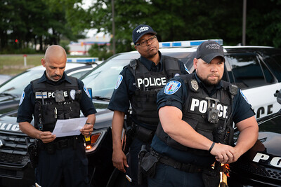
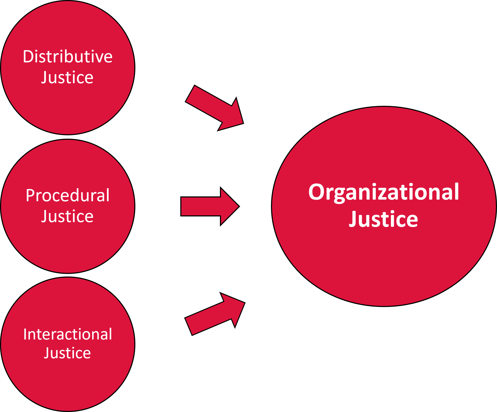
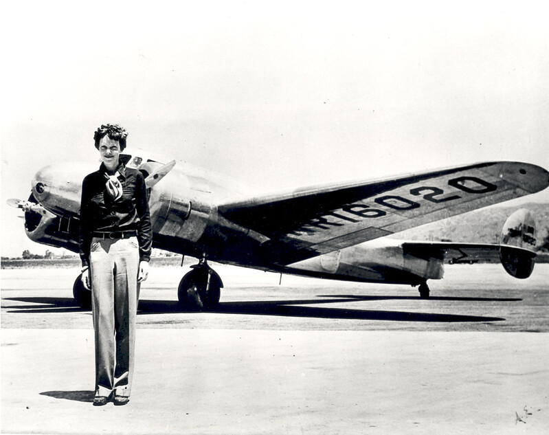

class: center, middle, inverse
background-image: url(https://www.unomaha.edu/university-communications/downloadables/campus-icon-the-o/uno-icon-color.png)
background-position: 95% 90%
background-size: 10%

# Police Subculture

<br>
<br>
<br>

[Justin Nix](https://jnix.netlify.app)  
*School of Criminology and Criminal Justice*  
*University of Nebraska Omaha*

<br>
<br>
<br>
<br>
.white[March 1, 2022]

---
class: top

# Pop Quiz!

--

Take out a sheet of paper and jot down your answers to the following:

--

1. What comes to mind when you hear the phrase **police subculture**?

2. Are the problems we have in policing the result of **a few bad apples**, a problematic **subculture**, or something else?

3. Regardless of your answer to #2, how can we change **culture**?

---
class: center, middle, inverse

# Before proceeding...

Read this [op-ed](https://www.jurist.org/commentary/2020/06/sierra-arevalo-police-training/)

And listen to this ~50 minute episode of the [Criminal Injustice Podcast](http://www.criminalinjusticepodcast.com/blog/2021/06/01/138-to-fix-policing-understand-it)

---
class: top
background-image: url(words.png)
background-position: 95% 5%
background-size: 40%

# Let's define some key terms

--

**Culture**

--

- **Values**

--

- **Norms**

--

<br>
**Subculture**

--

- **Police subculture**
  
--

<br>
Social institutions *construct* and *maintain* culture

---
class: top

# Sources of Police Subculture

--

## Organizational factors

--

- Starts with basic and field training

--

- Colleagues working the same shifts and beats

--

  - [Klinger (1997)](https://doi.org/10.1111/j.1745-9125.1997.tb00877.x): "territorially based independent work groups"
  
  - See also [Ingram et al. (2018)](https://doi.org/10.1111/1745-9125.12192)

```{r, echo=FALSE, fig.align='center', out.width = "35%", fig.cap = "[Image by U.S. Marshals Service on Flickr (CC BY 2.0)]"}

```

---
class: top

# Sources of Police Subculture

## Organizational factors

--

- Command staff and immediate supervisors

--

```{r, echo=FALSE, fig.align='center', out.width = "55%"}

```

---
class: top

# Sources of Police Subculture

--

## The Street

--

- Interactions with citizens

--

  - People who have criminally offended and been victimized
  
--

  - Can result in stereotyping, [illusory correlations](https://doi.org/10.1177%2F0093854807304484)
  
--

      - E.G., "all people of Group X are dangerous" or "most people in this neighborhood are up to no good"
      
--
  
  - Can also lead to a sense of helplessness
  
---
class: top

# Sources of Police Subculture

--

## The Media

```{r, echo=FALSE, fig.align='center', out.width = "35%"}

```

--

Your textbook says the media has the most influence on police subculture...

--

  - ***Do you agree or disagree?***
  
--

  - See the so-called [Ferguson Effect](https://papers.ssrn.com/sol3/papers.cfm?abstract_id=3715223)
  
---
class: top

# Sources of Police Subculture

--

## Other Criminal Justice System Entities

--

- Prosecutors and judges

  - E.G., newly elected Manhattan D.A. Alvin Bragg [recently announced](https://www.nytimes.com/2022/01/08/nyregion/alvin-bragg-police-chief-eric-adams.html) a policy to "avoid seeking jail or prison time for all but the most serious crimes, and to cease charging a number of lower level crimes"
  
--

      - ***Regardless what you think of the policy, how might this affect police subculture?***

---
class: center, middle, inverse

# So what?

--

## Police subculture 👉 officer perceptions and behaviors

---
class: top

# Components of Police Subculture

--

> Policing in the United States is very much like going to war. Three times a day in countless locker rooms across the land, large men and a growing number of women carefully arm and armor themselves for the day’s events. They begin by strapping on flak jackets…Then they pick up a wide, heavy, black leather belt and hang around it the tools of their trade: gun, mace, handcuffs, bullets. When it is fully loaded, they swing the belt around their hips with the same practiced motion of the gun-fighter in Western movies, slugging it down and buckling it in front. Many officers slip an additional small-caliber pistol into their trouser pocket or a leg holster just above the ankle. Inspecting themselves in a full-length mirror, officers thread their night sticks into a metal ring on the side of their belt.

<div style="text-align: right"> - Skolnick & Bayley (1986: 142) </div>

---
class: top

# Components of Police Subculture

--

- The so-called [warrior mentality](https://heinonline.org/HOL/P?h=hein.journals/forharoc128&i=225)

<p align="center">
  
</p>

--

- Control

--

- Suspicion

--

- Secrecy

---
class: top

# Components of Police Subculture

--

- Moral superiority

--

> I guess what our job really boils down to is not letting the assholes take over the city...What I'm talking about are those shitheads out to prove they can push everybody around. Those are the assholes we gotta deal with and take care of on patrol...They're the ones that make it tough on the decent people out there. You take the majority of what we do and its nothing more than asshole control.

<div style="text-align: right"> - A veteran Patrolman as quoted in Van Maanen (1978:221) </div>

---
class: top

# Components of Police Subculture

--

- The [*Danger Imperative*](https://papers.ssrn.com/sol3/papers.cfm?abstract_id=2864104)

--

  - Fear of the so-called *Ninja Assassin* leads some officers to engage in risky behaviors like [not wearing their seat belts](https://doi.org/10.1177%2F1098611120923159)...
  
--

<div style="text-align: center">Average line-of-duty deaths per decade </div>

| Decade | Firearms-Related | Traffic-Related | Other |
|--------|:----------------:|:---------------:|:-----:|
| 1970s  |        128       |        60       |   47  |
| 1980s  |        87        |        64       |   40  |
| 1990s  |        68        |        59       |   36  |
| 2000s  |        57        |        71       |   43  |
| 2010s  |        53        |        52       |   58  |
| 2020   |        48        |        44       |  172  |

<br>
<br>
<br>
.small[Source: National Law Enforcement Memorial and Museum, [2020 Law Enforcement Officers Fatality Report](https://www.aamva.org/2020-LE-Officers-Fatalities-Report/)]

---
class: top, center

# Have a great day! 😄

```{r, echo=FALSE, fig.align='center', out.width = "50%"}

```

### *The most difficult thing is the decision to act, the rest is merely tenacity.*

<div style="text-align: right"> - Amelia Earhart </div>


<!-- ```{css, echo=FALSE} -->
<!-- @media print { -->
<!--   .has-continuation { -->
<!--     display: block; -->
<!--   } -->
<!-- } -->
<!-- ``` -->

<style>
p.caption {
  font-size: 0.5em;
  color: gray;
}
</style>