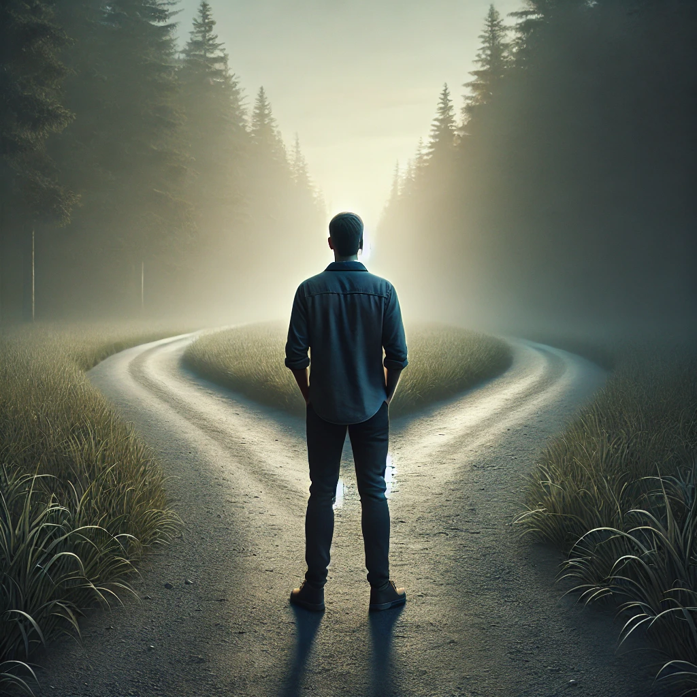
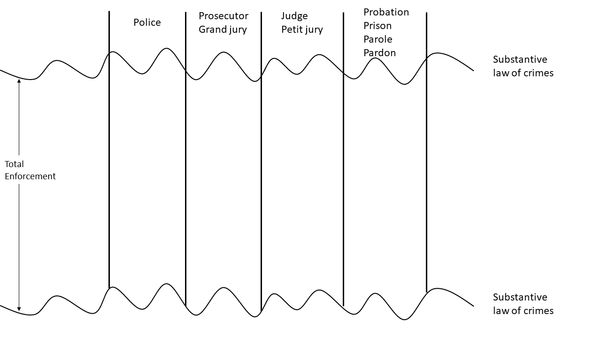
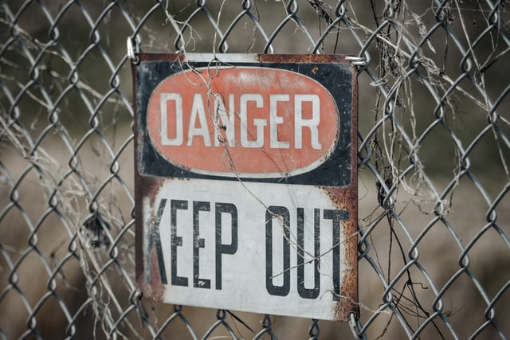

class: center, middle, inverse
background-image: url(https://www.unomaha.edu/university-communications/downloadables/campus-icon-the-o/uno-icon-color.png)
background-position: 95% 90%
background-size: 10%

# Police Discretion and Behavior

<br>
<br>
<br>

[Justin Nix](https://jnix.netlify.app)  
*School of Criminology and Criminal Justice*  
*University of Nebraska Omaha*

<br>
<br>
<br>
<br>
.white[March 8, 2022]

---
class: center, middle, inverse

# Before proceeding...

Listen to this ~50 minute episode of the [Probable Causation Podcast](https://www.probablecausation.com/podcasts/episode-44-arianna-ornaghi)

--

(or if you prefer you can read the [transcript](https://static1.squarespace.com/static/5c8e59f6e8ba44fdeb42f85f/t/60be34b912a67c77bb79a448/1623078074837/Episode44_Ornaghi_Transcript.pdf))

---
class: top

# Discretion

--

- The freedom to act according to one's own judgment and conscience

```{r, echo=FALSE, fig.align='center', out.width = "30%"}

```

--

- Exists in all phases of the criminal justice system

--

  - Stops and arrests, prosecution, sentencing, probation and parole
  
--

- What potential *benefits* does discretion offer?

--

- What potential *drawbacks* does it involve? 
  
---
class: top

# Why is it Necessary?

--

- *Total enforcement* is impossible

--

  - *Full enforcement* possible [in theory](https://www.jstor.org/stable/973838), but we know that police often decide *not to enforce*
  
--

  - This leaves us with *actual enforcement* - the "area" of which shrinks as we advance through the stages of the CJ process
  
--

- Officers' decisions whether to invoke the criminal process "largely determine the outer limits of law enforcement" [(Goldstein, 1960:543)](https://www.jstor.org/stable/794445)
  
---
class: top

# Actual Enforcement


.small[See [Goldstein (1960:563)](https://www.jstor.org/stable/794445).]

---
class: top

# Actual Enforcement


.small[See [Goldstein (1960:563)](https://www.jstor.org/stable/794445).]

---
class: top

# Actual Enforcement



.small[See [Goldstein (1960:563)](https://www.jstor.org/stable/794445).]

---
class: top

# Actual Enforcement


.small[See [Goldstein (1960:563)](https://www.jstor.org/stable/794445).]

---
class: top

# Actual Enforcement


.small[See [Goldstein (1960:563)](https://www.jstor.org/stable/794445).]

---
class: top

# Actual Enforcement


.small[See [Goldstein (1960:563)](https://www.jstor.org/stable/794445).]

---
class: top

# Actual Enforcement


.small[See [Goldstein (1960:563)](https://www.jstor.org/stable/794445).]

---
class: top

# Actual Enforcement


.small[See [Goldstein (1960:563)](https://www.jstor.org/stable/794445).]

---
class: top

# The Decision to Enforce

--

- Discretion consists of two parts:

--

  1. *Whether* to intervene

  2. *How* to intervene
  
--

- Consider how officers used their discretion in [this incident](https://www.cnn.com/2014/03/04/us/court-police-chase/index.html)

--

- Think of it like an incredibly high-stakes game of [blackjack](https://www.police1.com/police-products/pursuit-management-technology/articles/16-to-a-dealers-10-could-blackjack-odds-help-inform-police-pursuit-policies-Y9x2Avr8SWzJG1c4/)

```{r, echo=FALSE, fig.align='center', out.width = "25%"}

```

--

  - ***How do officers (or agencies) decide their best move?***
  
---
class: top

# Seven factors that influence the use of discretion

--

1. [Nature](https://doi.org/10.1111/j.1745-9125.1997.tb00877.x) of the crime or problem

--

2. [Neighborhood context](https://doi.org/10.1016/j.jcrimjus.2021.101829)

--

3. [Relational distance](https://doi.org/10.1177%2F0011128711420102) between offender and victim

--

4. [Demeanor](https://doi.org/10.1007/s11292-019-09363-4)

--

5. Demographics of the [offender](https://doi.org/10.1111/j.1745-9125.2011.00230.x) or victim

--

6. [Departmental policy](https://doi.org/10.1080/07418825.2016.1147593)

--

7. [Prosecutorial discretion](https://twitter.com/samswey/status/1480836643607040003/photo/1)

--

<br>

***Others?***

---
class: top

# Classic Studies of Police Discretion

--

William Westley: [Violence and the Police](https://www.journals.uchicago.edu/doi/10.1086/221264)

--

As part of his dissertation fieldwork in the late 1940s, Westley asked officers in Gary, Indiana: 

--

> When do you think a policeman is justified in roughing a man up?

--

| Type of Response            | Frequency | Percentage |
|:----------------------------|----------:|-----------:|
| Disrespect for police       |        27 |         37 |
| When impossible to avoid    |        17 |         23 |
| To obtain information       |        14 |         19 |
| To make an arrest           |         6 |          8 |
| For the hardened criminal   |         5 |          7 |
| When you know man is guilty |         2 |          3 |
| For sex criminals           |         2 |          3 |
|                   **Total** |        73 |        100 |

---
class: top

# Classic Studies of Police Discretion

--

Jerome Skolnick: [Justice without Trial](https://www.google.com/books/edition/Justice_Without_Trial/4IHWq5A31IoC?hl=en&gbpv=1)

--

- "Symbolic assailants" and "danger signifiers"

```{r, echo=FALSE, fig.align='center', out.width = "35%"}

```

--

- Tension between "law" and "order"

---
class: top

# Classic Studies of Police Discretion

```{r, echo=FALSE, fig.align='center', out.width = "25%"}

```

James Q. Wilson: [Varieties of Police Behavior](https://www.hup.harvard.edu/catalog.php?isbn=9780674932111)

--
  
  - Watchman
  
--

  - Legalistic
  
--

  - Service

<br>

.small[\* Image By Rakesh M 759 - Own work, CC BY-SA 4.0, [Wikimedia Commons](https://commons.wikimedia.org/w/index.php?curid=66446243)]
  
---
class: top

# Media Coverage and Police Behavior

--

***How might the media have an effect on...***

--

- Police behavior?

--

- Crime?

--

- Clearance rates?

--

  - What did Drs. Mastrorocco and Ornaghi find in [their study](https://ariannaornaghi.github.io/ariannaornaghi.com/who_watches_the_watchmen.pdf)?

      - Think back to the Probable Causation Podcast

---
class: top, center

# Have a great day! 😄

```{r, echo=FALSE, fig.align='center', out.width = "50%", fig.cap = "[Image by mccarmona23 on Flickr (CC BY 2.0)]"}
knitr::include_graphics("jordan.png")
```

### *I've never lost a game, I just ran out of time.*

<div style="text-align: right"> - Michael Jordan </div>

<!-- ```{css, echo=FALSE} -->
<!-- @media print { -->
<!--   .has-continuation { -->
<!--     display: block; -->
<!--   } -->
<!-- } -->
<!-- ``` -->

<style>
p.caption {
  font-size: 0.5em;
  color: gray;
}
</style>