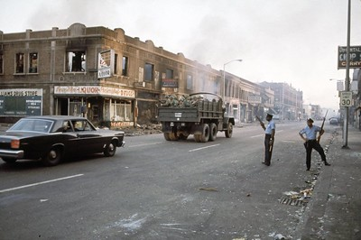
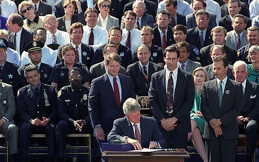
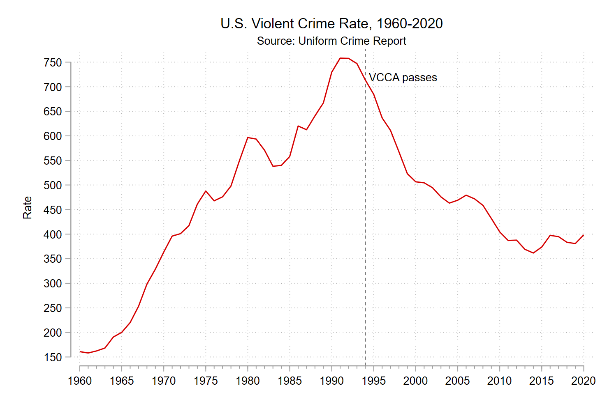

class: center, middle, inverse
background-image: url(https://www.unomaha.edu/university-communications/downloadables/campus-icon-the-o/uno-icon-color.png)
background-position: 95% 90%
background-size: 10%

# Community Policing

<br>
<br>
<br>

[Justin Nix](https://jnix.netlify.app)  
*School of Criminology and Criminal Justice*  
*University of Nebraska Omaha*

<br>
<br>
<br>
<br>
.white[March 22, 2022]

---
class: middle, center

# What is "Community Policing?"

---
class: top

# What is "Community Policing?"

--

A four-dimensional concept, according to [Gary Cordner](https://thewgsg.com/wp-content/uploads/2019/07/CommunityPolicingPrinciplesElements-Copy.pdf)

--

1. Philosophical

--

2. Strategic

--

3. Tactical

--

4. Organizational

---
class: top
background-image: url(violent_crime_60s.png)
background-position: 95% 10%
background-size: 30%

# The Path to Community Policing

## 1960s

--

The ["long, hot summer of 1967"](https://en.wikipedia.org/wiki/Long,_hot_summer_of_1967)

--

LBJ's **Commission on Law Enforcement and Administration of Justice** 

--

- Recommends "experimentation with a [team policing](https://www.ojp.gov/pdffiles1/11430.pdf) concept" (see [page 118 of the final report](https://www.ojp.gov/pdffiles1/Digitization/42NCJRS.pdf))

```{r, echo=FALSE, fig.align='center', out.width = "30%"}

```
<p style="text-align: center;">.small[Image by [continent.](https://www.flickr.com/photos/57221817@N07/) on [Flickr](https://flic.kr/p/JQ5ZUG), [CC BY 2.0](https://creativecommons.org/licenses/by/2.0/)]</p>

---
class: top
background-image: url(violent_crime_70s.png)
background-position: 95% 10%
background-size: 30%

# The Path to Community Policing

## 1970s

--

A pair of studies cast doubt on effectiveness of the traditional "law enforcement" role:

--

- National Police Foundation's [Kansas City Patrol Experiment](https://www.policefoundation.org/wp-content/uploads/2015/07/Kelling-et-al.-1974-THE-KANSAS-CITY-PREVENTIVE-PATROL-EXPERIMENT.pdf)
  
--

- Rand Corporation's [report](https://www.ojp.gov/pdffiles1/Digitization/44810NCJRS.pdf) on the criminal investigation process
  
--

Soon after, police in [Flint, MI](https://www.ojp.gov/ncjrs/virtual-library/abstracts/evaluation-neighborhood-foot-patrol-program-flint-michigan) and [Newark, NJ](https://www.policefoundation.org/wp-content/uploads/2015/07/144273499-The-Newark-Foot-Patrol-Experiment.pdf) launch foot patrol programs

--

Herman Goldstein introduces ["problem-oriented policing"](https://www.popcenter.org/sites/default/files/improving_policing_a_problem-oriented_approach_goldstein_crime_delinquency.pdf)

---
class: top
background-image: url(violent_crime_80s.png)
background-position: 95% 10%
background-size: 30%

# The Path to Community Policing

## 1980s

--

Wilson and Kelling publish [Broken Windows](https://www.theatlantic.com/magazine/archive/1982/03/broken-windows/304465/)

--

POP programs launched

- Most notably in [Baltimore County, MD](https://www.ojp.gov/pdffiles1/Digitization/103756NCJRS.pdf) and [Newport News, vA](https://www.ojp.gov/pdffiles1/Digitization/111964NCJRS.pdf)

--

Community policing initiatives in [Newark and Houston](https://www.ojp.gov/pdffiles1/Digitization/111964NCJRS.pdf)

---
class: top
background-image: url(violent_crime_90s.png)
background-position: 95% 10%
background-size: 30%

# The Path to Community Policing

## 1990s

--

[Violent Crime Control and Law Enforcement Act](https://www.ncjrs.gov/txtfiles/billfs.txt) passed in 1994

```{r, echo=FALSE, fig.align='center', out.width = "25%"}

```

--

- Created the [Office of Community Oriented Policing Services](https://cops.usdoj.gov/) 

--

- Made funds available to hire 100K officers for community policing

      - As well as to implement and evaluate programs

--

[CAPS](https://www.ojp.gov/pdffiles1/nij/179556.pdf) in Chicago

---
class: top

# How prevalent is "Community Policing" today?

--

| Population Served   | Has a written COP plan |
|---------------------|:----------------------:|
| 1 million+          |           80%          |
| 500,000-999,999     |           72%          |
| 250,000-499,999     |           78%          |
| 100,000-249,999     |           62%          |
| 50,000-99,999       |           62%          |
| 25,000-49,999       |           57%          |
| 10,000-24,999       |           51%          |
| 2,500-9,999         |           38%          |
| 2,499 or fewer      |           36%          |
| **All departments** |           **42%**      |

<br>
<br>
<br>

.small[Source: [Local Police Departments: Policies and Procedures, 2016](https://bjs.ojp.gov/content/pub/pdf/lpdpp16.pdf)]

---
class: middle, center

# So ~50 years later, does it work?

--

```{r, echo=FALSE, fig.align='center', out.width = "90%"}

```

---
class: middle, center

# Not so fast, my friend!

```{r, echo=FALSE, fig.align='center', out.width = "50%"}

```

.small[Image by [MGoBlog](https://www.flickr.com/photos/mgoblog/) on [Flickr](https://flic.kr/p/2c4zxw5), [CC By-NC 2.0](https://creativecommons.org/licenses/by-nc/2.0/)]

--

## ...It's more complicated than that

---
class: top

# Assessing the Evidence

--

Charlotte Gill et al.'s [meta-analysis](https://link.springer.com/article/10.1007/s11292-014-9210-y) of 37 studies suggests community policing:

--

- Increases satisfaction and perceived legitimacy of police
  
--
  
- Improves perceptions of disorder
  
--

- However, it has "limited effects on crime and fear of crime"
  
---
class: top

# Assessing the Evidence

--

Results of Kyle Peyton et al.'s [field experiment](https://www.pnas.org/content/116/40/19894) in New Haven were promising

--

- Brief door-to-door non-enforcement visits 👉 improved attitudes as much as 21 days later

--

*In theory*, these short-term gains in trust/legitimacy could contribute to long-term crime reduction benefits

--

- But methodologically rigorous evidence is scant

---
class: top

# Assessing the Evidence

--

Foot patrol seems to work well

--

- See, e.g., studies in [Philadelphia](https://www.jratcliffe.net/phila-foot-patrol-experiment) and [Dayton](https://www.researchgate.net/publication/329564228_The_Dayton_Foot_Patrol_Program_An_Evaluation_of_Hot_Spots_Foot_Patrols_in_a_Central_Business_District)
  
--

[POP approaches](https://popcenter.asu.edu/) also have a promising evidence base

--

- [Meta analysis](https://doi.org/10.1002/cl2.1089) of 34 studies 👉 33.8% reduction in crime/disorder in treatment areas/groups
  
--

  - And no significant displacement effects
  
---
class: top

# Key Challenges

--

## Implementation

--

Buy-in / commitment 

--

- From officers and the community

--

## Evaluation

--

Measurement

--

  - What did the agency do?
  
--

  - Ruling out alternative explanations
      
---
class: top, center

# Have a great day! 😄

```{r, echo=FALSE, fig.align='center', out.width = "35%"}

```

### *I'd rather regret the things I've done than regret the things I haven't done.*

<div style="text-align: right"> - Lucille Ball </div>

<!-- ```{css, echo=FALSE} -->
<!-- @media print { -->
<!--   .has-continuation { -->
<!--     display: block; -->
<!--   } -->
<!-- } -->
<!-- ``` -->

<style>
p.caption {
  font-size: 0.5em;
  color: gray;
}
</style>