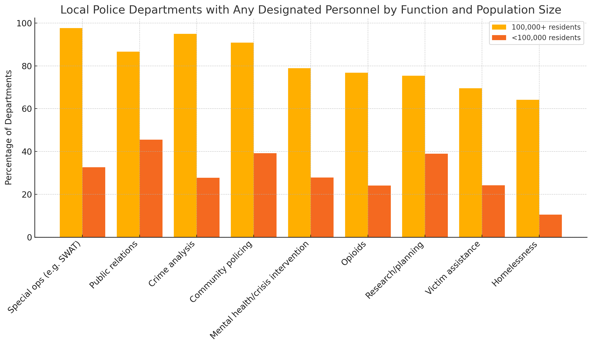

class: center, middle, inverse
background-image: url(https://www.unomaha.edu/university-communications/downloadables/campus-icon-the-o/uno-icon-color.png)
background-position: 95% 90%
background-size: 10%

# Community Policing

<br>
<br>
<br>

[Justin Nix](https://jnix.netlify.app)  
*School of Criminology and Criminal Justice*  
*University of Nebraska Omaha*

<br>
<br>
<br>
<br>
.white[October 23, 2025]

---
class: middle, center

# What is "Community Policing?"

---
class: top

# What is "Community Policing?"

--

A four-dimensional concept, according to [Gary Cordner](https://thewgsg.com/wp-content/uploads/2019/07/CommunityPolicingPrinciplesElements-Copy.pdf)

--

1. Philosophical

???

**Philosophical**: community policing values and promotes the active solicitation of input from neighborhood residents and civic organizations, especially with regard to decisions and policies that affect local residents

--

2. Strategic

???

**Strategic**: community policing requires police officers regularly to seek out face-to-face interactions with the general public. Two strategic elements aid officers in this endeavor:

- First, police officers spend less time in their squad cars by adopting alternative patrol strategies (e.g., foot and bike patrol). 
- Second, police officers are assigned to specific beats for extended periods. These two elements not only help officers develop positive relationships with local residents but also familiarize them with neighborhood concerns

--

3. Tactical

???

**Tactical**: police officers are encouraged to investigate and develop an understanding of local problems and tailor community-specific solutions to address them. Use community partnerships to solve local problems.

--

4. Organizational

???

**Organizational**: alter traditional structure. Paramilitary structure is not conducive to COP. Requires flattening the organization (reduce number of ranks) and increasing authority and responsibility of low-ranking officers.

---
class: top
background-image: url(violent_crime_60s.png)
background-position: 95% 10%
background-size: 30%

# The Path to Community Policing

## 1960s

--

The ["long, hot summer of 1967"](https://en.wikipedia.org/wiki/Long,_hot_summer_of_1967)

???

Long hot summer: 159 race riots took place across the U.S. in the summer of '67
- The worst of which took place in Newark NJ and Detroit
- All told: 83 deaths, thousands of injuries, tens of millions of dollars in property damage

--

**Commission on Law Enforcement and Administration of Justice** and **Kerner Commission** established by LBJ

???

The Commission on Law Enforcement and Administration of Justice is convened to study the CJ system
- 342 page report released in February 1967

In July, LBJ established the Kerner Commission to investigate the rioting and "urban issues."
- Final report issued in March 1968
- Key finding: riots were caused by Black and Latino frustration at the lack of economic opportunity, and urban violence was the result of racism
- Warned that "our nation is moving toward two societies, one black, one white - separate and unequal." 

- LBJ largely rejected the Kerner Commission's recommendations
- One month after the report was released, MLK was assassinated, sparking more protests and rioting

--

- The former recommended "experimentation with a [team policing](https://www.ojp.gov/pdffiles1/11430.pdf) concept" (see [page 118 of the final report](https://www.ojp.gov/pdffiles1/Digitization/42NCJRS.pdf))

```{r, echo=FALSE, fig.align='center', out.width = "30%"}

```
<p style="text-align: center;">.small[Image by [continent.](https://www.flickr.com/photos/57221817@N07/) on [Flickr](https://flic.kr/p/JQ5ZUG), [CC BY 2.0](https://creativecommons.org/licenses/by/2.0/)]</p>

---
class: top
background-image: url(violent_crime_70s.png)
background-position: 95% 10%
background-size: 30%

# The Path to Community Policing

## 1970s

--

A pair of studies cast doubt on effectiveness of the traditional "law enforcement" role:

--

- National Police Foundation's [Kansas City Patrol Experiment](https://www.policefoundation.org/wp-content/uploads/2015/07/Kelling-et-al.-1974-THE-KANSAS-CITY-PREVENTIVE-PATROL-EXPERIMENT.pdf)

???

- Go to page 8 of the final report to show the beat map

"The three patrol conditions did not affect crime, service delivery, or feelings of security in ways the public and the police often assume they do"
- No significant reduction of burglaries, auto thefts, larcenies of auto accessories, robberies, or vandalism
- Crime reporting did not vary across groups
- Fear of crime and satisfaction with police and police response times did not vary across groups
  
--

- Rand Corporation's [report](https://www.ojp.gov/pdffiles1/Digitization/44810NCJRS.pdf) on the criminal investigation process

???

- Comprehensive survey of all municipal/county police departments with 150 or more full-time employees or whose jurisdiction exceeded 100K as of 1970
  - 153 out of 300 agencies responded
- Findings:
  - Investigators only spend ~7 percent of their time on activities that lead to solving crime
  - Case solutions reflect the activities of patrol officers, members of the public, and routine clerical processing more so than investigative techniques
  - Nearly half of investigators' case-related activities are related to post-arrest processing, and those activities do not adequately meet the needs of prosecutors
  - Collecting evidence at crime scenes does not help solve crimes **unless** evidence-processing capabilities are adequate
  
--

Soon after, police in [Flint, MI](https://www.ojp.gov/ncjrs/virtual-library/abstracts/evaluation-neighborhood-foot-patrol-program-flint-michigan) and [Newark, NJ](https://www.policefoundation.org/wp-content/uploads/2015/07/144273499-The-Newark-Foot-Patrol-Experiment.pdf) launch foot patrol programs

???

**Flint**: several hundred interviews, informal conversations, and review of foot patrol officers' written reports
- Findings:
  - Reported crime goes down by about 9%
  - Almost 70% of those interviewed in the final year reported feeling safer because of foot patrol
  - >90% felt that foot patrol officers were more effective than motorized officers
  
**Newark**: 8 beats had consistently been receiving foot patrol as part of the Safe and Clean Neighborhoods Program
- Matched into pairs of two, where one randomly continued, one stopped
- Findings: 
  - Residents were aware of levels of foot patrol (stark contrast to motorized patrol and team policing)
  - Reported crime and victimization surveys suggest no significant effect on residential or commercial crimes
  - Residents *perceived* crime as *less problematic* and *felt safer*
  - Residents receiving foot patrol had more favorable opinions of the police
- Aside: this evaluation cost roughly 450K (in the late 70s...inflation adjusted = 1.87 million)

--

Herman Goldstein introduces ["problem-oriented policing"](https://www.popcenter.org/sites/default/files/improving_policing_a_problem-oriented_approach_goldstein_crime_delinquency.pdf)

???

POP: Imagine you're a patrol officer in Omaha. 
- Dispatch sends you to a local convenience store where teens are loitering and harassing customers as they come and go
- **What do you do?**
  - The next day you get the same call. **What do you do?**
  - The next day...same call...
  
**SARA Model**: Scanning, Analysis, Response, Assessment

Goldstein argues policing is far too **incident-driven** as opposed to **problem-driven**. That is, incidents should be grouped together according to the *underlying conditions* that give rise to *problems* that generate *incidents.* Solving the problem (by attacking the underlying condition) is way more effective in the long-term than constantly responding to incidents with no deeper level of analysis. 

---
class: top
background-image: url(violent_crime_80s.png)
background-position: 95% 10%
background-size: 30%

# The Path to Community Policing

## 1980s

--

Wilson and Kelling publish [Broken Windows](https://www.theatlantic.com/magazine/archive/1982/03/broken-windows/304465/)

--

POP programs launched

- Most notably in [Baltimore County, MD](https://www.ojp.gov/pdffiles1/Digitization/103756NCJRS.pdf) and [Newport News, vA](https://www.ojp.gov/pdffiles1/Digitization/111964NCJRS.pdf)

???

**Baltimore**: COPE (Citizen-Oriented Police Enforcement)
- Three units (45 total officers) created in 1982 whose mission was to "identify and reduce citizens' fear"
  - e.g., afraid to go out at night, answer the door, walk past a stranger, come out of the bank, call the police if they see a problem, etc...
- Officers patrolled on motorcycles and compact cars, and were instructed to drive slowly and stop often
- Findings from their *Garden Village* Project:
  - Officers determined a need/desire to upgrade street lighting
  - Got county roads department to repair some problematic roads and alleyways
  - Helped develop a federal grant proposal to build a new park facility. They didn't get the money, but later 70K was included in the county capital improvements budget for a multipurpose court
  - Trimmed back shrubbery, upgraded locks, secured vacant apartments, established a crime reporting system
  - Burglaries down 80%, auto larceny down 100%
  - **Important**: this effort involved 11 different governmental agencies - *not just the police*!
  
**Newport News**
- PERF identify 2 dozen problems in Newport News in 1986
  - Responses varied, but results were encouraging:
  - Burglaries in the New Briarfield Apartment complex were reduced 35%
  - Robberies in the CBD down 40%
  - Thefts from vehicles outside the Newport News Shipbuilding down 55%

--

Community policing initiatives in [Houston and Newark](https://www.policinginstitute.org/wp-content/uploads/2015/07/Pate-et-al.-1986-Reducing-Fear-of-Crime-in-Houston-and-Newark-Summary-Report-.pdf)

???

**Houston/Newark**  
Programs tested included:
- Local police-community newsletter
- Multi-service police-community center where citizens could report crimes, hold meetings, obtain info
- Proactive contacts with the public to determine problems
- Following up with victims by phone
- Helping create neighborhood organizations
- "Broken windows" policing (i.e., reducing social and physical disorder)

Findings: 
- Successful programs increased the quantity and quality of police-citizen contacts
  - And gave individual officers the discretion to innovate and develop programs responsive to public concerns
- The newsletters, victim follow-ups, and broken windows initiatives did not achieve their desired goals
  - Researchers say they weren't well-implemented, and they didn't establish the close working relatinoships between cops and community members that the "service" programs achieved

**Takeaway**: there are things the police can do that would be an improvement over the status quo (incident-driven policing)

---
class: top
background-image: url(violent_crime_90s.png)
background-position: 95% 10%
background-size: 30%

# The Path to Community Policing

## 1990s

--

[Violent Crime Control and Law Enforcement Act](https://www.ncjrs.gov/txtfiles/billfs.txt) passed in 1994

```{r, echo=FALSE, fig.align='center', out.width = "25%"}

```

--

- Created the [Office of Community Oriented Policing Services](https://cops.usdoj.gov/) 

--

- Made funds available to hire 100K officers for community policing

      - As well as to implement and evaluate programs

--

[CAPS](https://www.ojp.gov/pdffiles1/nij/179556.pdf) in Chicago

???

Go to page 6 of the report to show the map

This one took seriously Cordner's claim that community-policing required agencies to reorganize.
- Patrol divisions were reorganized and turf-based teams of officers were trained to deal with problems in their areas.
- 911 system was redesigned to ensure new teams could answer most calls for service in their designated areas
- Supervision system was changed to encourage teamwork among beat cops
- Monthly community meetings in every beat. In 1998, *nearly 6,000 people attended these meetings every month*

- Key finding here was there was a great deal of variation across beats. Those that saw the most success had "solid leadership." Those that struggled appeared not to take the problem-solving approach seriously

---
class: top

# How prevalent is "Community Policing" today?

--

<iframe title="Percentage of local police departments with a written COP plan" aria-label="Bar Chart" id="datawrapper-chart-dEWT8" src="https://datawrapper.dwcdn.net/dEWT8/3/" scrolling="no" frameborder="0" style="width: 0; min-width: 100% !important; border: none;" height="440" data-external="1"></iframe><script type="text/javascript">!function(){"use strict";window.addEventListener("message",(function(a){if(void 0!==a.data["datawrapper-height"]){var e=document.querySelectorAll("iframe");for(var t in a.data["datawrapper-height"])for(var r,i=0;r=e[i];i++)if(r.contentWindow===a.source){var d=a.data["datawrapper-height"][t]+"px";r.style.height=d}}}))}();
</script>

---
class: top

# How prevalent is "Community Policing" today?

--

```{r, echo=FALSE, fig.align='center', out.width = "90%"}

```
<p style="text-align: center;">.small[Source: [Local Police Departments Personnel, 2020](https://bjs.ojp.gov/sites/g/files/xyckuh236/files/media/document/lpdp20.pdf)]</p>

---
class: top

# How prevalent is "Community Policing" today? 

--

In 2014, DOJ launched a new initiative: 

- The **National Initiative for Building Community Trust and Justice**

--

  - $4.75 million
  - Training to combat bias
  - Evaluate police procedures
  
--

***Does it seem like a good investment in hindsight?***

--
  
- See this [~8min video](https://www.pbs.org/video/building-trust-between-police-and-community-1418337803/)

--

- And this more recent [op-ed](https://thehill.com/opinion/white-house/563276-bidens-plan-to-spend-billions-on-community-policing-is-bad-policy/)
---
class: middle, center

# So ~50 years later, does it work?

--

```{r, echo=FALSE, fig.align='center', out.width = "90%"}
knitr::include_graphics("violent_crime.png")
```

---
class: middle, center

# Not so fast, my friend!

```{r, echo=FALSE, fig.align='center', out.width = "50%"}

```

.small[Image by [MGoBlog](https://www.flickr.com/photos/mgoblog/) on [Flickr](https://flic.kr/p/2c4zxw5), [CC By-NC 2.0](https://creativecommons.org/licenses/by-nc/2.0/)]

--

## ...It's more complicated than that

---
class: top

# Assessing the Evidence

--

Charlotte Gill et al.'s [meta-analysis](https://link.springer.com/article/10.1007/s11292-014-9210-y) of 37 studies suggests community policing:

--

- Increases satisfaction and perceived legitimacy of police
  
--
  
- Improves perceptions of disorder
  
--

- However, it has "limited effects on crime and fear of crime"
  
---
class: top

# Assessing the Evidence

--

Results of Kyle Peyton et al.'s [field experiment](https://www.pnas.org/content/116/40/19894) in New Haven were promising

--

- Brief door-to-door non-enforcement visits 👉 improved attitudes as much as 21 days later

--

*In theory*, these short-term gains in trust/legitimacy could contribute to long-term crime reduction benefits

--

- But methodologically rigorous evidence is scant

---
class: top

# Assessing the Evidence

--

Foot patrol seems to work well

--

- See, e.g., studies in [Philadelphia](https://www.jratcliffe.net/phila-foot-patrol-experiment) and [Dayton](https://www.researchgate.net/publication/329564228_The_Dayton_Foot_Patrol_Program_An_Evaluation_of_Hot_Spots_Foot_Patrols_in_a_Central_Business_District)

???

If time allows, can show the Philly Hot Spot [video](https://www.jratcliffe.net/phila-foot-patrol-experiment)
  
--

[POP approaches](https://popcenter.asu.edu/) also have a promising evidence base

--

- [Meta analysis](https://doi.org/10.1002/cl2.1089) of 34 studies 👉 33.8% reduction in crime/disorder in treatment areas/groups
  
--

  - And no significant displacement effects
  
---
class: top

# Key Challenges

--

## Implementation

--

Buy-in / commitment 

--

- From officers and the community

--

## Evaluation

--

Measurement

--

  - What did the agency do?
  
--

  - Ruling out alternative explanations
      
---
class: top, center

# Have a great day! 😄

```{r, echo=FALSE, fig.align='center', out.width = "35%"}
knitr::include_graphics("lucy.png")
```

### *I'd rather regret the things I've done than regret the things I haven't done.*

<div style="text-align: right"> - Lucille Ball </div>

<!-- ```{css, echo=FALSE} -->
<!-- @media print { -->
<!--   .has-continuation { -->
<!--     display: block; -->
<!--   } -->
<!-- } -->
<!-- ``` -->

<style>
p.caption {
  font-size: 0.5em;
  color: gray;
}
</style>