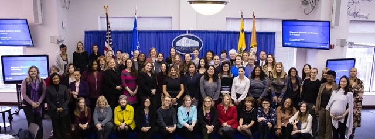
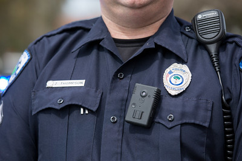

class: center, middle, inverse
background-image: url(https://www.unomaha.edu/university-communications/downloadables/campus-icon-the-o/uno-icon-color.png)
background-position: 95% 90%
background-size: 10%

# Policing in the Modern Era

<br>
<br>
<br>

[Justin Nix](https://jnix.netlify.app)  
*School of Criminology and Criminal Justice*  
*University of Nebraska Omaha*

<br>
<br>
<br>
<br>
.white[March 24, 2022]

---
class: top, center

# Policing in the Modern Era

```{r, echo=FALSE, fig.align='center', out.width = "30%"}

```

*When any part of the American family does not feel like*  
*it is being treated fairly, that’s a problem for all of us.*

<div style="text-align: right"> - President Barack Obama </div>

---
class: top

# Policing in the Modern Era

--

The [Task Force on 21st Century Policing](https://cops.usdoj.gov/RIC/Publications/cops-p341-pub.pdf) identified six pillars of reform:

--

1. Building trust and legitimacy

--

2. Policy and oversight

--

3. Technology and social media

--

4. Community policing and crime reduction

--

5. Training and education

--

6. Officer wellness and safety

---
class: top

## 1. Building trust and legitimacy

--

Legitimacy ➡️ compliance, cooperation, empowerment

--

Decades of research suggest [procedural justice](https://jnix.netlify.app/files/pdfs/critical_issues_PJ.pdf) is 🔑

--

- Treating people with dignity and respect

--

- Giving people a "voice" during encounters

--

- Being neutral and transparent in decision making

--

- Conveying trustworthy motives

--

Diversify departments to reflect the demographics of their communities

---
class: top

## 1. Building trust and legitimacy

--
```{r, echo=FALSE, fig.align='center', out.width = "85%"}

```

.small[Source: [Local Police Departments, 2016: Personnel](https://bjs.ojp.gov/content/pub/pdf/lpd16p.pdf)]

---
class: top

## 1. Building trust and legitimacy

--

Women make up 51% of the US population but only 12% of police officers

--

The [30x30 Initiative](https://30x30initiative.org/)

```{r, echo=FALSE, fig.align='center', out.width = "90%"}

```

---
class: top

## 2. Policy and oversight

--

Emphasize [de-escalation](https://doi.org/10.1111/1745-9133.12574) and alternatives to arrest or summons where appropriate

--

More data transparency:

--

- Collect and report data on [all police shootings](https://doi.org/10.1371/journal.pone.0259024) and in-custody deaths
  
--

- Publish agency [demographic data](https://doi.org/10.1126/science.abd8694)
  
--

- Collect and analyze demographic data on [all detentions](https://doi.org/10.1080/10511253.2016.1186993)
  
--

Civilian oversight
  
---
class: top

## 3. Technology and social media

--

Equip officers with [body-worn cameras](https://jnix.netlify.app/files/pdfs/TC_cops_cameras_crisis.pdf)

```{r, echo=FALSE, fig.align='center', out.width = "40%"}

```
<p style="text-align: center;">.small[Image by [North Charleston](https://www.flickr.com/photos/northcharleston/) on [Flickr](https://flic.kr/p/FfC8aQ), [CC BY-SA 2.0](https://creativecommons.org/licenses/by-sa/2.0/)]</p>

--

<br>
- ***Do you think BWCs have improved policing?***
  
---
class: top

## 3. Technology and social media

--

Development of [less than lethal technology](https://pubs.aeaweb.org/doi/pdfplus/10.1257/pandp.20191029)

```{r, echo=FALSE, fig.align='center', out.width = "50%"}

```
<p style="text-align: center;">.small[Image by Junglecat, [CC BY-SA 3.0](https://creativecommons.org/licenses/by-sa/3.0), via Wikimedia Commons]</p>

--

- ***What do you think?***

---
class: top

## 3. Technology and social media

--

Use of [social media](https://doi.org/10.1111/1745-9125.12277)

|Social Media    | % Currently Using |
|:---------------|:-----------------:|
| Agency website |        100        |
| Facebook       |         82        |
| Twitter        |         69        |
| YouTube        |         48        |
| LinkedIn       |         34        |

<p style="text-align: center;">.small[Source: PERF & COPS Office (2014), [*Future Trends in Policing*](https://www.policeforum.org/assets/docs/Free_Online_Documents/Leadership/future%20trends%20in%20policing%202014.pdf)]</p>

---
class: top

## 4. Community policing and crime reduction

--

Reinforce the importance of community engagement and problem-solving

--

COP should be infused throughout the culture and organizational structure of agencies

--

Adopt policies that address needs of most at-risk youth / Reduce aggressive enforcement tactics

--

School resource officers - but "limit involvement in student discipline"

---
class: top

## 5. Training and education

--

Adult-based learning and [scenario-based training](https://www.virtra.com/)

--

- Engage community members in the process

--

Development of a "national postgraduate institute" for senior executives with a standardized curriculum

--

Crisis Intervention Training

--

Training to improve [social interaction skills](https://doi.org/10.1111/1745-9133.12506)

--

[Implicit bias awareness](https://fipolicing.com/)

---
class: top

## 6. Officer wellness and safety

--

[Blue Alert](https://cops.usdoj.gov/bluealert) warning system

--

Regular mental health checks

--

Implement scientifically supported shift lengths

--

Equip all officers with tactical first aid kits and anti-ballistic vests

--

Collect better data on officer [deaths](https://www.odmp.org/), [injuries](https://jnix.netlify.app/post/post10-gvaanalysis/), and "near misses"

--

Policies that require officers to wear seat belts, vests

---
class: middle, center, inverse

# And then 2020 happened

---
class: top
background-image: url(floyd.png)
background-position: 95% 5%
background-size: 30%

# A Legitimacy Crisis Renewed

COVID-19 changes everything

George Floyd killed by Officer Derek Chauvin  
on May 25, 2020

"Defund the Police" gains traction

[Elevated turnover](https://jnix.netlify.app/files/pdfs/cpp_turnover.pdf) in some agencies

<br>

<p style="text-align: right;">.small[Photo by [Gayatri Malhotra](https://unsplash.com/@gmalhotra) on [Unsplash](https://unsplash.com/photos/oPzSBTqbKFU)]</p>

---
class: top

# A Legitimacy Crisis Renewed

--

By the end of 2020, homicides had spiked by nearly 30%

```{r, echo=FALSE, fig.align='center', out.width = "95%"}
knitr::include_graphics("homicide_rates.png")
```
<p style="text-align: right;">.small[Source: [FBI Crime Data Explorer](https://crime-data-explorer.fr.cloud.gov/pages/explorer/crime/crime-trend)]</p>
---
class: top

# A Legitimacy Crisis Renewed

--

Popular theories:

--

- [De-policing, decreased trust, and emboldened offenders](https://www.denverpost.com/2021/02/24/denver-crime-rate-homicide-shooting-property-crime-police/)

--

- [Increase in gun carrying](https://www.theatlantic.com/ideas/archive/2022/01/gun-sales-murder-spike/621196/)

--

- [The COVID-19 pandemic](https://www.usatoday.com/story/opinion/policing/2021/10/04/violent-crime-covid-isolation-pushed-spike/5903199001/?gnt-cfr=1)

--

Thomas Abt argues police are [necessary but not sufficient](https://www.policechiefmagazine.org/necessary-but-not-sufficient/?ref=e6b395be13bf27a03cf9a63a7c18aced) to address the ongoing wave of violence

--

And as Aaron Chalfin et al. show 👉 [when cities add cops, Black residents could have the most to gain — and the most to lose](https://www.niskanencenter.org/when-cities-add-cops-black-residents-could-have-the-most-to-gain-and-the-most-to-lose/)

  - ***What do you think?***

---
class: top, center

# Have a great day! 😄

```{r, echo=FALSE, fig.align='center', out.width = "30%"}
knitr::include_graphics("carrey.png")
```
<p style="text-align: center;">.small[Image by [Jean-François Gornet](https://www.flickr.com/photos/jfgornet/) on [Flickr](https://flic.kr/p/7QCV6i), [CC BY-SA 2.0](https://creativecommons.org/licenses/by-sa/2.0/)]</p>

### *You can fail at what you* ***don’t want***, *so you might as well take a chance on doing what you* ***love.***

<div style="text-align: right"> - Jim Carrey </div>

<!-- ```{css, echo=FALSE} -->
<!-- @media print { -->
<!--   .has-continuation { -->
<!--     display: block; -->
<!--   } -->
<!-- } -->
<!-- ``` -->

<style>
p.caption {
  font-size: 0.5em;
  color: gray;
}
</style>