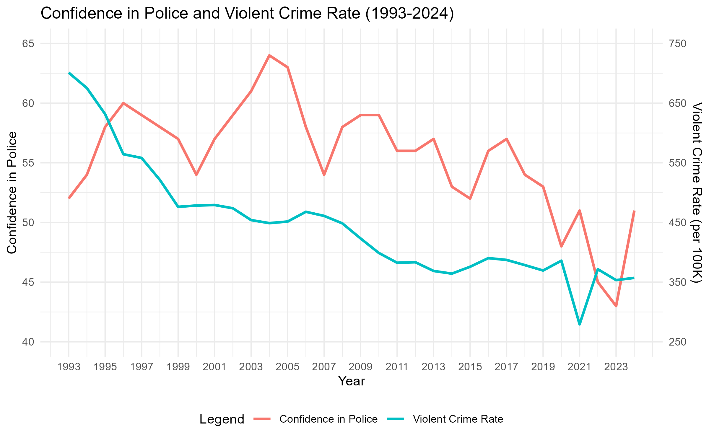
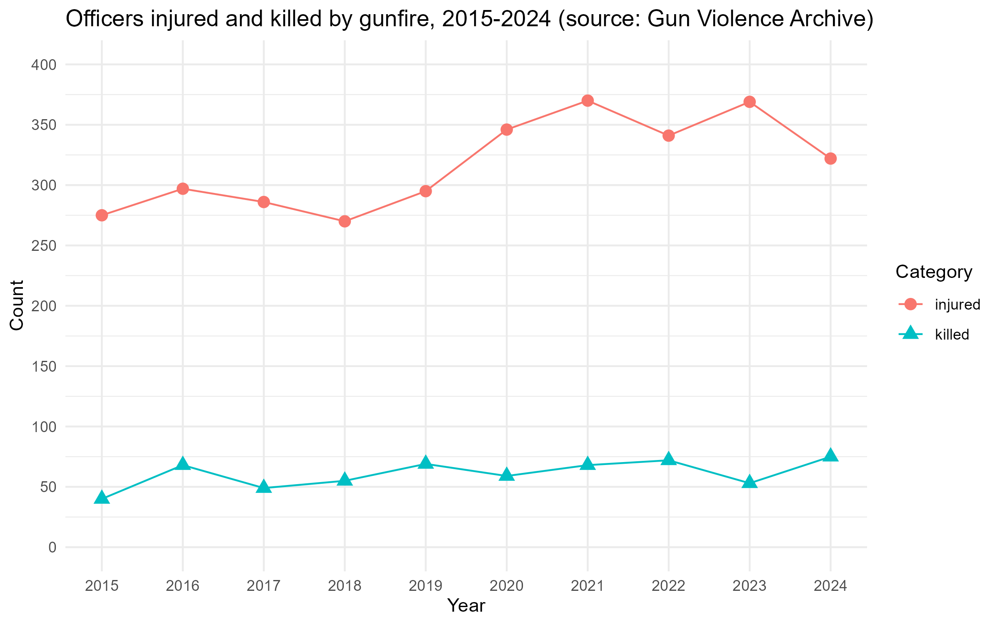

class: center, middle, inverse
background-image: url(https://www.unomaha.edu/university-communications/downloadables/campus-icon-the-o/uno-icon-color.png)
background-position: 95% 90%
background-size: 10%

# A Brief Overview of U.S. Policing Today

<br>
<br>
<br>

[Justin Nix](https://jnix.netlify.app)  
*School of Criminology and Criminal Justice*  
*University of Nebraska Omaha*

<br>
<br>
<br>
<br>
.white[January 27, 2022]

---
class: top

# Pop Quiz!

--

Take out a sheet of paper and write down your answers to the following:

--

1. **In one sentence**, explain why we have police (i.e., what is their **purpose**?).

2. What does **violent crime** refer to?

3. On any given day, about what % of their time do police spend responding to violent crime?

4. For every 1,000 crimes, how many do you think result in an offender going to jail or prison?

5. What gives Americans **confidence** in the police?

6. Has policing has become **more dangerous** in the last 30 years? 

---
class: middle, center, inverse

# Why do we have police?

---
class: top

# The function of police in society

--

If we want to reform the police, [the first step](https://www.theatlantic.com/ideas/archive/2020/06/first-step-figuring-out-what-police-are/612793/) is figuring out what they're for.

--

- Sociologist **Egon Bittner** famously said:

> [Police are nothing else than a mechanism for the distribution of situationally justified force in society.](https://www.ojp.gov/pdffiles1/Digitization/147822NCJRS.pdf)

--

- So we must ask ourselves: 

> [What kinds of situations require remedies that are non-negotiably coercible?](https://www.ojp.gov/pdffiles1/Digitization/147822NCJRS.pdf)

--

  - ***Do you agree?***
  
---
class: middle, center, inverse

# What is **violent crime**?

--

# How much time do police spend on violent crime?

---
class: top

# How do police spend their time?

--

```{r, echo=FALSE, fig.align='center', out.width = "50%"}

```

.small[from [*Intelligence-Led Policing* (2nd Ed.)](https://www.routledge.com/Intelligence-Led-Policing/Ratcliffe/p/book/9781138859012) by Jerry Ratcliffe]

---
class: middle, center, inverse

# On average, how often does a criminal offense result in a jail or prison sentence?

---
class: top

# The Crime Funnel

--

```{r, echo=FALSE, fig.align='center', out.width = "80%"}

```

<br>
<br>
<br>
<br>

.small[from [*Intelligence-Led Policing* (2nd Ed.)](https://www.routledge.com/Intelligence-Led-Policing/Ratcliffe/p/book/9781138859012) by Jerry Ratcliffe]

---
class: middle, center, inverse

# What factors shape your confidence (or lack thereof) in police?

---
class: top

# Confidence in the Police

--

```{r, echo=FALSE, fig.align='center', out.width = "85%"}

```

.small[sources: [Gallup](https://news.gallup.com/poll/1597/confidence-institutions.aspx) and [FBI Crime Data Explorer](https://crime-data-explorer.fr.cloud.gov/pages/explorer/crime/crime-trend)]

---
class: middle, center, inverse

# Is policing a **dangerous** job?

---
class: top

# How **Dangerous** is Policing?

--

- Line-of-duty deaths have declined dramatically [since the 1970s](https://doi.org/10.1111/1745-9133.12408)

--

- And policing doesn't crack the Top 10 ["deadliest jobs"](https://www.washingtonpost.com/news/wonk/wp/2015/01/28/charted-the-20-deadliest-jobs-in-america/) as measured by occupational fatality rates

--
  
  - Measured this way, *logging* and *fishing* are the most dangerous jobs
  
--

  - ***What are we missing when we measure danger this way?***
  
--

<br>
.center[

]

---
class: top

# How **Dangerous** is Policing?

--

- However, police account for 13% of workplace gun homicide victims, despite accounting for ~0.5% of the US workforce

--

- Gun homicide victimization rate for police is ~1.6x the U.S. rate

--

  - Nonfatal gun assault victimization disparity is even larger
  
--

- Determining how often officers *avert* injury or death is far more difficult

--

- According to [UCR data](https://ucr.fbi.gov/crime-in-the-u.s/2019/crime-in-the-u.s.-2019/topic-pages/tables/table-29), in 2019 police made ~10 million arrests

--
  
  - Including ~500K arrests for violent offenses 
  - And ~150K arrests for weapons offenses (carrying, possessing, etc.)

<br>

.small[sources: [FBI 2021](https://ucr.fbi.gov/leoka/2019/tables/table-28.xls); Bureau of Labor Statistics 2021; [Kaufman et al. 2021](https://doi.org/10.1001/jamainternmed.2020.6696); [Sierra-Arévalo & Nix 2020](https://doi.org/10.1111/1745-9133.12507)]

---
class: top

# How **Dangerous** is Policing?

--

```{r, echo=FALSE, fig.align='center', out.width = "85%"}

```

.small[source: working paper using data from [Gun Violence Archive](https://www.gunviolencearchive.org/)]

---
class: middle, center, inverse

# What does police **effectiveness** look like?

--

# How can police maximize effectiveness?

---
class: top

# Evidence-Based Policing

--

In terms of *crime prevention*, policing is most effective when it is [**focused** and **proactive**](https://cebcp.org/evidence-based-policing/the-matrix/)

--

  - Must balance against potential for [police-caused harms](https://www.nap.edu/read/24928/chapter/1)

--

```{r, echo=FALSE, fig.align='center', out.width = "65%"}

``` 

---
class: top, center

# Have a great day! 😄

```{r, echo=FALSE, fig.align='center', out.width = "50%"}

```

### *You never fail until you stop trying.*

<div style="text-align: right"> - Albert Einstein </div>


<!-- ```{css, echo=FALSE} -->
<!-- @media print { -->
<!--   .has-continuation { -->
<!--     display: block; -->
<!--   } -->
<!-- } -->
<!-- ``` -->

