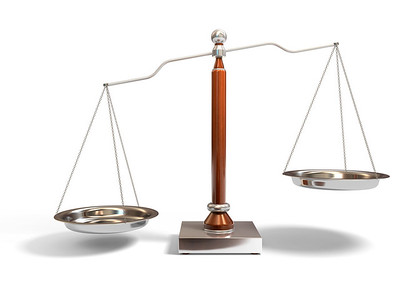
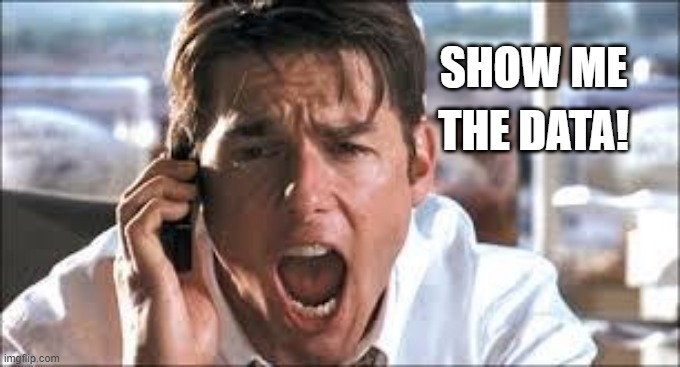

class: center, middle, inverse
background-image: url(https://www.unomaha.edu/university-communications/downloadables/campus-icon-the-o/uno-icon-color.png)
background-position: 95% 90%
background-size: 10%

# Science, Society, and Criminological Research

<br>
<br>
<br>

[Justin Nix](https://jnix.netlify.app)  
*School of Criminology and Criminal Justice*  
*University of Nebraska Omaha*

<br>
<br>
<br>
<br>
<br>
.white[January 24, 2023]

---
class: middle, center, inverse

# What do you believe are the causes of
# **mass shootings?**

--

<br>

## ...What constitutes a "mass" shooting?

--

## ...Now, how did you arrive at your beliefs?

---
class: middle, center, inverse

# Reasoning about the social world

---
class: top

# Reasoning about the social world

Criminological and criminal justice research is a type of **social science research**

???

- Social Science is about examining how people interact with one another. Specifically:
  - the use of scientific methods to investigate individuals, societies, and social processes; the knowledge produced by these investigations

--

Broadly, we seek answers to questions like:

```{r, echo=FALSE, fig.align='center', out.width = "35%"}

```
<p style="text-align: center; color: gray">.small[Image by [Fredrik Rubensson](https://flickr.com/photos/froderik/) on [Flickr](https://flic.kr/p/dC1gvd), [CC BY-SA 2.0](https://creativecommons.org/licenses/by-sa/2.0/)]</p>

--

- *Why people do what they do*

--

- *How organizations function*

---
class: top

# Reasoning about the social world

--

## Everyday errors in reasoning

--

### Overgeneralization

???

Overgeneralization is an error in reasoning that occurs when we conclude that what we've observed, or what we know to be true for **some** cases is true for **all** cases.

Statements that include definitive words like *always*, *never*, *everything*, or *only* may be overgeneralizations.

Also have to be careful about *sampling on the outcome*...

--

For example:

--

- *The McFlurry machine is always broken*

--

- *All politicians are corrupt*

--

- *ACAB*

---
class: top

# Reasoning about the social world

## Everyday errors in reasoning

--

### Selective observation

--

```{r, echo=FALSE, fig.align='center', fig.cap='Credit: @thesocycinema', out.width = "88%"}

```

???

Selective observation occurs when we choose to look only at things that align with our priors or beliefs. 

E.G., when we're inclined to criticize individuals or institutions, it is very easy to notice every time they fail.

- But if we only acknowledge instances that confirm our priors, we become victims of selective observation. 

Note that our observations can also simply be **inaccurate.** 

If we say the things from the last slide *despite evidence to the contrary*, we may have blinders on.

---
class: top

# Reasoning about the social world

## Everyday errors in reasoning

--

### Illogical reasoning

--

<p style="text-align: center">.large[🍦 ➡️ ☠️ ❓ ]</p>

???

Illogical reasoning occurs when we prematurely jump to conclusions on the basis of invalid, or empirically unsupported, assumptions. 

For example, we might note a strong *correlation* between ice cream sales and homicides. But it would be illogical to conclude that ice cream sales have a causal effect on homicides.
- Instead, warmer temperatures confounds this relationship. 

---
class: top

# Reasoning about the social world

## Everyday errors in reasoning

--

### Resistance to change

--

```{r, echo=FALSE, fig.align='center', out.width = "60%"}

```

???

A reluctance to change our ideas in light of new information can occur for several reasons:

- **Ego-based commitments**
  - It can be difficult to admit we were wrong once we've taken a position on an issue.
  
- **Excessive devotion to tradition**
  - Some degree of devotion to tradition can be healthy for societal functioning, but it can be a slippery slope toward stifling change in light of new evidence.
  
- **Uncritical agreement with authority**
  - E.G., do you uncritically agree when a police chief says they need more taxpayer money to help fight crime?
  - If we don't critically evaluate what authorities/leaders say and do, we risk enabling them to exercise their authority in ways we do not like/support.

---
class: middle, center, inverse

# The scientific approach is different

---
class: top

# The scientific approach is different

```{r, echo=FALSE, fig.align='center', out.width = "55%"}

```

???

- Uses systematic procedures to select subjects for observation

- Measures and samples phenomena systematically

- Uses explicit criteria for identifying causes and for determining if these criteria are met in a given instance

- Seeks to avoids bias that arises from ego-based commitments, excessive devotion to tradition, or unquestioned belief in authority

---
class: top

# The scientific approach is different

## Science vs. Pseudoscience

--

Check out this recent [story](https://www.propublica.org/article/911-call-analysis-fbi-police-courts) in *ProPublica*


???

This deputy chief claimed to be able to analyze 911 calls to determine if the caller was guilty of the crime they were reporting
- Things like tone, puases, word choice, grammar
- It sent Russ Faria to prison for 3.5 years for a murder he didn't commit. 
- ProPublica reporter documented >100 cases in 26 states where this man's pseudoscience played a "pivotal" role in arrests, prosecutions, and convictions.

The key to the scientific method is **transparency**, which enables others to try to replicate findings. 

If instead we relied on findings based on intuitions, gut reactions, or personal experiences, we'd open ourselves up to all the errors in reasoning we just covered. **Pseudoscientific beliefs** are not based on the scientific method (though they might be touted as "scientifically PROVEN"). Instead, they're based on testimonials. 

As your book points out: today's psuedoscience could be yesterday's science (e.g., phrenology). But this is a beautiful thing about science - it is constantly updating and correcting itself.

---
class: top

# The scientific approach is different

## Why conduct criminological research?

--

### Policy motivations

--

Are we using finite resources wisely?

--

For example:

--

- Do body-worn cameras provide a [good return on investment](https://fox42kptm.com/news/local/omaha-city-council-approves-5m-purchase-of-police-body-cameras-tasers)? 

</br>

```{r, echo=FALSE, fig.align='center', out.width = "80%"}
knitr::include_graphics("bwcs.png")
```

???

Assess programs and policies to determine their success and develop ways to improve outcomes and better address problems

**How would you assess whether this investment in BWCs was good or bad?**

---
class: top

# The scientific approach is different

## Why conduct criminological research? 

--

### Academic motivations

```{r, echo=FALSE, fig.align='center', out.width = "35%"}

```
<p style="text-align: center; color: gray">.small[Image by [Fredrik Rubensson](https://flickr.com/photos/froderik/) on [Flickr](https://flic.kr/p/dC1gvd), [CC BY-SA 2.0](https://creativecommons.org/licenses/by-sa/2.0/)]</p>

???

Learn more about complex social phenomena to better understand crime and society’s response to it

To be clear, as academics, we should be motivated to ask questions that have real world significance. But as academics, we have our own intellectual curiosities that we often pursue, and they may or may not involve the most pressing issues of the day. 

But the point is to try to understand mechanisms: why does [social phenomena] occur the way it does?

---
class: top

# The scientific approach is different

## Why conduct criminological research? 

--

### Personal motivations

--

For example: "pracademics"


???

Improve society, solve a problem of personal interest

---
class: top

# The scientific approach is different

--

## Social criminological research in action

--

### Descriptive research

???

**Descriptive research** is not interested in explaining some phenomenon, just in describing its prevalence or its qualities. Measurement and sampling are central concerns when doing descriptive research. 

--

For example:

--

- *How many [crimes](https://counciloncj.org/wp-content/uploads/2023/01/CCJ%E2%80%93Crime-Trends-Year-End-2022-Word-for-PDF.pdf) occurred in the United States last year?* 

???

Sort of a trick question! We won't have a good idea until September 30th, when 2022 NIBRS data are released. And even then, our data don't capture the true prevalence of crime. 

- We might also turn to **victimization surveys** like the NCVS as a separate descriptive measure. 

--

- *How [dangerous](https://doi.org/10.1111/1745-9133.12507) is it to be a police officer?* 

--

```{r, echo=FALSE, fig.align='center', out.width = "50%"}
knitr::include_graphics("cpp-paper.png")
```

???

Depends on how you operationalize **danger**! If you measure it as the rate of occupational fatalities, you'll find that logging, fishing, and taxi driving are all "more dangerous" than policing. This is, of course, an example of **illogical reasoning**. Trees and fish aren't out trying to kill loggers and fishermen. Police face an elevated risk of firearm violence, and are in fact asked to take proactive steps to get guns off the streets. 

---
class: top

# The scientific approach is different

## Social criminological research in action

--

### Exploratory research

???

**Exploratory research** seeks to find out how people get along in certain settings, what meanings they give to their actions, and what issues concern them. The goal is to answer the question: *what's going on here?*, and to investigate social phenomena without expectations. Often, questions asked are *open-ended.*

--

Seeks a better understanding of some phenomena, without expectations going in

--

- For example, *how do police officers feel about [protests against police brutality](https://nyupress.org/9781479807369/policing-unrest/)?*

```{r, echo=FALSE, fig.align='center', out.width = "15%"}
knitr::include_graphics("kochel.png")
```

---
class: top

# The scientific approach is different

## Social criminological research in action

--

### Explanatory research

???

**Explanatory research** seeks to identify causes and effects of social phenomena, to predict how one phenomena will change or vary in response to variation in some other phenomena. 

--

Seeks to explain the relationship(s) between two or more variables

--

- For example, [*subject race and police shooting mortality*](https://doi.org/10.1371/journal.pone.0259024)

--

```{r, echo=FALSE, fig.align='center', out.width = "70%"}
knitr::include_graphics("plos.png")
```

---
class: top

# The scientific approach is different

## Social criminological research in action

--

### Evaluation research

???

**Evaluation research** seeks to determine the effects of a social program or some other intervention. It's explanatory in that it deals with cause and effect, but it also considers the implementation and outcomes of policies and programs - things that may be less relevant to explanatory research. 

--

Do social programs/interventions work as intended? 

--

- For example, [does *D.A.R.E.* reduce adolescent drug use](https://www.sciencedirect.com/science/article/abs/pii/S0091743596900614)? 

--

```{r, echo=FALSE, fig.align='center', out.width = "70%"}
knitr::include_graphics("dare.png")
```

---
class: middle, center, inverse

# Strengths and limitations of social research

---
class: top

# Strengths and limitations of social research

--

Research always has flaws and limitations

--

Different studies may produce mixed evidence

--

The all-important question is: **what does the accumulation of evidence suggest?**

```{r, echo=FALSE, fig.align='center', out.width = "40%"}

```
<p style="text-align: center; color: gray">.small[Image by [winnifredxoxo](https://flickr.com/photos/61056899@N06/) on [Flickr](https://flic.kr/p/9LdVCR), [CC BY 2.0](https://creativecommons.org/licenses/by/2.0/)]</p>

---
class: middle, center, inverse

# Types of research methods

---
class: top

# Types of research methods

--

## Quantitative methods

--

```{r, echo=FALSE, fig.align='center', out.width = "70%"}

```

???

**Quant methods** use numerical data, or data pertaining to attributes that can be ordered in terms of magnitude.

Examples include surveys and experiments that record variation in social life or decision-making processes.

---
class: top

# Types of research methods

--

## Qualitative methods

--

```{r, echo=FALSE, fig.align='center', out.width = "50%"}

```

???

**Qual methods**, on the other hand, usually pertain to written or spoken words, or observations that do not have a direct numerical interpretation. 

Examples include participant observation, intensive interviewing, ride-alongs, and focus groups that are designed to capture social life as particpants experience it, rather than in categories predetermined by the researcher. 

---
class: top

# Types of research methods

--

## Mixed methods

--

```{r, echo=FALSE, fig.align='center', out.width = "85%"}

```

???

Here, as the name suggests, researchers draw on both quantitative and qualitative data. Can be a good way to triangulate, or to dig deeper (via qual data collection)  to understand the meaning of the quant data. 

---
class: middle, center, inverse

# Social research goals

---
class: top

# Social research goals

--

## Measurement validity

```{r, echo=FALSE, fig.align='center', out.width = "45%"}
knitr::include_graphics("darts.jpg")
```
<p style="text-align: center; color: gray">.small[Image by [anonphotography.com](https://flickr.com/photos/anonphotography/) on [Flickr](https://flic.kr/p/agn78o), [CC BY-NC 2.0](https://creativecommons.org/licenses/by-nc/2.0/)]</p>

???

Our research has **validity** to the extent it *measures what we think we're measuring*.

E.G., in the study Michael and I did on gun victimization in the line of duty, did we actually measure **danger?**

- We measured gun victimization. We did not measure other forms of violence that could speak to the overall dangerousness of policing, such as assaults with knives or blunt objects, or instances where people pulled a gun on officers, or shot at, but missed, police officers. 

- We justified our methodological decisions in the paper, but it's important to keep these limitations in mind.

---
class: top

# Social research goals

--

## Generalizability

???

**Sample generalizability** exists when our conclusions based on our sample of the larger population holds true for that larger population (i.e., our sampling frame).

- E.G., if we wanted to study Omaha police officers' perceptions of the June 2020 protests, and we asked them all to take our survey, but only 20% actually take it. Do findings from the 20% who took our survey generalize to the entire Omaha PD, including the 80% who did not? 

**Cross-population generalizability** (or external validity) exists when findings about one group, population, or setting hold true for other groups, populations, or settings.

--

```{r, echo=FALSE, fig.align='center', out.width = "73%"}

```

???

- Following up on the last example, would our findings extend to officers from other agencies in Douglas County? Or Nebraska? The Midwest? The U.S.?

---
class: top

# Social research goals

--

## Causal validity

???

**Causal validity** (or internal validity) exists when our conclusion that X results in Y is correct.

--

.pull-left[
```{r, echo=FALSE, fig.align='center', out.width = "75%"}

```
<p style="text-align: center">Nope.</p>
]

--

.pull-right[
```{r, echo=FALSE, fig.align='center', out.width = "75%"}

```
<p style="text-align: center">That's better!</p>
]

---
class: top

# Social research goals

--

## Authenticity

???

Finally, **authenticity** exists when our understanding of a social process or social setting is one that reflects fairly the various perspectives of participants in that setting.

It's a subjective world out there, and as researchers we should be cautious not to impose our interpretation of events/circumstances. We must also recognize we have lived experiences and biases that shape the questions we ask, and the way that we interpret causes and effects. Best to be as transparent as possible. 

--

```{r, echo=FALSE, fig.align='center', out.width = "40%"}
knitr::include_graphics("mirror.png")
```

---
class: middle, center, inverse



# Have a great day! 😄

<!-- ```{css, echo=FALSE} -->
<!-- @media print { -->
<!--   .has-continuation { -->
<!--     display: block; -->
<!--   } -->
<!-- } -->
<!-- ``` -->

<style>
p.caption {
  font-size: 0.5em;
  color: lightgray;
}
</style>