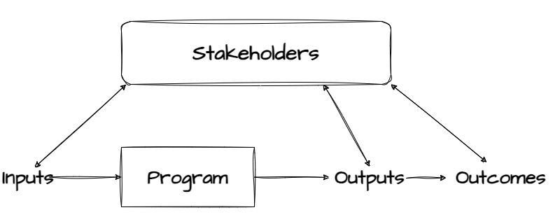
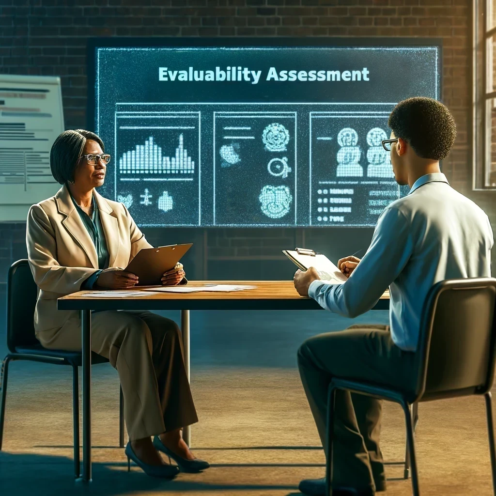
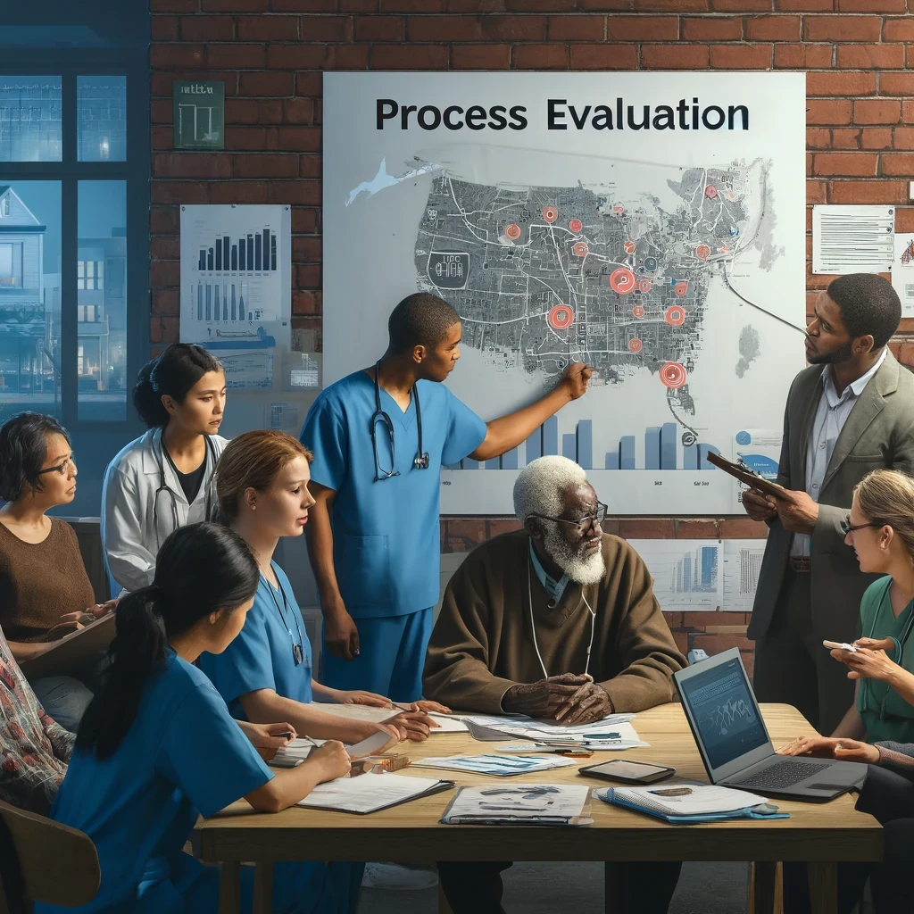
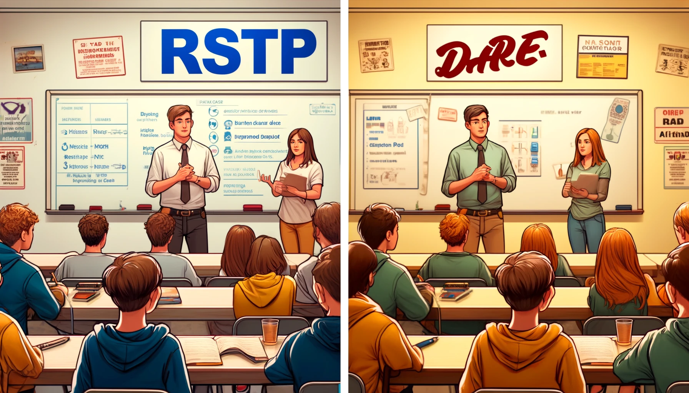

class: center, middle, inverse
background-image: url(https://www.unomaha.edu/university-communications/downloadables/campus-icon-the-o/uno-icon-color.png)
background-position: 95% 90%
background-size: 10%

# Evaluation and Policy Analysis

<br>
<br>
<br>

[Justin Nix](https://jnix.netlify.app)  
*School of Criminology and Criminal Justice*  
*University of Nebraska Omaha*

<br>
<br>
<br>
<br>
<br>
.white[April 18, 2024]

???

---
class: top

# Why Do We Need Evaluation?

```{r, echo=FALSE, fig.align='center', out.width = "60%"}

```

---
class: top

# A Brief History of Evaluation Research

--

## the Great Society and the War on Poverty

???

circa 1960s: Evaluation research in the social sciences isn't *new*, but taxpayer desires to know if their money was being spent wisely prompted a flurry of evaluation studies evaluating programs meant to alleviate poverty and the problems that stem from it.

--

<br>

## "Nothing works?"

???

**Robert Martinson's** 1974 work on the shortcomings of prisoner rehabilitation programs prompted the "nothing works" doctrine.
- Highly influential, and inspired a wave of strong sentencing reform and cancellation of rehabilitation programs

--

<br>

## Utility, feasibility, propriety, and accuracy

???

1981 Joint Committee on Standards published the list of features all evaluations should have:

1. **Utility**: should serve the practical information needs of intended users
2. **Feasibility**: Should be realistic, prudent, diplomatic and frugal
3. **Propriety**: evaluation should be conducted legally, ethically, and with due regard for those involved (including those affected by its results)
4. **Accuracy**: evaluation should reveal and convey technically adequate info about the features that determine worth or merit of the program

---
class: top

# Evaluation Basics

--

```{r, echo=FALSE, fig.align='center', out.width = "90%"}

```

???

**Inputs** are what goes into the program (in our context, often clients/participants and staff).

**Program process** - the complete treatment or service delivered by the program
- can be simple or complicated, short or long...but the idea is the same: it is designed to have some impact on the cases as inputs go into the model and outputs are produced.

**Outputs** are the services delivered, or new products produced, by the program process. ***Note***: these are often WAY easier to measure than outcomes.
- e.g., clients served, managers trained, arrests made

**Outcomes** reflect the impact - good and/or bad - of the program process on cases processed. 
- e.g., improved test scores, lower crime rates, reduced poverty

Variation in both outputs and outcomes in turn influences the inputs to the program through a **feedback process** which often involves **program stakeholders**.
- e.g., not enough clients being served? too many negative side effects from a trial med?

---
class: top

# Evaluation Alternatives

--

## Is the program **needed**?

```{r, echo=FALSE, fig.align='center', out.width = "50%"}

```

???

A **needs assessment** attempts to provide systematic, credible evidence of the need for a program. Key questions include the nature and scope of the problem, as well as the target population in need of the intervention. 

- What is the magnitude of this problem in this community?
- How many people in this community are in need of this program?
- What are the demographic characteristics of these people?
- Is the proposed program or intervention appropriate for this population? 

---
class: top

# Evaluation Alternatives

--

## **Can** the program be evaluated?

```{r, echo=FALSE, fig.align='center', out.width = "50%"}

```

???

Evaluation research is pointless is the program itself can't be evaluated. 

Often rely on qualitative methods; researchers might interview program managers or key staff to determine what data are available to analyze

Program sponsors might be interviewed about the importance they attached to different goals.

Can have an *action research* component, if researchers use their findings to encourage program managers or other key staff to make changes to current operations (e.g., collect more data or collect same data in a different way). 

---
class: top

# Evaluation Alternatives

--

## Is the program operating **as planned**?

```{r, echo=FALSE, fig.align='center', out.width = "50%"}

```

???

What actually happens? Evaluators are often asked to document the extent to which **implementation** has taken place. 

Key concerns here are **program coverage** and **delivery**. 

- Is the program reaching the target population? (coverage)
- Is it operating as expected? (delivery)
- What resources are being expended? 

***If a program has not been implemented as intended, should we even bother asking whether it had the intended outcomes?***

---
class: top

# Evaluation Alternatives

## Is the program operating **as planned**?

--

### Case study: [DARE](https://www.ojp.gov/pdffiles1/Digitization/152055NCJRS.pdf)

```{r, echo=FALSE, fig.align='center', out.width = "42%"}

```

???

In 1994, RTI did a process evaluation of D.A.R.E. that included 3 goals:

1. Assess the organizational structure and operation of representative DARE programs nationwide.
2. Review and assess factors that contribute to effective implementation. 
3. Assess how DARE and other school-based drug prevention programs are tailored to meet the needs of specific populations. 

They did site visits, interviews, discussion groups, and surveys of DARE program coordinators and advisers. 

Compared to coordinators of other alcohol/drug prevention programs, DARE coordinators were more likely to indicate satisfaction with their curriculum, teaching, admin requirements, student receptivity, and effects on students. 
- This would suggest DARE was operating as designed.

OTOH, site visits helped identify implementation problems, including insufficient numbers of officers to carry out the program as planned, and a lack of Spanish-language DARE books in a largely Hispanic school.

www.dare.org

---
class: top

# Evaluation Alternatives

--

## Did the program **work**?

```{r, echo=FALSE, fig.align='center', out.width = "50%"}

```

???

This most closely relates to a lot of the material we've covered thus far. Some program or policy is the independent variable, and its intended effects are the dependent variable. 

Ideally, we'd use an experimental design or a strong causal identification strategy.

But that can be difficult with social programs, where the usual practice is to let people decide for themselves whether they want to participate in a program, or to establish eligibility criteria that ensure people who enter the program are different from those who don't.
- Either way: *selection bias has likely been introduced*. 

---
class: top

# Evaluation Alternatives

## Did the program **work**?

--

### Case study: [D'Amico & Fromme (2002)](https://doi.org/10.1046/j.1360-0443.2002.00115.x)

```{r, echo=FALSE, fig.align='center', out.width = "70%"}

```

???

This study compared the impact of a new "Risk Skills Training Program" to an abbreviated DARE program and a control group
- **Participants**: Young people between the ages 14 and 19
- **Outcomes**: positive and negative "alcohol expectancies," perception of peer risk taking, and actual alcohol consumption

---
class: top

# Evaluation Alternatives

## Did the program **work**?

### Case study: [D'Amico & Fromme (2002)](https://doi.org/10.1046/j.1360-0443.2002.00115.x)

```{r, echo=FALSE, fig.align='center', out.width = "70%"}
knitr::include_graphics("rstp_expectancies.png")
```

???

Note that your textbook completely butchers the results of this study.

**Results**
- At post-test, the RSTP group showed no difference on negative alcohol expectancies, whereas DARE and control groups showed improvement!
- But at 6-month follow up, no meaningful differences in any of the groups. 

---
class: top

# Evaluation Alternatives

## Did the program **work**?

### Case study: [D'Amico & Fromme (2002)](https://doi.org/10.1046/j.1360-0443.2002.00115.x)

```{r, echo=FALSE, fig.align='center', out.width = "70%"}
knitr::include_graphics("rstp_weekly_drinking.png")
```

???

**Results**
- Control group increased their alcohol consumption

*Notice also how the groups were not equivalent at pretest!*

---
class: top

# Evaluation Alternatives

## Is the program **worth it**?

```{r, echo=FALSE, fig.align='center', out.width = "50%"}

```

---
class: top

# Evaluation Alternatives

## Is the program **worth it**?

--

### Case study: [Therapeutic communities](https://doi.org/10.1016/S0149-7189%2802%2900006-X)

```{r, echo=FALSE, fig.align='center', out.width = "50%"}

```

???

This study was a CBA of a modified therapeutic community. 342 individuals who'd been referred by homeless shelters or psychiatric facilities were randomly assigned to a TC or "treatment as usual," which in this case could have been a variety of things:
- Other residential programs, discharge without follow up, intensive case management, continue at the referral site, or drop out and wind up back on the streets.

Employment status, criminal behavior, and use of health care services were measured for each group 3 months prior to treatment and 3 months post-treatment

Earnings from employment in each period were adjusted for costs incurred by criminal behavior and use of health care services.

**Results**: The average cost of TC treatment for a client was about \$20K. But the economic benefit based on earnings to the average TC client was \$305K. 
- So after adjustments for costs the benefit to cost ratio as 13:1. 
---
class: top

# Design Decisions

## Black box evaluation or program theory?

---
class: top

# Design Decisions

## Researcher or stakeholder orientation?

---
class: top

# Evaluation in Action

## Case study: POP in Jersey City

---
class: top

# When Experiments are not Feasible

## Case study: Boot camps

---
class: top

# When Experiments are not Feasible

## Case study: Drinking and homicide in Eastern Europe

---
class: top

---
class: middle, center, inverse 

# Have a great day! 😄

## *Not everything that can be counted counts,*  
```{r, echo=FALSE, fig.align='center', out.width = "40%"}

```
## *and not everything that counts can be counted.*

<!-- ```{css, echo=FALSE} -->
<!-- @media print { -->
<!--   .has-continuation { -->
<!--     display: block; -->
<!--   } -->
<!-- } -->
<!-- ``` -->

<style>
p.caption {
  font-size: 0.5em;
  color: lightgray;
}
</style>