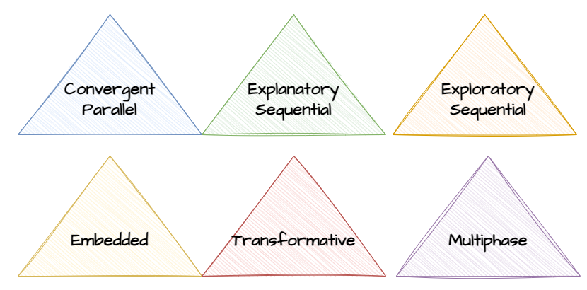

class: center, middle, inverse
background-image: url(https://www.unomaha.edu/university-communications/downloadables/campus-icon-the-o/uno-icon-color.png)
background-position: 95% 90%
background-size: 10%

# Mixing and Comparing Methods

<br>
<br>
<br>

[Justin Nix](https://jnix.netlify.app)  
*School of Criminology and Criminal Justice*  
*University of Nebraska Omaha*

<br>
<br>
<br>
<br>
<br>
.white[April 30, 2024]

???

---
class: top

# Mixed Methods

```{r, echo=FALSE, fig.align='center', out.width = "60%"}

```

???

**Triangulation** derives from land surveying. 
- If you know the coordinates of a single landmark, you can locate yourself somewhere along a straight line in relation to that landmark. 
- But if you have two landmarks, you can take bearings on both of them, and locate yourself at their intersection (that is, by measuring the angles in the triangle you've formed). 

In research methods, this refers to using multiple methods to try to answer your research question or test your hypotheses. 

> If a hypothesis can survive...a series of complementary methods if testing, it contains a degree of validity unattainable by one tested within the more constricted framework of a single method...

- Campbell & Fiske (1959:82)

---
class: top

# Six Major Designs

--

```{r, echo=FALSE, fig.align='center', out.width = "95%"}

```

???

**Convergent parallel**: quant and qual methods are implemented at the same time, and findings are integrated and interpreted together

**Explanatory sequential**: Quant method is implemented first, then followed by qualitative method

**Exploratory sequential**: Qual method is implemented first, then followed by quantitative method

**Embedded**: The primary method is qual or quant, but the researcher adds the other component to gain additional insight. For example, a quant design might be supplemented by a case study. The designs could be concurrent or sequential. 

**Transformative**: uses a theoretical perspective with a social justice focus - such as feminist research or participatory action research. The research is done to improve the well-being of vulnerable populations.

**Multiphase**: involves a series of quant and qual designs, with each design and the findings from it informing the next phase. 

---
class: top

# Six Major Designs

--

## Case Study: Should K-2 schools employ cops/"SROs?"

```{r, echo=FALSE, fig.align='center', out.width = "50%"}

```

???

Aaron Kupchik's 2010 book *Homeroom Security* is an example of **convergent parallel design**. 

In 4 high schools, he did >100 hours of observation - shadowing administrators and security guards, surveying classrooms and common areas. 
- In doing so, he directly observed on several occasions how minor problems escalated into bigger problems as a result of police involvement
- Thus sending students unnecessarily into the CJ system as opposed to handling the problems at the school level

He also did >100 semistructured interviews with administrators, security personnel, students, and parents.
- This gave him insight into how teachers and administrators perceived police presence at their school.
- One administrator voiced concern about how police officers didn't seem adequately trained to talk to/deal with young people. For example, they seemed to assume students were lying "before they even open their mouths."

Finally, he surveyed students about the experiences with punishment, perceptions of fairness, etc. 
- Here he learned that boys were more likely to report getting into trouble for rule violations than girls, and similarly, Black and Latino students were more likely than white students. 

---
class: top

# Six Major Designs

--

## Case Study: Why do Native Americans experience high rates violent victimization?

```{r, echo=FALSE, fig.align='center', out.width = "75%"}
knitr::include_graphics("american_indian_victimization.png")
```
<p style="text-align: center;">.medium[Source: [BJS, 2004](https://bjs.ojp.gov/content/pub/pdf/aic02.pdf)]</p>

???

*Death & Violence on the Reservation: Homicide, Family Violence and Suicide in American Indian Populations* 

Ronet Bachman (1992) is an example of **exploratory sequential design** - she started with in-person interviews of homicide offenders in three Midwestern state prisons. She asked them about the circumstances surrounding their crimes, their life before the crime, and their general attitudes about crime. These interviews helped her to **induce** a general explanation for high homicide rates in the American Indian community. 

She takes what she learned from this individual-level analysis and tests a series of hypotheses using community-level (state/county) data from the Supplementary Homicide Reports and the US Census. 

Key Findings

- Significantly higher rates of homicide and family violence on reservations, as well as suicide rates - particularly among young people
- Social disorganization, economic deprivation, substance abuse, and the legacy of colonial oppression as contributing factors
- Inadequate law enforcement, jurisdictional complexities, and the lack of culturally appropriate services

Ultimately she finds support for these ideas at two levels (individual & community) using two methodologies (qual & quant), which serves to bolster confidence in her conclusions. 

---
class: top

# Six Major Designs

--

## Case Study: Working with "official" data

.pull-left[

]

.pull-right[

]

???

[Carolyn Needleman (1981)](https://academic.oup.com/socpro/article-abstract/28/3/247/1646268) did a participant observation study of probation officers in two NY juvenile court intake units - in particular, how they screened cases. This is an example of **explanatory sequential design**

He finds that the concepts most researchers believe they are measuring with official records differ significantly from the meaning attached to these records by the people creating the data - the probation officers

- Researchers assume sending a juvenile case to court indicates a more severe disposition than retaining a case in the intake unit
  - Probation officers often diverted cases for fear the court would be too lenient.
  
- Researchers assume POs evaluate juveniles as individuals
  - POs often based decisions on their current social situation (e.g., stable home?) without learning anything about the individual juvenile

- **Most important**: POs often decided how to handle cases **first**, and then created an official record that appeared to justify their decision. 

  - Note: Bittner also observed the same thing on Skid Row: police often brought up charges that justified arrests, when the arrests were really just a way to resolve a dispute or problem.

---
class: top

# Comparing Research Designs

```{r, echo=FALSE, fig.align='center', out.width = "55%"}

```

???

Here's the proverbial garden of forking paths. There is no *one right way* to answer research questions or test hypotheses. And in fact, as we've discussed, triangulation is a useful way to scrutinize research questions. 

As I hope is clear by now, the research method you choose should be guided by the question(s) you're asking and the concerns you have about validity. 

- Experiments are great for testing causal relationships but often come at the expense of generalizability
- Surveys, done well, can be great for measurement validity and reliability, but rarely enable us to test causal relationships
  - Surveys can also be done very poorly, and there can be serious concerns about measurement validity and reliability!
- Qualitative methods can be really useful for appreciating context and the meanings people attach to their experiences. But again, often not useful on their own for generalizability. 
- Historical/comparative research is usually not great in terms of measurement validity or causality, but can be generalizable. 

---
class: top

# Comparing Results Across Studies

--

## Meta-Analysis

```{r, echo=FALSE, fig.align='center', out.width = "45%"}

```

???

Unlike a literature review which describes prior research verbally, meta-analysis treats prior studies as cases, with features measured as variables and analyzed statistically.

Researchers must be transparent about their **eligibility criteria**:

- Distinguishing features, research respondents, key variables, methods, cultural and linguistic range, time frame, and publication type

Goal is to generate an **effect size statistic** that can describe the average effect of some independent variable (e.g., policy) on some outcome (e.g., recidivism).

---
class: top

# Comparing Results Across Studies

## Meta-Analysis

--

### Case Study: Anti-bullying programs

```{r, echo=FALSE, fig.align='center', out.width = "40%"}

```
<p style="text-align: center;">.small[[Image](https://commons.wikimedia.org/wiki/File:Dont_Bullying.jpg) by Alejandrasotomange on Wikimedia Commons, [CC BY-SA 3.0](https://creativecommons.org/licenses/by-sa/3.0)]</p>

???

**What is bullying**? 

[Ferguson et al. 2007](https://journals.sagepub.com/doi/abs/10.1177/0734016807311712) performed a meta-analysis of the effects of anti-bullying programs, strictly focusing on experimental designs published between 1995 and 2006. 

**Results**: A statistically significant, but small effect of anti-bullying programs. 

**Limitations**: only looked at published, peer-reviewed studies (publication bias?)

Another meta-analysis by [Lee et al. (2015)](https://journals.sagepub.com/doi/full/10.1177/1367493513503581) examined the heterogeneity across studies, and concluded that:

>Effective school-based anti-bullying programs should include training in *emotional control, peer counseling, and the establishment of a school policy* on bullying.

---
class: top

# Comparing Results Across Studies

## Meta-Analysis

--

### Case Study: Can parent training programs prevent child abuse? 

```{r, echo=FALSE, fig.align='center', out.width = "40%"}

```

???

Lundahl et al. (2006) were interested in the effect of parent training and parent education programs on reducing risk factors associated with child abuse. 

Their 6 inclusion criteria included things like: no parent or child developmental or cognitive delays; focused on physical abuse, child neglect, or emotional abuse - not sexual abuse.

They searched using 3 key terms: child abuse, child neglect, and parent training, and found 186 studies published between 1970 and 2004
- Only 23 met their inclusion criteria...

**Results**: parent training had a moderate effect, and was effective in changing beliefs and attitudes toward children, improving parental emotional well-being, altering child-rearing behaviors, and reducing *documented* abuse. 

- Programs that included home visitors had a stronger effect than those without, and programs that did training at both the home and the office were more effective than those limited to training at one or the other site. 

---
class: top

# Comparing Results Across Studies

--

## Meta-Synthesis

???

Meta-synthesis is a related method used to analyze and integrate findings from qualitative studies. 
--

### Case Study: Female drug dealers

```{r, echo=FALSE, fig.align='center', out.width = "40%"}

```

???

---
class: middle, center, inverse 

# Have a great day! 😄

.pull-left[
```{r, echo=FALSE, fig.align='center', out.width = "60%"}

```
<p style="text-align: center;">.small[[Image](https://flic.kr/p/4MEVGU) by [Rashawerakh](https://www.flickr.com/photos/rashawerakh/2485115131/in/photostream/) on Flickr, [CC BY-NC 2.0 DEED](https://creativecommons.org/licenses/by-nc/2.0/)]</p>
]

.pull-right[

<br>

### *That's one thing Earthlings might learn to do, if they tried hard enough: Ignore the awful times, and concentrate on the good ones.* 
]

<p style="text-align: center;">– Kurt Vonnegut, <i>Slaughterhouse-Five</i></p>

<!-- ```{css, echo=FALSE} -->
<!-- @media print { -->
<!--   .has-continuation { -->
<!--     display: block; -->
<!--   } -->
<!-- } -->
<!-- ``` -->

<style>
p.caption {
  font-size: 0.5em;
  color: lightgray;
}
</style>