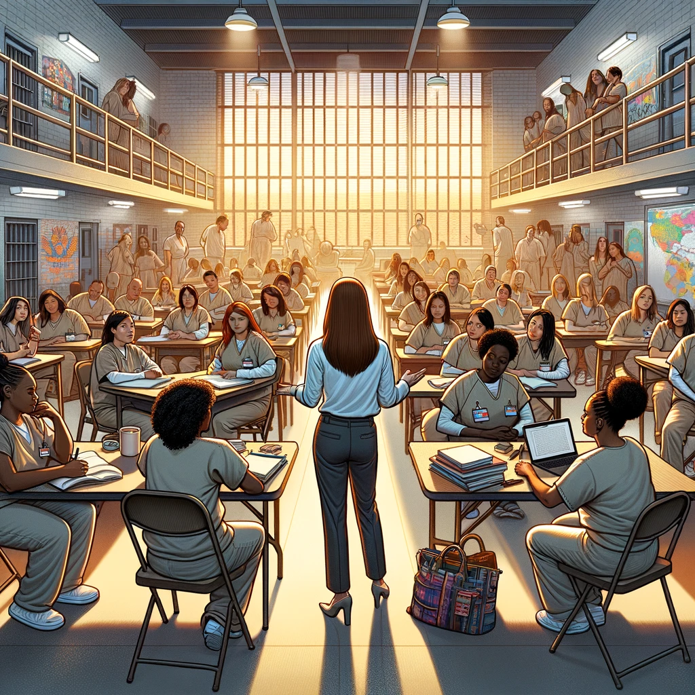
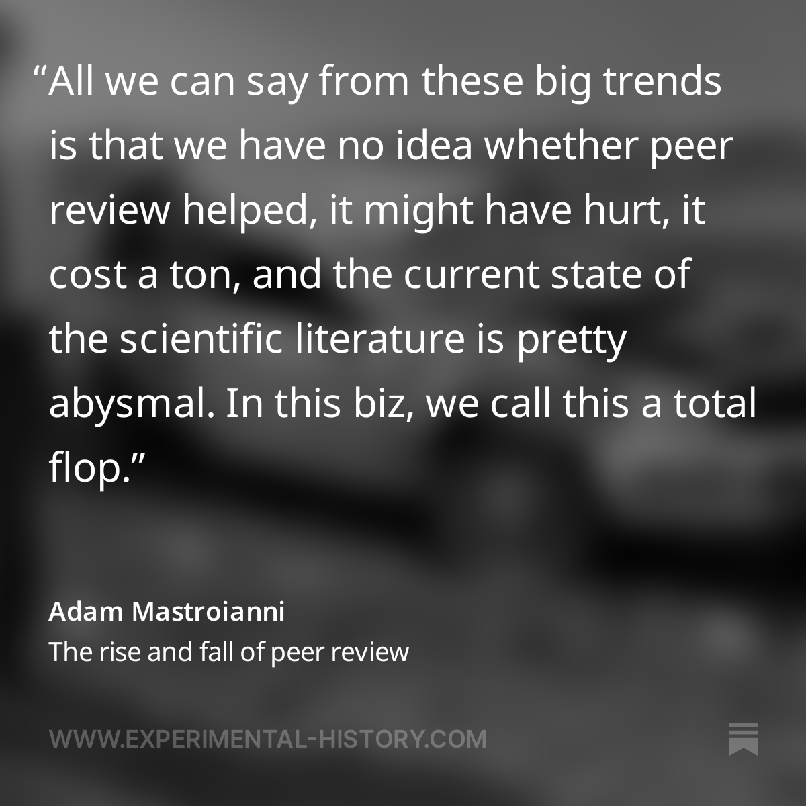
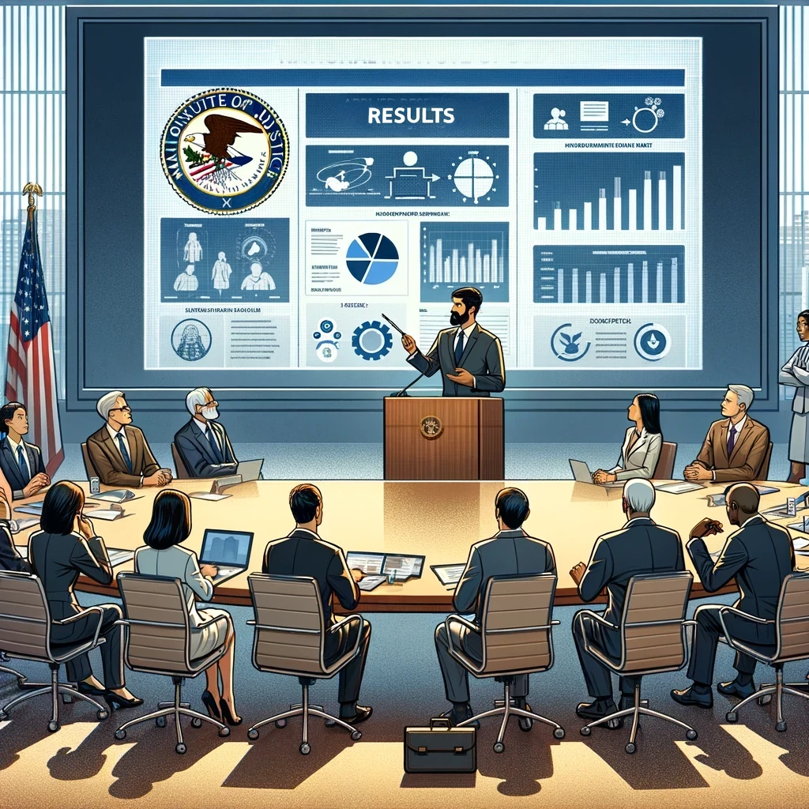
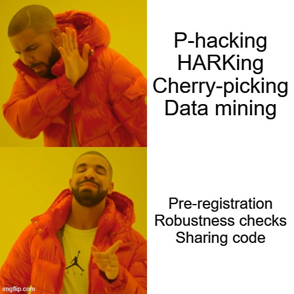
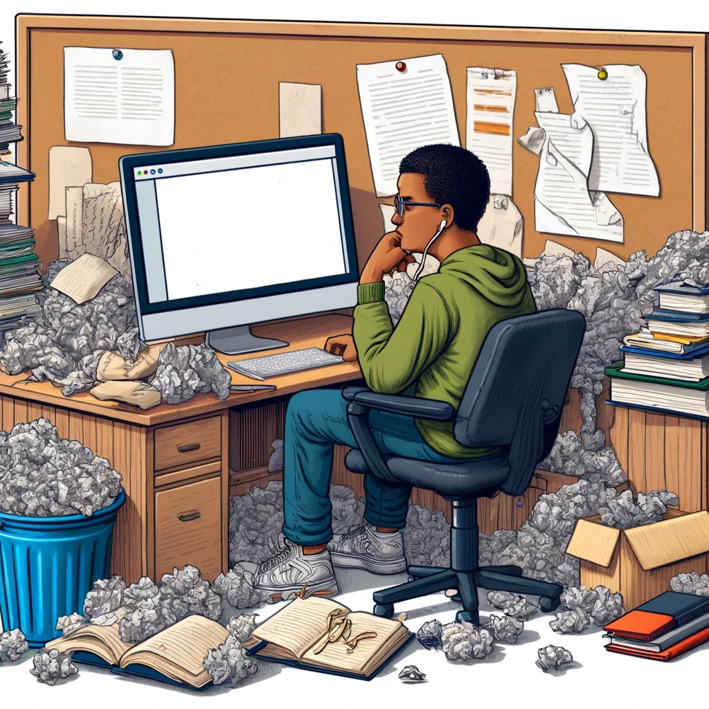

class: center, middle, inverse
background-image: url(https://www.unomaha.edu/university-communications/downloadables/campus-icon-the-o/uno-icon-color.png)
background-position: 95% 90%
background-size: 10%

# Reporting Research Results

<br>
<br>
<br>

[Justin Nix](https://jnix.netlify.app)  
*School of Criminology and Criminal Justice*  
*University of Nebraska Omaha*

<br>
<br>
<br>
<br>
<br>
.white[May 7, 2024]

???

---
class: top

# Research Report Goals

--

## 1. Advancing scientific knowledge

```{r, echo=FALSE, fig.align='center', out.width = "50%"}

```

???

Here the audience is other social scientists working in your area of study, or an adjacent area. 

This approach also treats "value considerations" as beyond the scope of science

Recall Weber:

> An empirical science cannot tell anyone what he should do but rather what he can do and under certain circumstances what he wishes to do (1949)

Thus there needs to be a strict separation between determination of empirical facts and evaluation of those facts as satisfactory or unsatisfactory

---
class: top

# Research Report Goals

--

## 2. Shaping social policy

```{r, echo=FALSE, fig.align='center', out.width = "50%"}

```

???

e.g., we just spent a whole chapter on evaluation research

The distinction here is the attention given to policy implications. 

Important to remember we are all capable of distorting our resaerch and our interpretations of research results to correspond to our own value preferences

---
class: top

# Research Report Goals

--

## 3. Organizing social action - Participatory Action Research

```{r, echo=FALSE, fig.align='center', out.width = "50%"}

```

???

William Foote Whyte, author of *Street Corner Society* (discussed in Ch. 9), argued social scientists must "get out of the academic rut" and engage in **applied research** to develop better understanding of social phenomena (1991, p. 285). 

i.e., Participatory Action Research (PAR)

Researcher involves as active participants some members of the setting being studied. Both the researcher and the organizational members are assumed to want to develop valid conclusions, new insights, and change. Whyte argues these things are more likely to be achieved if the researcher actively collaboarates with the persons being studied. 

Key features of PAR mimic a "spiral of self-reflecting cycles"
- Planning a change
- Activing and observing the process and consequences of the change
- Reflecting on these processes and consequences
- Replanning
- Acting and observing again...

So in contrast with reporting results at the end of a project, PAR makes research reporting an ongoing part of the research process

---
class: top

# Case Study: [Higher Education for Incarcerated Persons](https://doi.org/10.1111/j.1540-4560.2005.00421.x)

```{r, echo=FALSE, fig.align='center', out.width = "50%"}

```

???

Tough on crime policies of the 80s and 90s nearly eradicated college programs in prison. 

Torre & Fine (2005) designed a mixed-methods, PAR study to examine the effects of the Bedford Hills Correctional Facility's college program. 
- This is a maximum security women's prison in New York. 
- Michelle Fine was the principal investigator, along with 4 prisoner-researchers and 4 graduate students at CUNY

- Quantitative analysis of recidivism rates and costs of the program
- Qualitative interview and focus group data (inmates, faculty, children, college presidents)
- Surveys of faculty teaching in the program

**Results**: Women who didn't participate in the program were **four times** more likely to be returned to custody than those who participated. 
- 7.7% of the education group vs. 29.9% of the comparison group (p. 588)
- In 1999 in NY, it cost the state about $25K per year per inmate
- The College Program cost $1900 per year per student
  - So to administer this program to 100 incarcerated students, the total cost = almost $2.7m per year (including incarceration + program costs)
  - To incarcerate the same number of people but *not* administer the program is about $2.5m per year
  - **When you factor in the cost savings from decreased recidivism**, the program appears to save taxpayer dollars (on top of reducing recidivism in and of itself)

**Limitations**: not a randomized experiment, one program

***Shout out SCCJ's [TRAC Program](https://www.unomaha.edu/college-of-public-affairs-and-community-service/criminology-and-criminal-justice/undergraduate-programs/trac.php) led by Dr. Hashimi***
---
class: top

# Types of Research Reports

--

## Student papers, theses and dissertations

```{r, echo=FALSE, fig.align='center', out.width = "50%"}

```

???

You're welcome for not assigning a term paper 😁

Here, the sole/primary audience is your professor/committee. 

- Seek feedback **early and often**. Discuss your topic/research question and seek their approval. 

- Don't be afraid to ask if they're willing to look over early drafts and provide feedback - this is typically what writing in the "real world" will look like, and the whole point of these assignments is to get students to work though, at least somewhat independently, the issues that often arise during the writing process.

- What you submit should not be your first draft. 

- Remember that almost everyone almost always underestimates the amount of time needed to carry out a project (including me!).

For a **thesis or dissertation**, you'll have guidance from a committee of 3-4 professors throughout the process, culminating in an oral defense. 

---
class: top

# Types of Research Reports

--

## Journal Articles

```{r, echo=FALSE, fig.align='center', out.width = "45%"}

```

???

**The peer review process**
- In order to be published in an academic journal, your work must be assessed by other experts in your field or related fields. Anywhere from 2 to 5 reviewers may be called upon.
- At most Crim/CJ/Soc journals, the process is **double-blind**.
- At a lot of the "top" journals, more than 90% of submissions are rejected.

**Components of an article** 
abstract - concise summary of the paper, describing the research problem, sample, method, and key results. No more than 100-200 words (depending on journal).

intro - what do we know, what do we need to know, and how does this paper helps us get there? 

lit review - reviews prior work in the area. Doesn't need to be *exhaustive*, but should be comprehensive and should demonstrate the continuity between prior work and the present study, culminating in your hypotheses. No cherry picking!

method - detailed description of sample, data, variables, etc., such that readers can evaluate the validity of your study and attempt to replicate it. 

results - tables, figures, quotes, tests of significance, etc., that support or fail to support your hypotheses

discussion - bigger picture implications of your findings. what do we do with this new knowledge, both in terms of policy and future research? be transparent about limitations. 

references - exhaustive list of works cited throughout the paper. 

---
class: middle, center, inverse

# ⚠️ 
## Stop what you're doing and go read   
## [*The Rise and Fall of Peer Review*](https://www.experimental-history.com/p/the-rise-and-fall-of-peer-review)

```{r, echo=FALSE, fig.align='center', out.width = "40%"}

```

---
class: top

# Types of Research Reports

--

## Applied Reports

```{r, echo=FALSE, fig.align='center', out.width = "50%"}

```

???

Unlike journal articles, these are usually commissioned by a particular government, corporation, or nonprofit organization. 
- Like we discussed in Ch. 10, researchers need to produce a final report that meets the funding organization's expectations, while maintaining scientific integrity.

Often, researchers go and write academic articles after finishing a grant-funded project. Watch for "funding statements" that often appear on the first or last page of articles. Researchers should disclose how their work was funded so that readers can factor that into their assessment of the validity of the study. 

---
class: top

# Types of Research Reports

--

## Pre-prints

<figure style="text-align: center;">
  
  <figcaption><a href="https://www.crimrxiv.com/unosccj">UNOSCCJ's Crimrxiv Page</a></figcaption>
</figure>

???

This is work that hasn't yet received the "stamp of approval" from the peer-review process

You have to be cautious - judge for yourself if you think the study is valid. Of course, just because a study has passed peer review, it doesn't mean you *shouldn't* be cautious as you read it. 

Keep in mind results might change a bit from the pre-print stage to the final published version. 

E.G., our Denver pre-print changed substantially because we were asked to reformat it as a "research note," which involved trimming 8,000 words. 

---
class: top

# Ethical Considerations

--

```{r, echo=FALSE, fig.align='center', out.width = "47%"}

```

--

👉 [Questionable Research Practices and Open Science in Quantitative Criminology](https://link.springer.com/article/10.1007/s10940-021-09525-6)

???

Most quant criminologists admit to having used QRPs. 
- Almost half admit to selectively dropping covariates
- Almost half admit to HARKing
- More than half admit to omitting non-significant variables or studies
- More than half admit to underreporting results

Open science practices less common, but trending in the right direction I think.

---
class: top

# Writing is Really Hard

```{r, echo=FALSE, fig.align='center', out.width = "58%"}

```

???

START WITH AN OUTLINE

Accept the fact that you will discard a lot of what you write

Seek feedback

Try **reverse outlining**

---
class: middle, center, inverse 

# Have a great day! 😄

```{r, echo=FALSE, fig.align='center', out.width = "38%"}
knitr::include_graphics("standup_trex.png")
```

### *When writing a first draft, I have to remind myself constantly that I'm only shoveling sand into a box so later I can build castles.*

<p style="text-align: right;">– Shannon Hale</p>


<!-- ```{css, echo=FALSE} -->
<!-- @media print { -->
<!--   .has-continuation { -->
<!--     display: block; -->
<!--   } -->
<!-- } -->
<!-- ``` -->

<style>
p.caption {
  font-size: 0.5em;
  color: lightgray;
}
</style>