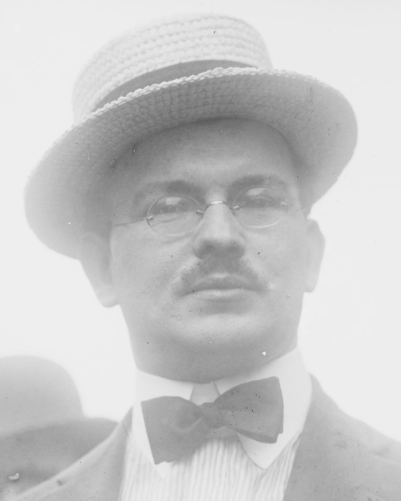

class: center, middle, inverse
background-image: url(https://www.unomaha.edu/university-communications/downloadables/campus-icon-the-o/uno-icon-color.png)
background-position: 95% 90%
background-size: 10%

# The Process and Problems  
# of Criminological Research

<br>
<br>
<br>

[Justin Nix](https://jnix.netlify.app)  
*School of Criminology and Criminal Justice*  
*University of Nebraska Omaha*

<br>
<br>
<br>
<br>
.white[February 2, 2023]

---
class: middle

> .large[One of the beautiful things about science is that it allows us to bumble along, getting it wrong time after time, and feel perfectly fine as long as we learn something each time.]

<p style="text-align: right; color: gray">\- Martin Schwartz, [*The importance of stupidity in scientific research*](https://doi.org/10.1242/jcs.033340)

---
class: middle, center, inverse

# Criminological research questions

---
class: top

# Criminological research questions

--

## Identifying a question

--

```{r, echo=FALSE, fig.align='center', out.width = "65%"}

```
<p style="text-align: center; color: gray">.small[Image by [Anastos Kol](https://flickr.com/photos/anastoskol/) on [Flickr](https://flic.kr/p/2g9SWn8), [CC BY-NC 2.0](https://creativecommons.org/licenses/by-nc/2.0/)]</p>

???

Maybe you have curiosity that stems from **personal** or **vicarious** experiences. 

Or, most articles include questions for future research to answer in their "discussion" or "limitations" sections. 

But the primary source for many criminologists is **criminological theory**. 

Of course, funding opportunities or local practitioners in search of answers may also dictate the kinds of questions we ask. 

---
class: top

# Criminological research questions

--

## Refining a question

???

Coming up with interesting questions is the easy part. The trickier part is focusing in on **problems of a manageable size.** 
- Often, we're interested in much more than we can reasonably investigate with our limited time and resources, and/or limited data availability

--

.pull-left[
```{r, echo=FALSE, fig.align='center', out.width = "95%"}
knitr::include_graphics("out-of-focus.jpg")
```
<p style="text-align: center; color: gray">.small[Image by [Thomas Hawk](hhttps://flickr.com/photos/thomashawk/) on [Flickr](https://flic.kr/p/hkKYG2), [CC BY-NC 2.0](https://creativecommons.org/licenses/by-nc/2.0/)]</p>
]

--

.pull-right[
```{r, echo=FALSE, fig.align='center', out.width = "95%"}

```
<p style="text-align: center; color: gray">.small[Image by [Thomas Hawk](https://flickr.com/photos/thomashawk/) on [Flickr](https://flic.kr/p/68BP7d), [CC BY-NC 2.0](https://creativecommons.org/licenses/by-nc/2.0/)]</p>
]

???

So what to do? Best approach is to develop your research question one bit at a time, using a step-by-step strategy. 

Don't sit around hoping the perfect question will just come to you like a light bulb moment. Instead, jot down possible questions as you go along.
- Read. Refine your questions. Read some more. Refine some more. Wash, rinse, repeat. 
- And keep in mind that the research you ultimately do will more likely than not produce additional research questions you can explore with future research. 

---
class: top

# Criminological research questions

--

## Evaluating a question

--

```{r, echo=FALSE, fig.align='center', out.width = "30%"}

```

???

Three criteria for a good question:  **feasibility**, **social importance**, and **scientific relevance**. 

**Feasibility**
- What sort of time constraints are you working under? 
- What resources do you have at your disposal? 
- Do adequate data already exist, or would you need to go collect novel data? *Could you even collect such data?*

**Social importance**
- Put simply: could answering this question make a difference for society (or some particular group)? If not...it's probably not worth your time. 
- The question should carry significance for the discipline as well as public policy. 
- You should also be motivated/excited about the question. If you're not really interested in it, it may be best to move on to a question that *does* interest you.

**Scientific relevance**
- Your research question should be grounded in the existing empirical literature. 
  - That is, it should be informed by what the evidence currently tells us about the matter. If it isn't, we risk reinventing the wheel, or making mistakes that have already been made before us, and were therefore preventable. 

---
class: middle, center, inverse

# The role of criminological theory

---
class: top

# The role of criminological theory

--

.pull-left[
```{r, echo=FALSE, fig.align='center', out.width = "80%"}

```
]

.pull-right[
```{r, echo=FALSE, fig.align='center', out.width = "85%"}

```
]

???

**What is theory?**
- It's a logically interrelated set of propositions about empirical reality. 
- They help us organize and make sense of a chaotic world. 
- They help guide future research.
- And they should help guide public policy. 
  - E.G., what should we do to reduce domestic violence? 
  
A good theory will contain **theoretical constructs** - which describe what is important to examine in order to understand, explain, predict, and ultimately "do something" about crime. 

A theory must also be **falsifiable**. If we can't empirically scrutinize a theory, it's not a theory at all, but a philosphy or faith-based belief. 

**Discussion**: Are you familiar with any theories about criminal or deviant behaviors, or how society should respond to them? 
- Maybe refer back to our discussion from Chapter 1 about the causes of youth violence

**Deterrence Theory** (Cesare Beccaria shown on the left)
- People are at least marginally rational; they weigh the expected costs and benefits of their actions
- Criminal sanctions can deter time *generally* and *specifically*. 

**Labeling Theory** (Frank Tannenbaum shown on the right)
- Distinguishes between *primary* and *secondary* deviance
- Sanctions label individuals as "deviant" in the eyes of others
- Once the label is applied, others will treat the person as a deviant, causing the person to act in a way consistent with the label. 
- So ironically, punishing a person stimulates more of the behavior it was meant to eliminate.

---
class: middle, center, inverse

# Social research strategies

---
class: top

# Social research strategies

--

## The "research wheel"

```{r, echo=FALSE, fig.align='center', out.width = "70%"}

```

???

[MAKE SURE THE STUDENTS UNDERSTAND WHAT A VARIABLE IS]

**Deductive reasoning** begins with a general idea or theory and proceeds to collect specific information (data). 
- From our theory, we form testable **hypotheses** about the relaionship between two or more **variables**. 
  - A **variable** is a characteristic or property that can vary (e.g., eye color, height, general happiness, etc.). 
  - Meanwhile, a **constant** does not vary. If we were studying a sample of people incaracerated at a male correctional facility, *sex* would be a constant, whereas *offense committed* would be a variable. 

**Inductive reasoning** is just the opposite: here, you have specific data, and you try to develop theory based on those data. 
- You do so by making **empirical generalizations** about the data. 

All research is an effort to connect theory and empirical data, and the two have a mutually reinforcing relationship. 

Consider a finding that runs counter to your theoretical expectations (and doesn't appear to be a methodological misstep). You'd want to reason inductively to make whatever theoretical sense you could of such an **anomalous finding**. And if it's sufficiently important, you might return to deductive reasoning and draw up a new study to formally test your ideas. 

---
class: middle, center, inverse

# Case study:
# Domestic violence and the research wheel

---
class: middle, center

# Case study:
# Domestic violence and the research wheel

--

Imagine you're a police officer and you've been dispatched to a **domestic violence** call.

--

What options do you have to resolve the matter?

--

Which do you think would most effectively reduce **repeat offenses**?

---
class: top

# Domestic violence and the research wheel

--

## Phase 1: [Deductive research](https://www.jstor.org/stable/2095575)

```{r, echo=FALSE, fig.align='center', out.width = "69%"}

```

---
class: top

# Domestic violence and the research wheel

--

## Phase 2: More [deductive research](https://vawnet.org/sites/default/files/materials/files/2016-09/AR_Arrest.pdf)

???

Remember, we should always be concerned about **validity**:
- Measurement validity, generalizability, and causal validity.

Concerns with the Minneapolis Study:
- Most domestic assaults actually **don't get reported** to police
  - Follow-up interviews with victims *generally* comported with the study's main findings
- Adherence to the randomization protocol (i.e., treatment as intended vs. treatment as delivered)
- How can we know if the results from Minneapolis are *generalizable* to other places? 

--

```{r, echo=FALSE, fig.align='center', out.width = "69%"}

```

???

Six replication sites, and the researchers tightened up the randomization process so that police officers would be more likely to adhere
- In Colorado Springs and Dade County, results were similar to Minneapolis: arrest seemed to lower recidivism
- But in Omaha, Charlotte, and Milwaukee, researchers found long-term *increases* in DV among those who were arrested.

So at this point researchers had traveled around the wheel twice to answer their RQ. But instead of gaining confidence in deterrence theory, results now seemed to call it into question. 

---
class: top

# Domestic violence and the research wheel

--

## Phase 3: [Inductive research](https://www.jstor.org/stable/2095921)

???

Now, researchers needed to make theoretical sense of their conflicting observations. 
- Just a function of different samples? 
- Implementation? 
- Is the theory wrong? 

Sherman turns to **control theory** (Toby, 1957)
- **Stakes in conformity** decrease a person's propensity to offend. 
  - Hypothesis derived from theory: people who are employed, married, have kids are more likely to be deterred by the threat of arrest than those who are unemployed, single, and have no kids.
  - Because they have more to lose
  
--

```{r, echo=FALSE, fig.align='center', out.width = "69%"}

```

???

Now we've been around the wheel **three** times, and maybe it's more appropriate to call it a spriral at this point. 

1. Minneapolis study seemed to support deterrence theory
2. Only 2/5 SARP sites replicated the Minneapolis findings; thus, arrest doesn't always deter DV recidivism. 
3a. Re-examine Milwaukee w/control theory in mind: arrest is a deterrence *if* a person is married, employed. 
3b. Arrest can also deter so long as offenders feel like they were treated fairly by officers. 

---
class: top

# Domestic violence and the research wheel

--

## Phase 4: More [deductive research](https://heinonline.org/HOL/P?h=hein.journals/lwsocrw31&i=173)

???

Ray Paternoster et al. (1997) re-examine the Milwaukee data to test **procedural justice theory**. 
- In Milwaukee, arrest had an overall *criminogenic* effect - meaning arrest increased the likelihood of future offending. 
- Perhaps this was a function of *how they were treated* during arrest rather than the simple fact they were arrested.

--

```{r, echo=FALSE, fig.align='center', out.width = "69%"}

```

???

Indeed, recidivism levels among the High PJ arrestee group were comparable to the warned group. This supports PJ theory - how people are treated may matter more to them than the outcome they receive. 

---
class: top

# Domestic violence and the research wheel

--

## Meanwhile: Other researchers do [exploratory research](https://doi.org/10.1177/088626099014007006)

--

Why do victims often choose not to press charges?

???

Another thing we learned from Minneapolis and the replication sites is that victims often decide not to press charges.

Researchers used exploratory, qualitative research to find out why. 

--

```{r, echo=FALSE, fig.align='center', out.width = "58%"}

```

---
class: middle, center, inverse

# Guidelines for criminologists

---
class: top

# Guidelines for criminologists

--

1. Test ideas against empirical reality without becoming too invested in a particular outcome.

???

1. Empirical testing requires a neutral and open-minded approach (to the best of your ability). 

--

2. Plan and carry out investigations systematically. 

???

2. This seems obvious, but once you start doing social science research, you'll understand how messy it can get. For example in the original Minneapolis study, Sherman and Berk gave officers a randomized, color-coded report sheet to determine whether to arrest or separate. But it turns out officers sometimes just did what they wanted to do (and thus treatment as delivered did not align with treatment as intended). So in some of the replications, officers were required to call in to a central number in order to receive the experimentally determined treatment. 

--

3. Document all procedures and disclose them publicly.

???

3. Transparency is a key feature of science. It allows others to evaluate/replicate your research, thus contributing to the accumulation of knowledge. Sometimes, mistakes are uncovered and papers fall apart, warranting **retraction**. The bottom line is: lack of transparency hinders science. 

--

4. Clarify the assumptions you're making. 

???

4. All studies come with some basic/fundamental assumptions. Studies testing deterrence theory assume that people who break the law calculate risks and benefits. Election polls assume that people actually vote for the candidate they say they'll vote for. By definition, we can't directly test assumptions (though we might be able to run a series of robustness checks that might increase/decrease faith in our results). But by thinking through your assumptions and making sure to disclose them, you provide important info for others to evaluate your work.

--

5. Define all the terms you're using. 

???

5. Words can often be fuzzy or have multiple meanings. Think back to what we talked about in the last chapter. What does **violence** mean to you? What does it mean to **trust** the government? We have to define explicitly these terms, how we're measuring them, and use them consistently. 

--

6. Maintain a skeptical stance.

???

6. Just remember that the results of any particular study must be examined critically. It's tempting to become confident about your interpretation of the world when it is supported by repeated investigations, but remember that all studies are making assumptions and come with limitations, so try to remain open to ideas that challenge your view. 

--

7. Replicate research and accumulate knowledge.

???

7. No one study can settle a matter; there will always be some plausible threats to its validity. On this point, it is also important to note that research results should be published so that we don't fall victim to **publication bias**. 

- If we're more likely to report significant findings, this will skew the evidence base. E.G., imagine we do 10 "hot spots policing" trials, and 1 of the 10 trials shows that it significantly reduces crime. If we only publish THAT finding, it's not only disingenuous but it might cause harm. 

--

8. Maintain an interest in theory.

???

8. We should always strive to use theory to guide our reasoning (deduction), or seek a better understanding of why observations don't support existing theory (induction). In other words, theory should always be involved in the research process.

--

9. Search for regularities or patterns.

<p style="text-align: center; color: gray">.small[(from Bachman & Schutt, [*Fundamentals of Research in Criminology and Criminal Justice*](https://us.sagepub.com/en-us/nam/fundamentals-of-research-in-criminology-and-criminal-justice/book259178))]

???

9. Sound obvious? Just remember there are always outliers, exceptions, etc. On their own, these do not negate theories.

---
class: top, center, inverse


# Have a great day! 😄


<!-- ```{css, echo=FALSE} -->
<!-- @media print { -->
<!--   .has-continuation { -->
<!--     display: block; -->
<!--   } -->
<!-- } -->
<!-- ``` -->

<style>
p.caption {
  font-size: 0.5em;
  color: lightgray;
}
</style>