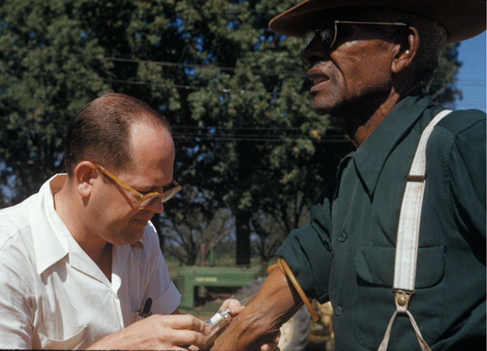
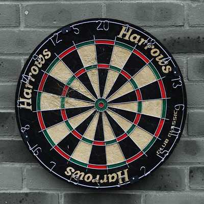
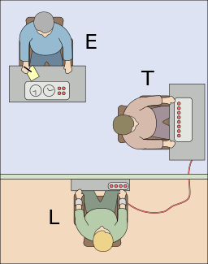
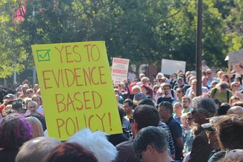
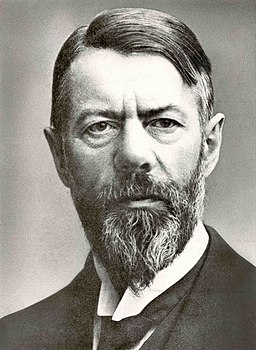
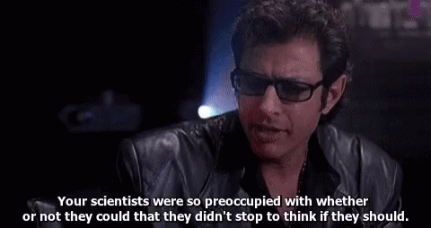

class: center, middle, inverse
background-image: url(https://www.unomaha.edu/university-communications/downloadables/campus-icon-the-o/uno-icon-color.png)
background-position: 95% 90%
background-size: 10%

# Ethical Guidelines for Research

<br>
<br>
<br>

[Justin Nix](https://jnix.netlify.app)  
*School of Criminology and Criminal Justice*  
*University of Nebraska Omaha*

<br>
<br>
<br>
<br>
<br>
.white[February 8, 2024]

---
class: middle, center

# Ever heard of the Stanford Prison Experiment? 

<iframe width="560" height="315" src="https://www.youtube.com/embed/3XN2X72jrFk" title="YouTube video player" frameborder="0" allow="accelerometer; autoplay; clipboard-write; encrypted-media; gyroscope; picture-in-picture; web-share" allowfullscreen></iframe>

---
class: middle, center

# What about Stanley Milgram's Shock Study?

<iframe width="560" height="315" src="https://www.youtube.com/embed/3YOox59J0Bk" title="YouTube video player" frameborder="0" allow="accelerometer; autoplay; clipboard-write; encrypted-media; gyroscope; picture-in-picture; web-share" allowfullscreen></iframe>

---
class: middle, center, inverse

# Historical background

---
class: top

# Historical background

--

```{r, echo=FALSE, fig.align='center', out.width = "80%"}

```
<p style="text-align: center; color: gray">.small[[The Nuremberg Trials](https://en.wikipedia.org/wiki/Nazi_human_experimentation)]</p>
]

???

1946: The Nuremberg War Crime Trials expose horrific medical experiments conducted by Nazi doctors and others in the name of "science."
- Conducted on prisoners - including children and people with disabilities - without their consent
- Often without anesthesia, and often resulting in death, trauma, disfigurement, or permanent disability

For example: at Auschwitz from 1943-44, experiments were performed on nearly 1500 sets of twins, of which, only 200 people survived. 
- Experiments including amputations, infecting them with various diseases, and injecting dye in their eyes to change their eye color
- Lead doctor, Josef Mengele, also tried to create conjoined twins by sewing them together
- If the first twin died, the other "control twin" would be brought in and killed. Alternatively, if the first twin survived, Mengele would dissect their bodies. 
---
class: top

# Historical background

--

```{r, echo=FALSE, fig.align='center', out.width = "77%"}

```
<p style="text-align: center; color: gray">.small[The US Public Health Service [Syphilis Study at Tuskegee](https://jamanetwork.com/journals/jama/fullarticle/1156872)]</p>
]

???

1970s: Americans shocked to learn that researchers funded by the Public Health Service followed 399 low-income black men with syphilis in the 1930s, collecting data to observe the natural course of the illness

- Many participants were not informed of their illness and were **denied treatment until 1972** - even though a cure (penicillin) was developed in the 1950s!

---
class: top

# Historical background

???

The result of these and other human rights violations resulted in the 1979 **Belmont Report**, issued by the National Commission for the Protection of Human Subjects of Biomedical and Behavioral Research. It established three basic ethical principles:

1. Respect for persons
  - Treat persons as autonomous agents and protect those with diminished autonomy
  
2. Beneficence
  - Minimize harms, maximize benefits
  
3. Justice
  - Distributing benefits and risks of research fairly

--

```{r, echo=FALSE, fig.align='center', out.width = "80%"}

```

---
class: middle, center, inverse

# Ethical principles

---
class: top

# Ethical principles

--

## Achieving valid results

???

The necessary starting point for any ethical research practice is **a commitment to achieving valid results.**

- We have no business asking people to answer our questions, submit to observations, or participate in our experiments if we are simply seeking to verify our preexisting prejudices or convince others to take action on behalf of our personal interests. 

Zimbardo designed the Stanford Prison Experiment so that it would seem realistic to the participants, but also enable him to carefully measure important variables and observe behaviors at all times. 

- But others argue that the guards' behaviors weren't so much influenced by the experimental conditions as by the instructions Zimbardo gave the guards at the start of the experiment. In a separate experiment, when guards were trained to respect prisoners, their behavior was less malicious (Lovibond et al. 1979). 

**Should our ethical judgments differ when we are confident a study's results provide valid information about important social processes?**

It is hard to justify *any* risk for human subjects - or *any* expenditure of time and resources - if our findings tell us nothing about the reality of what we're trying to understand. 

--

```{r, echo=FALSE, fig.align='center', out.width = "45%"}

```
<p style="text-align: center; color: gray">.small[Image by [anonphotography.com](https://flickr.com/photos/anonphotography/) on [Flickr](https://flic.kr/p/agn78o), [CC BY-NC 2.0](https://creativecommons.org/licenses/by-nc/2.0/)]</p>

---
class: top

# Ethical principles

--

## Honesty and openness

--

```{r, echo=FALSE, fig.align='center', out.width = "65%"}

```
<p style="text-align: center; color: gray">.small[Image by [Nick Youngson](http://www.nyphotographic.com/) on [Pix4free](https://pix4free.org/photo/16458/transparency.html), [CC BY-SA 3.0](https://creativecommons.org/licenses/by-sa/3.0/)]</p>

???

Scientists must openly disclose their methods and present their findings honestly. In order for others to assess the validity of a researcher's conclusions (or the ethics of their procedures), they need to know exactly how the research was conducted. This information is usually detailed in a "Methods" section in a journal article or report. 

Some are hesitant to disclose their procedures or results to p revent others from building on their ideas and taking some of the credit. 

---
class: top

# Ethical principles

--

## Protecting research participants

--

### Avoid harming them

--

```{r, echo=FALSE, fig.align='center', out.width = "30%"}

```
<p style="text-align: center; color: gray">.small[Image by [Fred the Oyster](https://commons.wikimedia.org/wiki/User:Fred_the_Oyster) on [Wikimedia Commons](https://commons.wikimedia.org/wiki/File:Milgram_experiment_v2.svg), [CC BY-SA 4.0](https://creativecommons.org/licenses/by-sa/4.0/)]</p>

???

Zimbardo himself admitted his experiment was unethical because it violated two principles:

1. Participants suffered "considerable anguish...and the [the experiment] resulted in such extreme stress and emotional turmoil that five of the sample of initially healthy young prisoners had to be released early" (Zimbardo 2008: 233-34). 
2. Zimbardo did not disclose in advance the nature of the arrest or booking procedures at police HQ, nor did he disclose to the participants' parents how bad things had gotten when they came to a visiting night. 

Still, there was no long-lasting harm to the participants, and there were some long-term social benefits of the research. 
- Thanks in part to **debriefing** and **follow-up interviews**. 

**What do you think: was Zimbardo's experiment ethical or unethical?**

Meanwhile, Milgram believed his experiment was 100% ethical. He was motivated by the Nuremberg Trials - wanting to know the conditions under which ordinary citizens would be obedient to authority figures' instructions to inflict pain on others. 
- When he did a follow-up survey of participants:
  - 84% were glad or very glad to have participated
  - 15% were neutral
  - 1% were sorry or very sorry to have participated
  
**Was the shock study ethical or unethical?**

**Does the fact that these studies seemed to have yielded significant insights into human behavior make any difference?**

---
class: top

# Ethical principles

## Protecting research participants

--

### Obtain informed consent

```{r, echo=FALSE, fig.align='center', out.width = "65%"}

```
<p style="text-align: center; color: gray">.small[Image by [NHGRI](https://www.flickr.com/photos/genomegov/) on [flickr](https://flic.kr/p/2n3v6xy), [CC BY-NC 2.0](https://creativecommons.org/licenses/by-nc/2.0/)]</p>

???

To be truly informed consent, it must be given by persons who are *competent to consent*, *can consent voluntarily*, are *fully informed about the research*, and *comprehend what they have been told*. 
- So minors usually get an opportunity to give/withold their assent or compliance, and a legal guardian must grant additional written informed consent
- People who are vulnerable to coercion also get special protections
  - People who are incarcerated, pregnant women, people with mental disabilities, and educationally or economically disadvantaged persons. 

---
class: top

# Ethical principles

## Protecting research participants

--

### Avoid deception, except in limited circumstances

```{r, echo=FALSE, fig.align='center', out.width = "50%"}

```
<p style="text-align: center; color: gray">.small[Image by [frankieleon](https://www.flickr.com/photos/armydre2008/) on [flickr](https://flic.kr/p/bniBdg), [CC BY 2.0](https://creativecommons.org/licenses/by/2.0/)]</p>

???

**But what about experimental research like Milgram's, which REQUIRES deception?**
- The study would be worthless if subjects understood what was really happening during the experiment. 

There are many other studies that employ placebos or ruses to ensure that participants' behavior is genuine.
- E.G., Piliavin & Piliavin (1972): fake seizures on subway trains to study helpfulness of bystanders. 

- The key question: **is there sufficient justification to allow the use of deception**? 
- Researchers should have a carefully designed debriefing procedure
  - Though another concern is that debriefed subjects can disclose the nature of the experiment to others who haven't yet participated, thereby contaminating results. Unfortunately, delaying the debriefing process can potentially compromise the ability for it to lessen harm. 

---
class: top

# Ethical principles

## Protecting research participants

--

### Maintain privacy and confidentiality

```{r, echo=FALSE, fig.align='center', out.width = "48%"}

```
<p style="text-align: center; color: gray">.small[Image by [Mike MacKenzie](https://www.vpnsrus.com/) on [flickr](https://flic.kr/p/VTaZJH), [CC BY 2.0](https://creativecommons.org/licenses/by/2.0/)]</p>

???

Researchers should have plans for how data will be stored and where any confidential information will be kept. 
- Locking hard copies in an office no one else can access without a key
- Special identifying codes

Statements about confidentiality must be realistic: in some cases, laws allow research records to be subpoenaed and may require researchers to report, e.g., child or elder abuse, or instances where respondents might immediately harm themselves or others. 

NIJ can issue a **privacy certificate** (NIH calls it a **certificate of confidentiality**) which protects researchers from being legally required to disclose confidential information. 

The Health Insurance Portability and Accountability Act (HIPAA) was passed by Congress in 1996 - creating much more stringent regulations for the protection of health care data. 
- Requires researchers to have valid authorization for any use or disclosure of "protected health information" from a health care provider. 

---
class: top

# Ethical principles

--

## The uses of research

```{r, echo=FALSE, fig.align='center', out.width = "65%"}

```
<p style="text-align: center; color: gray">.small[Image by [John Englart](https://flickr.com/photos/takver/) on [flickr](https://flic.kr/p/TVfoQB), [CC BY-SA 2.0](https://creativecommons.org/licenses/by-sa/2.0/)]</p>

???

**Should we strive to leave personal values outside of the laboratory, or is it okay for scientists to be concerned about how their research might be used?**
- That is, with the practical implications
- Milgram for example highlighted the extent of obedience to authority, and identified multiple factors that could be manipulated to lessen blind obedience
  - Encouraging dissent by one group member
  - Removing the subject from direct contact with the authority
  - Increasing the contact between the subject and the victim
  
Thinking back to the Minneapolis DV Experiment...Sherman explicitly warned not to adopt mandatory arrest policies on the basis of that one study, but the results were publicized in mass media and encouraged many jurisdictions to change their policies. 

When we conduct research on behalf of specific organizations we may face additional difficulties when they control the report / narrative. 
- Thus it is always important to acknowledge the **source of funding**

*Witholding beneficial treatment* from a control group is also a cause for ethical concern. 
- The DV experiments ran the risk of causing further harm to victims when their abusers were not arrested.
- The trouble is: we don't know until the experiment is done!
  - And even then: results might not replicate everywhere...

---
class: middle, center, inverse

# Social research philosophies

---
class: top

# Social research philosophies

--

## Positivism and postpositivism

```{r, echo=FALSE, fig.align='center', out.width = "35%"}

```

???

(Picture is Auguste Comte, considered the father of modern positivism)

**Positivism** is the belief that an objective reality exists apart from the perceptions of those who observe it. Thus, the goal of science is to better understand this reality (e.g., Weber 1949). 
- There are universal laws of human behavior, and scientists must be objective and unbiased in order to see reality clearly.

**Postpositivism** is the belief that there is an external, objective reality, but with recognition of its complexity and the limitations of the scientists who study it. 
- Scientists cannot ever be sure that their methods allow them to perceive objective reality. Rather, the goal of science can only be to achieve **intersubjective agreement** among scientists. 

An important point here is that positivists believe the goal of science is to develop valid knowledge about how society is organized or how we live our lives. It **does not** tell us how society *should* be organized or how we *should* live our lives.
- Determination of empirical facts should be a separate process from the evaluation of those facts as satisfactory or unsatisfactory. 

---
class: top

# Social research philosophies

--

## Interpretivism and constructivism

```{r, echo=FALSE, fig.align='center', out.width = "32%", fig.cap = "(Hacerahsen, CC BY-SA 4.0, via Wikimedia Commons)"}

```

???

(Image is Max Weber) 

Meanwhile, **interpretivism** is the belief that all "reality" is socially constructed, and that the goal of science is to understand what meanings people give to reality (*not* to determine how reality works apart from these interpretations). 
- Often guides qualitative research
- Interpretivists reject the positivist belief that there is a concrete, objective reality. Scientists construct an image of reality based on their own preferences, prejudices, and interactions with others. 
- Belief positivist and postpositivist theories are too general and don't reflect the nuance often found in human behavior.

**Constructivism** extends interpretivism by emphasizing the importance of *exploring how stakeholders in a social setting construct their beliefs.* 
- Begins by identifying the different interest groups in the research setting. Goes on to learn what each group thinks and gradually tries to develop a shared perspective on the problem being evaluated. 
- Goal is to achieve a more just society
  - Bring values into the research process, perhaps even collaborate actively with the persons being studied

---
class: top

# Social research philosophies

--

## An integrated philosophy

```{r, echo=FALSE, fig.align='center', out.width = "80%"}
knitr::include_graphics("predator.jpg")
```

???

It's tempting to think of positivism and postpositivism as an opposing research philosophy to interpretivism and constructivism. But there are good reasons to prefer a philosophy that integrates some of the differences.

For example: there is evidence that neither the positivists nor the constructivists get it 100% correct W/R/T the distinction/relationship between values and facts. 
- Savelsberg et al. (2002) examined influences on the focus and findings of published CJ scholarship. 
  - CJ research more likely to be oriented to topics and theories suggested by the state when it was funded by government agencies (political influence)
  - But government funding did **not** have any bearing on researchers' conclusions about the processes they were examining. (Suggests science can be insulated from subjective pressures)

---
class: middle, center, inverse

```{r, echo=FALSE, fig.align='center', out.width = "80%"}

```

# Have a great day! 😄

<!-- ```{css, echo=FALSE} -->
<!-- @media print { -->
<!--   .has-continuation { -->
<!--     display: block; -->
<!--   } -->
<!-- } -->
<!-- ``` -->

<style>
p.caption {
  font-size: 0.5em;
  color: lightgray;
}
</style>