class: center, middle, inverse
background-image: url(https://www.unomaha.edu/university-communications/downloadables/campus-icon-the-o/uno-icon-color.png)
background-position: 95% 90%
background-size: 10%

# Conceptualization and Measurement

<br>
<br>
<br>

[Justin Nix](https://jnix.netlify.app)  
*School of Criminology and Criminal Justice*  
*University of Nebraska Omaha*

<br>
<br>
<br>
<br>
<br>
.white[February 16, 2023]

---
class: middle, center, inverse

# Conceptualization → Operationalization

---
class: top

# Conceptualization → Operationalization

???

After we've defined our theoretical concepts in the abstract (i.e., conceptualizing), and after we have specified the specific variables we'd like to measure, we must develop our measurement procedures (i.e., **operationalization**). 

So it might be useful to look at some recent examples of the **operationalization process** used by my coauthors and me in a couple of recent studies. 

--

```{r, echo=FALSE, fig.align='center', out.width = "68%"}
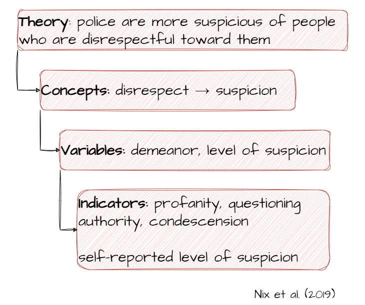
```

???

Here, we were building on decades of research testing the "demeanor hypothesis" - the idea that police respond more punitively to citizens who have an attitude. 
- Many studies carried out with different samples and methodologies in the 70s, 80s, and 90s appeared to confirm the demeanor hypothesis: cops were more likely to ticket or arrest "hostile" citizens. 
- Klinger (1994) challenged this literature, primarily on the grounds that researchers were conflating demeanor and compliance. 

We make the case that systematic social observation makes it difficult, if not impossible, to tease apart the two, because they so often occur simultaneously. So if a cop arrests a citizen who is both hostile AND noncompliant, we can't say for sure which was the more proximate cause of the officer's decision to arrest. 

Our study uses a survey experiment, giving us the ability to manipulate/precisely measure the key concepts (demeanor, suspicion). 
- Operationalization:  we vary how the citizen is acting in a hypothetical vignette, and we ask officers to tell us **how** suspicious they are (among other things) on a Likert scale. 

---
class: top

# Conceptualization → Operationalization

--

```{r, echo=FALSE, fig.align='center', out.width = "75%"}
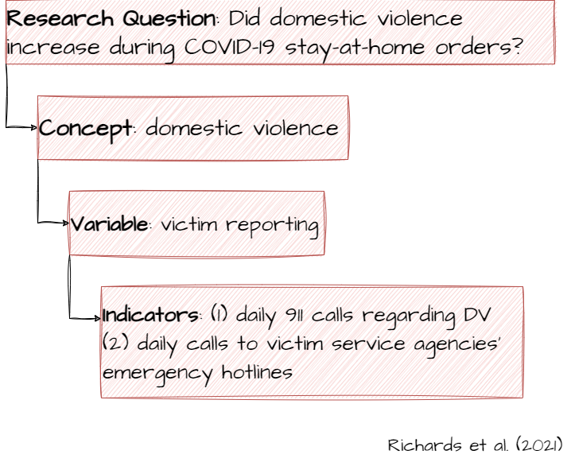
```

???

Here's another example from Dr. Richards and I, along with a couple of colleagues. 

At the start of the pandemic, when many places adopted SAHOs, there was an explosion of research reporting that domestic violence was increasing.
- Lots of single-city studies
- In every instance, the concept researchers want to measure is DV. But the best available data is generally 911 calls. So the variable becomes "victim reporting" - which we know won't tell the whole story because victims often choose not to report. 

Dr. Richards also pointed out that victims may choose to report to an entity other than the police - e.g., emergency hotlines operated by victim assistance agencies. She was able to secure call data from 7 agencies, and we pulled 911 data from the police departments serving the same jurisdictions. 
- Unsurprisingly, we found that results varied across jursidictions. Some saw calls to both agencies go up, some saw increases in calls to one, but not the other. 

The thing to keep in mind here is that good conceptualization and operationalization can prevent confusion later on in the process. 

---
class: middle, center, inverse

# Identifying the best data

---
class: top

# Identifying the best data

--

## Using available data

???

The first question to wrestle with: *do you need to collect* ***original data,*** *or is there already some* ***secondary data*** *out there?*

Lots of useful data for CJ research already out there, courtesy of BJS, FBI, the US Census Bureau, etc. 

Local governments often compile annual reports, or in some cases publish data online, that CJ researchers can leverage. 
- Just have to be careful about comparing across jurisdictions, as definitions of concepts may vary. 
  - E.G., what constitutes "more than necessary force" or what makes a "simple" vs. "aggravated" assault. 

--

For example: [National Incident-Based Reporting System](https://cde.ucr.cjis.gov/LATEST/webapp/#/pages/home)

```{r, echo=FALSE, fig.align='center', out.width = "50%"}
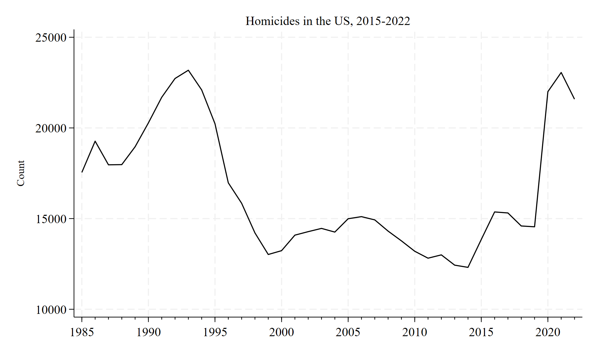
```

???

NIBRS is compiled annually by the FBI from data submitted by local police departments.
- But participation is voluntary, so the estimates come with a good bit of *uncertainty* due to non-reporting. 
  - In 2021 - which is the most recent data we have - only about 63% of agencies submitted data. 
  - **Think back to your first homework assignment**: do you trust a 63% sample? 
  - Maybe we could non-response was randomly distributed. But it's not. NIBRS overrepresents southern agencies and underrepresents large cities. 

---
class: top

# Identifying the best data

## Using available data

For example: [National Law Enforcement Officers Memorial Fund](https://nleomf.org/memorial/facts-figures/officer-fatalities-by-state/)

```{r, echo=FALSE, fig.align='center', out.width = "65%"}
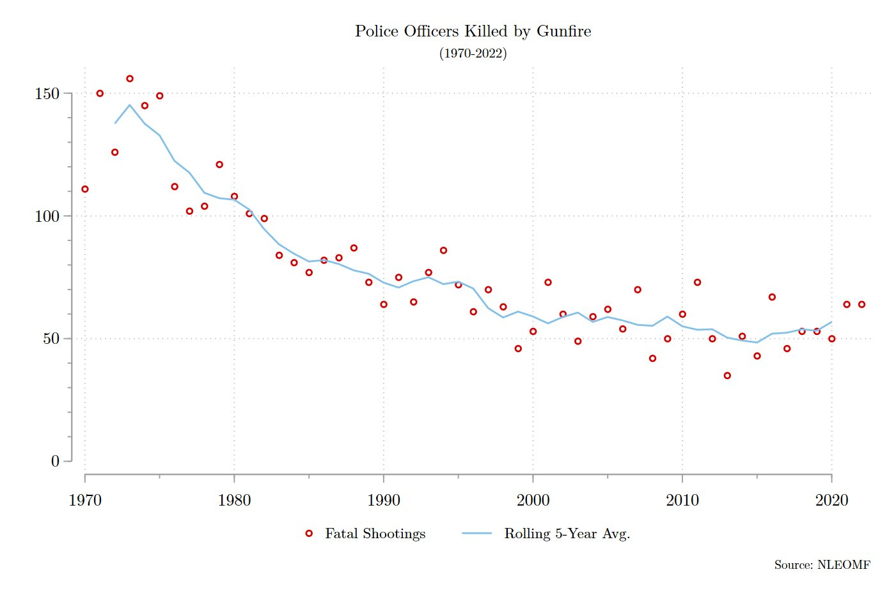
```

???

Nonprofits and other private organizations often compile and release data, too. 

For example, USA Today recently ran a story claiming a "disturbing trend" in killings of police officers. There were 64 officers killed in the line of duty in 2022.
- I pulled the data from the story and made this graph, which shows that killings of officers have hovered around 55 per year since 1995. 
- Yes, the number isn't exactly 55 every year. It's bounced as low as ~35 and as high as ~75. **Because that's what statistically rare outcomes do**. 
  - How much of the variation is meaningful, and how much is just noise? Hard to say. 
  - But one thing clear from this graph is that killings of police officers are much less common today than they were in the 1970s. **Why?**
  
---
class: top

# Identifying the best data

???

Perhaps secondary data don't exist. Or maybe it does exist, but it's outdated, or you don't like the way key concepts were measured. 
- If the data weren't collected with your project in mind, they may may not be good data for your project. 
- Have to do a cost/benefit analysis: is it worth the time and money to collect new data?
  - Keeping in mind that the goal is to obtain VALID RESULTS. 
  
So maybe you decide a survey is the best method to collect the data you need. (you checked, and Gallup, Pew, NORC, etc., don't have adequate data)
- Will you use **closed-ended** or **open-ended** questions? Closed-ended questions reduce ambiguity and make it easier on respondents. But open-ended questions are preferable when the range of responses can't adequately be anticipated. 
- If you use closed-ended questions, make sure they're **mutually exclusive** and **exhaustive**. 

--

## Constructing questions

???

So following up on our demeanor experiment: we used survey vignettes so that we could isolate demeanor from compliance. This was meant to help us better test the demeanor hypothesis, i.e., hopefully give us more valid results. 

Note that we'll spend more time on **experimental design** in Chapter 6. 

--

*You pull someone over for driving 10 miles over the speed limit. When you approach the driver’s window, he says...*

--

<p style="text-align: center">.large[😃]

“Officer, I think I was only going two miles over the speed limit.” You tell him how fast he was driving. He says “sorry about that, I guess I did not realize how fast I was going.” You ask him for his license and registration. He says “sure, officer,” and hands them to you.

<p style="text-align: right; color: gray; font-size: 75%">\- Nix et al., [*Compliance, noncompliance, and the in-between*](https://link.springer.com/article/10.1007/s11292-019-09363-4)

---
class: top

# Identifying the best data

## Constructing questions

*You pull someone over for driving 10 miles over the speed limit. When you approach the driver’s window, he says...*

--

<p style="text-align: center">.large[😡]

“I was going two fucking miles over the speed limit. Do not you have something better to do?” As you start to tell him how fast he was going, he cuts you off and says, “I do not even want to hear it.” You ask him for his license and registration. <mark>He hands them to you</mark> and says “And you wonder why everyone hates the police.”

<p style="text-align: right; color: gray; font-size: 75%">\- Nix et al., [*Compliance, noncompliance, and the in-between*](https://link.springer.com/article/10.1007/s11292-019-09363-4)

---
class: top

# Identifying the best data

## Constructing questions

*You pull someone over for driving 10 miles over the speed limit. When you approach the driver’s window, he says...*

--

<p style="text-align: center">.large[😡]

“I was going two fucking miles over the speed limit. Do not you have something better to do?” You tell him how fast he was going, and ask for his license and registration. He tells you to “go fuck yourself. <mark>I’m not giving you anything</mark>.” You tell him to step out of the car, and he says “<mark>fuck you</mark>.”

<p style="text-align: right; color: gray; font-size: 75%">\- Nix et al., [*Compliance, noncompliance, and the in-between*](https://link.springer.com/article/10.1007/s11292-019-09363-4)

---
class: top

# Identifying the best data

## Constructing questions

*How trusting or suspicious would you be in this situation?*

1. Very trusting

2. Trusting

3. Somewhat trusting

4. Somewhat suspicious

5. Suspicious

6. Very suspicious

<p style="text-align: right; color: gray; font-size: 75%">\- Nix et al., [*Compliance, noncompliance, and the in-between*](https://link.springer.com/article/10.1007/s11292-019-09363-4)

???

This is a **closed-ended** question - respondents were asked to select only one of the six options.

An **open-ended question** might ask respondents to describe what they would do next. 

---
class: top

# Identifying the best data

--

## Making observations

--

```{r, echo=FALSE, fig.align='center', out.width = "60%"}
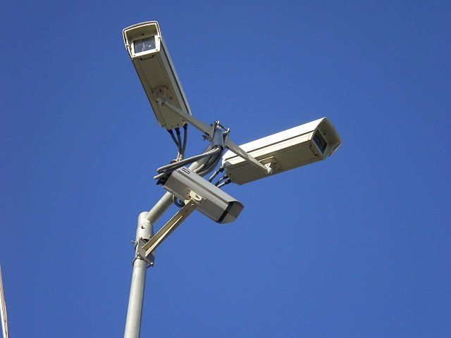
```
<p style="text-align: center; color: gray">.small[[Image](https://commons.wikimedia.org/w/index.php?curid=1906323) by Paweł Zdziarski - Own work, [CC BY 2.5](https://creativecommons.org/licenses/by/2.5/)]</p>

???

**Systematic social observation** is a very careful method of observing phenomena
- E.G., for their seminal study of *collective efficacy*, Sampson et al.:
  - Drove in an SUV at 5mph down every street in a sample of Chicago neighborhoods. 
  - Video cameras were pointed out of each side of the vehicle, which captured features of streets, buildings, businesses, and social interactions on over 15,000 blocks. 
  - Trained observers also rode in the SUVs and completed nearly 24,000 logs about what they saw. 
  
This was once a very popular method of studying police behaviors (e.g., Police Services Study, Project on Policing Neighborhoods). 
- Can capture very rich information about how officers behave in a real-world setting
- Just can't get that with a survey
- But the drawback: it's very expensive and time-consuming. And all of the data is filtered through the eyes of the trained observer
  - So is it **objective reality** or merely **reality as perceived by the observer**?
  - (Your answer probably depends on whether you consider yourself a *positivist* or an *interpretivist*)

---
class: top

# Identifying the best data

--

## Collecting unobtrusive measures

--

```{r, echo=FALSE, fig.align='center', out.width = "52%"}
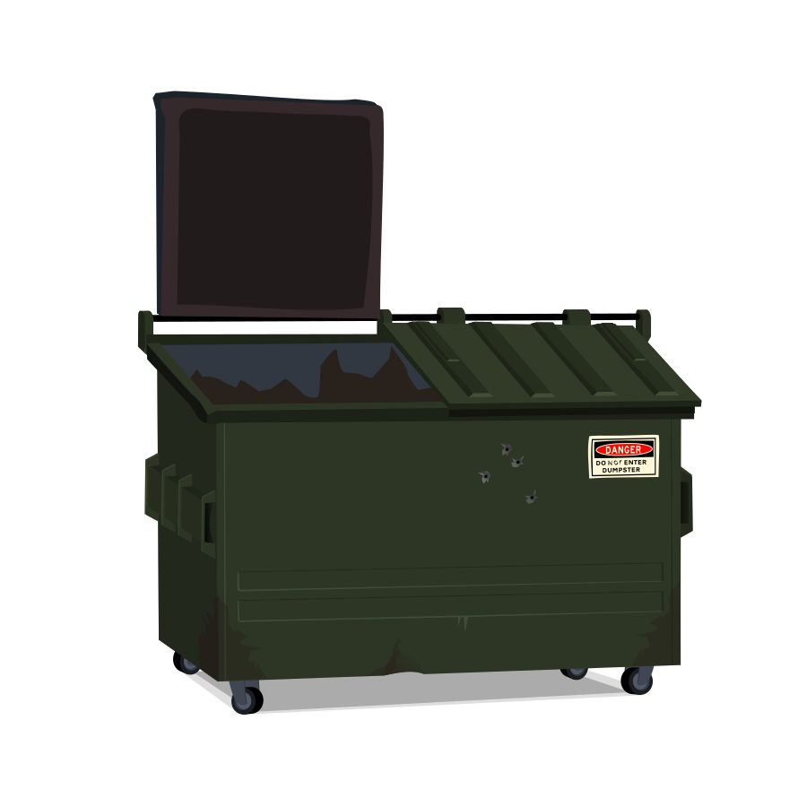
```

???

**Unobtrustive measures** allow us to collect data about individuals or groups without their direct knowledge or participation. 
- E.G., physical trace evidence, archives, simple observation, or contrived observation (e.g., hidden cameras). 

So if we wanted to measure the prevalence of drinking in college dorms or fraternity houses, we might count the number of empty bottles of alcohol in the surrounding dumpsters (trace evidence). 
- **Would this produce valid results?**
  - Things to consider: number of residents in the dorms, time since last trash collection, accessibility of each dumpster to passersby, etc.

Or you might scrape the student newspaper for articles reporting substance abuse or ads for alcohol or nearby pubs (archival data collection).
- **Would this be a better approach?**

**What might be a better way to measure the prevalence of drinking in dorms?**

When possible, we should consider **combining measurement operations**. 
- Similar results across methodologies can bolster our confidence in the validity of our conclusions. 
- Divergent results might indicate that one or more of the measures is influenced by more measurement error than is tolerable. 
- Could also mean that our measures are operationalizing different concepts. 

---
class: middle, center, inverse

# How much information do we really have?

---
class: top

# How much information do we really have? 

--

## Nominal level of measurement

???

AKA categorical or qualitative level of measurement. 

Values have no mathematical interpretation. They only vary in kind or quality, not in amount. 

In fact, you might refer to "attributes" of nominal variables, rather than "values." 

Gender, race, ethnicity, occupation, region of the country → all nominal variables. 

--

<br>

<p style="text-align: center">For example: occupation

<p style="text-align: center">.large[`r emo::ji("policeman")` `r emo::ji("male_detective")` `r emo::ji("woman_health_worker")` `r emo::ji("woman_teacher")` `r emo::ji("man_technologist")` ]

???

If we were surveying various experts in the area of violence, we might want to include police officers, investigators, trauma surgeons, and criminologists in our sample. Our "occupation" variable is nominal - these attributes have no mathematical meaning. 

---
class: top

# How much information do we really have? 

--

## Ordinal level of measurement

--

<p style="text-align: center">For example: This question

```{r, echo=FALSE, fig.align='center', out.width = "85%"}
knitr::include_graphics("ordinal-question.png")
```

<p style="text-align: right; color: gray; font-size: 75%">- Nix et al., [*Testing a theoretical model of perceived audience legitimacy*](https://doi.org/10.1177/0022427819873957)

???

**Ordinal** is the first of three levels of quantitative measurement. At this level, numbers assigned to cases specify the order, and enable us to make "greater-than" and "less-than" comparisons.
- For example, the Core Alcohol and Drug Survey asked respondents about how often they use various drugs:
  - Never, once a year, 6x a year, once a month, twice a month, once a week, 3x a week, every day
  - Here, you could determine if one respondent uses more, less, or about the same as another respondent, but you couldn't get any more specific than that. 

---
class: top

# How much information do we really have? 

--

## Interval level of measurement

--

<p style="text-align: center">For example: Fahrenheit

```{r, echo=FALSE, fig.align='center', out.width = "10%"}
knitr::include_graphics("thermometer.png")
```

???

At the **interval** level, the numbers indicating the value of a variable represent fixed measurement units
- That is, the change in value from one unit to the next is equal and incremental
- However, there is no absolute or fixed zero point

Degrees Fahrenheit is a good example.
- 60 degrees is 30 degrees hotter than 30 degrees. But it is not "twice as hot" as 30, because heat (in Fahrenheit) does not begin at 0 degrees. 
- So we can add and subtract interval values, but ratios between them are not meaningful. 

---
class: top

# How much information do we really have? 

--

## Ratio level of measurement

--

<br>

<p style="text-align: center">For example: age in years

<p style="text-align: center">.large[`r emo::ji("baby")` `r emo::ji("man")` `r emo::ji("older_man")`]
???

At the **ratio** level, numbers are fixed units AND there is an absolute zero point - where zero means there is none of the thing being measured. 
- So on a ratio scale, 10 is two points higher than 8, and twice as much as 5. 
- So we can add and subtract ratio numbers, as well as multiply and divide them.

Age is a good example. At 35, it's possible I'm twice as old as someone in this room. 

Group size is another example. Note that there doesn't actually have to be a group that takes on 0. What's important is that the numbering scheme begins at 0 - in this case, 0 would represent the absence of a group. 
- So if I broke the class up into groups according to their major, I'd guess the largest group would be CJ majors, we might have a few smaller groups of, e.g., social work or journalism majors. And lots of majors offered here at UNO wouldn't be represented in our sample (zero groups in our class). 

---
class: top

# How much information do we really have? 

--

## Comparison of levels of measurement

--

```{r, echo=FALSE, fig.align='center', out.width = "100%"}
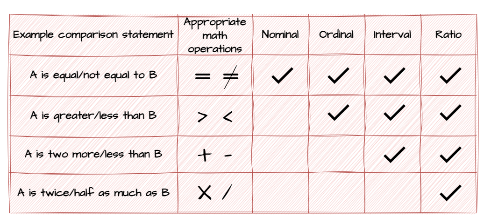
```

???

As a general rule, it's best to measure variables at the highest level possible, as long as doing so doesn't distort the meaning of the concept. 
- E.G., measure age in years because you can always collapse to a lower level later on (e.g., comparing teens to adults to elderly persons), but if you start at the lower level you can't recover exact ages. 
- That said, with some variables - like income - it might be better to use an ordinal measure, as people are often reluctant to disclose their exact income (even in anonymous surveys). 

---
class: middle, center, inverse

# Did we measure what we wanted to measure?

---
class: top

# Measurement validity

???

By now, I hope it's clear that if we haven't measured what we *think* we've measured, then we really don't know what we're talking about. 

**Consider**: what is the prevalence of juvenile delinquency in Omaha? 
- To answer this question, we might look at arrest data.
  - But how can we be certain that's a valid measure of delinquency, and not *really* just a measure of police behavior? I.E., police oversupervise juveniles.
  - We also know that official data underestimate the prevalence of crime, because so much crime goes unreported. 
  
**There are four basic approaches to assessing validity. We'll discuss each in turn.**

--

## Face validity

???

As the name suggests, **face validity** simply means: does the measure seem appropriate on its face? Does it pass the smell test? 

Obviously, merely passing the smell test isn't enough to be confident in our measure's validity.
- Consider a study of alcohol consumption
  - We could ask how many drinks respondents had in the last week. That measure would have face validity. But heavy drinkers tend to underreport how much they drink, and so to the extent our sample had heavy drinkers, the resulting data might underestimate alcohol consumption.
  
--

```{r, echo=FALSE, fig.align='center', out.width = "75%"}
knitr::include_graphics("kermit.jpg")
```

---
class: top

# Measurement validity

--

## Content validity

???

**Content validity** establishes that the measure covers the full range - or every dimension - of the concept's meaning. 

For example, the *Michigan Alcoholism Screening Test* includes 24 questions on a range of issues related to alcoholism:
- Recognition of problem by self, others
- Legal, social, work problems
- Marital difficulties
- Liver pathology

In the *police legitimacy* literature, there is extensive debate about the various dimensions of legitimacy. A measure that had content validity would need to include not just one, but all of the dimensions. Otherwise, it's not a valid measure of "legitimacy."

--

```{r, echo=FALSE, fig.align='center', out.width = "52%"}
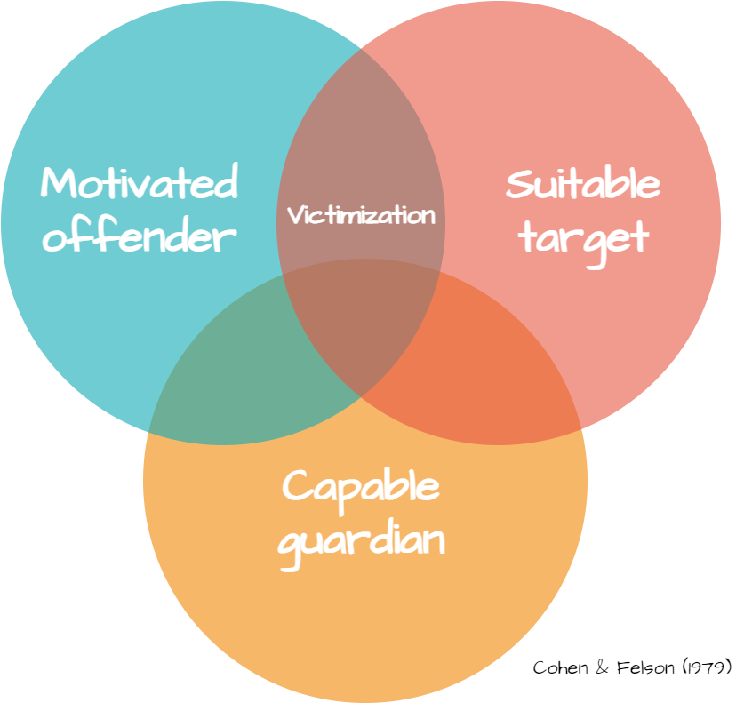
```

???

We can't say we've tested Routine Activities Theory if we don't measure all three dimensions. 

---
class: top

# Measurement validity

--

## Criterion validity

???

**Criterion validity** is established when the scores obtained on one measure can be accurately compared to those obtained with a more direct, or already validated, measure of the same phenomenon

--

```{r, echo=FALSE, fig.align='center', out.width = "60%"}
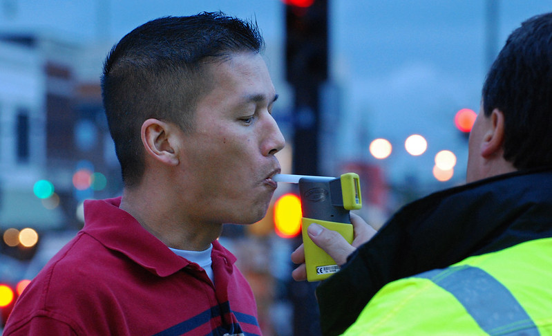
```
<p style="text-align: center; color: gray">.small[[Image](https://flic.kr/p/eeoWQx) by [KOMUnews](https://www.flickr.com/photos/komunews/) on flickr, [CC BY 2.0](https://creativecommons.org/licenses/by/2.0/)]</p>

???

To continue with our alcohol consumption example...

We can measure alcohol consumption directly, via blood, urine, or breath samples. Asking someone on a survey about alcohol consumption is an indirect measure (i.e., we're banking that the respondent is being truthful). If our indirect measure lines up with a direct or already-validated measure, we can say it has criterion validity. Basically, criterion validity offers *evidence*. 

However, we often don't have a variable we could reasonably consider a criterion for, e.g., attitudes or beliefs or other subjective states measured on surveys. 

---
class: top

# Measurement validity

--

## Construct validity

???

**Construct validity** is what we often turn to when there is no reasonable criterion to judge our measure against. We establish it by showing that our measure is related to a variety of *other* measures as specified in a theory.
- The difference between criterion and construct validity is not always clear; opinions may vary about whether a particular indicator *is in fact* a criterion for the concept we're measuring. 
- The important thing is to think critically about the quality of the comparison measure, and whether it actually represents a different measure of the same phenomenon. 
  - E.G., It'd be weak to say that our new (not validated) measure is associated with scores on our previous (not validated) measure, and try to claim that demonstrates criterion or construct validity. 
  
--

If we have no criterion to judge our measure against...

--

We can still attempt to show that our measure is related to *other* measures specified in a theory

---
class: top

# Reliability

???

**Reliability** means that a measurement produces consistent scores (as long as the phenomenon itself isn't changing). 
- If a measure is reliable, it's less affected by random error/chance than if its unreliable. 
- If we give students the same alcohol consumption survey 6 months apart, and got consistent results, it would indicate our measures were reliable. 
  - Unless of course, the sample's drinking habits had significantly changed!
  
The authors of your book argue that reliability is a **prerequisite** for measurement validity.
- That is, we can't really measure a phenomenon if our measure is giving us inconsistent results. 

There are four methods for assessing reliability, and we'll discuss each in turn. 

--

## Test-retest reliability

???

The last example we used was an indication of test-retest reliability. 

If you take the GRE today, and again 2 months later, and get a very similar score, it indicates the GRE is a reliable measure of your verbal and quantitative reasoning skills. 
- **Of course, what might be the reason for a significantly better score two months later?**

--

If we observe X → Y at two points in time, this bolsters our confidence in the reliability of our measures

--

(Assuming nothing has changed significantly between the two periods!)

---
class: top

# Reliability

--

## Interitem reliability

???

If we use multiple items to measure a single concept, we should be concerned with **interitem reliability**, or **internal consistency.**
- Each of the items should be strongly associated with one another. If they're all over the place (inconsistent), they don't have reliability. 

--

```{r, echo=FALSE, fig.align='center', out.width = "60%"}
knitr::include_graphics("neighborhood-survey.png")
```

<p style="text-align: right; color: gray; font-size: 75%">- Nix et al., [*Trust in the police*](https://doi.org/10.1177/0011128714530548)

???

Here we asked respondents about a range of issues - some of which are criminal, some of which are merely nuisance/disorderly behaviors. We can assess how well the individual responses correlate with each other. This process might tell us that people in some neighborhoods are highly concerned with both, which might justify creating a single "neighborhood problems" scale. Or, it might tell us that people in some neighborhoods are highly concerned about disorder issues, but not so much criminal behaviors (or vice versa). Such a result might mean it's a better strategy to create separate scales. 
- The point: check how well individual items meant to measure a latent concept load together. 

---
class: top

# Reliability

--

## Alternate-forms reliability

???

Of course, if we always measure a concept the same way, we might fall victim to *mono-operation bias*. It's therefore good practice to compare respondents' answers to slightly different versions of survey questions. 
- Researchers might reverse the ordering of response choices in an index (though Pickett & Baker's paper suggests this can be problematic)
- Or, modify the question wording in minor ways 

If the two sets of responses are not too different, you've got evidence of alternate-forms reliability. 

A related approach is the **split-halves reliability** approach. Divide your sample into two by flipping a coin and administer the two forms of questions. Here again, if responses are substantively similar, you've got an indication of reliability. 

--

.pull-left[
```{r, echo=FALSE, fig.align='center', out.width = "100%"}
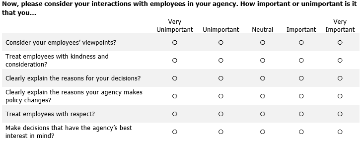
```
]

.pull-right[
```{r, echo=FALSE, fig.align='center', out.width = "100%"}
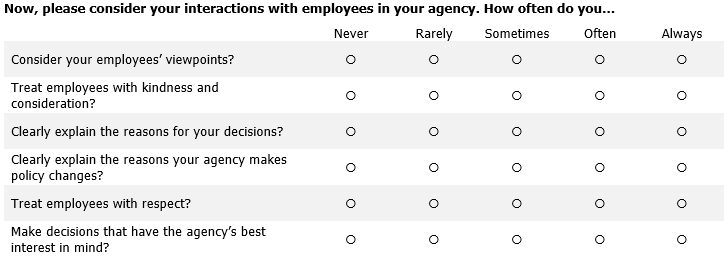
```
]

<br>
<p style="text-align: right; color: gray; font-size: 75%">- Wolfe et al., [*The measurement of organizational justice matters*](https://www.crimrxiv.com/pub/ckjwt1m4/release/1)

---
class: top

# Reliability

--

## Intra and Interobserver reliability

???

For SSO or archival data collection methods, we need to assess intra/interobserver reliability.

**Intraobserver reliability** is basically test-retest reliability for the observer/coder. If you're collecting data at 2+ points in time, you want to be sure that your observations are consistent. 

When using more than one observer or coder to rate the same persons, events, etc., **interobserver reliability** is the goal. Here, we want to be sure observers are using the same instrument, and that their ratings are similar. 

--

```{r, echo=FALSE, fig.align='center', out.width = "60%"}
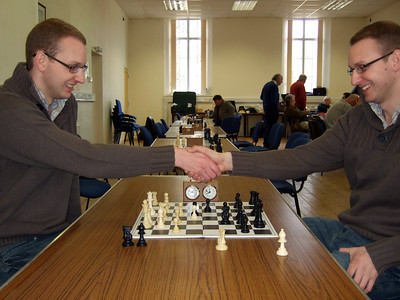
```
<p style="text-align: center; color: gray">.small[[Image](https://flic.kr/p/7JA9Pi) by [Edward Webb](https://www.flickr.com/photos/crazyeddie/) on flickr, [CC BY-SA 2.0](https://creativecommons.org/licenses/by-sa/2.0/)]</p>

---
class: middle, center, inverse

# We want both **reliability** <ins>and</ins> **validity**

---
class: middle, center, inverse 

```{r, echo=FALSE, fig.align='center', out.width = "60%"}
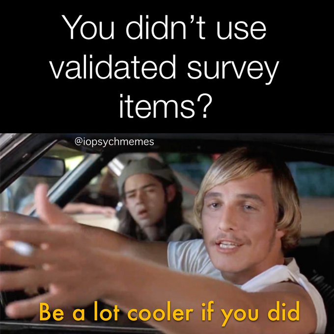
```

# Have a great day! 😄

<!-- ```{css, echo=FALSE} -->
<!-- @media print { -->
<!--   .has-continuation { -->
<!--     display: block; -->
<!--   } -->
<!-- } -->
<!-- ``` -->

<style>
p.caption {
  font-size: 0.5em;
  color: lightgray;
}
</style>